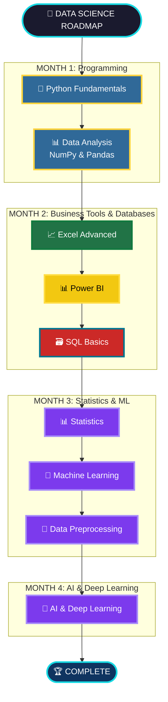

<div align="center">
<h1> 🚀 My Data Science Journey with SD Hub </h1>
</div>


<div align="center">


*📅 Started: July 1st, 2025*
*🕐 Class Timings: 3:00 PM - 6:00 PM (Mon-Fri)*
*🎯 Goal: Master Data Science / Analytics & Gen-AI*

</div>

---

## 🌟 About This Repository

Welcome to my documentation of the **Data Science Course (Batch 2)** at **Skills Development Hub (SD Hub)**! This repository serves as my digital learning journal, capturing my real-time progress, key insights, and hands-on practice as I navigate this transformative journey.

> *"Data is the new oil, and I'm here to refine it!"* 🛢️➡️💎

### 📁 Repository Structure

Here's a high-level overview of the key directories in this repository:

```bash
.
├── 📁 SDHub-DS/
│   ├── 📁 00 Notes/              # My personal and instructor-provided notes.
│   │   ├── 📁 01_Python/
│   │   ├── 📁 02_Excel/
│   │   ├── 📁 03_Power BI/
│   │   └── 📁 04_SQL/
│   ├── 📁 01 Python Foundation/   # Code, notebooks, and datasets for Python.
│   ├── 📁 02 Bi-Excel/            # Workbooks and Power BI project files.
│   ├── 📁 03 SQL/                 # SQL scripts and practice files.
│   └── 📁 Hackathon/              # Project files for hackathons.
└── 📜 README.md                   # You are here!
```

---

## 🏢 About SD Hub

**Skills Development Hub** is a premier destination for free job-oriented technology training programs, managed by **Professionals Solidarity Forum (PSF)** and supported by **Helping Hand Foundation (HHF)**. Their mission is to make quality education accessible to all, regardless of financial constraints.

### 🎯 Course Details
- **📚 Program:** Data Science & Gen AI
- **🏆 Batch:** 2
- **📅 Duration:** 4.5 months (July 2025 onwards)
- **⏰ Schedule:** Monday to Friday
    - **IELTS & Interview Prep:** 3:00 PM - 4:00 PM
    - **Data Science:** 4:00 PM - 6:00 PM
- **📍 Location:** SD Hub Qutubshahi
- **💻 Requirement:** Personal laptop mandatory

---

## 📚 Course Curriculum Overview

Our instructor has outlined the learning journey in 4 main phases:



---

## 💻 My Development Environment

### 🖥️ System Specifications
<div align="center">


</div>

```
🏷️  Hardware Model: MSI Bravo 15 B5DD
🧠  Processor:      AMD Ryzen™ 5 5600H with Radeon™ Graphics
💾  Memory:         16.0 GiB RAM
🎮  Graphics:       AMD Radeon™ Graphics
💿  Storage:        512.1 GB SSD
---
🐧  Primary OS:     CachyOS (rolling) with GNOME 48
🐧  Kernel:         Linux 6.16.6-2-cachyos
```

### 🛠️ Tools & Setup

I'm using a slightly different stack than the one taught in class, which provides an excellent opportunity to learn about cross-compatibility and modern tooling.

<div align="center">

[](https://github.com/astral-sh/uv)


 


</div>

> [!NOTE]
> ### Course Setup vs. My Setup
> *   **Python Environment:**
>     *   **Course:** `Windows` + `Anaconda Navigator` + `Jupyter Notebook`.
>     *   **My Setup:** `CachyOS (Arch Linux)` + `uv` (a fast Python package manager) + `Jupyter Notebook`. This gives me a lightweight, high-performance, and Linux-native workflow.
> *   **Database Environment:**
>     *   **Course:** `MySQL` + `MySQL Workbench`.
>     *   **My Setup:** `MariaDB` (a community-driven fork of MySQL) + `JetBrains DataGrip`.

---

## 📈 Learning Progress

### 🏅 Completed Milestones
- [x] ✅ **Phase 1:** Python Fundamentals & Python for Data Science (NumPy, Pandas).
- [x] ✅ **Phase 2 (Partial):** Business Intelligence with Excel & Power BI.

### 📊 Current Progress
```progress
Phase 1: Foundations        [██████████] 100% Complete!
Phase 2: Power BI           [██████████] 100% Complete!
Phase 2: SQL & Databases    [████......]  40% In Progress
Phase 3: Advanced AI/ML     [..........]   0% Not Started
```

**🎯 Currently Learning: Week 10 - Advanced SQL Queries**
- We've moved beyond basic DDL and are now focusing on powerful DQL techniques.
- Today's focus was on aggregating data with `GROUP BY`, filtering groups with `HAVING`, and using nested queries (subqueries) to solve complex problems.
- **Up Next:** Database `JOIN`s and understanding table relationships.

---

## 📝 Today's Learning Overview

<details open>
<summary><strong>Day 70 (September 10th, 2025) - Advanced Queries: Aggregation, Grouping, and Subqueries</strong></summary>
<br>

**🎯 Session Focus:** Mastering advanced data retrieval with `GROUP BY`, filtering with `HAVING`, and constructing powerful nested queries (subqueries).

**📚 Key Concepts Explored:**

### 📊 The Anatomy of a SELECT Query
A `SELECT` statement has several clauses that are processed in a specific logical order, which is different from how we write them.

> [!IMPORTANT]
> ### ✍️ Lexical Order vs. Logical Order
> *   **Lexical Order** is how you *write* the query (`SELECT`, `FROM`, `WHERE`...).
> *   **Logical Order** is how the database *executes* the query (`FROM`, `WHERE`, `GROUP BY`...).

```mermaid
graph LR
    A[1: FROM] --> B[2: WHERE]
    B --> C[3: GROUP BY]
    C --> D[4: HAVING]
    D --> E[5: SELECT]
    E --> F[6: ORDER BY]
    F --> G[7: LIMIT]

    style A fill:#e1f5fe,stroke:#01579b,stroke-width:2px
    style B fill:#f3e5f5,stroke:#4a148c,stroke-width:2px
    style C fill:#e8f5e8,stroke:#1b5e20,stroke-width:2px
    style D fill:#fff3e0,stroke:#e65100,stroke-width:2px
    style E fill:#fce4ec,stroke:#880e4f,stroke-width:2px
    style F fill:#f1f8e9,stroke:#33691e,stroke-width:2px
    style G fill:#fff8e1,stroke:#f57f17,stroke-width:2px
```



### Filtering: `WHERE` vs. `HAVING`
> [!NOTE]
> ### `WHERE` Filters Rows, `HAVING` Filters Groups
> *   The `WHERE` clause filters individual rows **before** they are grouped.
> *   The `HAVING` clause filters entire groups **after** aggregation has occurred.

### 🧩 Nested Queries (Subqueries)
> [!IMPORTANT]
> ### The Golden Rule of Subqueries
> The **inner query** executes **first**, and its result is used by the **outer query**.

**Example:** Find all employees whose salary is above the company average.
```sql
-- This query finds records with a salary greater than the overall average
SELECT *
FROM company
WHERE salary > (
    -- This inner query runs first to calculate the average
    SELECT AVG(salary)
    FROM company
);
```
**💡 Key Insights:**
- **Think Like the Database:** Understanding the logical query order is essential for writing efficient queries.
- **Aggregation is Key:** `GROUP BY` is one of the most powerful tools for data analysis.
- **Subqueries for Complex Logic:** When a simple `WHERE` clause isn't enough, subqueries allow for dynamic, multi-step filtering.

</details>

---

## 🤝 Connect & Collaborate

<div align="center">

[](https://www.linkedin.com/in/md-riyan-nazeer/)
[](https://github.com/riyann00b)
[](mailto:riyannazeer786@gmail.com)


*📬 Always open to discussions about data science, learning experiences, and collaboration!*

</div>

---

<div align="center">

### 🌟 Journey Stats
 
 


---

**📊 Learning Analytics**
**Journey Duration:** 2 months, 10 days | **Total Days:** 70

---

*"The journey of a thousand miles begins with a single step"* 🚶‍♂️
**Started:** July 1st, 2025 | **Status:** Learning & Growing 🌱

**Made with ❤️ and lots of ☕ during my Data Science journey at SD Hub**

</div>
