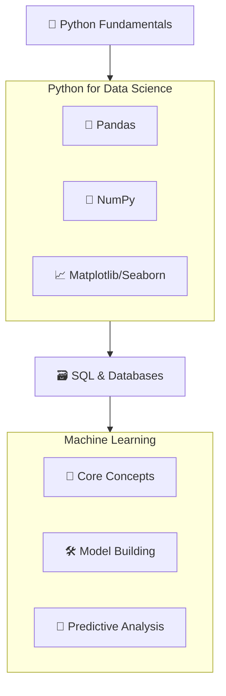

# 🚀 My Data Science Journey with SD Hub

<div align="center">


*📅 Course Duration: July 2025 - Ongoing*  
*🕐 Class Timings: 3:30 PM - 5:30 PM (Mon-Fri)*  
*🎯 Goal: Master Data Science & Analytics*

</div>

---

## 🌟 About This Repository

Welcome to my comprehensive documentation of the **Data Science Course (Batch 2)** at **Skills Development Hub (SD Hub)**! This repository serves as my digital learning journal, project showcase, and knowledge base throughout this transformative journey.

> *"Data is the new oil, and I'm here to refine it!"* 🛢️➡️💎

---

## 🏢 About SD Hub

**Skills Development Hub** is a premier destination for free job-oriented technology training programs, managed by **Professionals Solidarity Forum (PSF)** and supported by **Helping Hand Foundation (HHF)**. Their mission is to make quality education accessible to all, regardless of financial constraints.

### 🎯 Course Details
- **📚 Program:** Data Science & Analytics
- **🏆 Batch:** 2
- **📅 Start Date:** July 1st, 2025
- **⏰ Schedule:** Monday to Friday, 3:30 PM - 5:30 PM
- **📍 Location:** SD Hub Qutubshahi
- **💻 Requirement:** Personal laptop mandatory

---

## 📚 Learning Path & Curriculum

Based on the course orientation, our learning journey is structured around four core pillars, building a strong foundation from programming fundamentals to advanced machine learning.



---

## 📁 Repository Structure

```
📦 SDHub-DS
├── 📂 01-Foundation/
│   ├── 📝 notes/
│   ├── 💻 python-basics/
│   └── 📊 statistics/
├── 📂 02-Data-Manipulation/
│   ├── 🐼 pandas-exercises/
│   ├── 🔢 numpy-practice/
│   └── 📁 datasets/
├── 📂 03-Visualization/
│   ├── 📊 matplotlib-projects/
│   ├── 🎨 seaborn-visualizations/
│   └── 📈 plotly-dashboards/
├── 📂 04-Machine-Learning/
│   ├── 🤖 supervised-learning/
│   ├── 🔍 unsupervised-learning/
│   └── 🧪 model-evaluation/
├── 📂 05-Projects/
│   ├── 🎯 mini-projects/
│   ├── 🏆 major-projects/
│   └── 📊 case-studies/
├── 📂 06-Resources/
│   ├── 📚 cheat-sheets/
│   ├── 🔗 useful-links/
│   └── 📖 reading-materials/
└── 📂 07-Certifications/
    └── 🏅 certificates/
```

## 💻 My Development Environment

### 🖥️ System Specifications
<div align="center">

 
 
 
 


</div>

```
🏷️  Hardware Model: MSI Bravo 15 B5DD
🧠  Processor:      AMD Ryzen™ 5 5600H with Radeon™ Graphics × 12
💾  Memory:         16.0 GiB RAM
🎮  Graphics:       AMD Radeon™ Graphics + AMD Radeon™ RX 5500M
💿  Storage:        512.1 GB SSD
🐧  OS:             Fedora Linux 42 (Workstation Edition)
🖼️  Desktop:        GNOME 48 (Wayland)
🔧  Kernel:         Linux 6.15.3-200.fc42.x86_64
📅  Last Updated:   July 1st, 2025
```

_Perfect setup for Data Science work! 🚀_

---

## 🛠️ Tech Stack & Tools

<div align="center">

### Programming Languages


### Data Science Libraries


### Machine Learning & AI


### Business Intelligence & Visualization


### Tools & Platforms


</div>

---

## 📈 Learning Progress

### 🏅 Achievements Unlocked
- [x] ✅ **Day 1: Course Orientation & Introduction**
- [ ] 🐍 Python Fundamentals
- [ ] 📊 Statistics Mastery
- [ ] 🐼 Pandas Proficiency
- [ ] 📈 Data Visualization Expert
- [ ] 🤖 Machine Learning Practitioner
- [ ] 🧠 Deep Learning Explorer
- [ ] 🎯 First Project Completed
- [ ] 🏆 Capstone Project

### 📊 Weekly Progress Tracker
```
Week 1: [█.........] 10% - Course Introduction Complete! 🚀
```

*Progress bars will be updated weekly!*

---

## 🚀 Featured Projects

<!--  
### 🎯 Project Highlights

| Project | Technology | Status | Description |
|---------|------------|--------|-------------|
| 📊 **Sales Analysis Dashboard** | Python, Pandas, Plotly | 🚧 In Progress | Interactive dashboard for sales data analysis |
| 🏠 **House Price Predictor** | Scikit-learn, Flask | 📅 Planned | ML model to predict house prices |
| 📱 **Social Media Sentiment** | NLP, TextBlob | 📅 Planned | Sentiment analysis of social media posts |
| 🛒 **Customer Segmentation** | K-Means, Seaborn | 📅 Planned | Customer behavior analysis |
-->
---

## 📝 Daily Learning Log

#### [Day 1 - July 1st, 2025: Course Orientation & The World of Data](https://github.com/riyann00b/SDHub-DS/blob/main/SDHub-DS/01-Foundation/notes/Day%20-%201.md)
- **Summary:** Today was the official start of the course! We began with a comprehensive overview of the Data Science field, the course structure, and career opportunities.
- **Key Concepts Learned:**
  - **Data Science vs. Data Analysis:** A crucial distinction was made. **Data Analysis** uses descriptive statistics to understand past data (e.g., "What was our sales total last quarter?"), while **Data Science** uses inferential statistics and ML to predict future outcomes (e.g., "What will our sales be next quarter?").
  - **Statistics is the Backbone:** Understood that Descriptive (summarizing data) and Inferential (making predictions) statistics are fundamental to all data work.
  - **The "What, Why, How":**
    - **What:** The study of data.
    - **Why:** To extract actionable insights.
    - **How:** Using tools like Python, SQL, Tableau, and Power BI.
- **Course Roadmap:**
  1.  **Python:** Core programming fundamentals.
  2.  **Python for Data Science:** Libraries (Pandas, NumPy, Matplotlib).
  3.  **SQL:** Database querying.
  4.  **Machine Learning:** Building predictive models.
- **Action Items for Tomorrow:**
  - 📖 Review basic statistics concepts.
  - 🐍 Prepare for the first Python fundamentals class.
  - 🛠️ Familiarize myself with the names and purposes of Excel, Tableau, and Power BI.

> *"The journey begins! Excited to dive into the core concepts and start coding."*

---

## 📚 Resources & References
<!--
### 🔗 Quick Links
- [📖 Course Materials](./resources/course-materials/)
- [🔧 Setup Guides](./resources/setup-guides/)
- [📊 Practice Datasets](./resources/datasets/)
- [💡 Tips & Tricks](./resources/tips-tricks/)

### 📖 Recommended Reading
- "Python for Data Analysis" by Wes McKinney
- "Hands-On Machine Learning" by Aurélien Géron
- "The Elements of Statistical Learning" by Hastie, Tibshirani, and Friedman
-->

---

## 🤝 Connect & Collaborate

<div align="center">

### Let's Connect!

[](https://www.linkedin.com/in/md-riyan-nazeer/)
[](https://github.com/riyann00b)
[](mailto:riyannazeer786@gmail.com)

*📬 Open to collaboration, discussions, and sharing knowledge!*

</div>

---

## 📄 License & Usage

This repository is created for educational purposes and personal learning documentation. Feel free to explore, learn, and get inspired!

<div align="center">

### 🌟 Journey Stats

 
 
 
 


---

*"The journey of a thousand miles begins with a single step"* 🚶‍♂️  
**Started:** July 1st, 2025 | **Status:** Learning & Growing 🌱

**Made with ❤️ and lots of ☕ during my Data Science journey at SD Hub**

</div>
