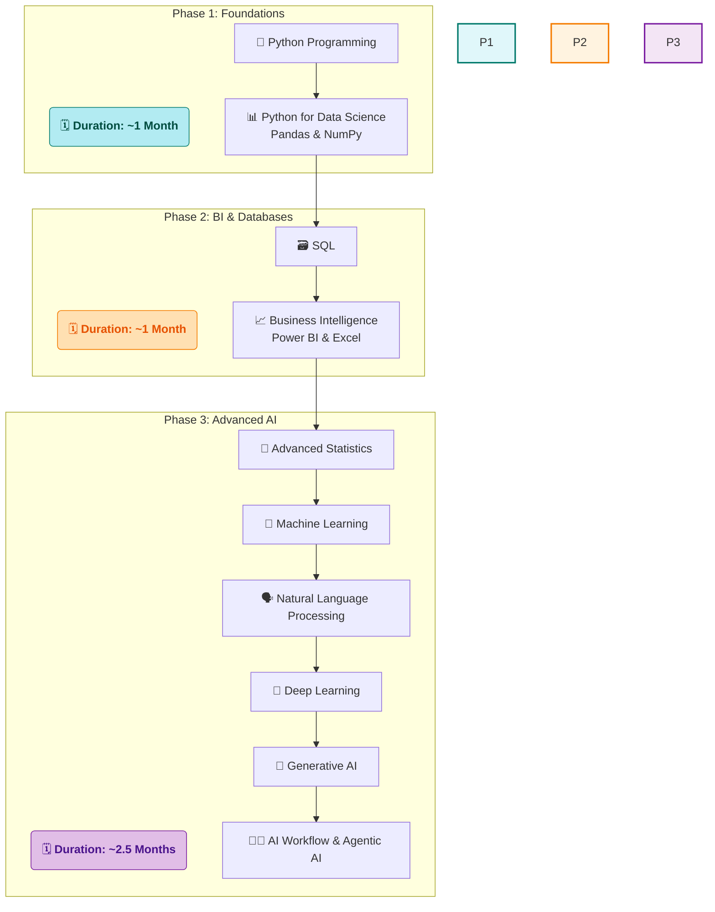

# 🚀 My Data Science Journey with SD Hub

<div align="center">


*📅 Started: July 1st, 2025*  
*🕐 Class Timings: 3:30 PM - 5:30 PM (Mon-Fri)*  
*🎯 Goal: Master Data Science / Analytics & Gen-AI*

</div>

---

## 🌟 About This Repository

Welcome to my documentation of the **Data Science Course (Batch 2)** at **Skills Development Hub (SD Hub)**! This repository serves as my digital learning journal, capturing my real-time progress, key insights, and hands-on practice as I navigate this transformative journey.

> *"Data is the new oil, and I'm here to refine it!"* 🛢️➡️💎

### 📁 Repository Structure

```
├── 📁 SDHub-DS/
│   ├── 📁 01 Foundation/
│   │   ├── 📁 01 Notes/
│   │   │   ├── 📁 01 My Notes/                 # My detailed daily learning notes in Markdown
│   │   │   │   └── 📝 01 Data Science Overview.md
│   │   │   └── 📁 02 Sir Notes/                 # PDFs and materials from the instructor
│   │   │       └── 📄 Day_01.pdf
│   │   ├── 📁 02 Python Basics Code/
│   │   │   ├── 📁 01 My Jupyter NoteBooks/       # My hands-on practice notebooks
│   │   │   │   └── 📓 Python-Basics-Cleaned.ipynb
│   │   │   └── 📁 02 Sir Jupyter NoteBooks/       # Notebooks provided by the instructor
│   │   │       └── 📓 DS_01.ipynb
│   │   ├── 📁 Projects/
│   │   └── 📁 Resources/
│   │
│   ├── 📁 02 Bi-Excel-SQL/                      # (Content for Phase 2: BI & Databases)
│   │   ├── 📁 01 Notes/
│   │   ├── 📁 02 Projects/
│   │   ├── 📁 03 datasets/
│   │   └── 📁 04 Resources/
│   │
│   ├── 📁 03 Advanced AI/                       # (Content for Phase 3: Advanced AI)
│   │   ├── 📁 01 Notes/
│   │   ├── 📁 02 Projects/
│   │   └── 📁 03 Resources/
│   │
│   └── 📁 Certifications/                      # Course and skill certifications
│
├── 📝 README.md                               # You are here!
└── 📄 LICENSE
```

>     💡 A Note on Folder Visibility:
> The structure above shows the complete, intended layout of my repository. However, Git does not track empty directories. Therefore, some folders (like Projects/ or future phase folders) may not be visible on GitHub until I add the first file (e.g., a notebook, a note, or a placeholder .gitkeep file) to them. They will appear automatically as my journey progresses and I populate them with content!


---

## 🏢 About SD Hub

**Skills Development Hub** is a premier destination for free job-oriented technology training programs, managed by **Professionals Solidarity Forum (PSF)** and supported by **Helping Hand Foundation (HHF)**. Their mission is to make quality education accessible to all, regardless of financial constraints.

### 🎯 Course Details
- **📚 Program:** Data Science & Gen AI
- **🏆 Batch:** 2
- **📅 Duration:** 4.5 months (July 2025 onwards)
- **⏰ Schedule:** Monday to Friday, 3:30 PM - 5:30 PM
- **📍 Location:** SD Hub Qutubshahi
- **💻 Requirement:** Personal laptop mandatory

---

## 📚 Course Curriculum Overview

Our instructor has outlined the learning journey in three main phases:



*Note: This is the planned curriculum structure. I'll update with actual topics as we progress through the course.*

---

## 💻 My Development Environment

### 🖥️ System Specifications
<div align="center">

 
  
 


</div>

```
🏷️  Hardware Model: MSI Bravo 15 B5DD
🧠  Processor:      AMD Ryzen™ 5 5600H with Radeon™ Graphics × 12
💾  Memory:         16.0 GiB RAM
🎮  Graphics:       AMD Radeon™ Graphics + AMD Radeon™ RX 5500M
💿  Storage:        512.1 GB SSD
🐧  OS:             Fedora Linux 42 (Workstation Edition)
🖼️  Desktop:        GNOME 48 (Wayland)
🔧  Kernel:         Linux 6.15.3-200.fc42.x86_64
```

### 🛠️ Tools & Setup
**Course Standard:** Anaconda + Jupyter Notebook  
**My Setup:** `uv` package manager + Jupyter (for speed and efficiency on Linux)  
**Primary IDE:** Jupyter Notebook (as required by course)

<div align="center">


[](https://github.com/astral-sh/uv)


</div>

---

## 📈 Learning Progress

### 🏅 Completed Sessions
- [x] ✅ **Week 1 (Days 1-5):** Course Orientation, AI/ML Concepts, Python Fundamentals, User Input, Operators, and Strings.
- [x] ✅ **Week 2 (Days 6-9):** Python Data Structures (Lists, Tuples, Sets, Dictionaries) and Conditional Programming.
- [x] ✅ **Week 3 (Days 10-14):** Control Flow (Loops), Comprehensions, and Functional Programming (`def`, `*args`, `**kwargs`).
- [x] ✅ **Week 4 (Days 15-17):** Object-Oriented Programming (OOP), File I/O, and Exception Handling.

### 📊 Current Progress
```progress
Week 1: [██████████] 100% - Python Fundamentals Complete!
Week 2: [██████████] 100% - Data Structures & Conditionals Complete!
Week 3: [██████████] 100% - Control Flow & Functions Complete!
Week 4: [██████....] 60%  - OOP, Files & Error Handling In Progress!
```

**📚 Topics Covered So Far:**
- **Python Paradigms:** Procedural, Functional, and Object-Oriented Programming (OOP).
- **Core Programming:** Variables, data types, operators, I/O.
- **Data Structures:** In-depth study of Lists, Tuples, Sets, and Dictionaries.
- **Control Flow:** `if`/`elif`/`else`, `while`/`for` loops, `break`/`continue`/`pass`.
- **Pythonic Code:** List/Dictionary Comprehensions.
- **Functional Programming:** `def`, `return`, scope, `*args`, `**kwargs`, `lambda`, `map`, `reduce`.
- **Object-Oriented Programming:** `class`, `__init__`, attributes (`self.x`), methods, and the four pillars: **Inheritance, Polymorphism, Encapsulation, and Abstraction**.
- **File Handling:** The `open()` function, file modes (`'r'`, `'w'`, `'a'`), and the `with` statement for safe file operations.
- **Exception Handling:** Using `try`, `except`, and `finally` blocks to gracefully manage runtime errors like `ValueError`, `ZeroDivisionError`, and `FileNotFoundError`.

**🎯 Currently Learning:**
- Building robust programs by combining OOP, File Handling, and Exception Handling.
- Implementing `try...except...finally` for solid user input validation and file I/O operations.
- Preparing to apply these skills to read and process datasets using libraries like Pandas.

---

## 🤝 Connect & Collaborate

<div align="center">

[](https://www.linkedin.com/in/md-riyan-nazeer/)
[](https://github.com/riyann00b)
[](mailto:riyannazeer786@gmail.com)

*📬 Always open to discussions about data science, learning experiences, and collaboration!*

</div>

---

## 📚 Learning Resources

### 🔗 Useful Links I've Discovered
- [Jupyter Notebook Documentation](https://jupyter-notebook.readthedocs.io/) - Official guide for Jupyter
- [Python PEP 8 Style Guide](https://pep8.org/) - Python coding conventions
- [Markdown Guide](https://www.markdownguide.org/) - Comprehensive Markdown reference

---

<div align="center">

### 🌟 Journey Stats
  


---

**📊 Learning Analytics**  
**Days Active:** 17 | **Sessions Completed:** 17 | **Concepts Learned:** 85+

---

*"The journey of a thousand miles begins with a single step"* 🚶‍♂️  
**Started:** July 1st, 2025 | **Status:** Learning & Growing 🌱

**Made with ❤️ and lots of ☕ during my Data Science journey at SD Hub**

</div>
