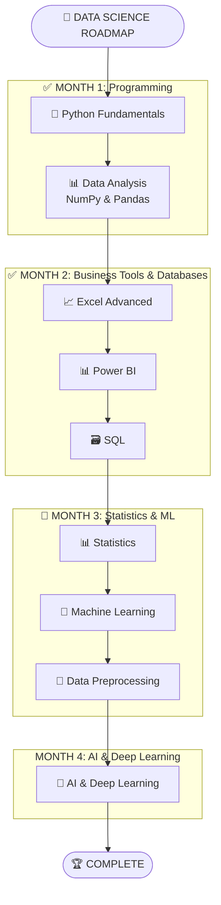
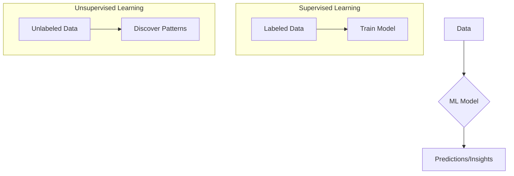

<div align="center">
<h1> 🚀 My Data Science Journey with SD Hub </h1>
</div>

<div align="center">


*📅 Started: July 1st, 2025*
*🕐 Class Timings: 3:00 PM - 6:00 PM (Mon-Fri)*
*🎯 Goal: Master Data Science / Analytics & Gen-AI*

</div>

---

## 🌟 About This Repository

Welcome to my documentation of the **Data Science Course (Batch 2)** at **Skills Development Hub (SD Hub)**! This repository serves as my digital learning journal, capturing my real-time progress, key insights, and hands-on practice as I navigate this transformative journey.

> *"Data is the new oil, and I'm here to refine it!"* 🛢️➡️💎

### 📁 Repository Structure

Here's a high-level overview of the key directories in this repository:

```bash
.
├── 📁 SDHub-DS/
│   ├── 📁 00 Notes/              # My personal and instructor-provided notes.
│   │   ├── 📁 01_Python/
│   │   ├── 📁 02_Excel/
│   │   ├── 📁 03_Power BI/
│   │   ├── 📁 04_SQL/
│   │   ├── 📁 05_Statistics/
│   │   └── 📁 06_Machine Learning/
│   ├── 📁 01 Python Foundation/   # Code, notebooks, and datasets for Python.
│   ├── 📁 02 Bi-Excel/            # Workbooks and Power BI project files.
│   ├── 📁 03 SQL/                 # SQL scripts and practice files.
│   ├── 📁 04 Statistics/          # Statistics notebooks and materials.
│   └── 📁 Hackathon/              # Project files for hackathons.
└── 📜 README.md                   # You are here!
```

### 🚀 Quick Access to Notes

Jump directly to the notes for each module:

-   [🐍 **Python Notes**](https://github.com/riyann00b/SDHub-DS/tree/main/SDHub-DS/00%20Notes/01_Python)
-   [📊 **Excel Notes**](https://github.com/riyann00b/SDHub-DS/tree/main/SDHub-DS/00%20Notes/02_Excel)
-   [📈 **Power BI Notes**](https://github.com/riyann00b/SDHub-DS/tree/main/SDHub-DS/00%20Notes/03_Power%20BI)
-   [🗃️ **SQL Notes**](https://github.com/riyann00b/SDHub-DS/tree/main/SDHub-DS/00%20Notes/04_SQL)
-   [📉 **Statistics Notes**](https://github.com/riyann00b/SDHub-DS/tree/main/SDHub-DS/00%20Notes/05_Statistics)
-   [🤖 **Machine Learning Notes**](https://github.com/riyann00b/SDHub-DS/tree/main/SDHub-DS/00%20Notes/06_Machine%20Learning/My_Notes)

---

## 🏢 About SD Hub

**Skills Development Hub** is a premier destination for free job-oriented technology training programs, managed by **Professionals Solidarity Forum (PSF)** and supported by **Helping Hand Foundation (HHF)**. Their mission is to make quality education accessible to all, regardless of financial constraints.

### 🎯 Course Details
- **📚 Program:** Data Science & Gen AI
- **🏆 Batch:** 2
- **📅 Duration:** 4.5 months (July 2025 onwards)
- **⏰ Schedule:** Monday to Friday
    - **IELTS & Interview Prep:** 3:00 PM - 4:00 PM
    - **Data Science:** 4:00 PM - 6:00 PM
- **📍 Location:** SD Hub Qutubshahi
- **💻 Requirement:** Personal laptop mandatory

---

## 📚 Course Curriculum Overview

Our instructor has outlined the learning journey in 4 main phases:



---

## 💻 My Development Environment

### 🖥️ System Specifications
<div align="center">


</div>

```
🏷️  Hardware Model: MSI Bravo 15 B5DD
🧠  Processor:      AMD Ryzen™ 5 5600H with Radeon™ Graphics
💾  Memory:         16.0 GiB RAM
🎮  Graphics:       AMD Radeon™ Graphics
💿  Storage:        512.1 GB SSD
---
🐧  Primary OS:     CachyOS (rolling) with GNOME 49
🐧  Kernel:         Linux 6.16.8-2-cachyos
```

### 🛠️ Tools & Setup

I'm using a slightly different stack than the one taught in class, which provides an excellent opportunity to learn about cross-compatibility and modern tooling.

<div align="center">

[](https://github.com/astral-sh/uv)


</div>

---

## 📈 Learning Progress

### 🏅 Completed Milestones
- [x] ✅ **Phase 1:** Python Fundamentals & Python for Data Science (NumPy, Pandas).
- [x] ✅ **Phase 2:** Business Intelligence (Excel, Power BI) & SQL Databases.
- [x] ✅ **Phase 3 (Partial):** Statistics & Probability.

### 📊 Current Progress
```progress
Phase 1: Python Foundations    [██████████] 100% Complete!
Phase 2: BI & Excel            [██████████] 100% Complete!
Phase 3: SQL                   [██████████] 100% Complete!
Phase 3: Statistics            [██████████] 100% Complete!
Phase 3: Machine Learning      [█.........]  10% In Progress
```

**🎯 Currently Learning: Week 13 - Introduction to Machine Learning**
- We have successfully completed the Statistics module.
- Today we are officially kicking off the **Machine Learning** phase.
- **Up Next:** Diving into the ML pipeline, supervised vs. unsupervised learning, and our first algorithm!

---

## 📝 Today's Learning Overview

<details open>
<summary><strong>Day 86 (September 24th, 2025) - Module Wrap-Up: Statistics & Kick-off: Machine Learning</strong></summary>
<br>

**🎯 Session Focus:** Transitioning from theoretical foundations to predictive modeling. We concluded our deep dive into statistics and formally began our Machine Learning journey.

**📚 Key Concepts Reviewed & Introduced:**

### 1. Statistics Module Recap
We solidified our understanding of the two pillars of statistics, which are crucial for data analysis and form the bedrock of machine learning.

-   **Descriptive Statistics**: Summarizing and organizing data (mean, median, mode, variance).
-   **Inferential Statistics**: Making predictions and inferences about a population from a sample (hypothesis testing, confidence intervals).

### 2. Machine Learning Kick-off
The much-awaited module has begun! The initial session was dedicated to setting the stage and understanding the landscape.

-   **What is ML?**: Defined machine learning and contrasted it with traditional programming.
-   **The Data Science Roadmap**: Revisited our learning path to see how Python, SQL, and Statistics all converge into the ML pipeline.
-   **Types of ML**: Introduced the core categories of machine learning:
    -   **Supervised Learning**: Learning from labeled data (e.g., predicting house prices).
    -   **Unsupervised Learning**: Finding patterns in unlabeled data (e.g., customer segmentation).
    -   **Reinforcement Learning**: Learning through trial and error (e.g., training a game-playing AI).



**💡 Key Insights:**
- **Statistics is the 'Why'**: It provides the mathematical justification for how and why ML models work.
- **ML is the 'How'**: It provides the algorithms and frameworks to build predictive models from data.
- **Everything Builds**: Every topic covered so far—from Python data manipulation to SQL querying—is a critical step in the end-to-end machine learning workflow. The journey is connecting!

</details>

---

## 🤝 Connect & Collaborate

<div align="center">

[](https://www.linkedin.com/in/md-riyan-nazeer/)
[](https://github.com/riyann00b)
[](mailto:riyannazeer786@gmail.com)


*📬 Always open to discussions about data science, learning experiences, and collaboration!*

</div>

---

<div align="center">

### 🌟 Journey Stats


---

**📊 Learning Analytics**
**Journey Duration:** 2 months, 24 days | **Total Days:** 86

---

*"The journey of a thousand miles begins with a single step"* 🚶‍♂️
**Started:** July 1st, 2025 | **Status:** Learning & Growing 🌱

**Made with ❤️ and lots of ☕ during my Data Science journey at SD Hub**

</div>
