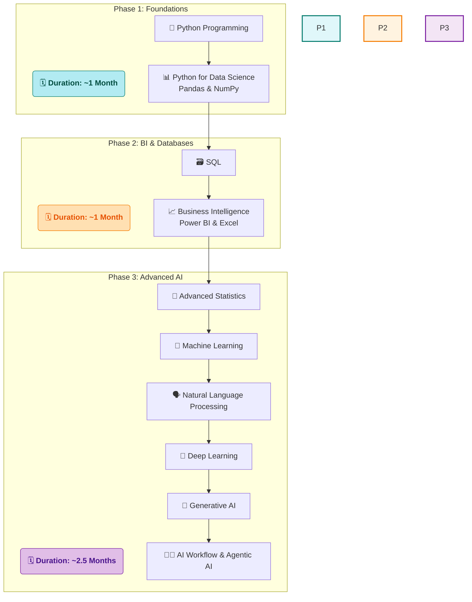

# 🚀 My Data Science Journey with SD Hub

<div align="center">


*📅 Started: July 1st, 2025*  
*🕐 Class Timings: 3:30 PM - 5:30 PM (Mon-Fri)*  
*🎯 Goal: Master Data Science & Analytics*

</div>

---

## 🌟 About This Repository

Welcome to my documentation of the **Data Science Course (Batch 2)** at **Skills Development Hub (SD Hub)**! This repository serves as my digital learning journal, capturing my real-time progress, key insights, and hands-on practice as I navigate this transformative journey.

> *"Data is the new oil, and I'm here to refine it!"* 🛢️➡️💎

### 📁 Repository Structure

```
├── 📁 SDHub-DS/
│   ├── 📁 01 Foundation/
│   │   ├── 📁 01 Notes/
│   │   │   ├── 📁 01 My Notes/                 # My detailed daily learning notes in Markdown
│   │   │   │   └── 📝 01 Data Science Overview.md
│   │   │   └── 📁 02 Sir Notes/                 # PDFs and materials from the instructor
│   │   │       └── 📄 Day_01.pdf
│   │   ├── 📁 02 Python Basics Code/
│   │   │   ├── 📁 01 My Jupyter NoteBooks/       # My hands-on practice notebooks
│   │   │   │   └── 📓 Python-Basics-Cleaned.ipynb
│   │   │   └── 📁 02 Sir Jupyter NoteBooks/       # Notebooks provided by the instructor
│   │   │       └── 📓 DS_01.ipynb
│   │   ├── 📁 Projects/
│   │   └── 📁 Resources/
│   │
│   ├── 📁 02 Bi-Excel-SQL/                      # (Content for Phase 2: BI & Databases)
│   │   ├── 📁 01 Notes/
│   │   ├── 📁 02 Projects/
│   │   ├── 📁 03 datasets/
│   │   └── 📁 04 Resources/
│   │
│   ├── 📁 03 Advanced AI/                       # (Content for Phase 3: Advanced AI)
│   │   ├── 📁 01 Notes/
│   │   ├── 📁 02 Projects/
│   │   └── 📁 03 Resources/
│   │
│   └── 📁 Certifications/                      # Course and skill certifications
│
├── 📝 README.md                               # You are here!
└── 📄 LICENSE
```

>     💡 A Note on Folder Visibility:
> The structure above shows the complete, intended layout of my repository. However, Git does not track empty directories. Therefore, some folders (like Projects/ or future phase folders) may not be visible on GitHub until I add the first file (e.g., a notebook, a note, or a placeholder .gitkeep file) to them. They will appear automatically as my journey progresses and I populate them with content!


---

## 🏢 About SD Hub

**Skills Development Hub** is a premier destination for free job-oriented technology training programs, managed by **Professionals Solidarity Forum (PSF)** and supported by **Helping Hand Foundation (HHF)**. Their mission is to make quality education accessible to all, regardless of financial constraints.

### 🎯 Course Details
- **📚 Program:** Data Science & Analytics
- **🏆 Batch:** 2
- **📅 Duration:** 4.5 months (July 2025 onwards)
- **⏰ Schedule:** Monday to Friday, 3:30 PM - 5:30 PM
- **📍 Location:** SD Hub Qutubshahi
- **💻 Requirement:** Personal laptop mandatory

---

## 📚 Course Curriculum Overview

Our instructor has outlined the learning journey in three main phases:



*Note: This is the planned curriculum structure. I'll update with actual topics as we progress through the course.*

---

## 💻 My Development Environment

### 🖥️ System Specifications
<div align="center">

 
 
 
 


</div>

```
🏷️  Hardware Model: MSI Bravo 15 B5DD
🧠  Processor:      AMD Ryzen™ 5 5600H with Radeon™ Graphics × 12
💾  Memory:         16.0 GiB RAM
🎮  Graphics:       AMD Radeon™ Graphics + AMD Radeon™ RX 5500M
💿  Storage:        512.1 GB SSD
🐧  OS:             Fedora Linux 42 (Workstation Edition)
🖼️  Desktop:        GNOME 48 (Wayland)
🔧  Kernel:         Linux 6.15.3-200.fc42.x86_64
```

### 🛠️ Tools & Setup
**Course Standard:** Anaconda + Jupyter Notebook  
**My Setup:** `uv` package manager + Jupyter (for speed and efficiency on Linux)  
**Primary IDE:** Jupyter Notebook (as required by course)

<div align="center">


[](https://github.com/astral-sh/uv)


</div>

---

## 📈 Learning Progress

### 🏅 Completed Sessions
- [x] ✅ **Week 1 (Days 1-5):** Course Orientation, AI/ML Concepts, Python Fundamentals, User Input, Operators, and Strings.
- [x] ✅ **Week 2 (Days 6-9):** Python Data Structures (Lists, Tuples, Sets, Dictionaries) and Conditional Programming.
- [x] ✅ **Week 3 (Days 10-11):** Control Flow with `while` and `for` Loops.

### 📊 Current Progress
```
Week 1: [██████████] 100% - Python Fundamentals Complete!
Week 2: [██████████] 100% - Data Structures & Conditionals Complete!
Week 3: [████......] 40%  - Control Flow & Loops in Progress...
```

**📚 Topics Covered So Far:**
- **Data Science Concepts:** AI/ML/DL hierarchy, Data Science vs. Data Analysis.
- **Python Fundamentals:** Syntax, variables, data types, operators.
- **Environment:** Jupyter Notebooks, Markdown for documentation.
- **Data Structures:** In-depth study of Lists, Tuples, Sets, and Dictionaries.
- **Conditional Control Flow:** `if`, `elif`, `else`, nested conditions, and the ternary operator.
- **Iterative Control Flow:** The `while` loop and the `for` loop.
- **Loop Control Keywords:** Using `break`, `continue`, and `pass` to manage loop execution.

**🎯 Currently Learning:**
- Advanced loop patterns (e.g., nested loops).
- List comprehensions as a concise alternative to `for` loops.

---

## 📝 Daily Learning Log

<details open>
<summary><strong>📅 Week 3 (July 14th Onwards)</strong></summary>

<br>

<details open>
<summary><strong>Day 11 - July 15th, 2025: Mastering Iteration with `for` Loops</strong></summary>

**🎯 Session Focus:** Using `for` loops to iterate over sequences and perform data manipulation. [Notes](https://github.com/riyann00b/SDHub-DS/blob/main/SDHub-DS/01_Foundation/01_Notes/01_My_Notes/11%20%20Python%20Loops%20%60while%60%20and%20%60for%60.md) | [Notebook](https://github.com/riyann00b/SDHub-DS/blob/main/SDHub-DS/01_Foundation/02_Python_Basics_Code/Code%20JNs/JNB/09%20While%20loop%20.ipynb)

**📚 Key Concepts Learned:**, using diagrams and flowcharts to make the concepts easy to understand.

- **The `for` Loop:** Understood its primary use for iterating over a known sequence (like a list, string, or tuple). It simplifies iteration by automatically managing the counter variable.
- **Syntax and Flow:** `for item in collection:`. The loop runs once for each item in the collection.
  ```mermaid
  graph TD
      A[Start] --> B(For each item in collection);
      B -- More items --> C[Execute code block for the item];
      C --> B;
      B -- No more items --> D[End];
  ```
- **Practical Data Manipulation:**
  - Iterated through a list of numbers to identify and separate them into `odd` and `even` lists.
  - Processed a list of student scores to filter them into `pass` and `fail` categories.
  - Filtered a list of names based on specific criteria (e.g., starting with a certain letter).
- **`while` vs. `for` Loop:**
  - **`while`:** Best when the number of iterations is unknown (e.g., waiting for user input).
  - **`for`:** Best when you have a definite collection to iterate through.

**💡 Key Insights:**
- The `for` loop is the most "Pythonic" way to handle iteration over collections. It's more concise and less error-prone than a `while` loop with a manual counter.
- Combining a `for` loop with an `if` statement is a powerful pattern for filtering data—a fundamental task in data analysis.
- The ability to create new lists based on conditions within a loop (like the pass/fail example) is a core skill for data preparation and transformation.

**🎯 Personal Action Items:**
- [x] Completed and documented all `for` loop exercises from the notebook.
- [ ] Explore **list comprehensions**, a more advanced and efficient way to create lists from `for` loops (e.g., `evens = [i for i in li if i % 2 == 0]`).
- [ ] Practice with **nested loops** (a loop inside another loop) to solve more complex problems, like working with 2D lists (matrices).

</details>

<details>
<summary><strong>Day 10 - July 14th, 2025: Control Flow and `while` Loops</strong></summary>

**🎯 Session Focus:** Moving from sequential to iterative programming using `while` loops. [Notes](https://github.com/riyann00b/SDHub-DS/blob/main/SDHub-DS/01_Foundation/01_Notes/01_My_Notes/10%20Control%20Flow%20with%20while%20%20Loops.md) | [Notebook](https://github.com/riyann00b/SDHub-DS/blob/main/SDHub-DS/01_Foundation/02_Python_Basics_Code/Code%20JNs/JNB/09%20While%20loop%20.ipynb)

**📚 Key Concepts Learned:**
- **Introduction to Loops:** Understood why loops are essential for avoiding redundant code.
- **The `while` Loop:** Mastered the core three-step process:
  1.  **Initialization:** Setting up a counter (`num = 1`).
  2.  **Condition:** The test that determines if the loop continues (`while num <= 10:`).
  3.  **Operation/Update:** Modifying the counter to progress towards the exit condition (`num += 1`).
- **Loop Control Keywords:** Learned how `break` (stop), `continue` (skip), and `pass` (do nothing) alter the loop's flow.
- **Practical Applications:** Built a simple password authentication system with a limited number of attempts, demonstrating the power of combining `while True`, `if`, and `break`.

**💡 Key Insights:**
- The update step (`num += 1`) is the most critical part of a `while` loop. Forgetting it leads to an infinite loop.
- A `while True` loop combined with `break` is a standard pattern for creating programs that run until a specific exit condition is met inside the loop.
- Combining loops and conditionals is the foundational skill for building almost any complex program logic.

</details>

</details>

<details>
<summary><strong>📅 Week 2 (July 7th Onwards)</strong></summary>

<br>

<details>
<summary><strong>Day 8 & 9 - July 10-11, 2025: Conditional Programming Mastery</strong></summary>

**🎯 Session Focus:** Building complex decision-making logic in Python. [Notes 8](https://github.com/riyann00b/SDHub-DS/blob/main/SDHub-DS/01_Foundation/01_Notes/01_My_Notes/08%20Revision%20%26%20Conditional%20Programming.md) | [Notes 9](https://github.com/riyann00b/SDHub-DS/blob/main/SDHub-DS/01_Foundation/01_Notes/01_My_Notes/09%20Conditional%20Logic.md)

**📚 Key Concepts Learned:**
- **`if-elif-else` Chains:** Mastered the flow for handling multiple, mutually exclusive conditions.
- **Nested `if` Statements:** Understood how to create decisions within decisions.
- **The `in` Operator:** Used this powerful keyword to check for membership within a list.
- **Ternary Operator:** Practiced the concise one-line `if-else` syntax.

**💡 Key Insights:**
- Nested conditions are the key to building programs that react to a sequence of user inputs.
- The ternary operator is elegant for simple choices but should be avoided for complex logic to maintain readability.

</details>

<details>
<summary><strong>Day 7 - July 9th, 2025: Sets and Dictionaries</strong></summary>

**🎯 Session Focus:** Understanding and implementing Python's powerful key-value and unique-item collections. [Notes](https://github.com/riyann00b/SDHub-DS/blob/main/SDHub-DS/01_Foundation/01_Notes/01_My_Notes/07%20Sets%20and%20Dictionaries.md)

**📚 Key Concepts Learned:**
- **Sets:** Unordered collections with **no duplicate elements**. Mastered `.add()`, `.remove()`, `.union()`, etc.
- **Dictionaries:** Ordered collections of **key-value pairs**. Practiced CRUD (Create, Read, Update, Delete) operations.

**💡 Key Insights:**
- Sets are incredibly efficient for removing duplicates from a list (`list(set(my_list))`).
- Dictionaries are the foundation for more complex data structures like JSON, making them extremely important.

</details>

<details>
<summary><strong>Day 6 - July 8th, 2025: Lists and Tuples</strong></summary>

**🎯 Session Focus:** Deep dive into Python's sequence data types. [Notes](https://github.com/riyann00b/SDHub-DS/blob/main/SDHub-DS/01_Foundation/01_Notes/01_My_Notes/06_Lists_and_Tuples.md)

**📚 Key Concepts Learned:**
- **Lists:** Ordered, **mutable** (changeable) collections.
- **Tuples:** Ordered, **immutable** (unchangeable) collections.
- **Indexing and Slicing:** Reinforced the `[start:stop:step]` syntax.

**💡 Key Insights:**
- The choice between a list and a tuple depends entirely on whether you need to modify the data after creation.

</details>

<details>
<summary><strong>Day 5 - July 7th, 2025: Introduction to Python Strings</strong></summary>

**🎯 Session Focus:** Revising operators and a deep dive into string manipulation. [Notes](https://github.com/riyann00b/SDHub-DS/blob/main/SDHub-DS/01_Foundation/01_Notes/01_My_Notes/05_Python_Strings.md)

**📚 Key Concepts Learned:**
- **String Definition:** An immutable sequence of characters.
- **String Access:** Indexing and Slicing (`[start:end:step]`).

**💡 Key Insights:**
- The immutability of strings is a key concept. To "change" a string, you must create a new one.
- Slicing, especially with `[::-1]` to reverse a string, is a powerful and concise feature.

</details>

</details>

<details>
<summary><strong>📅 Week 1 (July 1-4, 2025)</strong></summary>

<br>

<details>
<summary><strong> Day 4 - July 4th, 2025: User Input and Python Operators </strong></summary>

**🎯 Session Focus:** Making programs interactive and performing operations. [Notes](https://github.com/riyann00b/SDHub-DS/blob/main/SDHub-DS/01%20Foundation/01%20Notes/01%20My%20Notes/04%20User%20Input%20%26%20Operators.md)

**📚 Key Concepts Learned:**
- **`input()` Function:** Always returns a string.
- **Type Casting:** The necessity of converting input strings to numbers using `int()` or `float()`.
- **Python Operators:** Covered Arithmetic, Assignment, Comparison, Logical, etc.

**💡 Key Insights:**
- Type casting is non-negotiable when getting numerical input.
- `is` (checks memory location) and `==` (checks value) are not the same.

</details>

<details>
<summary><strong>Day 3 - July 3rd, 2025: Python Fundamentals & Jupyter Mastery</strong></summary>

**🎯 Session Focus:** Hands-on coding and environment setup. [Notes](https://github.com/riyann00b/SDHub-DS/blob/main/SDHub-DS/01%20Foundation/01%20Notes/01%20My%20Notes/03%20Python%20Fundamentals%20%26%20Jupyter%20Mastery.md)

**📚 Key Concepts Learned:**
- **Jupyter Notebook Navigation:** Command Mode vs. Edit Mode.
- **Markdown Documentation:** Basics of formatting text.
- **Python Fundamentals:** Variable naming rules and basic data types.

</details>

<details>
<summary><strong>Day 2 - July 2nd, 2025: Understanding the AI Landscape</strong></summary>

**🎯 Session Focus:** Conceptual foundation of AI, ML, and DL. [Notes](https://github.com/riyann00b/SDHub-DS/blob/main/SDHub-DS/01%20Foundation/01%20Notes/01%20My%20Notes/02%20Understanding%20the%20AI.md)

**📚 Key Concepts Learned:**
- **AI vs ML vs DL Hierarchy:** Understood the relationship between these fields.
- **Generative AI Applications:** Explored text, image, and code generation.

</details>

<details>
<summary><strong>Day 1 - July 1st, 2025: Course Kickoff & Data Science Overview</strong></summary>

**🎯 Session Focus:** Introduction and course orientation. [Notes](https://github.com/riyann00b/SDHub-DS/blob/main/SDHub-DS/01%20Foundation/01%20Notes/01%20My%20Notes/01%20Data%20Science%20Overview.md)

**📚 Key Concepts Learned:**
- **Data Science vs Data Analysis:** Key differences and scopes.
- **Course Structure Overview:** The three main phases of our learning journey.
- **Statistics Foundation:** Descriptive vs. Inferential statistics.

</details>

</details>

---

## 🤝 Connect & Collaborate

<div align="center">

[](https://www.linkedin.com/in/md-riyan-nazeer/)
[](https://github.com/riyann00b)
[](mailto:riyannazeer786@gmail.com)

*📬 Always open to discussions about data science, learning experiences, and collaboration!*

</div>

---

## 📚 Learning Resources

### 🔗 Useful Links I've Discovered
- [Jupyter Notebook Documentation](https://jupyter-notebook.readthedocs.io/) - Official guide for Jupyter
- [Python PEP 8 Style Guide](https://pep8.org/) - Python coding conventions
- [Markdown Guide](https://www.markdownguide.org/) - Comprehensive Markdown reference

---

<div align="center">

### 🌟 Journey Stats
  


---

**📊 Learning Analytics**  
**Days Active:** 11 | **Sessions Completed:** 11 | **Concepts Learned:** 50+

---

*"The journey of a thousand miles begins with a single step"* 🚶‍♂️  
**Started:** July 1st, 2025 | **Status:** Learning & Growing 🌱

**Made with ❤️ and lots of ☕ during my Data Science journey at SD Hub**

</div>
