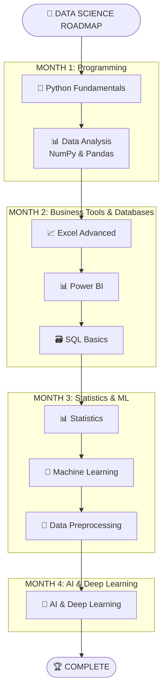
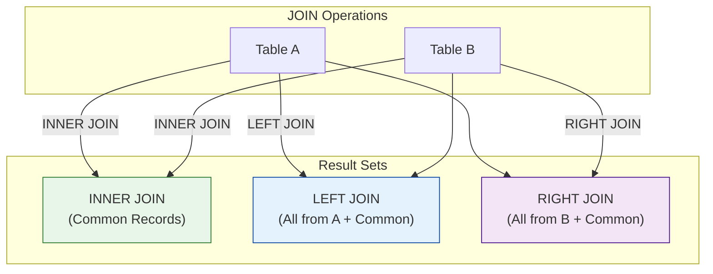

<div align="center">
<h1> 🚀 My Data Science Journey with SD Hub </h1>
</div>

<div align="center">


*📅 Started: July 1st, 2025*
*🕐 Class Timings: 3:00 PM - 6:00 PM (Mon-Fri)*
*🎯 Goal: Master Data Science / Analytics & Gen-AI*

</div>

---

## 🌟 About This Repository

Welcome to my documentation of the **Data Science Course (Batch 2)** at **Skills Development Hub (SD Hub)**! This repository serves as my digital learning journal, capturing my real-time progress, key insights, and hands-on practice as I navigate this transformative journey.

> *"Data is the new oil, and I'm here to refine it!"* 🛢️➡️💎

### 📁 Repository Structure

Here's a high-level overview of the key directories in this repository:

```bash
.
├── 📁 SDHub-DS/
│   ├── 📁 00 Notes/              # My personal and instructor-provided notes.
│   │   ├── 📁 01_Python/
│   │   ├── 📁 02_Excel/
│   │   ├── 📁 03_Power BI/
│   │   └── 📁 04_SQL/
│   ├── 📁 01 Python Foundation/   # Code, notebooks, and datasets for Python.
│   ├── 📁 02 Bi-Excel/            # Workbooks and Power BI project files.
│   ├── 📁 03 SQL/                 # SQL scripts and practice files.
│   └── 📁 Hackathon/              # Project files for hackathons.
└── 📜 README.md                   # You are here!
```

### 🚀 Quick Access to Notes

Jump directly to the notes for each module:

-   [🐍 **Python Notes**](https://github.com/riyann00b/SDHub-DS/tree/main/SDHub-DS/00%20Notes/01_Python)
-   [📊 **Excel Notes**](https://github.com/riyann00b/SDHub-DS/tree/main/SDHub-DS/00%20Notes/02_Excel)
-   [📈 **Power BI Notes**](https://github.com/riyann00b/SDHub-DS/tree/main/SDHub-DS/00%20Notes/03_Power%20BI)
-   [🗃️ **SQL Notes**](https://github.com/riyann00b/SDHub-DS/tree/main/SDHub-DS/00%20Notes/04_SQL)

---

## 🏢 About SD Hub

**Skills Development Hub** is a premier destination for free job-oriented technology training programs, managed by **Professionals Solidarity Forum (PSF)** and supported by **Helping Hand Foundation (HHF)**. Their mission is to make quality education accessible to all, regardless of financial constraints.

### 🎯 Course Details
- **📚 Program:** Data Science & Gen AI
- **🏆 Batch:** 2
- **📅 Duration:** 4.5 months (July 2025 onwards)
- **⏰ Schedule:** Monday to Friday
    - **IELTS & Interview Prep:** 3:00 PM - 4:00 PM
    - **Data Science:** 4:00 PM - 6:00 PM
- **📍 Location:** SD Hub Qutubshahi
- **💻 Requirement:** Personal laptop mandatory

---

## 📚 Course Curriculum Overview

Our instructor has outlined the learning journey in 4 main phases:



---

## 💻 My Development Environment

### 🖥️ System Specifications
<div align="center">


</div>

### 🛠️ Tools & Setup

I'm using a slightly different stack than the one taught in class, which provides an excellent opportunity to learn about cross-compatibility and modern tooling.

<div align="center">

[](https://github.com/astral-sh/uv)
 


</div>

---

## 📈 Learning Progress

### 🏅 Completed Milestones
- [x] ✅ **Phase 1:** Python Fundamentals & Python for Data Science (NumPy, Pandas).
- [x] ✅ **Phase 2 (Partial):** Business Intelligence with Excel & Power BI.

### 📊 Current Progress
```progress
Phase 1: Foundations        [██████████] 100% Complete!
Phase 2: Power BI           [██████████] 100% Complete!
Phase 2: SQL & Databases    [█████.....]  55% In Progress
Phase 3: Advanced AI/ML     [..........]   0% Not Started
```

**🎯 Currently Learning: Week 10 - SQL `JOIN`s**
- We are mastering how to combine data from multiple tables using `JOIN` clauses.
- Today’s focus was understanding the different types of `JOIN`s (`INNER`, `LEFT`, `RIGHT`) and the special-purpose `SELF JOIN`.
- **Up Next:** More complex `JOIN` scenarios and advanced database concepts.

---

## 📝 Today's Learning Overview

<details open>
<summary><strong>Day 71 (September 11th, 2025) - Mastering SQL JOINs: Connecting Multiple Tables</strong></summary>
<br>

**🎯 Session Focus:** Combining rows from two or more tables based on a related column. This is a fundamental skill for querying relational databases effectively.

**📚 Key Concepts Explored:**

### `JOIN`s vs. Nested Queries
While both can be used to get data from multiple tables, `JOIN`s are almost always more performant. The database query optimizer is highly tuned for `JOIN` operations, making them the industry standard.

### 🧩 The Core `JOIN` Types
We visualized the primary `JOIN` types to understand how they include or exclude data.



### The `SELF JOIN`
A powerful technique where a table is joined to itself. This is essential for querying hierarchical data, like finding an employee's manager in the same table.

**Example:** Fetching student details along with their company role and salary using aliases.
```sql
-- Using aliases 'sd' and 'cm' makes the query cleaner and easier to read
SELECT
    sd.Name,
    sd.Age,
    cm.Role,
    cm.Salary
FROM student_details AS sd
JOIN company AS cm ON sd.Name = cm.Name;
```
**💡 Key Insights:**
- **`JOIN`s are essential:** It's impossible to work with relational databases without mastering `JOIN`s.
- **Aliases are your friend:** Using table aliases (`AS`) is a best practice that dramatically improves query readability.
- **Choose the right `JOIN`:** Understanding the difference between `INNER`, `LEFT`, and `RIGHT` joins is crucial for getting the exact data you need without errors or `NULL` values where you don't expect them.

</details>

---

## 🤝 Connect & Collaborate

<div align="center">

[](https://www.linkedin.com/in/md-riyan-nazeer/)
[](https://github.com/riyann00b)
[](mailto:riyannazeer786@gmail.com)


*📬 Always open to discussions about data science, learning experiences, and collaboration!*

</div>

---

<div align="center">

**Made with ❤️ and lots of ☕ during my Data Science journey at SD Hub**

</div>