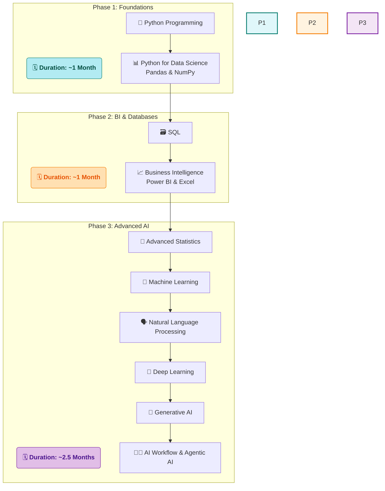

# 🚀 My Data Science Journey with SD Hub

<div align="center">


*📅 Started: July 1st, 2025*  
*🕐 Class Timings: 3:30 PM - 5:30 PM (Mon-Fri)*  
*🎯 Goal: Master Data Science / Analytics & Gen-AI*

</div>

---

## 🌟 About This Repository

Welcome to my documentation of the **Data Science Course (Batch 2)** at **Skills Development Hub (SD Hub)**! This repository serves as my digital learning journal, capturing my real-time progress, key insights, and hands-on practice as I navigate this transformative journey.

> *"Data is the new oil, and I'm here to refine it!"* 🛢️➡️💎

### 📁 Repository Structure

```
├── 📁 SDHub-DS/
│   ├── 📁 01 Foundation/
│   │   ├── 📁 01 Notes/
│   │   │   ├── 📁 01 My Notes/                 # My detailed daily learning notes in Markdown
│   │   │   │   └── 📝 01 Data Science Overview.md
│   │   │   └── 📁 02 Sir Notes/                 # PDFs and materials from the instructor
│   │   │       └── 📄 Day_01.pdf
│   │   ├── 📁 02 Python Basics Code/
│   │   │   ├── 📁 01 My Jupyter NoteBooks/       # My hands-on practice notebooks
│   │   │   │   └── 📓 Python-Basics-Cleaned.ipynb
│   │   │   └── 📁 02 Sir Jupyter NoteBooks/       # Notebooks provided by the instructor
│   │   │       └── 📓 DS_01.ipynb
│   │   ├── 📁 Projects/
│   │   └── 📁 Resources/
│   │
│   ├── 📁 02 Bi-Excel-SQL/                      # (Content for Phase 2: BI & Databases)
│   │   ├── 📁 01 Notes/
│   │   ├── 📁 02 Projects/
│   │   ├── 📁 03 datasets/
│   │   └── 📁 04 Resources/
│   │
│   ├── 📁 03 Advanced AI/                       # (Content for Phase 3: Advanced AI)
│   │   ├── 📁 01 Notes/
│   │   ├── 📁 02 Projects/
│   │   └── 📁 03 Resources/
│   │
│   └── 📁 Certifications/                      # Course and skill certifications
│
├── 📝 README.md                               # You are here!
└── 📄 LICENSE
```

>     💡 A Note on Folder Visibility:
> The structure above shows the complete, intended layout of my repository. However, Git does not track empty directories. Therefore, some folders (like Projects/ or future phase folders) may not be visible on GitHub until I add the first file (e.g., a notebook, a note, or a placeholder .gitkeep file) to them. They will appear automatically as my journey progresses and I populate them with content!


---

## 🏢 About SD Hub

**Skills Development Hub** is a premier destination for free job-oriented technology training programs, managed by **Professionals Solidarity Forum (PSF)** and supported by **Helping Hand Foundation (HHF)**. Their mission is to make quality education accessible to all, regardless of financial constraints.

### 🎯 Course Details
- **📚 Program:** Data Science & Gen AI
- **🏆 Batch:** 2
- **📅 Duration:** 4.5 months (July 2025 onwards)
- **⏰ Schedule:** Monday to Friday, 3:30 PM - 5:30 PM
- **📍 Location:** SD Hub Qutubshahi
- **💻 Requirement:** Personal laptop mandatory

---

## 📚 Course Curriculum Overview

Our instructor has outlined the learning journey in three main phases:



*Note: This is the planned curriculum structure. I'll update with actual topics as we progress through the course.*

---

## 💻 My Development Environment

### 🖥️ System Specifications
<div align="center">

 
 
 
 


</div>

```
🏷️  Hardware Model: MSI Bravo 15 B5DD
🧠  Processor:      AMD Ryzen™ 5 5600H with Radeon™ Graphics × 12
💾  Memory:         16.0 GiB RAM
🎮  Graphics:       AMD Radeon™ Graphics + AMD Radeon™ RX 5500M
💿  Storage:        512.1 GB SSD
🐧  OS:             Fedora Linux 42 (Workstation Edition)
🖼️  Desktop:        GNOME 48 (Wayland)
🔧  Kernel:         Linux 6.15.3-200.fc42.x86_64
```

### 🛠️ Tools & Setup
**Course Standard:** Anaconda + Jupyter Notebook  
**My Setup:** `uv` package manager + Jupyter (for speed and efficiency on Linux)  
**Primary IDE:** Jupyter Notebook (as required by course)

<div align="center">


[](https://github.com/astral-sh/uv)


</div>

---

## 📈 Learning Progress

### 🏅 Completed Sessions
- [x] ✅ **Week 1 (Days 1-5):** Course Orientation, AI/ML Concepts, Python Fundamentals, User Input, Operators, and Strings.
- [x] ✅ **Week 2 (Days 6-9):** Python Data Structures (Lists, Tuples, Sets, Dictionaries) and Conditional Programming.
- [x] ✅ **Week 3 (Days 10-14):** Control Flow (Loops), Comprehensions, and a deep dive into Functional Programming (`def`, `*args`, `**kwargs`, `lambda`, `map`, `reduce`).

### 📊 Current Progress
```
Week 1: [██████████] 100% - Python Fundamentals Complete!
Week 2: [██████████] 100% - Data Structures & Conditionals Complete!
Week 3: [██████████] 100% - Control Flow & Functions Complete!
```

**📚 Topics Covered So Far:**
- **Data Science Concepts:** AI/ML/DL hierarchy, Data Science vs. Data Analysis.
- **Python Fundamentals:** Syntax, variables, data types, operators.
- **Environment:** Jupyter Notebooks, Markdown for documentation.
- **Data Structures:** In-depth study of Lists, Tuples, Sets, and Dictionaries.
- **Conditional Control Flow:** `if`, `elif`, `else`, nested conditions, and the ternary operator.
- **Iterative Control Flow:** The `while` loop and the `for` loop.
- **Loop Control Keywords:** Using `break`, `continue`, and `pass` to manage loop execution.
- **Pythonic Code:** Writing concise code with **List & Dictionary Comprehensions**.
- **Functional Programming:**
    -  **Core Concepts:** `def`, parameters, `return`, and variable scope.
    -  **Advanced Concepts:** `*args`, `**kwargs`, `lambda`, `map`, and `reduce`.

**🎯 Currently Learning:**
- Phase 1 complete! Consolidating my Python knowledge.
- Preparing for Phase 2: BI & Databases.

---

## 📝 Daily Learning Log

<details open>
<summary><strong>📅 Week 3 (July 14th Onwards)</strong></summary>

<br>

<details open>
<summary><strong>Day 14 - July 19th, 2025 (Saturday Session): Advanced Functional Programming</strong></summary>

> **Note:** This was a special Saturday class to compensate for the holiday on Friday (July 18th), which was declared due to heavy rain.

**🎯 Session Focus:** Mastering flexible and powerful functional programming tools: `*args`, `**kwargs`, `lambda`, `map`, and `reduce`. [Notes](https://github.com/riyann00b/SDHub-DS/blob/main/SDHub-DS/01_Foundation/01_Notes/01_My_Notes/14%20Functional%20Programming.md) | [Notebook](https://github.com/riyann00b/SDHub-DS/blob/main/SDHub-DS/01_Foundation/02_Python_Basics_Code/Code%20JNs/JNB/12%20functional%20programming.ipynb)

**📚 Key Concepts Learned:**

- **Flexible Function Arguments:**
    - **`*args`:** Understood how it captures a variable number of *positional* arguments into a **tuple**. This is perfect for functions that need to process an unknown number of items, like a custom `sum()` function.
    - **`**kwargs`:** Learned how it captures a variable number of *keyword* arguments into a **dictionary**, allowing for highly flexible functions that accept optional named attributes.
    - **Argument Order:** Mastered the mandatory function signature order: `standard_args`, `*args`, `**kwargs`.

- **`lambda` (Anonymous Functions):** Solidified the concept of `lambda` as a concise way to create small, one-line functions, especially useful inside other functions like `map` and `reduce`.
    - **Syntax:** `lambda arguments: expression`
    - **Conditional Logic:** Practiced the ternary syntax: `value_if_true if condition else value_if_false`.

- **The `map` and `reduce` Functions:**
    - **`map(function, iterable)`:** Applies a function to *every* item in an iterable.
        ```mermaid
        graph TD
            subgraph Input List
                A[1] --> B[2] --> C[3]
            end
            E((map: λ x: x*2))
            subgraph Output List
                F[2] --> G[4] --> H[6]
            end
            A --> E --> F; B --> E --> G; C --> E --> H;
        ```
    - **`reduce(function, iterable)`:** Cumulatively applies a function to a sequence to "reduce" it to a single value. (Requires import from `functools`).
        ```mermaid
        graph TD
            A[1] --> C{1 + 2 = 3};
            B[2] --> C;
            C --> E{3 + 3 = 6};
            D[3] --> E;
        ```

**💡 Key Insights:**
- `*args` and `**kwargs` are game-changers for creating professional, adaptable functions that don't force the user to provide a fixed set of inputs.
- The combination of `lambda` with `map` is an incredibly powerful and "Pythonic" pattern for data transformation, replacing clunky `for` loops.
- Finally understood the common errors from my previous notebooks—passing keyword arguments to a `*args`-only function was the main culprit. The distinction is now crystal clear.

**🎯 Personal Action Items:**
- [x] Created a new, clean Jupyter Notebook summarizing all the functional programming concepts.
- [x] Documented today's special session in my Markdown notes and this README.
- [ ] Write a function `create_report(student_name, *grades, **report_details)` that uses all three types of arguments to generate a formatted student report string.
- [ ] Revisit the `pass`/`fail` exercise and rewrite it as a single line using `map` and a `lambda` function.

</details>

<details>
<summary><strong>Day 13 - July 17th, 2025: Modularizing Code with Functional Programming</strong></summary>

**🎯 Session Focus:** Writing reusable, modular, and clean code using functions. [Notes](https://github.com/riyann00b/SDHub-DS/blob/main/SDHub-DS/01_Foundation/01_Notes/01_My_Notes/13%20Functional%20Programming.md) | [Notebook](https://github.com/riyann00b/SDHub-DS/blob/main/SDHub-DS/01_Foundation/02_Python_Basics_Code/Code%20JNs/JNB/11%20Fuctional%20Programming.ipynb)

**📚 Key Concepts Learned:**

- **Functional Programming:** Introduced to the paradigm of building programs by defining and composing functions, promoting a DRY (Don't Repeat Yourself) coding style.
- **User-Defined Functions:** Mastered the core mechanics of `def`, parameters vs. arguments, and the critical `return` keyword.
- **Variable Scope:** Differentiated between local and global scope.
- **Recursive Functions:** Explored the concept of a function that calls itself.

**💡 Key Insights:**
- Functions are the most important building blocks for organized and scalable programs.
- Capturing a function's output with `return` is far more powerful than just printing it.

</details>

<details>
<summary><strong>Day 12 - July 16th, 2025: Pythonic Data Manipulation with Comprehensions</strong></summary>

**🎯 Session Focus:** Refactoring loops into elegant, one-line comprehensions for lists and dictionaries. [Notes](https://github.com/riyann00b/SDHub-DS/blob/main/SDHub-DS/01_Foundation/01_Notes/01_My_Notes/12%20Loops%20and%20Comprehensions.md) | [Notebook](https://github.com/riyann00b/SDHub-DS/blob/main/SDHub-DS/01_Foundation/02_Python_Basics_Code/Code%20JNs/JNB/10%20Loop%20and%20comprehension.ipynb)

**📚 Key Concepts Learned:**
- **Comprehensions:** Understood that comprehensions are a concise, "Pythonic" way to create lists, dictionaries, or sets.
- **Core Patterns:** Mastered simple mapping, filtering (`if` at the end), and conditional output (`if/else` at the beginning).

**💡 Key Insights:**
- Comprehensions are often more readable and can be faster than their equivalent `for` loop counterparts.

</details>

<details>
<summary><strong>Day 11 - July 15th, 2025: Mastering Iteration with `for` Loops</strong></summary>

**🎯 Session Focus:** Using `for` loops to iterate over sequences and perform data manipulation. [Notes](https://github.com/riyann00b/SDHub-DS/blob/main/SDHub-DS/01_Foundation/01_Notes/01_My_Notes/11%20%20Python%20Loops%20%60while%60%20and%20%60for%60.md) | [Notebook](https://github.com/riyann00b/SDHub-DS/blob/main/SDHub-DS/01_Foundation/02_Python_Basics_Code/Code%20JNs/JNB/09%20While%20loop%20.ipynb)

**📚 Key Concepts Learned:**
- **The `for` Loop:** Understood its primary use for iterating over a known sequence.
- **`while` vs. `for` Loop:** Distinguished the use cases: `while` for unknown iteration counts, `for` for definite collections.

</details>

<details>
<summary><strong>Day 10 - July 14th, 2025: Control Flow and `while` Loops</strong></summary>

**🎯 Session Focus:** Moving from sequential to iterative programming using `while` loops. [Notes](https://github.com/riyann00b/SDHub-DS/blob/main/SDHub-DS/01_Foundation/01_Notes/01_My_Notes/10%20Control%20Flow%20with%20while%20%20Loops.md) | [Notebook](https://github.com/riyann00b/SDHub-DS/blob/main/SDHub-DS/01_Foundation/02_Python_Basics_Code/Code%20JNs/JNB/09%20While%20loop%20.ipynb)

**📚 Key Concepts Learned:**
- **The `while` Loop:** Mastered the three-step process: Initialization, Condition, and Update.
- **Loop Control Keywords:** Learned how `break`, `continue`, and `pass` alter the loop's flow.

</details>

</details>

<details>
<summary><strong>📅 Week 2 (July 7th Onwards)</strong></summary>
<!-- Collapsed for brevity -->
</details>

<details>
<summary><strong>📅 Week 1 (July 1-4, 2025)</strong></summary>
<!-- Collapsed for brevity -->
</details>

---

## 🤝 Connect & Collaborate

<div align="center">

[](https://www.linkedin.com/in/md-riyan-nazeer/)
[](https://github.com/riyann00b)
[](mailto:riyannazeer786@gmail.com)

*📬 Always open to discussions about data science, learning experiences, and collaboration!*

</div>

---

## 📚 Learning Resources

### 🔗 Useful Links I've Discovered
- [Jupyter Notebook Documentation](https://jupyter-notebook.readthedocs.io/) - Official guide for Jupyter
- [Python PEP 8 Style Guide](https://pep8.org/) - Python coding conventions
- [Markdown Guide](https://www.markdownguide.org/) - Comprehensive Markdown reference

---

<div align="center">

### 🌟 Journey Stats
  


---

**📊 Learning Analytics**  
**Days Active:** 14 | **Sessions Completed:** 14 | **Concepts Learned:** 65+

---

*"The journey of a thousand miles begins with a single step"* 🚶‍♂️  
**Started:** July 1st, 2025 | **Status:** Learning & Growing 🌱

**Made with ❤️ and lots of ☕ during my Data Science journey at SD Hub**

</div>
