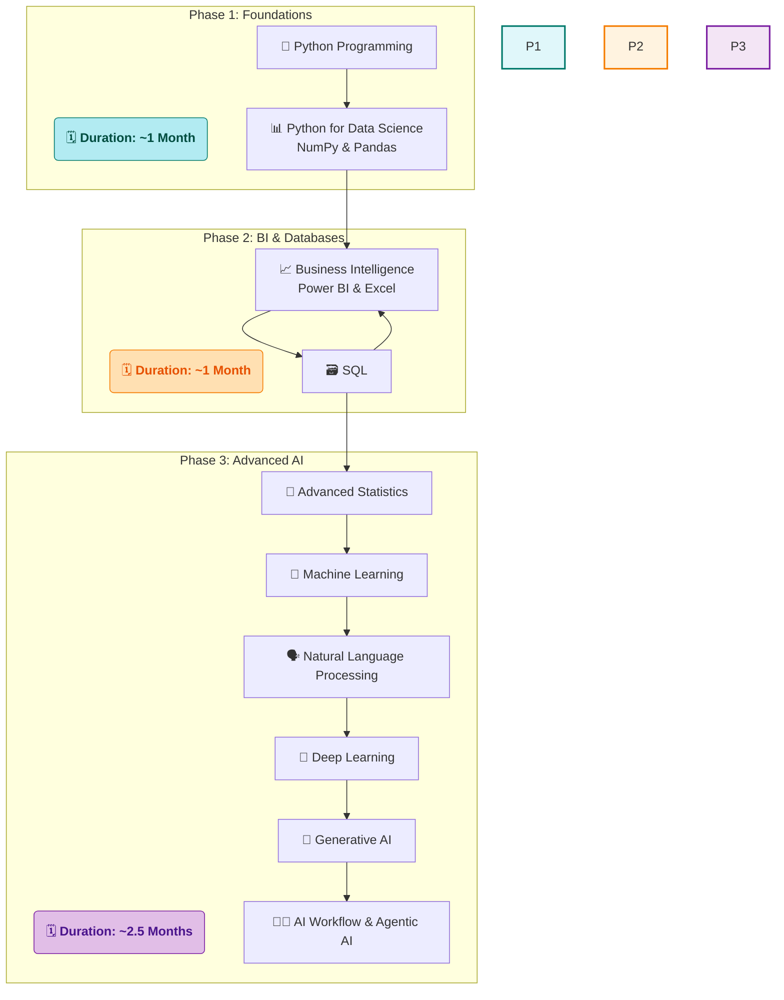

# 🚀 My Data Science Journey with SD Hub

<div align="center">


*📅 Started: July 1st, 2025*
*🕐 Class Timings: 3:00 PM - 6:00 PM (Mon-Fri)*
*🎯 Goal: Master Data Science / Analytics & Gen-AI*

</div>

---

## 🌟 About This Repository

Welcome to my documentation of the **Data Science Course (Batch 2)** at **Skills Development Hub (SD Hub)**! This repository serves as my digital learning journal, capturing my real-time progress, key insights, and hands-on practice as I navigate this transformative journey.

> *"Data is the new oil, and I'm here to refine it!"* 🛢️➡️💎

### 📁 Repository Structure

```
└── SDHub-DS/
    ├── README.md
    ├── LICENSE
    └── SDHub-DS/
        ├── 00 Notes/
        │   ├── 01_My_Notes/
        │   └── 02_Sir_Notes/
        ├── 01 Python Foundation/
        │   ├── 02_Python_Basics_Code/
        │   └── 03 Python For Data Science/
        ├── 02 Bi-Excel/
        │   ├── 01 Excel/
        │   └── 02 Power BI/
        ├── 03 SQL/
        └── Hackathon/
            └── Data cleaning and vistualization/
```
> *Note: This is a high-level overview. The repository contains detailed notes, Jupyter notebooks, datasets, and project files within this structure.*

---

## 🏢 About SD Hub

**Skills Development Hub** is a premier destination for free job-oriented technology training programs, managed by **Professionals Solidarity Forum (PSF)** and supported by **Helping Hand Foundation (HHF)**. Their mission is to make quality education accessible to all, regardless of financial constraints.

### 🎯 Course Details
- **📚 Program:** Data Science & Gen AI
- **🏆 Batch:** 2
- **📅 Duration:** 4.5 months (July 2025 onwards)
- **⏰ Schedule:** Monday to Friday
    - **IELTS & Interview Prep:** 3:00 PM - 4:00 PM
    - **Data Science:** 4:00 PM - 6:00 PM
- **📍 Location:** SD Hub Qutubshahi
- **💻 Requirement:** Personal laptop mandatory

---

## 📚 Course Curriculum Overview

Our instructor has outlined the learning journey in three main phases:



---

## 💻 My Development Environment

### 🖥️ System Specifications
<div align="center">


</div>

```
🏷️  Hardware Model: MSI Bravo 15 B5DD
🧠  Processor:      AMD Ryzen™ 5 5600H with Radeon™ Graphics × 12
💾  Memory:         16.0 GiB RAM
🎮  Graphics:       AMD Radeon™ Graphics
💿  Storage:        512.1 GB SSD
🐧  Primary OS:     CachyOS (rolling) with GNOME 48
```

### 🛠️ Tools & Setup
**Primary Development:** `uv` package manager + Jupyter on CachyOS.
**Business Intelligence:** Using **Windows 11 Pro** for Power BI & Excel.

<div align="center">


</div>

---

## 📈 Learning Progress

### 🏅 Completed Milestones
- [x] ✅ **Phase 1:** Python Fundamentals & Python for Data Science (NumPy, Pandas).
- [x] ✅ **Phase 2 (Partial):** Business Intelligence with Excel & Power BI.

### 📊 Current Progress
```progress
Phase 1: Foundations        [██████████] 100% Complete!
Phase 2: Power BI           [██████████] 100% Complete!
Phase 2: SQL & Databases    [██........]  20% In Progress
Phase 3: Advanced AI/ML     [..........]   0% Not Started
```

**🎯 Currently Learning: Week 10 - Introduction to SQL**
- We have officially started the database module, kicking things off with SQL.
- Today's focus was on understanding the core concepts of databases, the structure of SQL, and how to define the schema of a database.
- **Up Next:** Manipulating and querying data with DML and DQL.

---

## 📝 Today's Learning Overview (September 8th, 2025)

<details open>
<summary><strong>Day 68 - Introduction to SQL & Database Fundamentals</strong></summary>
<br>

**🎯 Session Focus:** Understanding the foundational concepts of databases, the role of SQL as a database language, and learning the first major category of SQL commands: DDL.

**📚 Key Concepts Explored:**

Today marked our transition from BI tools into the world of databases. We covered the "why" and "what" of SQL before writing our first queries.

### 🏛️ 1. Database Fundamentals
- **Data vs. Information:** Data is raw (e.g., 'A', 20), while information is structured and meaningful (e.g., a table row with `Name='A'`, `Age=20`).
- **Structured vs. Unstructured Data:** We learned that SQL databases excel at managing **structured data** (tables with rows and columns), like user profiles. **Unstructured data** (comments, posts, likes) is typically handled by NoSQL databases.
- **DBMS vs. RDBMS:** A Database Management System (DBMS) is the software that manages a database. An RDBMS is a specific type for relational (table-based) databases.

### 🧩 2. The Five Sub-Languages of SQL
SQL isn't just one language; it's a set of sub-languages for different tasks. We broke them down:
- **DDL (Data Definition Language):** For defining the database structure. `(CREATE, ALTER, DROP)`
- **DML (Data Manipulation Language):** For manipulating the data itself. `(INSERT, UPDATE, DELETE)`
- **DQL (Data Query Language):** For fetching data. `(SELECT)`
- **DCL (Data Control Language):** For managing permissions. `(GRANT, REVOKE)`
- **TCL (Transaction Control Language):** For managing transactions. `(COMMIT, ROLLBACK)`

### 🏗️ 3. DDL in Practice
We spent the most time on DDL, as it's the first step in building a database.
- **`CREATE`:** Used to build a new database or table.
  ```sql
  -- First, create the database container
  CREATE DATABASE sdhub;
  
  -- Then, select it for use
  USE sdhub;
  
  -- Finally, define the table structure (schema)
  CREATE TABLE student_details (
      Name VARCHAR(15),
      Age INT,
      Gender VARCHAR(1)
  );
  ```
- **`ALTER`:** Modifies an existing table's structure (e.g., adding a new column).
- **`DROP` vs. `TRUNCATE`:** A crucial distinction. `TRUNCATE` deletes all data *inside* a table but keeps the structure. `DROP` deletes the *entire table* permanently.

**💡 Key Insights:**
- **Structure is Everything:** SQL's power comes from its enforced structure, ensuring data consistency.
- **Keywords are not Case-Sensitive:** `SELECT` is the same as `select`, but the convention is to use UPPERCASE for readability.
- **DDL is the Blueprint:** You must build the house (DDL) before you can put things inside it (DML).

</details>

---

## 🤝 Connect & Collaborate

<div align="center">

[](https://www.linkedin.com/in/md-riyan-nazeer/)
[](https://github.com/riyann00b)
[](mailto:riyannazeer786@gmail.com)

*📬 Always open to discussions about data science, learning experiences, and collaboration!*

</div>

---

<div align="center">

### 🌟 Journey Stats
  

---

**📊 Learning Analytics**
**Journey Duration:** 2 months, 8 days | **Total Days:** 68

---

*"The journey of a thousand miles begins with a single step"* 🚶‍♂️
**Started:** July 1st, 2025 | **Status:** Learning & Growing 🌱

**Made with ❤️ and lots of ☕ during my Data Science journey at SD Hub**

</div>
