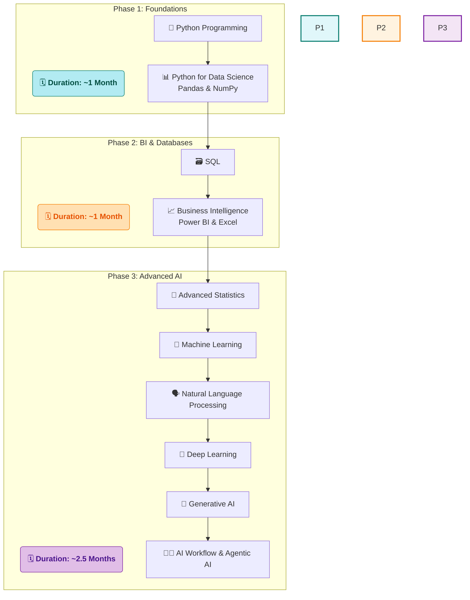

# 🚀 My Data Science Journey with SD Hub

<div align="center">


*📅 Started: July 1st, 2025*  
*🕐 Class Timings: 3:30 PM - 5:30 PM (Mon-Fri)*  
*🎯 Goal: Master Data Science & Analytics*

</div>

---

## 🌟 About This Repository

Welcome to my documentation of the **Data Science Course (Batch 2)** at **Skills Development Hub (SD Hub)**! This repository serves as my digital learning journal, capturing my real-time progress, key insights, and hands-on practice as I navigate this transformative journey.

> *"Data is the new oil, and I'm here to refine it!"* 🛢️➡️💎

### 📁 Repository Structure
```
├── 📁 SDHub-DS/
│   ├── 📁 01 Foundation/
│   │   ├── 📁 01 Notes/
│   │   │   ├── 📁 01 My Notes/                 # My detailed daily learning notes in Markdown
│   │   │   │   └── 📝 01 Data Science Overview.md
│   │   │   └── 📁 02 Sir Notes/                 # PDFs and materials from the instructor
│   │   │       └── 📄 Day_01.pdf
│   │   ├── 📁 02 Python Basics Code/
│   │   │   ├── 📁 01 My Jupyter NoteBooks/       # My hands-on practice notebooks
│   │   │   │   └── 📓 Python-Basics-Cleaned.ipynb
│   │   │   └── 📁 02 Sir Jupyter NoteBooks/       # Notebooks provided by the instructor
│   │   │       └── 📓 DS_01.ipynb
│   │   ├── 📁 Projects/
│   │   └── 📁 Resources/
│   │
│   ├── 📁 02 Bi-Excel-SQL/                      # (Content for Phase 2: BI & Databases)
│   │   ├── 📁 01 Notes/
│   │   ├── 📁 02 Projects/
│   │   ├── 📁 03 datasets/
│   │   └── 📁 04 Resources/
│   │
│   ├── 📁 03 Advanced AI/                       # (Content for Phase 3: Advanced AI)
│   │   ├── 📁 01 Notes/
│   │   ├── 📁 02 Projects/
│   │   └── 📁 03 Resources/
│   │
│   └── 📁 Certifications/                      # Course and skill certifications
│
├── 📝 README.md                               # You are here!
└── 📄 LICENSE
```
>     💡 A Note on Folder Visibility:
> The structure above shows the complete, intended layout of my repository. However, Git does not track empty directories. Therefore, some folders (like Projects/ or future phase folders) may not be visible on GitHub until I add the first file (e.g., a notebook, a note, or a placeholder .gitkeep file) to them. They will appear automatically as my journey progresses and I populate them with content!


---

## 🏢 About SD Hub

**Skills Development Hub** is a premier destination for free job-oriented technology training programs, managed by **Professionals Solidarity Forum (PSF)** and supported by **Helping Hand Foundation (HHF)**. Their mission is to make quality education accessible to all, regardless of financial constraints.

### 🎯 Course Details
- **📚 Program:** Data Science & Analytics
- **🏆 Batch:** 2
- **📅 Duration:** 4.5 months (July 2025 onwards)
- **⏰ Schedule:** Monday to Friday, 3:30 PM - 5:30 PM
- **📍 Location:** SD Hub Qutubshahi
- **💻 Requirement:** Personal laptop mandatory

---

## 📚 Course Curriculum Overview

Our instructor has outlined the learning journey in three main phases:



*Note: This is the planned curriculum structure. I'll update with actual topics as we progress through the course.*

---

## 💻 My Development Environment

### 🖥️ System Specifications
<div align="center">

 
 
 
 


</div>

```
🏷️  Hardware Model: MSI Bravo 15 B5DD
🧠  Processor:      AMD Ryzen™ 5 5600H with Radeon™ Graphics × 12
💾  Memory:         16.0 GiB RAM
🎮  Graphics:       AMD Radeon™ Graphics + AMD Radeon™ RX 5500M
💿  Storage:        512.1 GB SSD
🐧  OS:             Fedora Linux 42 (Workstation Edition)
🖼️  Desktop:        GNOME 48 (Wayland)
🔧  Kernel:         Linux 6.15.3-200.fc42.x86_64
📅  Last Updated:   July 3rd, 2025
```

### 🛠️ Tools & Setup
**Course Standard:** Anaconda + Jupyter Notebook  
**My Setup:** `uv` package manager + Jupyter (for speed and efficiency on Linux)  
**Primary IDE:** Jupyter Notebook (as required by course)

<div align="center">


[](https://github.com/astral-sh/uv)


</div>

---

## 📈 Learning Progress

### 🏅 Completed Sessions
- [x] ✅ **Day 1 (July 1st):** Course Orientation & Data Science Introduction
- [x] ✅ **Day 2 (July 2nd):** AI, ML, & DL Fundamentals
- [x] ✅ **Day 3 (July 3rd):** Python Basics & Jupyter Notebook Mastery
- [x] ✅ **Day 4 (July 4th):** User Input & Python Operators

### 📊 Current Progress
```
Week 1: [████████..] 80% - Python Fundamentals in Progress
Week 2: [..........] 80% - Starts on monday
```

**📚 Topics Covered So Far:**
- Data Science vs Data Analysis concepts
- AI, ML, DL distinctions and applications
- Python variable naming and basic data types
- Jupyter Notebook navigation and shortcuts
- Markdown for documentation
- **User input with `input()` and type casting**
- **Python Operators (Arithmetic, Comparison, Logical, etc.)**

**🎯 Currently Learning:**
- Mastering Python operators
- Applying concepts with practical exercises
- Understanding Bitwise operations

---

## 📝 Daily Learning Log

### 📅 Week 1 (July 1-4, 2025)

<details>
<summary><strong> Day 4 - July 4th, 2025: User Input and Python Operators </strong></summary>

**🎯 Session Focus:** Making programs interactive and performing operations [Notes](https://github.com/riyann00b/SDHub-DS/blob/main/SDHub-DS/01%20Foundation/01%20Notes/01%20My%20Notes/04%20User%20Input%20%26%20Operators.md).

**📚 Key Concepts Learned:**
- **Static vs. Dynamic Values:**
  - **Static:** Hard-coded values in the program (e.g., `name = "Riyan"`).
  - **Dynamic:** Values provided by the user during runtime.
- **`input()` Function:**
  - Used to get dynamic input from the user.
  - **Crucial Rule:** It *always* returns a string.
- **Type Casting:**
  - The necessity of converting input strings to numbers using `int()` or `float()` for calculations.
- **Python Operators:**
  - **Arithmetic:** `+`, `-`, `*`, `/`, `//` (floor division), `%` (modulus), `**` (exponent).
  - **Assignment:** `+=`, `-=`, `*=`, etc., as shortcuts.
  - **Comparison:** `==`, `!=`, `>`, `<`, `>=`, `<=` to get `True`/`False` results.
  - **Logical:** `and`, `or`, `not` to combine comparison results.
  - **Membership:** `in`, `not in` to check for presence in a sequence.
  - **Identity:** `is`, `is not` to check if two variables are the exact same object in memory.

**💡 Key Insights:**
- Type casting is non-negotiable when getting numerical input from users.
- `is` and `==` are not the same; `==` checks for equal value, while `is` checks for identical memory location.
- Understanding the full range of operators is key to writing expressive and efficient Python code.

**🎯 Personal Action Items:**
- [x] Consolidate today's notes into a clean Jupyter Notebook.
- [ ] Practice the Bitwise operators homework to understand low-level data manipulation.
- [ ] Write a simple calculator program combining `input()`, type casting, and arithmetic operators.

</details>

<details>
<summary><strong>Day 3 - July 3rd, 2025: Python Fundamentals & Jupyter Mastery</strong></summary>

**🎯 Session Focus:** Hands-on coding and environment setup [Notes](https://github.com/riyann00b/SDHub-DS/blob/main/SDHub-DS/01%20Foundation/01%20Notes/01%20My%20Notes/03%20Python%20Fundamentals%20%26%20Jupyter%20Mastery.md)

**📚 Key Concepts Learned:**
- **Jupyter Notebook Navigation:**
  - Command Mode (blue border) vs Edit Mode (green border)
  - Essential shortcuts: `Shift + Enter` (run cell), `Esc` (command mode), `A` (insert above), `B` (insert below), `D,D` (delete cell)
  - Cell types: Code, Markdown, Raw
  
- **Markdown Documentation:**
  - Creating headers with `#`, `##`, `###`
  - Formatting text with **bold**, *italic*
  - Creating lists and links
  - Embedding images and structuring notes

- **Python Fundamentals:**
  - **Variable Naming Rules:**
    - Must start with letter or underscore `_`
    - Cannot start with numbers
    - No special characters except underscore
    - Case-sensitive (`name` ≠ `Name`)
  - **Basic Data Types:**
    - `int`: Integer numbers (e.g., `42`)
    - `float`: Decimal numbers (e.g., `3.14`)
    - `str`: Text strings (e.g., `"Hello"`)
    - `bool`: True/False values
  - **Essential Functions:**
    - `print()`: Display output
    - `type()`: Check data type of variable

**💡 Key Insights:**
- Jupyter notebooks are perfect for combining code, documentation, and results in one place
- Good variable naming is crucial for code readability and maintenance
- Markdown makes notebook documentation clean and professional

**🎯 Personal Action Items:**
- [x] Set up `uv` environment for faster package management
- [x] Practice Jupyter shortcuts until they become muscle memory
- [ ] Create a Python basics cheat sheet for quick reference

</details>

<details>
<summary><strong>Day 2 - July 2nd, 2025: Understanding the AI Landscape</strong></summary>

**🎯 Session Focus:** Conceptual foundation of AI, ML, and DL [Notes](https://github.com/riyann00b/SDHub-DS/blob/main/SDHub-DS/01%20Foundation/01%20Notes/01%20My%20Notes/02%20Understanding%20the%20AI.md)

**📚 Key Concepts Learned:**
- **AI vs ML vs DL Hierarchy:**
  - **Artificial Intelligence (AI):** Broader field of making machines intelligent
  - **Machine Learning (ML):** Subset of AI that learns from data
  - **Deep Learning (DL):** Subset of ML using neural networks
  
- **Generative AI Applications:**
  - Text generation (ChatGPT, Claude)
  - Image generation (DALL-E, Midjourney)
  - Code generation (GitHub Copilot)
  - Impact on various industries

- **Historical Context:**
  - Alan Turing's contribution to AI field
  - Evolution from rule-based systems to modern AI
  - Current state of AI technology

- **Key Terminology:**
  - **NLP:** Natural Language Processing
  - **LLM:** Large Language Models
  - **Computer Vision:** AI understanding of images
  - **Generative Models:** AI creating new content

**💡 Key Insights:**
- AI is not just one technology but a collection of approaches and techniques
- Generative AI represents a paradigm shift in how we interact with computers
- Understanding the history helps appreciate how far we've come

**🔗 Topics to Explore Further:**
- Alan Turing's work and the Turing Test
- Different types of machine learning (supervised, unsupervised, reinforcement)
- Real-world applications of AI in different industries

</details>

<details>
<summary><strong>Day 1 - July 1st, 2025: Course Kickoff & Data Science Overview</strong></summary>

**🎯 Session Focus:** Introduction and course orientation [Notes](https://github.com/riyann00b/SDHub-DS/blob/main/SDHub-DS/01%20Foundation/01%20Notes/01%20My%20Notes/01%20Data%20Science%20Overview.md)

**📚 Key Concepts Learned:**
- **Data Science vs Data Analysis:**
  - Data Analysis: Examining data to find insights
  - Data Science: Broader field including prediction, machine learning, and advanced analytics
  
- **Course Structure Overview:**
  - 4.5-month intensive program
  - Three distinct phases of learning
  - Hands-on approach with real projects
  
- **Career Opportunities in Data Science:**
  - Data Analyst
  - Data Scientist
  - ML Engineer
  - Business Intelligence Analyst
  - Various specializations available

- **Statistics Foundation:**
  - **Descriptive Statistics:** Summarizing and describing data
  - **Inferential Statistics:** Making predictions and inferences from data
  - Importance of statistical thinking in data science

**💡 Key Insights:**
- Data Science is interdisciplinary: combines statistics, programming, and domain knowledge
- The field offers diverse career paths with different focus areas
- Strong foundation in statistics is essential for success
- Practical, hands-on experience is crucial

**🎯 Course Expectations:**
- Regular attendance and participation
- Hands-on practice with real datasets
- Building a portfolio of projects
- Collaborative learning environment

</details>

---

## 🤝 Connect & Collaborate

<div align="center">

[](https://www.linkedin.com/in/md-riyan-nazeer/)
[](https://github.com/riyann00b)
[](mailto:riyannazeer786@gmail.com)

*📬 Always open to discussions about data science, learning experiences, and collaboration!*

</div>

---

## 📚 Learning Resources

### 🔗 Useful Links I've Discovered
- [Jupyter Notebook Documentation](https://jupyter-notebook.readthedocs.io/) - Official guide for Jupyter
- [Python PEP 8 Style Guide](https://pep8.org/) - Python coding conventions
- [Markdown Guide](https://www.markdownguide.org/) - Comprehensive Markdown reference

---

<div align="center">

### 🌟 Journey Stats
 
 


---

**📊 Learning Analytics**  
**Days Active:** 4 | **Sessions Completed:** 4 | **Concepts Learned:** 20+

---

*"The journey of a thousand miles begins with a single step"* 🚶‍♂️  
**Started:** July 1st, 2025 | **Status:** Learning & Growing 🌱

**Made with ❤️ and lots of ☕ during my Data Science journey at SD Hub**

</div>
