# 🚀 My Data Science Journey with SD Hub

<div align="center">


*📅 Started: July 1st, 2025*  
*🕐 Class Timings: 3:30 PM - 5:30 PM (Mon-Fri)*  
*🎯 Goal: Master Data Science / Analytics & Gen-AI*

</div>

---

## 🌟 About This Repository

Welcome to my documentation of the **Data Science Course (Batch 2)** at **Skills Development Hub (SD Hub)**! This repository serves as my digital learning journal, capturing my real-time progress, key insights, and hands-on practice as I navigate this transformative journey.

> *"Data is the new oil, and I'm here to refine it!"* 🛢️➡️💎

### 📁 Repository Structure

```
├── 📁 SDHub-DS/
│   ├── 📁 01 Foundation/
│   │   ├── 📁 01 Notes/
│   │   │   ├── 📁 01 My Notes/                 # My detailed daily learning notes in Markdown
│   │   │   │   └── 📝 01 Data Science Overview.md
│   │   │   └── 📁 02 Sir Notes/                 # PDFs and materials from the instructor
│   │   │       └── 📄 Day_01.pdf
│   │   ├── 📁 02 Python Basics Code/
│   │   │   ├── 📁 01 My Jupyter NoteBooks/       # My hands-on practice notebooks
│   │   │   │   └── 📓 Python-Basics-Cleaned.ipynb
│   │   │   └── 📁 02 Sir Jupyter NoteBooks/       # Notebooks provided by the instructor
│   │   │       └── 📓 DS_01.ipynb
│   │   ├── 📁 Projects/
│   │   └── 📁 Resources/
│   │
│   ├── 📁 02 Bi-Excel-SQL/                      # (Content for Phase 2: BI & Databases)
│   │   ├── 📁 01 Notes/
│   │   ├── 📁 02 Projects/
│   │   ├── 📁 03 datasets/
│   │   └── 📁 04 Resources/
│   │
│   ├── 📁 03 Advanced AI/                       # (Content for Phase 3: Advanced AI)
│   │   ├── 📁 01 Notes/
│   │   ├── 📁 02 Projects/
│   │   └── 📁 03 Resources/
│   │
│   └── 📁 Certifications/                      # Course and skill certifications
│
├── 📝 README.md                               # You are here!
└── 📄 LICENSE
```

>     💡 A Note on Folder Visibility:
> The structure above shows the complete, intended layout of my repository. However, Git does not track empty directories. Therefore, some folders (like Projects/ or future phase folders) may not be visible on GitHub until I add the first file (e.g., a notebook, a note, or a placeholder .gitkeep file) to them. They will appear automatically as my journey progresses and I populate them with content!


---

## 🏢 About SD Hub

**Skills Development Hub** is a premier destination for free job-oriented technology training programs, managed by **Professionals Solidarity Forum (PSF)** and supported by **Helping Hand Foundation (HHF)**. Their mission is to make quality education accessible to all, regardless of financial constraints.

### 🎯 Course Details
- **📚 Program:** Data Science & Gen AI
- **🏆 Batch:** 2
- **📅 Duration:** 4.5 months (July 2025 onwards)
- **⏰ Schedule:** Monday to Friday, 3:30 PM - 5:30 PM
- **📍 Location:** SD Hub Qutubshahi
- **💻 Requirement:** Personal laptop mandatory

---

## 📚 Course Curriculum Overview

Our instructor has outlined the learning journey in three main phases:

```mermaid
graph TD
    subgraph "Phase 1: Foundations"
        style P1 fill:#e0f7fa,stroke:#00796b,stroke-width:2px
        P1_duration("🗓️ <b>Duration: ~1 Month</b>")
        style P1_duration fill:#b2ebf2,stroke:#00796b,color:#004d40
        A[🐍 Python Programming] --> B[📊 Python for Data Science <br> NumPy & Pandas];
    end

    subgraph "Phase 2: BI & Databases"
        style P2 fill:#fff3e0,stroke:#f57c00,stroke-width:2px
        P2_duration("🗓️ <b>Duration: ~1 Month</b>")
        style P2_duration fill:#ffe0b2,stroke:#f57c00,color:#e65100
        C[🗃️ SQL] --> D[📈 Business Intelligence <br> Power BI & Excel];
    end

    subgraph "Phase 3: Advanced AI"
        style P3 fill:#f3e5f5,stroke:#7b1fa2,stroke-width:2px
        P3_duration("🗓️ <b>Duration: ~2.5 Months</b>")
        style P3_duration fill:#e1bee7,stroke:#7b1fa2,color:#4a148c
        E[🧠 Advanced Statistics] --> F[🤖 Machine Learning];
        F --> G[🗣️ Natural Language Processing];
        G --> H[🧠 Deep Learning];
        H --> I[🎨 Generative AI];
        I --> J[🧑‍💻 AI Workflow & Agentic AI];
    end

    B --> C;
    D --> E;
```



*Note: This is the planned curriculum structure. I'll update with actual topics as we progress through the course.*

---

## 💻 My Development Environment

### 🖥️ System Specifications
<div align="center">

 
  
 

</div>

```
🏷️  Hardware Model: MSI Bravo 15 B5DD
🧠  Processor:      AMD Ryzen™ 5 5600H with Radeon™ Graphics × 12
💾  Memory:         16.0 GiB RAM
🎮  Graphics:       AMD Radeon™ Graphics + AMD Radeon™ RX 5500M
💿  Storage:        512.1 GB SSD
🐧  OS:             Fedora Linux 42 (Workstation Edition)
🖼️  Desktop:        GNOME 48 (Wayland)
🔧  Kernel:         Linux 6.15.3-200.fc42.x86_64
```

### 🛠️ Tools & Setup
**Course Standard:** Anaconda + Jupyter Notebook  
**My Setup:** `uv` package manager + Jupyter (for speed and efficiency on Linux)  
**Primary IDE:** Jupyter Notebook (as required by course)

<div align="center">


[](https://github.com/astral-sh/uv)


</div>

---

## 📈 Learning Progress

### 🏅 Completed Milestones
- [x] ✅ **Week 1 (Days 1-5):** Course Orientation & Python Fundamentals.
- [x] ✅ **Week 2 (Days 6-9):** Python Data Structures & Conditional Programming.
- [x] ✅ **Week 3 (Days 10-14):** Functional Programming, Scope, & Lambda Functions.
- [x] ✅ **Week 4 (Days 15-19):** Loops, Comprehensions, OOP, & File/Exception Handling.
- [x] ✅ **Week 5 (Days 20-24):** Python for Data Science - NumPy & Pandas Intro.
- [x] ✅ **Week 6 (Days 24-27):** Advanced Pandas - Indexing, Grouping, & Manipulation.

### 📊 Current Progress
```progress
Week 1: [██████████] 100% - Python Fundamentals Complete!
Week 2: [██████████] 100% - Data Structures & Conditionals Complete!
Week 3: [██████████] 100% - Control Flow & Functions Complete!
Week 4: [██████████] 100% - Advanced Python Concepts Complete!
Week 5: [██████████] 100% - NumPy & Pandas Intro Complete!
Week 6: [██████████] 100% - Advanced Pandas Complete!
Week 7: [..........]   0% - Data Visualization
```

**📚 Foundational Topics Covered:**
- **Core Programming:** Variables, data types, operators, I/O.
- **Data Structures:** In-depth study of Lists, Tuples, Sets, and Dictionaries.
- **Control Flow:** `if`/`elif`/`else`, `while`/`for` loops, `break`/`continue`/`pass`.
- **Pythonic Code:** List Comprehensions, Dictionary Comprehensions.
- **Functional Programming:** `def`, `return`, scope, `*args`, `**kwargs`, `lambda`, `map`, `filter`, `reduce`.
- **Object-Oriented Programming:** `class`, `__init__`, attributes (`self.x`), methods, and the four pillars.
- **Robust Programming:** File Handling (`with open(...)`) and Exception Handling (`try`, `except`, `finally`).
- **NumPy:** Completed module on array creation, manipulation, conditional logic, and statistical functions.
- **Pandas:** Intro, `Series` & `DataFrame`, File I/O, Advanced Indexing (`.loc`, `.iloc`), Filtering, Grouping (`.groupby`), Aggregating (`.agg`), Reshaping (`.pivot_table`, `crosstab`), and handling Time Series (`.dt`) and String (`.str`) data.

**🎯 Currently Learning: Week 7 - Data Visualization**
- **Up Next:** Creating compelling charts and graphs with Matplotlib and Seaborn.

---

## 📝 Daily Learning Log

<details open>
<summary><strong>📅 Week 6 (August 4th - 8th) - Advanced Pandas</strong></summary>
<br>

> *Note: I was unwell this week and missed the live classes. These notes are my consolidated summary after reviewing the class notebooks (`DS_Pandas_03`, `04`, `DSP`, `06`).*

<details>
<summary><strong>Day 27 - August 8th, 2025: Time Series & String Manipulation</strong></summary>

**🎯 Session Focus:** Cleaning real-world data by handling date/time columns and extracting information from text columns using Pandas' powerful `.dt` and `.str` accessors.

**📚 Key Concepts Learned:**

Today was all about **data cleaning** and **feature engineering**. We learned that data rarely comes in a perfect format, and it's our job to fix it.

### 🕒 1. Time Series with the `.dt` Accessor
When a date column is loaded, it's often an `object` (string). We must convert it to a `datetime` object to unlock its special properties.

**Workflow:**
1.  **Convert to Datetime**: `pd.to_datetime(df['Date_Column'])`
2.  **Access Properties**: Use `.dt` to extract year, month, day, etc.

```python
# Assume 'Date' column is a string like '01-02-2023'
df['Date'] = pd.to_datetime(df['Date'], format='%d-%m-%Y')

# Now, create new features
df['Year'] = df['Date'].dt.year
df['Month_Name'] = df['Date'].dt.month_name()
```

### ✍️ 2. String Manipulation with the `.str` Accessor
Similarly, the `.str` accessor lets us perform powerful string operations on entire columns at once.

| `.str` Method | Purpose |
| :--- | :--- |
| `.lower()` / `.upper()` | Change case. |
| `.title()` / `.capitalize()` | Title-case or capitalize. |
| `.split('delimiter', expand=True)` | Split strings into new columns. |
| `.replace('old', 'new')` | Replace a substring. |

**Example: Extracting Username and Domain from an Email**
```python
email_df[['Username', 'Domain']] = email_df['Email'].str.split('@', expand=True)
```

**💡 Key Insights:**
- **Data is Never Clean:** This session underscored that a significant part of a data scientist's job is cleaning and preparing data before analysis can even begin.
- **Accessors are Superpowers:** Using `.dt` and `.str` is efficient, readable, and avoids slow Python `for` loops. They are the idiomatic Pandas way to handle date and string data.
- **Feature Engineering is Creativity:** Creating a new `Age` column from a `DOB` or a `Domain` column from an `Email` is how we add value and create better inputs for analysis and machine learning models.

</details>

<details>
<summary><strong>Day 26 - August 7th, 2025: Grouping, Aggregating, and Reshaping Data</strong></summary>

**🎯 Session Focus:** Mastering data summarization using the **Split-Apply-Combine** strategy with `.groupby()`, and learning to reshape data into insightful reports with `.pivot_table()` and `pd.crosstab()`.

**📚 Key Concepts Learned:**

This session was about moving from viewing raw data to calculating meaningful summaries.

### 🧠 1. The Split-Apply-Combine Strategy

### 🧮 2. `.groupby()` in Action
- **Single Grouping:** `df.groupby('Product')['Profit'].sum()` calculates the total profit for each product.
- **Multiple Grouping:** `df.groupby(['Segment', 'Product'])['Profit'].mean()` calculates the average profit for each combination.
- **Multiple Aggregations with `.agg()`**: This allows applying different functions to different columns.
  ```python
  df.groupby('Segment').agg(
      Total_Profit=('Profit', 'sum'),
      Average_Sales=('Gross Sales', 'mean')
  )
  ```

### 🔄 3. Reshaping Data for Readability
- **`.pivot_table()`**: Creates a spreadsheet-style summary. It's excellent for seeing the relationship between three variables.
  ```python
  # Shows total profit, with Products as rows and Segments as columns
  df.pivot_table(index='Product', columns='Segment', values='Profit', aggfunc='sum')
  ```
- **`pd.crosstab()`**: A specialized tool to **count the frequency** of occurrences between two categorical columns.
  ```python
  # Counts how many times each product was sold in each country
  pd.crosstab(df['Product'], df['Country'])
  ```

**💡 Key Insights:**
- **`groupby` is the Engine of Analysis:** It's arguably the most powerful method in Pandas for data analysis, allowing you to slice your data into logical chunks and analyze them independently.
- **Pivoting Creates Perspective:** A pivot table can turn a long, hard-to-read table into a wide, intuitive summary that immediately highlights patterns and outliers.
- **Choose the Right Tool:** Use `groupby` for general-purpose aggregation. Use `pivot_table` when you need a 2D grid summary. Use `crosstab` specifically for frequency counting.

</details>

<details>
<summary><strong>Day 25 - August 5th, 2025: Data Inspection & Descriptive Statistics</strong></summary>

**🎯 Session Focus:** Learning the essential toolkit for **Exploratory Data Analysis (EDA)** to understand a new dataset's structure, content, and potential issues like missing data.

**📚 Key Concepts Learned:**

Before analyzing, we must *inspect*. Today was about the first commands you run after `pd.read_csv()`.

### 🔍 The Data Inspection Toolkit

| Method | Purpose | What It Answers |
| :--- | :--- | :--- |
| `df.head()` / `df.tail()` | **Preview Data** | "What does my data look like?" |
| `df.info()` | **Technical Summary**| "What are the column types? Is any data missing?" |
| `df.describe()` | **Numerical Stats** | "What is the mean, min, max of my numerical columns?" |
| `df.describe(include='object')`| **Categorical Stats** | "What are the most common text values?" |
| `df.columns` | **Column Names** | "What are all the column names?" |

### 📊 Practical Application
```python
# Load the data
df = pd.read_csv('FinData.csv')

# 1. Get the structure and find missing values
df.info() 
# Instantly reveals that 'Discount Band' has nulls.

# 2. Get a feel for numerical distributions
df.describe()
# We can quickly see the average profit and also identify potential outliers
# by comparing the mean to the 50% (median) and the max value.

# 3. Understand categorical data
df.describe(include='object')
# Tells us 'Government' is the most frequent segment.
```

**💡 Key Insights:**
- **EDA is Non-Negotiable:** Never skip these steps. A few lines of inspection code can save hours of debugging by revealing missing data, incorrect data types, or unexpected outliers early on.
- **`.info()` is Your Best Friend:** It's the fastest way to get a high-level overview of your DataFrame's health, especially concerning null values and memory usage.
- **Statistics Tell a Story:** `describe()` provides the first chapter of your data's story. Is the `mean` much higher than the `median` (50%)? That suggests a right-skewed distribution with high-value outliers.

</details>

<details>
<summary><strong>Day 24 - August 4th, 2025: Advanced Indexing & Slicing</strong></summary>

**🎯 Session Focus:** Moving beyond basic indexing to master precise data selection using `.loc[]` (label-based) and `.iloc[]` (integer-based) accessors, and applying conditional filtering.

**📚 Key Concepts Learned:**

Today, we learned the fundamental difference between selecting data by its *name* versus its *position*. This is a critical distinction that prevents common errors.

### 📍 `.iloc` vs `.loc`: The Definitive Guide

| Accessor | Selection Method | Key Characteristic | Slicing Behavior |
| :--- | :--- | :--- | :--- |
| **`.iloc`** | **I**nteger **LOC**ation | Uses the integer **position** of rows/columns. | `[start:stop]` (stop is **exclusive**) |
| **`.loc`** | **LOC**ation (Label) | Uses the index **label/name**. | `[start:stop]` (stop is **inclusive**) |


### 🔎 Examples in Action

```python
# --- .iloc (Position) ---
# Select the first row (position 0)
df.iloc[0]

# Select the first 3 rows (positions 0, 1, 2)
df.iloc[0:3]

# Select the cell at the first row, second column
df.iloc[0, 1] # Returns 22

# --- .loc (Label) ---
# First, set a meaningful index
df_indexed = df.set_index('Name')

# Select the row for 'Uwaish'
df_indexed.loc['Uwaish']

# Select the 'Age' for 'Khan'
df_indexed.loc['Khan', 'Age'] # Returns 24
```

### ❔ Conditional Filtering (Boolean Indexing)
This powerful technique lets you select data based on conditions.
```python
# Get all rows where Age is greater than 23
condition = df['Age'] > 23
df[condition]

# A more direct way:
df[df['Age'] > 23]

# Get the 'Name' and 'Gender' for people who are 25 or younger
df.loc[df['Age'] <= 25, ['Name', 'Gender']]
```

**💡 Key Insights:**
- **Clarity and Precision:** Using `.loc` and `.iloc` is more explicit and less ambiguous than using basic `[]` indexing for complex selections. This makes code easier to read and debug.
- **The Power of a Good Index:** While `.iloc` always works, `.loc` becomes incredibly powerful and intuitive when you have a meaningful index (like names, IDs, or dates) instead of the default `0, 1, 2...`.
- **Filtering is Fundamental:** The `df[condition]` pattern is one of the most common and essential operations in all of data analysis.

</details>

</details>

<details>
<summary><strong>📅 Week 5 (July 28th - August 1st) - Python for Data Science!</strong></summary>

<br>

<details>
<summary><strong>Day 24 - August 1st, 2025: Pandas Data Structures and File I/O</strong></summary>

**🎯 Session Focus:** Deep dive into Pandas, understanding its core `Series` and `DataFrame` structures, learning various creation methods, and mastering how to read data from external files like CSV and Excel. [Consolidated Notebook](https://github.com/riyann00b/SDHub-DS/blob/main/path/to/your/new/Pandas_Week5_Notes.ipynb)

**📚 Key Concepts Learned:**

Today, we officially completed the Python for Data Science foundation by mastering the fundamentals of Pandas. We synthesized information from multiple notebooks and practical sessions into a coherent understanding of data manipulation.

### 🐼 1. Core Pandas Data Structures

Pandas introduces two primary structures that are the bedrock of any analysis.

- **`pd.Series` (1D):** A one-dimensional labeled array. Think of it as a single column of data.
  ```python
  # A Series from a list (auto-indexed)
  s1 = pd.Series([10, 20, 30])
  
  # A Series from a dictionary (keys become the index)
  s2 = pd.Series({101: "Riyan", 102: "Amaan"})
  ```- **`pd.DataFrame` (2D):** A two-dimensional table with labeled rows and columns. This is the main object we will work with. The most common creation method is from a dictionary of lists or arrays.
  ```python
  di = {
      'Name': ['Riyan', 'Amaan', 'Adnan'],
      'Age': [20, 22, 23]
  }
  df = pd.DataFrame(di)
  ```

### 🏷️ 2. Custom Indexing

While DataFrames get a default numerical index (`0, 1, 2...`), we can provide a more meaningful one.

> **Key Rule:** The length of the index must match the number of rows.
```python
df_custom = pd.DataFrame(
    {'Course': ['DS', 'DevOps'], 'Score': [90, 80]}, 
    index=['Riyan', 'Amaan']
)
```
This creates a table where `Riyan` and `Amaan` are the row labels instead of `0` and `1`.

### 📂 3. Reading Data from Files

A critical skill is loading external datasets into a DataFrame.
- **`pd.read_csv('filename.csv')`:** For comma-separated files.
- **`pd.read_excel('filename.xlsx')`:** For Excel files.

**File Path Rules:**
1.  **Same Directory:** If the data file and notebook are in the same folder, just use the filename.
2.  **Different Directory:** Provide the full, absolute path to the file.
    > *Pro Tip for Windows:* Use forward slashes `/` or double backslashes `\\` in your path to avoid errors.

<br>

**💡 Key Insights:**
- **Structure is Key:** Pandas gives structure and meaning to raw data. A NumPy array is just a grid of numbers; a DataFrame is a table with named columns and labeled rows, making it instantly more interpretable.
- **The Index is Powerful:** The index is more than just a label; it's the key to fast data retrieval, alignment, and joining, which we will explore later.
- **Garbage In, Garbage Out:** The ability to load data correctly with `read_csv` and `read_excel` is the absolute first step of any data analysis workflow. Mastering this prevents many future headaches.
- **Foundation Complete:** With NumPy for computation and Pandas for manipulation, we now have the complete foundational toolkit for data analysis in Python!

</details>

<details>
<summary><strong>Day 23 - July 31st, 2025: NumPy Practice & Pandas Introduction</strong></summary>

**🎯 Session Focus:** Solidifying NumPy skills through hands-on practice and transitioning to the next core library, Pandas, by understanding its fundamental data structures. [My Notes](https://github.com/riyann00b/SDHub-DS/blob/main/SDHub-DS/01_Foundation/01_Notes/01_My_Notes/24%20Introduction%20to%20Pandas.md) | [My Code JNB](https://github.com/riyann00b/SDHub-DS/blob/main/SDHub-DS/01_Foundation/03%20Python%20For%20Data%20Science/JNB/04%20Pands%20Intoduction%20Part-1-2.ipynb)

**📚 Key Concepts Learned:**

Today was a two-part session. First, we reinforced our NumPy knowledge with a practical workout. Then, we took our first step into Pandas, the most powerful tool for data manipulation in Python.

### 🏋️ 1. NumPy Practice Session
This session was all about applying the concepts we've learned. We tackled problems across several key areas:
- **Array Creation:** Using `np.arange`, `np.zeros`, `np.random.randint`, and `np.linspace` to generate data.
- **Indexing and Slicing:** Extracting specific elements, rows, columns, and subarrays.
- **Array Operations:** Performing element-wise math (addition, multiplication) and calculating aggregate statistics (mean, std).
- **Reshaping and Stacking:** Changing array dimensions with `.reshape()` and combining arrays with `hstack`/`vstack`.
- **Logical Filtering:** Using boolean masks and `np.where` to select data based on conditions.

### 🐼 2. Introduction to Pandas
If NumPy is the engine for numerical data, Pandas is the entire vehicle for data analysis. It provides labeled data structures that are intuitive and powerful.

#### The Core Data Structures:
1.  **The Series (1D):** Think of a Series as a single column in a spreadsheet. It's a one-dimensional labeled array, where the labels are called the **index**.
    *Analogy: A list of items with a name tag for each item.*
    ```python
    # A Series with a default integer index
    s1 = pd.Series([10, 20, 30])
    # 0    10
    # 1    20
    # 2    30
    ```
2.  **The DataFrame (2D):** This is the workhorse of Pandas. A DataFrame is a two-dimensional table, like a full spreadsheet or an SQL table, with labeled rows and columns.
    *Analogy: A dictionary of Series, where each Series is a column.*

#### Visualizing the DataFrame:
A DataFrame is a collection of Series that share the same index. This is the key relationship to understand.

| | Name (Series 1) | Age (Series 2) |
| :--- | :--- | :-- |
| **Index 0**| Alice | 25 |
| **Index 1**| Bob | 30 |

<br>

**💡 Key Insights:**
- **Practice Makes Permanent:** The NumPy session proved that knowing the functions isn't enough; practice is required to solve problems efficiently.
- **From Numbers to Information:** NumPy gives us powerful arrays. Pandas takes those arrays and adds labels (indexes, column names), turning raw numbers into structured, queryable information.
- **The Building Blocks:** Understanding that a DataFrame is fundamentally a collection of Series is crucial. It clarifies how operations on columns work and simplifies the mental model of the library.

</details>

<details>
<summary><strong>Day 22 - July 30th, 2025: Advanced NumPy Array Operations</strong></summary>

**🎯 Session Focus:** Mastering advanced array manipulation by combining, splitting, and performing conditional and statistical operations on NumPy arrays. [My Note](https://github.com/riyann00b/SDHub-DS/blob/main/SDHub-DS/01_Foundation/01_Notes/01_My_Notes/22%20NumPy%20Operations.md) | [Jyputer Notebook](https://github.com/riyann00b/SDHub-DS/blob/main/SDHub-DS/01_Foundation/03%20Python%20For%20Data%20Science/JNB/03%20Numpy%20Part-3.ipynb)

**📚 Key Concepts Learned:**

Today, we built a powerful toolkit for shaping and analyzing data with NumPy. We moved beyond simple creation and slicing to complex manipulations.

### 🛠️ 1. Combining Arrays (Stacking)

We learned three ways to join arrays, each serving a different dimensional purpose. The key is ensuring the shapes are compatible.

| Function | Purpose | Axis | Requirement |
| :--- | :--- | :--- | :--- |
| `np.hstack()` | Combine arrays **horizontally** (side-by-side) | Columns (Axis 1) | Same number of rows |
| `np.vstack()` | Combine arrays **vertically** (one on top of another) | Rows (Axis 0) | Same number of columns |
| `np.dstack()` | Stack arrays along a **third (depth) axis** | Depth (Axis 2) | Same shape (rows & cols) |

### 🔪 2. Splitting Arrays

The reverse of stacking, these functions break one large array into several smaller ones.
- **`np.hsplit()`**: Splits an array horizontally.
- **`np.vsplit()`**: Splits an array vertically.
- **Crucial Rule:** The split must result in arrays of equal shape. An array with 8 columns can be `hsplit` into 2, 4, or 8 parts, but not 3.

### 🤔 3. Conditional Logic with `np.where()`

This is NumPy's vectorized version of an if-else statement. It's incredibly fast because it avoids Python loops.

**Syntax:** `np.where(condition, value_if_true, value_if_false)`

We also saw how to **nest `np.where`** to handle `if-elif-else` scenarios for more complex conditions.

### ✨ 4. Other Essential Functions

- **Transpose (`.T`)**: Swaps rows and columns, effectively rotating the matrix. Shape `(4, 3)` becomes `(3, 4)`.
- **Flatten vs. Ravel**: Both convert a multi-dimensional array to 1D.
    - `flatten()`: Creates a **new copy** in memory. Safer, but uses more memory.
    - `ravel()`: Creates a **view** of the original array if possible. Faster and more memory-efficient.
- **`np.nditer()`**: The specialized, high-performance iterator for looping through every element in an N-dimensional array.

**💡 Key Insights:**
- **Vectorization is King:** Functions like `np.where` and other NumPy operations are "vectorized," meaning they operate on the entire array at once at the C-level, making them orders of magnitude faster than Python `for` loops.
- **Shape Compatibility:** The most common source of errors in array combination is mismatched shapes. Always check `.shape` before attempting to stack arrays.
- **Copy vs. View:** Understanding when a function returns a copy (`flatten`) versus a view (`ravel`, slicing) is critical for memory management and preventing unintended changes to your original data.

</details>

<details>
<summary><strong>Day 21 - July 29th, 2025: NumPy Array Creation and Slicing Mastery</strong></summary>

**🎯 Session Focus:** Building on our NumPy foundation, we dove deep into the various methods for creating arrays and the powerful techniques for accessing, slicing, and manipulating their elements. [My Notebook](https://github.com/riyann00b/SDHub-DS/blob/main/SDHub-DS/01_Foundation/01_Notes/01_My_Notes/21%20Introduction%20to%20NumPy%20Part%202.md) | [Sir's Notebook](https://github.com/riyann00b/SDHub-DS/blob/main/SDHub-DS/01_Foundation/03%20Python%20For%20Data%20Science/JNB/Cleaned/02%20Numpy.ipynb)

**📚 Key Concepts Learned:**

Today was about moving from manual array creation to more programmatic and efficient methods, and then learning to precisely select the data we need from within those arrays.

### 🛠️ 1. NumPy's Array Creation Toolkit

We explored a suite of functions for generating arrays without manually typing lists. This is crucial for creating test data or initializing arrays for computation.

| Function | Purpose | Key Parameters |
| :--- | :--- | :--- |
| `np.arange()` | Generate values within a step-based range. | `start`, `stop`, `step` |
| `np.linspace()` | Generate a specific number of evenly spaced values. | `start`, `stop`, `num` |
| `np.ones()` / `np.zeros()` | Create arrays filled with 1s or 0s. | `shape` (a tuple) |
| `np.identity()` | Create a square identity matrix (1s on the diagonal). | `n` (number of rows/cols) |
| `np.random.randint()`| Create an array with random integers. | `low`, `high`, `size` (shape) |

### 🎯 2. Accessing Elements: Indexing vs. Slicing

This was the core concept of the day. Understanding the difference is vital for data manipulation.

- **Indexing:** Retrieves a single element, reducing the dimension.
    - `arr2d[1, 1]` returns a **scalar** (a single number).
- **Slicing:** Retrieves a subarray, *preserving* the dimension.
    - `arr2d[1:2, 1:2]` returns a **2D array** (of shape `(1,1)`).

### 🔪 3. Advanced Slicing and Flipping

Slicing is not just for selecting parts; it's also for reordering. The `start:stop:step` syntax is incredibly powerful.

- **Select every other element:** `arr[::2]`
- **Reverse an array (Flipping):** The trick is to use a negative step of `-1`.
    - `arr[::-1]` -> Flips rows.
    - `arr[:, ::-1]` -> Flips columns.
    - `arr[::-1, ::-1]` -> Flips both rows and columns.

**💡 Key Insights:**
- **The Right Tool for the Job:** Use `arange` for integer steps, but `linspace` when you need a specific number of points in a range (especially for floats).
- **Slicing is Non-Destructive:** Slicing creates a *view* or a *copy* of the original array but doesn't modify the original in place (unless you explicitly assign to the slice). This is a key safety feature.
- **Dimensionality Matters:** Always be aware of whether your operation returns a single value or a subarray. An indexing error can silently change the dimensions of your data and break your entire analysis pipeline later on.

</details>

<details>
<summary><strong>Day 20 - July 28th, 2025: Introduction to NumPy - The Bedrock of Data Science</strong></summary>

**🎯 Session Focus:** Transitioning from core Python to specialized data science libraries, starting with **NumPy**. We learned why NumPy is essential, how its `ndarray` object works, and how to create and reshape arrays. [My Notebook](https://github.com/riyann00b/SDHub-DS/blob/main/SDHub-DS/01_Foundation/01_Notes/01_My_Notes/20%20NumPy%20for%20Data%20Science.md) | [Jupyter Notebook](https://github.com/riyann00b/SDHub-DS/blob/main/SDHub-DS/01_Foundation/03%20Python%20For%20Data%20Science/JNB/Cleaned/01%20Python%20For%20DA-DS%20Numpy_cleaned.ipynb)

**📚 Key Concepts Learned:**

Today marked a pivotal shift in our course. We moved beyond general programming into the specialized tools that power data analysis. The first and most crucial tool is NumPy.

### 🏛️ 1. Why NumPy? The Python Data Science Ecosystem

Python's strength lies in its ecosystem of libraries. Think of Python as a university and its libraries as specialized colleges.

NumPy is the foundation upon which many other data science libraries are built.

### 🥊 2. Python Lists vs. NumPy Arrays

While Python lists are flexible, NumPy arrays are optimized for numerical tasks.

| Feature | Python Lists | NumPy Arrays |
| :--- | :--- | :--- |
| **Data Type** | Heterogeneous (mixed types) | **Homogeneous** (single type) |
| **Performance** | Slower | **Faster** (uses C in the background) |
| **Primary Use** | General Storage | **Numerical Calculations** |


### 🧩 3. The NumPy `ndarray` and its Attributes

The core of NumPy is the **n-dimensional array** (`ndarray`). We explored its key attributes:

-   `arr.ndim`: Number of dimensions (e.g., 1 for a vector, 2 for a matrix).
-   `arr.shape`: A tuple showing the size of each dimension (e.g., `(3, 4)` for 3 rows, 4 columns).
-   `arr.size`: Total number of elements in the array.
-   `arr.dtype`: The data type of the elements (e.g., `int64`, `float64`).

### 📐 4. Understanding Dimensions & Shape

This is the most critical concept of the day. We learned to visualize arrays and their shapes.

- **1D Array (Vector):** A single row. Shape: `(elements,)` -> `(4,)`
- **2D Array (Matrix):** Rows and columns. Shape: `(rows, cols)` -> `(2, 3)`
- **3D Array (Tensor):** Layers of 2D arrays. Shape: `(layers, rows, cols)` -> `(2, 2, 2)`


### 🪄 5. Dynamic Creation with `.reshape()`

Manually typing multi-dimensional arrays is inefficient. The "dynamic" approach is to create a 1D array (often with `np.arange()`) and then `reshape` it.

**The Golden Rule of Reshaping:** The `size` of the old array must equal the product of the new shape's dimensions. (e.g., An array of size 12 can be reshaped to `(3, 4)` because 3 * 4 = 12).


**💡 Key Insights:**
- **Foundation First:** Mastering NumPy is non-negotiable. Pandas DataFrames, which we'll learn next, are built on top of NumPy arrays.
- **Shape is Everything:** From today onwards, the first thing to check for any data array will be its `.shape`. It tells us the structure and dimensionality of our data.
- **Efficiency Matters:** Using `np.arange(24).reshape(2, 3, 4)` is vastly superior to manually typing out a 3D array. This is the professional way to generate structured data.

</details>
</details>

---

## 🤝 Connect & Collaborate

<div align="center">

[](https://www.linkedin.com/in/md-riyan-nazeer/)
[](https://github.com/riyann00b)
[](mailto:riyannazeer786@gmail.com)

*📬 Always open to discussions about data science, learning experiences, and collaboration!*

</div>

---

## 📚 Learning Resources

### 🔗 Useful Links I've Discovered
- [NumPy Official Documentation](https://numpy.org/doc/stable/) - The definitive guide for NumPy.
- [Pandas Official Documentation](https://pandas.pydata.org/docs/) - The official, comprehensive guide for Pandas.
- [Jupyter Notebook Documentation](https://jupyter-notebook.readthedocs.io/) - Official guide for Jupyter.
- [Python PEP 8 Style Guide](https://pep8.org/) - Python coding conventions.
- [Markdown Guide](https://www.markdownguide.org/) - Comprehensive Markdown reference.

---

<div align="center">

### 🌟 Journey Stats
  

---

**📊 Learning Analytics**  
**Days Active:** 24 | **Sessions Completed:** 24 | **Concepts Learned:** 100+

---

*"The journey of a thousand miles begins with a single step"* 🚶‍♂️  
**Started:** July 1st, 2025 | **Status:** Learning & Growing 🌱

**Made with ❤️ and lots of ☕ during my Data Science journey at SD Hub**

</div>
