<div align="center">
<h1> 🚀 My Data Science Journey with SD Hub </h1>
</div>

<div align="center">


*📅 Started: July 1st, 2025*
*🕐 Class Timings: 3:00 PM - 6:00 PM (Mon-Fri)*
*🎯 Goal: Master Data Science / Analytics & Gen-AI*

</div>

---

## 🌟 About This Repository

Welcome to my documentation of the **Data Science Course (Batch 2)** at **Skills Development Hub (SD Hub)**! This repository serves as my digital learning journal, capturing my real-time progress, key insights, and hands-on practice as I navigate this transformative journey.

> *"Data is the new oil, and I'm here to refine it!"* 🛢️➡️💎

### 📁 Repository Structure

Here's a high-level overview of the key directories in this repository:

```bash
.
├── 📁 SDHub-DS/
│   ├── 📁 00 Notes/              # My personal and instructor-provided notes.
│   │   ├── 📁 01_Python/
│   │   ├── 📁 02_Excel/
│   │   ├── 📁 03_Power BI/
│   │   └── 📁 04_SQL/
│   ├── 📁 01 Python Foundation/   # Code, notebooks, and datasets for Python.
│   ├── 📁 02 Bi-Excel/            # Workbooks and Power BI project files.
│   ├── 📁 03 SQL/                 # SQL scripts and practice files.
│   └── 📁 Hackathon/              # Project files for hackathons.
└── 📜 README.md                   # You are here!
```

### 🚀 Quick Access to Notes

Jump directly to the notes for each module:

-   [🐍 **Python Notes**](https://github.com/riyann00b/SDHub-DS/tree/main/SDHub-DS/00%20Notes/01_Python)
-   [📊 **Excel Notes**](https://github.com/riyann00b/SDHub-DS/tree/main/SDHub-DS/00%20Notes/02_Excel)
-   [📈 **Power BI Notes**](https://github.com/riyann00b/SDHub-DS/tree/main/SDHub-DS/00%20Notes/03_Power%20BI)
-   [🗃️ **SQL Notes**](https://github.com/riyann00b/SDHub-DS/tree/main/SDHub-DS/00%20Notes/04_SQL)

---

## 🏢 About SD Hub

**Skills Development Hub** is a premier destination for free job-oriented technology training programs, managed by **Professionals Solidarity Forum (PSF)** and supported by **Helping Hand Foundation (HHF)**. Their mission is to make quality education accessible to all, regardless of financial constraints.

### 🎯 Course Details
- **📚 Program:** Data Science & Gen AI
- **🏆 Batch:** 2
- **📅 Duration:** 4.5 months (July 2025 onwards)
- **⏰ Schedule:** Monday to Friday
    - **IELTS & Interview Prep:** 3:00 PM - 4:00 PM
    - **Data Science:** 4:00 PM - 6:00 PM
- **📍 Location:** SD Hub Qutubshahi
- **💻 Requirement:** Personal laptop mandatory

---

## 📚 Course Curriculum Overview

Our instructor has outlined the learning journey in 4 main phases:

```mermaid
flowchart TD
    Start([🎯 DATA SCIENCE ROADMAP])

    %% --- MONTH 1 ---
    subgraph M1["MONTH 1: Programming"]
        A[🐍 Python Fundamentals]
        B[📊 Data Analysis<br/>NumPy & Pandas]
        A --> B
    end

    %% --- MONTH 2 ---
    subgraph M2["MONTH 2: Business Tools & Databases"]
        C[📈 Excel Advanced]
        D[📊 Power BI]
        E[🗃️ SQL Basics]
        C --> D
        D --> E
    end

    %% --- MONTH 3 ---
    subgraph M3["MONTH 3: Statistics & ML"]
        F[📊 Statistics]
        G[🤖 Machine Learning]
        H[🧹 Data Preprocessing]
        F --> G --> H
    end

    %% --- MONTH 4 ---
    subgraph M4["MONTH 4: AI & Deep Learning"]
        I[🧠 AI & Deep Learning]
    end

    %% FLOW
    Start --> A
    B --> C
    E --> F
    H --> I
    I --> End([🏆 COMPLETE])
```



---

## 💻 My Development Environment

### 🖥️ System Specifications
<div align="center">


</div>

```
🏷️  Hardware Model: MSI Bravo 15 B5DD
🧠  Processor:      AMD Ryzen™ 5 5600H with Radeon™ Graphics
💾  Memory:         16.0 GiB RAM
🎮  Graphics:       AMD Radeon™ Graphics
💿  Storage:        512.1 GB SSD
---
🐧  Primary OS:     CachyOS (rolling) with GNOME 48
🐧  Kernel:         Linux 6.16.6-2-cachyos
```

### 🛠️ Tools & Setup

I'm using a slightly different stack than the one taught in class, which provides an excellent opportunity to learn about cross-compatibility and modern tooling.

<div align="center">

[](https://github.com/astral-sh/uv)
 


</div>

> [!NOTE]
> ### Course Setup vs. My Setup
> *   **Python Environment:**
>     *   **Course:** `Windows` + `Anaconda Navigator` + `Jupyter Notebook`.
>     *   **My Setup:** `CachyOS (Arch Linux)` + `uv` (a fast Python package manager) + `Jupyter Notebook`. This gives me a lightweight, high-performance, and Linux-native workflow.
> *   **Database Environment:**
>     *   **Course:** `MySQL` + `MySQL Workbench`.
>     *   **My Setup:** `MariaDB` (a community-driven fork of MySQL) + `JetBrains DataGrip`.

---

## 📈 Learning Progress

### 🏅 Completed Milestones
- [x] ✅ **Phase 1:** Python Fundamentals & Python for Data Science (NumPy, Pandas).
- [x] ✅ **Phase 2 (Partial):** Business Intelligence with Excel & Power BI.

### 📊 Current Progress
```progress
Phase 1: Foundations        [██████████] 100% Complete!
Phase 2: Power BI           [██████████] 100% Complete!
Phase 2: SQL & Databases    [██████....]  65% In Progress
Phase 3: Advanced AI/ML     [..........]   0% Not Started
```

**🎯 Currently Learning: Week 11 - Advanced SQL**
- We've moved beyond `JOIN`s to more powerful analytical tools.
- Today’s focus was on **Window Functions** (`RANK()`, `DENSE_RANK()`), **Common Table Expressions (CTEs)**, and **Views**.
- **Up Next:** Stored Procedures, Triggers, and advanced database optimization techniques.

---

## 📝 Today's Learning Overview

<details open>
<summary><strong>Day 72 (September 12th, 2025) - Advanced SQL: Window Functions, CTEs & Views</strong></summary>
<br>

**🎯 Session Focus:** Unlocking advanced analytical capabilities in SQL. Today we learned how to perform complex, row-level calculations without collapsing data and how to organize large queries for better readability and reusability.

**📚 Key Concepts Explored:**

### 1. Window Functions (Analytical Functions)
These functions perform calculations across a set of rows related to the current row, without using `GROUP BY`. This allows us to create rankings and running totals while keeping the original row data intact.

-   **`RANK()`**: Assigns a rank, but skips numbers after ties (e.g., 1, 2, 2, 4).
-   **`DENSE_RANK()`**: Assigns a rank with no gaps after ties (e.g., 1, 2, 2, 3).
-   **`PARTITION BY`**: A powerful sub-clause that resets the window function's calculation for each specified group (e.g., ranking employees *within each department*).

```mermaid
graph TD
    subgraph "Ranking Functions"
        A[Salary Data] --> B{OVER (ORDER BY Salary DESC)};
        B --> C[RANK()<br>1, 2, 2, 4];
        B --> D[DENSE_RANK()<br>1, 2, 2, 3];
    end
```

### 2. Common Table Expressions (CTEs)
CTEs, defined with the `WITH` clause, create a temporary, named result set. They are essential for breaking down complex logic into readable, sequential steps.

### 3. Views
A View is a stored query that acts like a virtual table. It provides a simplified and secure way to look at data without duplicating the underlying tables. It's excellent for saving and reusing complex queries.

**Example:** Finding the 2nd highest salaried employee in each role using a CTE and `DENSE_RANK()`.
```sql
-- CTE 'rank_table' calculates the rank for each employee within their role
WITH rank_table AS (
    SELECT
        name,
        role,
        salary,
        DENSE_RANK() OVER (PARTITION BY role ORDER BY salary DESC) AS r
    FROM
        company
)
-- The final query simply filters the CTE for the 2nd rank
SELECT
    *
FROM
    rank_table
WHERE
    r = 2;
```
**💡 Key Insights:**
- **Window Functions are for analysis:** They are perfect for tasks like "find the top N products per category" or "calculate month-over-month growth."
- **CTEs are for readability:** Use them to turn a monolithic, confusing query into a clean, step-by-step recipe.
- **Views are for reusability:** If you have a query you run often, save it as a `VIEW` to simplify future access.

</details>

---

## 🤝 Connect & Collaborate

<div align="center">

[](https://www.linkedin.com/in/md-riyan-nazeer/)
[](https://github.com/riyann00b)
[](mailto:riyannazeer786@gmail.com)


*📬 Always open to discussions about data science, learning experiences, and collaboration!*

</div>

---

<div align="center">

### 🌟 Journey Stats
 
 


---

**📊 Learning Analytics**
**Journey Duration:** 2 months, 12 days | **Total Days:** 72

---

*"The journey of a thousand miles begins with a single step"* 🚶‍♂️
**Started:** July 1st, 2025 | **Status:** Learning & Growing 🌱

**Made with ❤️ and lots of ☕ during my Data Science journey at SD Hub**

</div>