# 🚀 My Data Science Journey with SD Hub

<div align="center">


*📅 Course Duration: July 2025 - Ongoing*  
*🕐 Class Timings: 3:30 PM - 5:30 PM (Mon-Fri)*  
*🎯 Goal: Master Data Science & Analytics*

</div>

---

## 🌟 About This Repository

Welcome to my comprehensive documentation of the **Data Science Course (Batch 2)** at **Skills Development Hub (SD Hub)**! This repository serves as my digital learning journal, project showcase, and knowledge base throughout this transformative journey.

> *"Data is the new oil, and I'm here to refine it!"* 🛢️➡️💎

---

## 🏢 About SD Hub

**Skills Development Hub** is a premier destination for free job-oriented technology training programs, managed by **Professionals Solidarity Forum (PSF)** and supported by **Helping Hand Foundation (HHF)**. Their mission is to make quality education accessible to all, regardless of financial constraints.

### 🎯 Course Details
- **📚 Program:** Data Science & Analytics
- **🏆 Batch:** 2
- **📅 Start Date:** July 1st, 2025
- **⏰ Schedule:** Monday to Friday, 3:30 PM - 5:30 PM
- **📍 Location:** SD Hub Qutubshahi
- **💻 Requirement:** Personal laptop mandatory

---

## 📚 Learning Path & Curriculum

Our 4.5-month journey is structured into three distinct phases, building from foundational skills to advanced, cutting-edge AI concepts.

```mermaid
graph TD
    subgraph "Phase 1: Foundations"
        style P1 fill:#e0f7fa,stroke:#00796b,stroke-width:2px
        P1_duration("🗓️ <b>Duration: 1 Month</b>")
        style P1_duration fill:#b2ebf2,stroke:#00796b,color:#004d40
        A[🐍 Python Programming] --> B[📊 Python for Data Science <br> Pandas & NumPy];
    end

    subgraph "Phase 2: BI & Databases"
        style P2 fill:#fff3e0,stroke:#f57c00,stroke-width:2px
        P2_duration("🗓️ <b>Duration: 1 Month</b>")
        style P2_duration fill:#ffe0b2,stroke:#f57c00,color:#e65100
        C[🗃️ SQL] --> D[📈 Business Intelligence <br> Power BI & Excel];
    end

    subgraph "Phase 3: Advanced AI"
        style P3 fill:#f3e5f5,stroke:#7b1fa2,stroke-width:2px
        P3_duration("🗓️ <b>Duration: 2.5 Months</b>")
        style P3_duration fill:#e1bee7,stroke:#7b1fa2,color:#4a148c
        E[🧠 Advanced Statistics] --> F[🤖 Machine Learning];
        F --> G[🗣️ Natural Language Processing];
        G --> H[🧠 Deep Learning];
        H --> I[🎨 Generative AI];
        I --> J[🧑‍💻 AI Workflow & Agentic AI];
    end

    B --> C;
    D --> E;
```



---

## 💻 My Development Environment

### 🖥️ System Specifications
<div align="center">

 
 
 
 


</div>

```
🏷️  Hardware Model: MSI Bravo 15 B5DD
🧠  Processor:      AMD Ryzen™ 5 5600H with Radeon™ Graphics × 12
💾  Memory:         16.0 GiB RAM
🎮  Graphics:       AMD Radeon™ Graphics + AMD Radeon™ RX 5500M
💿  Storage:        512.1 GB SSD
🐧  OS:             Fedora Linux 42 (Workstation Edition)
🖼️  Desktop:        GNOME 48 (Wayland)
🔧  Kernel:         Linux 6.15.3-200.fc42.x86_64
📅  Last Updated:   July 3rd, 2025
```

---

## 🛠️ Tech Stack & Tools

This is the comprehensive toolkit we will be mastering throughout the course.

<div align="center">

**Programming & Data Querying**
<br>

**Data Science & Machine Learning**
<br>


**Development Tools & Platforms**
<br>


</div>

### Environment Setup
*   **Course Standard:** The course is taught using **Anaconda**.
*   **My Personal Setup:** I am using **`uv`** by Astral for its speed and efficiency on Linux.
*   **Primary IDE:** Our main environment for all coursework is **Jupyter Notebook**.

---

## 📈 Learning Progress

### 🏅 Achievements Unlocked
- [x] ✅ **Day 1: Course Orientation & Introduction**
- [x] ✅ **Day 2: AI, ML, & DL Core Concepts**
- [x] ✅ **Day 3: Python Fundamentals & Jupyter**
- [ ] 📊 Statistics Mastery
- [ ] 🐼 Pandas Proficiency
- [ ] 🤖 Machine Learning Practitioner
- [ ] 🎯 First Project Completed

### 📊 Weekly Progress Tracker
```
Week 1: [██████....] 60% - Python Fundamentals Underway!
```

cd

## 📝 Daily Learning Log

### Day 3 - July 3rd, 2025: Hands-on with Jupyter & Python Fundamentals
-   **Summary:** Today was a major step forward! I moved from theory to practice by setting up my environment, getting hands-on with Jupyter Notebook, and writing my first lines of Python code. This session was all about building a solid foundation for the work ahead.
-   **Key Concepts Learned:**
    -   **Jupyter Notebook Mastery:** Learned the difference between **Command Mode** (blue border, for notebook-level actions) and **Edit Mode** (green border, for typing in cells). Practiced essential shortcuts like `Shift + Enter`, `Esc`, `A`, `B`, and `D,D`.
    -   **Markdown for Documentation:** Got comfortable using Markdown to format text, create headings, lists, and add links/images directly in my notebook.
    -   **Python's First Steps:**
        -   **Variables & Identifiers:** Understood the rules for naming variables (must start with a letter or `_`, no special characters, case-sensitive).
        -   **Basic Data Types:** Learned about `int`, `float`, `str`, and `bool`.
        -   **Core Functions:** Used `print()` to display output and `type()` to check the data type of my variables.
-   **Action Items:**
    -   Organize today's notes into a clean Jupyter Notebook.
    -   Practice the variable declaration and `print()` syntax.
    -   Experiment with more Jupyter shortcuts to improve my workflow.

### Day 2 - July 2nd, 2025: Diving into AI, ML, & DL
-   **Summary:** Covered the foundational concepts of Artificial Intelligence, Machine Learning, and Deep Learning. We explored the applications of Generative AI and the historical context of the field.
-   **Key Concepts Learned:** AI vs. ML vs. DL, Generative AI applications, historical context of Alan Turing, and key terminology like NLP and LLMs.

### Day 1 - July 1st, 2025: Course Orientation & The World of Data
-   **Summary:** The official start! We received a comprehensive overview of the Data Science field, the course structure, and career opportunities.
-   **Key Concepts Learned:** Data Science vs. Data Analysis, the roles of descriptive and inferential statistics.

---

## 🤝 Connect & Collaborate

<div align="center">

[](https://www.linkedin.com/in/md-riyan-nazeer/)
[](https://github.com/riyann00b)
[](mailto:riyannazeer786@gmail.com)

*📬 Open to collaboration, discussions, and sharing knowledge!*

</div>

---

<div align="center">

### 🌟 Journey Stats
 
 


---

*"The journey of a thousand miles begins with a single step"* 🚶‍♂️  
**Started:** July 1st, 2025 | **Status:** Learning & Growing 🌱

**Made with ❤️ and lots of ☕ during my Data Science journey at SD Hub**

</div>
