# 🚀 My Data Science Journey with SD Hub

<div align="center">


*📅 Started: July 1st, 2025*  
*🕐 Class Timings: 3:00 PM - 6:00 PM (Mon-Fri)*  
*🎯 Goal: Master Data Science / Analytics & Gen-AI*

</div>

---

## 🌟 About This Repository

Welcome to my documentation of the **Data Science Course (Batch 2)** at **Skills Development Hub (SD Hub)**! This repository serves as my digital learning journal, capturing my real-time progress, key insights, and hands-on practice as I navigate this transformative journey.

> *"Data is the new oil, and I'm here to refine it!"* 🛢️➡️💎

### 📁 Repository Structure

```
└── 
SDHub-DS/
    ├── README.md
    ├── LICENSE
    └── SDHub-DS/
        ├── 00 Notes/
        │   ├── 01_My_Notes/
        │   └── 02_Sir_Notes/
        ├── 01 Python Foundation/
        │   ├── 02_Python_Basics_Code/
        │   └── 03 Python For Data Science/
        ├── 02 Bi-Excel/
        │   ├── 01 Excel/
        │   └── 02 Power BI/
        └── Hackathon/
            └── Data cleaning and vistualization/
```
> *Note: This is a high-level overview. The repository contains detailed notes, Jupyter notebooks, datasets, and project files within this structure.*

---

## 🏢 About SD Hub

**Skills Development Hub** is a premier destination for free job-oriented technology training programs, managed by **Professionals Solidarity Forum (PSF)** and supported by **Helping Hand Foundation (HHF)**. Their mission is to make quality education accessible to all, regardless of financial constraints.

### 🎯 Course Details
- **📚 Program:** Data Science & Gen AI
- **🏆 Batch:** 2
- **📅 Duration:** 4.5 months (July 2025 onwards)
- **⏰ Schedule:** Monday to Friday
    - **IELTS & Interview Prep:** 3:00 PM - 4:00 PM
    - **Data Science:** 4:00 PM - 6:00 PM
- **📍 Location:** SD Hub Qutubshahi
- **💻 Requirement:** Personal laptop mandatory

---

## 📚 Course Curriculum Overview

Our instructor has outlined the learning journey in three main phases:

```mermaid
graph TD
    subgraph "Phase 1: Foundations"
        style P1 fill:#e0f7fa,stroke:#00796b,stroke-width:2px
        P1_duration("🗓️ <b>Duration: ~1 Month</b>")
        style P1_duration fill:#b2ebf2,stroke:#00796b,color:#004d40
        A[🐍 Python Programming] --> B[📊 Python for Data Science <br> NumPy & Pandas];
    end

    subgraph "Phase 2: BI & Databases"
        style P2 fill:#fff3e0,stroke:#f57c00,stroke-width:2px
        P2_duration("🗓️ <b>Duration: ~1 Month</b>")
        style P2_duration fill:#ffe0b2,stroke:#f57c00,color:#e65100
        C[🗃️ SQL] --> D[📈 Business Intelligence <br> Power BI & Excel];
    end

    subgraph "Phase 3: Advanced AI"
        style P3 fill:#f3e5f5,stroke:#7b1fa2,stroke-width:2px
        P3_duration("🗓️ <b>Duration: ~2.5 Months</b>")
        style P3_duration fill:#e1bee7,stroke:#7b1fa2,color:#4a148c
        E[🧠 Advanced Statistics] --> F[🤖 Machine Learning];
        F --> G[🗣️ Natural Language Processing];
        G --> H[🧠 Deep Learning];
        H --> I[🎨 Generative AI];
        I --> J[🧑‍💻 AI Workflow & Agentic AI];
    end

    B --> C;
    D --> E;
```



---

## 💻 My Development Environment

### 🖥️ System Specifications
<div align="center">

 
 

 


</div>

```
🏷️  Hardware Model: MSI Bravo 15 B5DD
🧠  Processor:      AMD Ryzen™ 5 5600H with Radeon™ Graphics × 12
💾  Memory:         16.0 GiB RAM
🎮  Graphics:       AMD Radeon™ Graphics
💿  Storage:        512.1 GB SSD
🐧  Primary OS:     CachyOS (rolling) with GNOME 48
```

### 🛠️ Tools & Setup
**Primary Development:** `uv` package manager + Jupyter on CachyOS.  
**Business Intelligence:** Using **Windows 11 Pro** for Power BI & Excel.

<div align="center">


</div>

---

## 📈 Learning Progress

### 🏅 Completed Milestones
- [x] ✅ **Phase 1:** Python Fundamentals & Python for Data Science (NumPy, Pandas).
- [x] ✅ **Phase 2 (Partial):** Data Visualization (Matplotlib, Seaborn), EDA, Excel.

### 📊 Current Progress
```progress
Phase 1: Python Foundations [██████████] 100% Complete!
Phase 2: BI & Databases    [█████.....]  50% In Progress
Phase 3: Advanced AI       [..........]   0% Not Started
```

**🎯 Currently Learning: Week 9 - Power BI: Data Modeling & DAX**
- We are deep into Power BI, having covered the Power Query Editor and are now focusing on creating relationships between different data tables (Data Modeling).
- **Up Next:** Advanced DAX, SQL for Data Analysis.

---

## 📝 Today's Learning Overview (September 2nd, 2025)

<details open>
<summary><strong>Day 64 - Power BI: Mastering Data Modeling & Relationships</strong></summary>
<br>

**🎯 Session Focus:** Building a robust and efficient data model by creating and configuring relationships between tables. This is the backbone of any meaningful Power BI report.

**📚 Key Concepts Explored:**

Today we moved from cleaning individual tables in the Power Query Editor to connecting them in the **Model View**. A well-structured model is essential for accurate and fast analysis.

### 🔗 1. Understanding Relationships & Cardinality
We learned that relationships define how different tables filter each other. The key concept was **cardinality**, which describes the uniqueness of values in a column.
- **One-to-Many (`1:*`):** The most common type (e.g., one *Product* can have many *Sales*).
- **One-to-One (`1:1`):** Less common (e.g., one *Employee* has one set of *Contact Info*).
- **Many-to-Many (`*.*`):** Complex relationship that often requires a "bridge" table.

### ↔️ 2. Filter Direction
We explored how filters flow between tables. Setting the correct **cross-filter direction** (Single or Both) is crucial for creating interactive reports where selecting an item in one visual correctly filters another.

### Schema Design: Star vs. Snowflake
- **Star Schema:** The preferred model. A central "Fact" table (like *Sales*) is connected to multiple "Dimension" tables (like *Products*, *Customers*, *Dates*). It's simple and efficient.
- **Snowflake Schema:** A more normalized version where dimension tables are broken down into further tables.

**💡 Key Insights:**
- **A Good Model is Everything:** You can be a DAX wizard, but your formulas will be slow and incorrect if the underlying data model and relationships are poorly designed.
- **Think in Terms of Facts and Dimensions:** Separating your data into tables that describe *what happened* (facts) and tables that describe the *who, what, where, when* (dimensions) is the foundation of good BI design.
- **Avoid Many-to-Many When Possible:** While Power BI supports many-to-many relationships, they can introduce ambiguity. The best practice is often to create a bridge table to resolve them into two one-to-many relationships.

</details>

---

## 🤝 Connect & Collaborate

<div align="center">

[](https://www.linkedin.com/in/md-riyan-nazeer/)
[](https://github.com/riyann00b)
[](mailto:riyannazeer786@gmail.com)

*📬 Always open to discussions about data science, learning experiences, and collaboration!*

</div>

---

<div align="center">

### 🌟 Journey Stats
  

---

**📊 Learning Analytics**  
**Journey Duration:** 2 months, 3 days | **Total Days:** 65

---

*"The journey of a thousand miles begins with a single step"* 🚶‍♂️  
**Started:** July 1st, 2025 | **Status:** Learning & Growing 🌱

**Made with ❤️ and lots of ☕ during my Data Science journey at SD Hub**

</div>
