# 🚀 My Data Science Journey with SD Hub

<div align="center">


*📅 Course Duration: July 2025 - Ongoing*  
*🕐 Class Timings: 3:30 PM - 5:30 PM (Mon-Fri)*  
*🎯 Goal: Master Data Science & Analytics*

</div>

---

## 🌟 About This Repository

Welcome to my comprehensive documentation of the **Data Science Course (Batch 2)** at **Skills Development Hub (SD Hub)**! This repository serves as my digital learning journal, project showcase, and knowledge base throughout this transformative journey.

> *"Data is the new oil, and I'm here to refine it!"* 🛢️➡️💎

---

## 🏢 About SD Hub

**Skills Development Hub** is a premier destination for free job-oriented technology training programs, managed by **Professionals Solidarity Forum (PSF)** and supported by **Helping Hand Foundation (HHF)**. Their mission is to make quality education accessible to all, regardless of financial constraints.

### 🎯 Course Details
- **📚 Program:** Data Science & Analytics
- **🏆 Batch:** 2
- **📅 Start Date:** July 1st, 2025
- **⏰ Schedule:** Monday to Friday, 3:30 PM - 5:30 PM
- **📍 Location:** SD Hub Qutubshahi
- **💻 Requirement:** Personal laptop mandatory

---

## 📚 Learning Path & Curriculum

Our 4.5-month journey is structured into three distinct phases, building from foundational skills to advanced, cutting-edge AI concepts.

```mermaid
graph TD
    subgraph "Phase 1: Foundations"
        style P1 fill:#e0f7fa,stroke:#00796b,stroke-width:2px
        P1_duration("🗓️ <b>Duration: 1 Month</b>")
        style P1_duration fill:#b2ebf2,stroke:#00796b,color:#004d40
        A[🐍 Python Programming] --> B[📊 Python for Data Science <br> Pandas & NumPy];
    end

    subgraph "Phase 2: BI & Databases"
        style P2 fill:#fff3e0,stroke:#f57c00,stroke-width:2px
        P2_duration("🗓️ <b>Duration: 1 Month</b>")
        style P2_duration fill:#ffe0b2,stroke:#f57c00,color:#e65100
        C[🗃️ SQL] --> D[📈 Business Intelligence <br> Power BI & Excel];
    end

    subgraph "Phase 3: Advanced AI"
        style P3 fill:#f3e5f5,stroke:#7b1fa2,stroke-width:2px
        P3_duration("🗓️ <b>Duration: 2.5 Months</b>")
        style P3_duration fill:#e1bee7,stroke:#7b1fa2,color:#4a148c
        E[🧠 Advanced Statistics] --> F[🤖 Machine Learning];
        F --> G[🗣️ Natural Language Processing];
        G --> H[🧠 Deep Learning];
        H --> I[🎨 Generative AI];
        I --> J[🧑‍💻 AI Workflow & Agentic AI];
    end

    B --> C;
    D --> E;
```



---

## 💻 My Development Environment

### 🖥️ System Specifications
<div align="center">

 
 
 
 


</div>

```
🏷️  Hardware Model: MSI Bravo 15 B5DD
🧠  Processor:      AMD Ryzen™ 5 5600H with Radeon™ Graphics × 12
💾  Memory:         16.0 GiB RAM
🎮  Graphics:       AMD Radeon™ Graphics + AMD Radeon™ RX 5500M
💿  Storage:        512.1 GB SSD
🐧  OS:             Fedora Linux 42 (Workstation Edition)
🖼️  Desktop:        GNOME 48 (Wayland)
🔧  Kernel:         Linux 6.15.3-200.fc42.x86_64
📅  Last Updated:   July 2nd, 2025
```

---

## 🛠️ Tech Stack & Tools
Of course! Based on today's notes which clarified the roles of Anaconda, `uv`, and Jupyter, I've updated the **"Tech Stack & Tools"** section.

I've reorganized the categories for better clarity and added an Anaconda badge to visually represent the course's standard environment. The description below the badges now clearly explains the difference between the course standard and your personal, high-speed setup.

Here is the updated section for you to replace in your README:

---

## 🛠️ Tech Stack & Tools

This is the comprehensive toolkit we will be mastering throughout the course, from programming languages to development platforms.

Excellent idea! Adding a badge for Astral/uv will make your personal tool choice much clearer and adds a nice modern touch to your stack.

I've added the Astral/uv badge to the "Development Tools & Platforms" section. Here is the updated **"Tech Stack & Tools"** section for your README.

---

## 🛠️ Tech Stack & Tools

This is the comprehensive toolkit we will be mastering throughout the course, from programming languages to development platforms.

You are absolutely right! My apologies for using the wrong colors. Thank you for providing the exact hex codes. That level of detail is fantastic.

I have now created a new `uv` badge using the correct brand colors: a background of `#d6ff60` and the logo/text color of `#1e0e26`. It should look much more accurate now.

Here is the updated **"Tech Stack & Tools"** section with the corrected badge.

---

## 🛠️ Tech Stack & Tools

This is the comprehensive toolkit we will be mastering throughout the course, from programming languages to development platforms.

<div align="center">

**Programming & Data Querying**
<br>


**Data Science & Machine Learning**
<br>


**Business Intelligence & Visualization**
<br>


**Development Tools & Platforms**
<br>


</div>

### Environment Setup

*   **Course Standard:** The course will be taught using the **Anaconda** distribution, an all-in-one platform that bundles Python and key libraries.
*   **My Personal Setup:** As a Linux user, I am opting for **`uv`** by Astral, a high-speed package and environment manager, for a more lightweight and modern workflow.
*   **Primary IDE:** Our main environment for coding, analysis, and projects will be **Jupyter Notebook**, valued for its interactive and documentation-friendly format.

### Environment Setup

*   **Course Standard:** The course will be taught using the **Anaconda** distribution, an all-in-one platform that bundles Python and key libraries.
*   **My Personal Setup:** As a Linux user, I am opting for **`uv`** by Astral, a high-speed package and environment manager, for a more lightweight and modern workflow.
*   **Primary IDE:** Our main environment for coding, analysis, and projects will be **Jupyter Notebook**, valued for its interactive and documentation-friendly format.

### Environment Setup

*   **Course Standard:** The course will be taught using the **Anaconda** distribution, an all-in-one platform that bundles Python and key libraries.
*   **My Personal Setup:** As a Linux user, I am opting for **`uv`**, a high-speed package and environment manager, for a more lightweight and modern workflow.
*   **Primary IDE:** Our main environment for coding, analysis, and projects will be **Jupyter Notebook**, valued for its interactive and documentation-friendly format.

---

## 📈 Learning Progress

### 🏅 Achievements Unlocked
- [x] ✅ **Day 1: Course Orientation & Introduction**
- [x] ✅ **Day 2: AI, ML, & DL Core Concepts**
- [ ] 🐍 Python Fundamentals
- [ ] 📊 Statistics Mastery
- [ ] 🐼 Pandas Proficiency
- [ ] 🤖 Machine Learning Practitioner
- [ ] 🎯 First Project Completed

### 📊 Weekly Progress Tracker
```
Week 1: [██........] 20% - Core Concepts Covered!
```

---

## 📝 Daily Learning Log

### Day 2 - July 2nd, 2025: Diving into AI, ML, & DL
-   **Summary:** Today we moved from the "what" of data science to the "how," covering the foundational concepts of Artificial Intelligence and its key subsets. We also explored the exciting applications of Generative AI.
-   **Key Concepts Learned:**
    -   **AI vs. ML vs. DL:**
        -   **AI (Artificial Intelligence):** The broad concept of creating intelligent machines.
        -   **ML (Machine Learning):** A subset of AI where machines learn from data to make predictions. Works best with structured data.
        -   **DL (Deep Learning):** A subset of ML that uses deep neural networks to solve complex problems with unstructured data (e.g., images, text).
    -   **Generative AI:** Understood its role in creating new content, with examples like Midjourney (images), Google Veo (video), and ChatGPT (text).
    -   **Historical Context:** Learned about Alan Turing's pivotal work during WWII on the Bombe machine to crack the Enigma code, which laid the philosophical foundation for "thinking machines."
-   **New Terminology:**
    -   **NLP (Natural Language Processing):** Enabling machines to understand human language.
    -   **LLM (Large Language Model):** The core technology behind modern chatbots.
    -   **EDA (Exploratory Data Analysis):** The crucial first step of analyzing and visualizing data.
-   **Action Items:**
    -   Begin setting up my Python environment using `uv`.
    -   Launch Jupyter Notebook and practice basic Markdown formatting.
    -   Review the detailed course roadmap to understand the learning path ahead.

### Day 1 - July 1st, 2025: Course Orientation & The World of Data
-   **Summary:** The official start! We received a comprehensive overview of the Data Science field, the course structure, and career opportunities.
-   **Key Concepts Learned:**
    -   **Data Science** uses inferential statistics and ML to predict future outcomes.
    -   **Data Analysis** uses descriptive statistics to understand past data.
-   **Action Items:**
    -   📖 Review basic statistics concepts.
    -   🐍 Prepare for the first Python fundamentals class.

---

## 🤝 Connect & Collaborate

<div align="center">

[](https://www.linkedin.com/in/md-riyan-nazeer/)
[](https://github.com/riyann00b)
[](mailto:riyannazeer786@gmail.com)

*📬 Open to collaboration, discussions, and sharing knowledge!*

</div>

---

<div align="center">

### 🌟 Journey Stats
 
 


---

*"The journey of a thousand miles begins with a single step"* 🚶‍♂️  
**Started:** July 1st, 2025 | **Status:** Learning & Growing 🌱

**Made with ❤️ and lots of ☕ during my Data Science journey at SD Hub**

</div>