# 🚀 My Data Science Journey with SD Hub

<div align="center">


*📅 Started: July 1st, 2025*  
*🕐 Class Timings: 3:30 PM - 5:30 PM (Mon-Fri)*  
*🎯 Goal: Master Data Science / Analytics & Gen-AI*

</div>

---

## 🌟 About This Repository

Welcome to my documentation of the **Data Science Course (Batch 2)** at **Skills Development Hub (SD Hub)**! This repository serves as my digital learning journal, capturing my real-time progress, key insights, and hands-on practice as I navigate this transformative journey.

> *"Data is the new oil, and I'm here to refine it!"* 🛢️➡️💎

### 📁 Repository Structure

```
├── 📁 SDHub-DS/
│   ├── 📁 01 Foundation/
│   │   ├── 📁 01 Notes/
│   │   │   ├── 📁 01 My Notes/                 # My detailed daily learning notes in Markdown
│   │   │   │   └── 📝 01 Data Science Overview.md
│   │   │   └── 📁 02 Sir Notes/                 # PDFs and materials from the instructor
│   │   │       └── 📄 Day_01.pdf
│   │   ├── 📁 02 Python Basics Code/
│   │   │   ├── 📁 01 My Jupyter NoteBooks/       # My hands-on practice notebooks
│   │   │   │   └── 📓 Python-Basics-Cleaned.ipynb
│   │   │   └── 📁 02 Sir Jupyter NoteBooks/       # Notebooks provided by the instructor
│   │   │       └── 📓 DS_01.ipynb
│   │   ├── 📁 Projects/
│   │   └── 📁 Resources/
│   │
│   ├── 📁 02 Bi-Excel-SQL/                      # (Content for Phase 2: BI & Databases)
│   │   ├── 📁 01 Notes/
│   │   ├── 📁 02 Projects/
│   │   ├── 📁 03 datasets/
│   │   └── 📁 04 Resources/
│   │
│   ├── 📁 03 Advanced AI/                       # (Content for Phase 3: Advanced AI)
│   │   ├── 📁 01 Notes/
│   │   ├── 📁 02 Projects/
│   │   └── 📁 03 Resources/
│   │
│   └── 📁 Certifications/                      # Course and skill certifications
│
├── 📝 README.md                               # You are here!
└── 📄 LICENSE
```

>     💡 A Note on Folder Visibility:
> The structure above shows the complete, intended layout of my repository. However, Git does not track empty directories. Therefore, some folders (like Projects/ or future phase folders) may not be visible on GitHub until I add the first file (e.g., a notebook, a note, or a placeholder .gitkeep file) to them. They will appear automatically as my journey progresses and I populate them with content!


---

## 🏢 About SD Hub

**Skills Development Hub** is a premier destination for free job-oriented technology training programs, managed by **Professionals Solidarity Forum (PSF)** and supported by **Helping Hand Foundation (HHF)**. Their mission is to make quality education accessible to all, regardless of financial constraints.

### 🎯 Course Details
- **📚 Program:** Data Science & Gen AI
- **🏆 Batch:** 2
- **📅 Duration:** 4.5 months (July 2025 onwards)
- **⏰ Schedule:** Monday to Friday, 3:30 PM - 5:30 PM
- **📍 Location:** SD Hub Qutubshahi
- **💻 Requirement:** Personal laptop mandatory

---

## 📚 Course Curriculum Overview

Our instructor has outlined the learning journey in three main phases:

```mermaid
graph TD
    subgraph "Phase 1: Foundations"
        style P1 fill:#e0f7fa,stroke:#00796b,stroke-width:2px
        P1_duration("🗓️ <b>Duration: ~1 Month</b>")
        style P1_duration fill:#b2ebf2,stroke:#00796b,color:#004d40
        A[🐍 Python Programming] --> B[📊 Python for Data Science <br> NumPy & Pandas];
    end

    subgraph "Phase 2: BI & Databases"
        style P2 fill:#fff3e0,stroke:#f57c00,stroke-width:2px
        P2_duration("🗓️ <b>Duration: ~1 Month</b>")
        style P2_duration fill:#ffe0b2,stroke:#f57c00,color:#e65100
        C[🗃️ SQL] --> D[📈 Business Intelligence <br> Power BI & Excel];
    end

    subgraph "Phase 3: Advanced AI"
        style P3 fill:#f3e5f5,stroke:#7b1fa2,stroke-width:2px
        P3_duration("🗓️ <b>Duration: ~2.5 Months</b>")
        style P3_duration fill:#e1bee7,stroke:#7b1fa2,color:#4a148c
        E[🧠 Advanced Statistics] --> F[🤖 Machine Learning];
        F --> G[🗣️ Natural Language Processing];
        G --> H[🧠 Deep Learning];
        H --> I[🎨 Generative AI];
        I --> J[🧑‍💻 AI Workflow & Agentic AI];
    end

    B --> C;
    D --> E;
```



*Note: This is the planned curriculum structure. I'll update with actual topics as we progress through the course.*

---

## 💻 My Development Environment

### 🖥️ System Specifications
<div align="center">

 
  
 

</div>

```
🏷️  Hardware Model: MSI Bravo 15 B5DD
🧠  Processor:      AMD Ryzen™ 5 5600H with Radeon™ Graphics × 12
💾  Memory:         16.0 GiB RAM
🎮  Graphics:       AMD Radeon™ Graphics + AMD Radeon™ RX 5500M
💿  Storage:        512.1 GB SSD
🐧  OS:             Fedora Linux 42 (Workstation Edition)
🖼️  Desktop:        GNOME 48 (Wayland)
🔧  Kernel:         Linux 6.15.3-200.fc42.x86_64
```

### 🛠️ Tools & Setup
**Course Standard:** Anaconda + Jupyter Notebook  
**My Setup:** `uv` package manager + Jupyter (for speed and efficiency on Linux)  
**Primary IDE:** Jupyter Notebook (as required by course)

<div align="center">


[](https://github.com/astral-sh/uv)


</div>

---

## 📈 Learning Progress

### 🏅 Completed Milestones
- [x] ✅ **Week 1 (Days 1-5):** Course Orientation & Python Fundamentals.
- [x] ✅ **Week 2 (Days 6-9):** Python Data Structures & Conditional Programming.
- [x] ✅ **Week 3 (Days 10-14):** Functional Programming, Scope, & Lambda Functions.
- [x] ✅ **Week 4 (Days 15-19):** Loops, Comprehensions, OOP, & File/Exception Handling.

### 📊 Current Progress
```progress
Week 1: [██████████] 100% - Python Fundamentals Complete!
Week 2: [██████████] 100% - Data Structures & Conditionals Complete!
Week 3: [██████████] 100% - Control Flow & Functions Complete!
Week 4: [██████████] 100% - Advanced Python Concepts Complete!
Week 5: [████......]  40% - Python for Data Science
```

**📚 Foundational Python Topics Covered:**
- **Core Programming:** Variables, data types, operators, I/O.
- **Data Structures:** In-depth study of Lists, Tuples, Sets, and Dictionaries.
- **Control Flow:** `if`/`elif`/`else`, `while`/`for` loops, `break`/`continue`/`pass`.
- **Pythonic Code:** List Comprehensions, Dictionary Comprehensions.
- **Functional Programming:** `def`, `return`, scope, `*args`, `**kwargs`, `lambda`, `map`, `filter`, `reduce`.
- **Object-Oriented Programming:** `class`, `__init__`, attributes (`self.x`), methods, and the four pillars: **Inheritance, Polymorphism, Encapsulation, and Abstraction**.
- **Robust Programming:** File Handling (`with open(...)`) and Exception Handling (`try`, `except`, `finally`).

**🎯 Currently Learning: Week 5 - Python for Data Science**
- **NumPy:** Fundamentals of numerical computing.
- **NDArrays:** Creation (`np.array`, `np.arange`, `np.linspace`), attributes (`shape`, `ndim`), and reshaping.
- **Array Manipulation:** Indexing, slicing, flipping (`arr[::-1]`), transposing (`.T`), and flattening (`.flatten()`).
- **Array Combination:** Stacking arrays horizontally (`hstack`), vertically (`vstack`), and depth-wise (`dstack`).
- **Conditional Logic:** Using `np.where` for vectorized if-else operations.
- **Mathematical & Statistical Functions:** `sum`, `mean`, `std`, `var`, `min`, `max`.

---

## 📝 Daily Learning Log

<details open>
<summary><strong>📅 Week 5 (July 28th Onwards) - Python for Data Science Begins!</strong></summary>

<br>

<details open>
<summary><strong>Day 22 - July 30th, 2025: Advanced NumPy Array Operations</strong></summary>

**🎯 Session Focus:** Mastering advanced array manipulation by combining, splitting, and performing conditional and statistical operations on NumPy arrays. [My Notebook](https://github.com/riyann00b/SDHub-DS/blob/main/SDHub-DS/01_Foundation/03%20Python%20For%20Data%20Science/JNB/Cleaned/03_Numpy_part-3.ipynb) | [Sir's Notebook](https://github.com/riyann00b/SDHub-DS/blob/main/SDHub-DS/01_Foundation/03%20Python%20For%20Data%20Science/JNB/Sir/NumpyDS_03.ipynb)

**📚 Key Concepts Learned:**

Today, we built a powerful toolkit for shaping and analyzing data with NumPy. We moved beyond simple creation and slicing to complex manipulations.

### 🛠️ 1. Combining Arrays (Stacking)

We learned three ways to join arrays, each serving a different dimensional purpose. The key is ensuring the shapes are compatible.

| Function | Purpose | Axis | Requirement |
| :--- | :--- | :--- | :--- |
| `np.hstack()` | Combine arrays **horizontally** (side-by-side) | Columns (Axis 1) | Same number of rows |
| `np.vstack()` | Combine arrays **vertically** (one on top of another) | Rows (Axis 0) | Same number of columns |
| `np.dstack()` | Stack arrays along a **third (depth) axis** | Depth (Axis 2) | Same shape (rows & cols) |

### 🔪 2. Splitting Arrays

The reverse of stacking, these functions break one large array into several smaller ones.
- **`np.hsplit()`**: Splits an array horizontally.
- **`np.vsplit()`**: Splits an array vertically.
- **Crucial Rule:** The split must result in arrays of equal shape. An array with 8 columns can be `hsplit` into 2, 4, or 8 parts, but not 3.

### 🤔 3. Conditional Logic with `np.where()`

This is NumPy's vectorized version of an if-else statement. It's incredibly fast because it avoids Python loops.

**Syntax:** `np.where(condition, value_if_true, value_if_false)`


We also saw how to **nest `np.where`** to handle `if-elif-else` scenarios for more complex conditions.

### ✨ 4. Other Essential Functions

- **Transpose (`.T`)**: Swaps rows and columns, effectively rotating the matrix. Shape `(4, 3)` becomes `(3, 4)`.
- **Flatten vs. Ravel**: Both convert a multi-dimensional array to 1D.
    - `flatten()`: Creates a **new copy** in memory. Safer, but uses more memory.
    - `ravel()`: Creates a **view** of the original array if possible. Faster and more memory-efficient.
- **`np.nditer()`**: The specialized, high-performance iterator for looping through every element in an N-dimensional array.

**💡 Key Insights:**
- **Vectorization is King:** Functions like `np.where` and other NumPy operations are "vectorized," meaning they operate on the entire array at once at the C-level, making them orders of magnitude faster than Python `for` loops.
- **Shape Compatibility:** The most common source of errors in array combination is mismatched shapes. Always check `.shape` before attempting to stack arrays.
- **Copy vs. View:** Understanding when a function returns a copy (`flatten`) versus a view (`ravel`, slicing) is critical for memory management and preventing unintended changes to your original data.

</details>

<details>
<summary><strong>Day 21 - July 29th, 2025: NumPy Array Creation and Slicing Mastery</strong></summary>

**🎯 Session Focus:** Building on our NumPy foundation, we dove deep into the various methods for creating arrays and the powerful techniques for accessing, slicing, and manipulating their elements. [My Notebook](https://github.com/riyann00b/SDHub-DS/blob/main/SDHub-DS/01_Foundation/01_Notes/01_My_Notes/21%20Introduction%20to%20NumPy%20Part%202.md) | [Sir's Notebook](https://github.com/riyann00b/SDHub-DS/blob/main/SDHub-DS/01_Foundation/03%20Python%20For%20Data%20Science/JNB/Cleaned/02%20Numpy.ipynb)

**📚 Key Concepts Learned:**

Today was about moving from manual array creation to more programmatic and efficient methods, and then learning to precisely select the data we need from within those arrays.

### 🛠️ 1. NumPy's Array Creation Toolkit

We explored a suite of functions for generating arrays without manually typing lists. This is crucial for creating test data or initializing arrays for computation.

| Function | Purpose | Key Parameters |
| :--- | :--- | :--- |
| `np.arange()` | Generate values within a step-based range. | `start`, `stop`, `step` |
| `np.linspace()` | Generate a specific number of evenly spaced values. | `start`, `stop`, `num` |
| `np.ones()` / `np.zeros()` | Create arrays filled with 1s or 0s. | `shape` (a tuple) |
| `np.identity()` | Create a square identity matrix (1s on the diagonal). | `n` (number of rows/cols) |
| `np.random.randint()`| Create an array with random integers. | `low`, `high`, `size` (shape) |

### 🎯 2. Accessing Elements: Indexing vs. Slicing

This was the core concept of the day. Understanding the difference is vital for data manipulation.

*   **Indexing:** Retrieves a single element, reducing the dimension.
    *   `arr2d[1, 1]` returns a **scalar** (a single number).
*   **Slicing:** Retrieves a subarray, *preserving* the dimension.
    *   `arr2d[1:2, 1:2]` returns a **2D array** (of shape `(1,1)`).

### 🔪 3. Advanced Slicing and Flipping

Slicing is not just for selecting parts; it's also for reordering. The `start:stop:step` syntax is incredibly powerful.

*   **Select every other element:** `arr[::2]`
*   **Reverse an array (Flipping):** The trick is to use a negative step of `-1`.
    *   `arr[::-1]` -> Flips rows.
    *   `arr[:, ::-1]` -> Flips columns.
    *   `arr[::-1, ::-1]` -> Flips both rows and columns.

**💡 Key Insights:**
- **The Right Tool for the Job:** Use `arange` for integer steps, but `linspace` when you need a specific number of points in a range (especially for floats).
- **Slicing is Non-Destructive:** Slicing creates a *view* or a *copy* of the original array but doesn't modify the original in place (unless you explicitly assign to the slice). This is a key safety feature.
- **Dimensionality Matters:** Always be aware of whether your operation returns a single value or a subarray. An indexing error can silently change the dimensions of your data and break your entire analysis pipeline later on.

</details>

<details>
<summary><strong>Day 20 - July 28th, 2025: Introduction to NumPy - The Bedrock of Data Science</strong></summary>

**🎯 Session Focus:** Transitioning from core Python to specialized data science libraries, starting with **NumPy**. We learned why NumPy is essential, how its `ndarray` object works, and how to create and reshape arrays. [My Notebook](https://github.com/riyann00b/SDHub-DS/blob/main/SDHub-DS/01_Foundation/01_Notes/01_My_Notes/20%20NumPy%20for%20Data%20Science.md) | [Jupyter Notebook](https://github.com/riyann00b/SDHub-DS/blob/main/SDHub-DS/01_Foundation/03%20Python%20For%20Data%20Science/JNB/Cleaned/01%20Python%20For%20DA-DS%20Numpy_cleaned.ipynb)

**📚 Key Concepts Learned:**

Today marked a pivotal shift in our course. We moved beyond general programming into the specialized tools that power data analysis. The first and most crucial tool is NumPy.

### 🏛️ 1. Why NumPy? The Python Data Science Ecosystem

Python's strength lies in its ecosystem of libraries. Think of Python as a university and its libraries as specialized colleges.


NumPy is the foundation upon which many other data science libraries are built.

### 🥊 2. Python Lists vs. NumPy Arrays

While Python lists are flexible, NumPy arrays are optimized for numerical tasks.

| Feature | Python Lists | NumPy Arrays |
| :--- | :--- | :--- |
| **Data Type** | Heterogeneous (mixed types) | **Homogeneous** (single type) |
| **Performance** | Slower | **Faster** (uses C in the background) |
| **Primary Use** | General Storage | **Numerical Calculations** |


### 🧩 3. The NumPy `ndarray` and its Attributes

The core of NumPy is the **n-dimensional array** (`ndarray`). We explored its key attributes:

*   `arr.ndim`: Number of dimensions (e.g., 1 for a vector, 2 for a matrix).
*   `arr.shape`: A tuple showing the size of each dimension (e.g., `(3, 4)` for 3 rows, 4 columns).
*   `arr.size`: Total number of elements in the array.
*   `arr.dtype`: The data type of the elements (e.g., `int64`, `float64`).

### 📐 4. Understanding Dimensions & Shape

This is the most critical concept of the day. We learned to visualize arrays and their shapes.

*   **1D Array (Vector):** A single row. Shape: `(elements,)` -> `(4,)`
*   **2D Array (Matrix):** Rows and columns. Shape: `(rows, cols)` -> `(2, 3)`
*   **3D Array (Tensor):** Layers of 2D arrays. Shape: `(layers, rows, cols)` -> `(2, 2, 2)`


### 🪄 5. Dynamic Creation with `.reshape()`

Manually typing multi-dimensional arrays is inefficient. The "dynamic" approach is to create a 1D array (often with `np.arange()`) and then `reshape` it.

**The Golden Rule of Reshaping:** The `size` of the old array must equal the product of the new shape's dimensions. (e.g., An array of size 12 can be reshaped to `(3, 4)` because 3 * 4 = 12).


**💡 Key Insights:**
- **Foundation First:** Mastering NumPy is non-negotiable. Pandas DataFrames, which we'll learn next, are built on top of NumPy arrays.
- **Shape is Everything:** From today onwards, the first thing to check for any data array will be its `.shape`. It tells us the structure and dimensionality of our data.
- **Efficiency Matters:** Using `np.arange(24).reshape(2, 3, 4)` is vastly superior to manually typing out a 3D array. This is the professional way to generate structured data.

</details>

---

## 🤝 Connect & Collaborate

<div align="center">

[](https://www.linkedin.com/in/md-riyan-nazeer/)
[](https://github.com/riyann00b)
[](mailto:riyannazeer786@gmail.com)

*📬 Always open to discussions about data science, learning experiences, and collaboration!*

</div>

---

## 📚 Learning Resources

### 🔗 Useful Links I've Discovered
- [NumPy Official Documentation](https://numpy.org/doc/stable/) - The definitive guide for NumPy.
- [Jupyter Notebook Documentation](https://jupyter-notebook.readthedocs.io/) - Official guide for Jupyter.
- [Python PEP 8 Style Guide](https://pep8.org/) - Python coding conventions.
- [Markdown Guide](https://www.markdownguide.org/) - Comprehensive Markdown reference.

---

<div align="center">

### 🌟 Journey Stats
  


---

**📊 Learning Analytics**  
**Days Active:** 22 | **Sessions Completed:** 22 | **Concepts Learned:** 100+

---

*"The journey of a thousand miles begins with a single step"* 🚶‍♂️  
**Started:** July 1st, 2025 | **Status:** Learning & Growing 🌱

**Made with ❤️ and lots of ☕ during my Data Science journey at SD Hub**

</div>
