# Data Science - Class 3 Notes 📊

**Date:** [03-07-2025] 

## 1. Environment Setup & Introduction to Jupyter Notebook 🚀

Today's session focused on preparing my development environment and getting acquainted with **Jupyter Notebook**, my primary tool for interactive data science work.

### Anaconda vs. `uv` (My Setup) 🐍

*   **Course Standard: Anaconda**
    *   A popular, all-in-one distribution for Data Science, bundling Python, essential libraries, and the `conda` package manager.
    *   **Installation:**
        *   **Windows:** Download the `.exe` installer from the [official Anaconda website](https://www.anaconda.com/products/distribution) and follow the on-screen prompts.
        *   **Linux:** Download the `.sh` script from the Anaconda website and run it in the terminal: `bash Anaconda3-....sh`.
*   **My Choice: `uv` by Astral ✨**
    *   **Why it's better:** `uv` offers significantly faster package and environment management, providing a more streamlined workflow, which I prefer for my Linux setup.
    *   **Installation:** `curl -LsSf https://astral.sh/uv/install.sh | sh`
*   **My Project Setup with `uv`:**
    1.  **Create Project Folder:** `mkdir my_ds_project && cd my_ds_project`
    2.  **Create Virtual Environment:** `uv venv`
    3.  **Activate Environment:** `source .venv/bin/activate`
    4.  **Install Jupyter:** `uv pip install jupyter`

### Jupyter Notebook: UI, Purpose, and Usage 💻

Jupyter is an interactive environment that lets me write and run code in small chunks, making it perfect for learning and data exploration.

```mermaid
graph LR
    subgraph "Jupyter Ecosystem"
        A[🌐 Web Browser] --> B(🖥️ Notebook Server);
        B -- Manages --> C{📓 Notebook Files <br> .ipynb};
        C -- Contains --> D[✍️ Markdown Cells];
        C -- Contains --> E[🐍 Code Cells];
        B -- Interacts with --> F(🧠 Kernel);
        F -- Executes --> E;
        E -- Sends Output --> F;
        F -- Relays to --> B;
        B -- Displays in --> A;
    end
```


*   **Kernel:** The "engine" that runs my code. I always need to ensure I'm using the `Python 3` kernel.

---
## 2. Markdown Basics: Formatting Text ✍️

Markdown is a simple way to format text for documentation inside Jupyter.

**Markdown Cheat Sheet:**

| Feature         | Syntax                | Example                                                                                    |
| :-------------- | :-------------------- | :----------------------------------------------------------------------------------------- |
| **Headings**    | `#` to `######`       | `# H1`, `## H2`, `### H3`                                                                  |
| **Bold**        | `**Bold**`            | **Bold**                                                                                   |
| **Italic**      | `*Italic*`            | *Italic*                                                                                   |
| **Lists**       | `- Item` or `1. Item` | `- Item 1`<br>`1. Item 2`                                                                  |
| **Quotes**      | `> Quote`             | > This is a quote.                                                                         |
| **Inline Code** | `` `code` ``          | `print("Hello")`                                                                           |
| **Links**       | `[Text](URL)`         | [Python Docs](https://docs.python.org/3/)                                                  |
| **Images**      | ``         |  |

**Note:** you can also use standard HTML tags directly in Markdown cells.

---

## 3. Jupyter Notebook Shortcuts ⚡

Mastering shortcuts requires understanding Jupyter's two primary modes.

#### **Command Mode vs. Edit Mode**

*   **Command Mode (Press `Esc`)**: Allows me to edit the notebook as a whole, but not type into individual cells. The selected cell will have a **blue border**. In this mode, I can cut, copy, paste, delete, and add cells.
*   **Edit Mode (Press `Enter`)**: Allows me to type code or text into the active cell. The selected cell will have a **green border** and a blinking cursor.

**The Most Important Shortcuts:**

| Action                      | When to Use (Mode) | Shortcut             |
| :-------------------------- | :----------------- | :------------------- |
| **Run Cell**                | Command or Edit    | `Ctrl + Enter`       |
| **Run Cell & Select Below** | Command or Edit    | `Shift + Enter`      |
| **Run Cell & Insert Below** | Command or Edit    | `Alt + Enter`        |
| **Switch to Markdown**      | Command Mode       | `M`                  |
| **Switch to Code**          | Command Mode       | `Y`                  |
| **Add Cell Above**          | Command Mode       | `A`                  |
| **Add Cell Below**          | Command Mode       | `B`                  |
| **Cut Cell**                | Command Mode       | `X`                  |
| **Copy Cell**               | Command Mode       | `C`                  |
| **Paste Cell**              | Command Mode       | `V`                  |
| **Delete Cell**             | Command Mode       | `D, D` (Press twice) |
| **Undo Cell Action**        | Command Mode       | `Z`                  |
| **Toggle Line Numbers**     | Command Mode       | `L`                  |
| **Save Notebook**           | Command Mode       | `S`                  |

---

## 4. Python Basics: Variables, Data Types, & Keywords 💡

### Variables: Naming & Assignment

Variables are named containers for storing data values. The equals sign (`=`) is used to assign a value to a variable.


*   **Identifier Rules:**
    1.  Must start with a letter (`a-z`, `A-Z`) or an underscore (`_`).
    2.  Can contain letters, numbers (`0-9`), and underscores.
    3.  **Cannot** have spaces or special characters (`@`, `!`, etc.).
    4.  Is **case-sensitive** (`age` is different from `Age`).

### Data Types 🔢

*   **Basic Types:**
    *   `int`: Whole numbers (e.g., `10`, `-5`).
    *   `float`: Numbers with decimals (e.g., `3.14`).
    *   `str`: Text, in single (`'`) or double (`"`) quotes.
    *   `bool`: `True` or `False`.

### Keywords & Functions 🔑

*   **Keywords:** Reserved words with special meaning (`if`, `for`, `True`, `False`). I cannot use these as variable names.
*   **Functions:** Reusable blocks of code (`print()`, `type()`, `input()`).

---

## 5. Homework Assignment 📝

This is the assignment from today's class, which I've completed in my notebook.

### My Python Code

```python
# Displaying personal and course details
name = 'riyan'
gender = 'Male'
age = 22
course = 'Data Science'
duration = '4.5 months'

print("my name: ", name, "\nmy age: " , age, "\nmy gender: ", gender, "\nmy course: ", course, "\nmy duration: ", duration)

# Displaying student details
roll_no = 160924748036
college = "LORDs"
year = 2025

print("\nmy roll_no: ", roll_no, "\nmy name: ", name, "\nmy college: ", college, "\nmy course: ", course, "\nmy year: ", year)

# Checking data types (homework)
print("\n--- Data Type Check ---")
print("data type of roll_no:", type(roll_no))
print("data type of name:", type(name))
print("data type of college:", type(college))
print("data type of course:", type(course))
print("data type of year:", type(year))
```