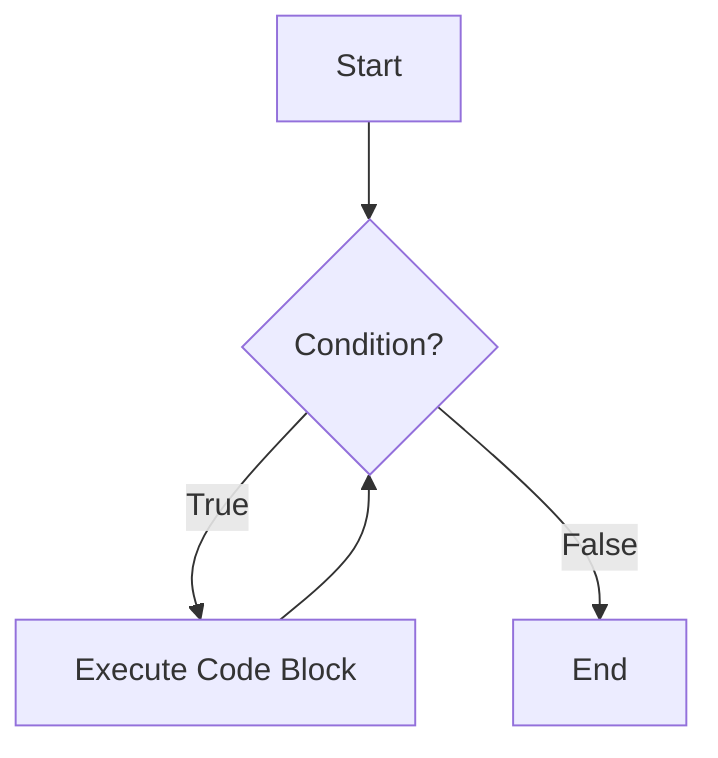
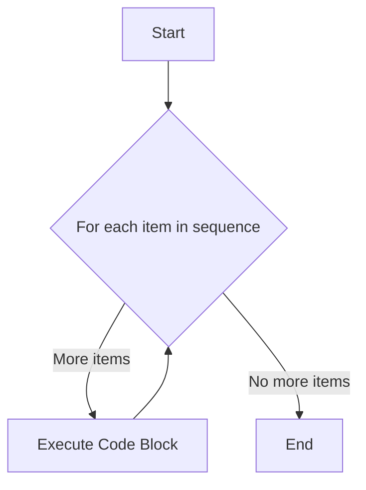
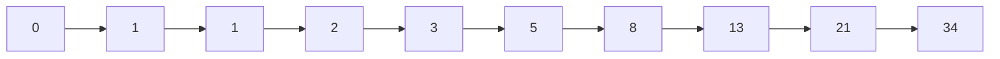
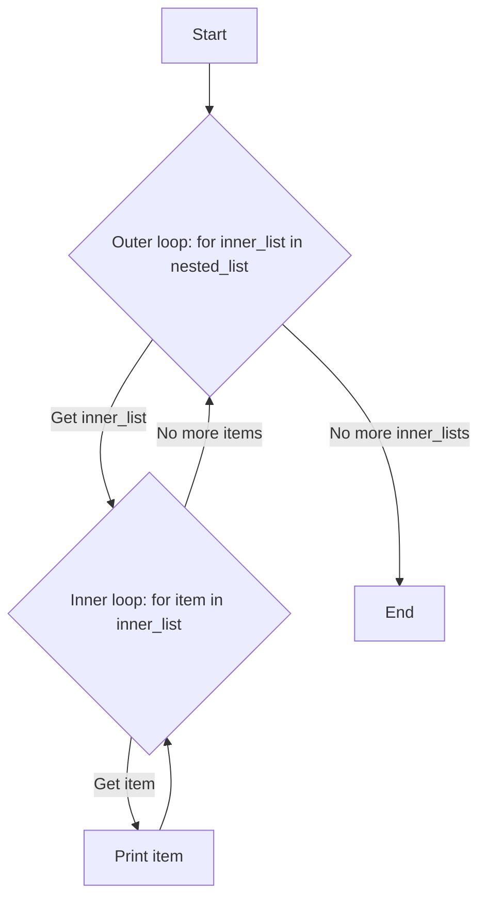

# Week 4, Day 15: Python Loops & List Comprehension

**Date: 21-07-2025, Monday**

## 🔁 While Loops

A `while` loop in Python is used to repeatedly execute a block of code as long as a certain condition is true. The loop continues until the condition becomes false.

### Basic Structure of a `while` Loop

```
while condition:
    # code to be executed
```

### Flowchart of a `while` Loop



### `while` Loop Practice Questions

#### 1. Print numbers from 1 to 10.

```python
i = 1
while i <= 10:
    print(i)
    i += 1```

**Explanation:**
- We initialize a counter `i` to 1.
- The loop continues as long as `i` is less than or equal to 10.
- In each iteration, we print the value of `i` and then increment it by 1.

#### 2. Print the sum of all even numbers between 1 and 50.

```python
num = 1
sum_even = 0
while num <= 50:
    if num % 2 == 0:
        sum_even += num
    num += 1
print(f"The sum of even numbers is: {sum_even}")
```
**Explanation:**
- `sum_even` is a variable to store the sum, initialized to 0.
- The `while` loop iterates from 1 to 50.
- Inside the loop, `if num % 2 == 0:` checks if the number is even.
- If it's even, the number is added to `sum_even`.

#### 3. Reverse a number.

```python
number = 123
reversed_num = 0
temp_num = number
while temp_num > 0:
    digit = temp_num % 10
    reversed_num = reversed_num * 10 + digit
    temp_num //= 10
print(f"The reversed number is: {reversed_num}")
```

**Explanation:**
- We extract the last digit of the number using the modulo operator (`% 10`).
- We then build the reversed number by multiplying the current `reversed_num` by 10 and adding the extracted digit.
- We remove the last digit from the original number using integer division (`// 10`).

**Visual Representation:**

| Iteration | `temp_num` | `digit` | `reversed_num` |
| :--- | :--- | :--- | :--- |
| 1 | 123 | 3 | 3 |
| 2 | 12 | 2 | 32 |
| 3 | 1 | 1 | 321 |

#### 4. Find the factorial of a number.

```python
number = 5
factorial = 1
i = 1
while i <= number:
    factorial *= i
    i += 1
print(f"The factorial of {number} is: {factorial}")
```

**Explanation:**
- The factorial of a number is the product of all integers from 1 to that number.
- We initialize `factorial` to 1 and `i` to 1.
- The loop multiplies `factorial` by `i` in each iteration and increments `i`.

## 🔂 For Loops

A `for` loop in Python is used for iterating over a sequence (that is either a list, a tuple, a dictionary, a set, or a string).

### Basic Structure of a `for` Loop

```
for item in sequence:
    # code to be executed for each item
```

### Flowchart of a `for` Loop



### `for` Loop Practice Questions

#### 9. Print the square of all numbers from 1 to 10.

```python
for i in range(1, 11):
    print(f"The square of {i} is {i*i}")
```
**Explanation:**
- `range(1, 11)` generates a sequence of numbers from 1 to 10.
- The `for` loop iterates through each number in that sequence, and in each iteration, it prints the number and its square.

#### 13. Print all prime numbers between 10 and 50.

```python
for num in range(10, 51):
    if num > 1:
        for i in range(2, num):
            if (num % i) == 0:
                break
        else:
            print(num)
```
**Explanation:**
- A prime number is a number greater than 1 that has no positive divisors other than 1 and itself.
- The outer loop iterates through numbers from 10 to 50.
- The inner loop checks if the number has any divisors. If it finds a divisor, it breaks out of the inner loop.
- The `else` clause of the `for` loop is executed only if the loop completes without a `break`. This means no divisors were found, and the number is prime.

#### 15. Print the Fibonacci series up to 10 elements.

```python
a, b = 0, 1
for _ in range(10):
    print(a, end=" ")
    a, b = b, a + b
```

**Explanation:**
- The Fibonacci sequence is a series of numbers where each number is the sum of the two preceding ones, usually starting with 0 and 1.
- In each iteration, we print the current value of `a`, and then we update `a` and `b` for the next iteration.

**Visual Representation of Fibonacci Sequence:**



#### 16. Loop through a nested list and print all inner elements.

```python
nested_list = [[1, 2, 3], [4, 5, 6], [7, 8, 9]]
for inner_list in nested_list:
    for item in inner_list:
        print(item)
```

**Diagram of a Nested Loop:**



## 🧠 List Comprehensions

List comprehensions offer a concise way to create lists. They consist of brackets containing an expression followed by a `for` clause, then zero or more `for` or `if` clauses.

### Basic Structure of a List Comprehension

| Part | Description |
| :--- | :--- |
| `expression` | The expression to be executed for each item. |
| `for item in iterable` | The `for` loop that iterates over a sequence. |
| `if condition` | (Optional) A filter to include only certain items. |

### List Comprehension Practice Questions

#### 18. Create a list of squares from 1 to 10.

```python
squares = [x**2 for x in range(1, 11)]
print(squares)
```
**Explanation:**
- `x**2` is the expression that squares each number.
- `for x in range(1, 11)` is the loop that provides the numbers from 1 to 10.

#### 20. From a list of words, make a new list with words longer than 4 letters.

```python
words = ["apple", "banana", "kiwi", "orange", "grape"]
long_words = [word for word in words if len(word) > 4]
print(long_words)
```
**Explanation:**
- `word` is the expression (we want the word itself).
- `for word in words` is the loop.
- `if len(word) > 4` is the condition that filters the words.

#### 21. Convert a list of temperatures in Celsius to Fahrenheit.

```python
celsius = [0, 10, 20, 30, 40]
fahrenheit = [(c * 9/5) + 32 for c in celsius]
print(fahrenheit)
```
**Explanation:**
- The expression `(c * 9/5) + 32` converts Celsius to Fahrenheit.
- The loop `for c in celsius` iterates through the `celsius` list.

#### 23. From a list of numbers, create a list of strings like: "Even" or "Odd".

```python
numbers = [1, 2, 3, 4, 5]
labels = ["Even" if num % 2 == 0 else "Odd" for num in numbers]
print(labels)
```
**Explanation:**
- This uses a conditional expression within the list comprehension.
- If `num % 2 == 0` is true, the value is "Even"; otherwise, it's "Odd".