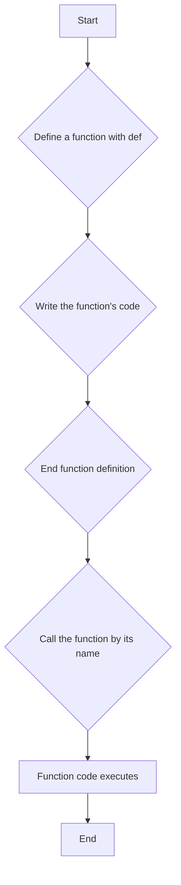
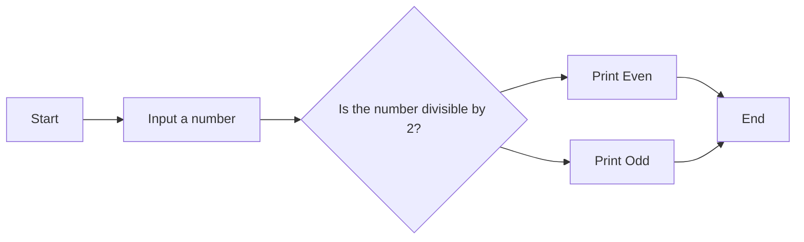

#  📚 **Week 3, Day 13: Functional Programming**
### 1. Functional Programming:

Functional programming is a programming paradigm where programs are constructed by applying and composing functions. It treats computation as the evaluation of mathematical functions and avoids changing-state and mutable data.

### 2. Built-in Functions:

Python comes with a number of built-in functions that are always available to use. Here is a table of some common built-in functions:

| Function | Description |
| --- | --- |
| `print()` | Prints the specified object to the standard output device. |
| `len()` | Returns the number of items in an object. |
| `list()` | Creates a list object. |
| `input()` | Allows user input. |
| `int()` | Converts a specified value into an integer number. |
| `str()` | Converts a specified value into a string. |
| `range()` | Returns a sequence of numbers, starting from 0 by default, and increments by 1 (by default), and stops before a specified number. |
| `type()` | Returns the type of an object. |

### 3. User-Defined Functions:

You can create your own functions in Python to perform specific tasks.

*   **Defining a function:** You can define a function using the `def` keyword, followed by the function name and parentheses `()`.
*   **Calling a function:** You can call a function by using the function name followed by parentheses `()`.
*   **Parameters:** Information can be passed into functions as parameters. Parameters are specified after the function name, inside the parentheses. You can add as many parameters as you want; just separate them with a comma.

Here’s a flowchart that illustrates the process of defining and calling a function:



### 4. `return` Statement

The `return` statement is used to exit a function and return a value. If no return statement is specified, the function will return `None`.

Here is an example of a function that returns the square of a number:

```python
def sq(num):
    return num**2

sq(12)
```

### 5. Functions with Conditional Logic

You can use conditional statements (if, else, elif) within your functions to make them more powerful.

For example, here’s a function that checks if a number is even or odd:

```python
def odd_even(num):
    if num % 2 == 0:
        print(f'the number {num} is even')
    else:
        print(f'the number {num} is odd')

odd_even(12)
```

And a flowchart to illustrate its logic:



### 6. Recursive Functions:

A recursive function is a function that calls itself. This can be a very powerful tool for solving certain types of problems, such as calculating factorials.

Here is an example of a recursive function that calculates the factorial of a number:

```python
def fucto(num):
    if num == 1:
        return 1
    else:
        return num * fucto(num-1)

fucto(5)
```

### 7. Variable Scope:

The scope of a variable is the part of the program where the variable is accessible.

*   **Local variables:** Variables that are defined inside a function are called local variables. They can only be used inside the function in which they are defined.
*   **Global variables:** Variables that are defined outside of a function are called global variables. They can be used throughout the program.