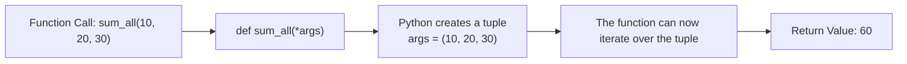
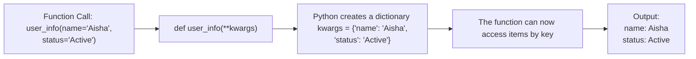
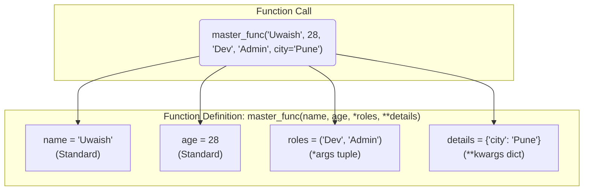
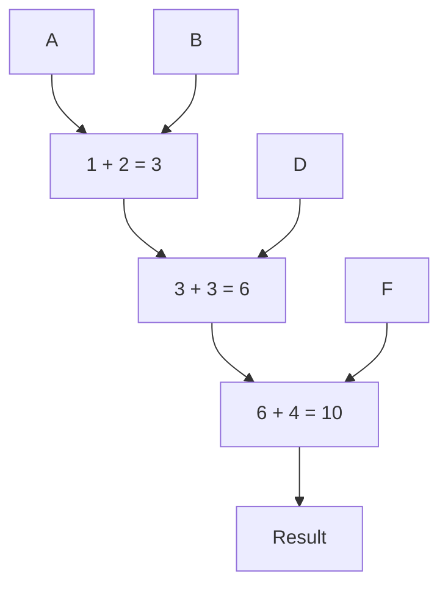
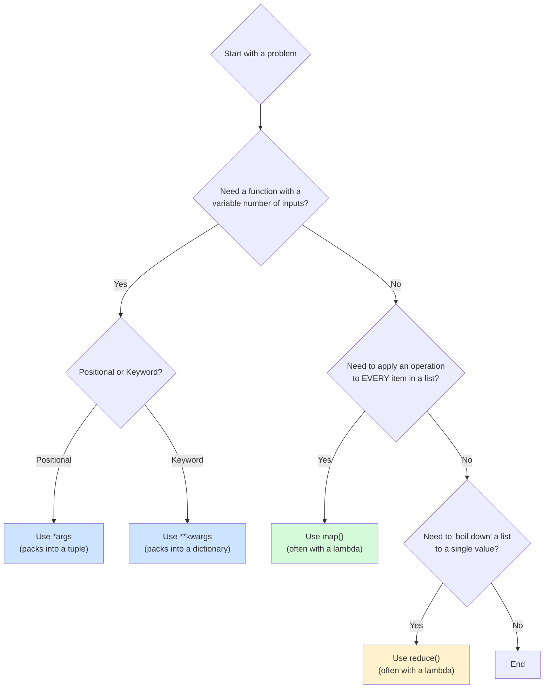

# 📚 **Week 3, Day 14: Mastering Functional Programming in Python: 

**Date:** 19-7-25, Saturday

**Tags:** #Python #FunctionalProgramming #Lambda #Map #Reduce #Args #Kwargs

## Introduction

Welcome to this in-depth guide to Functional Programming in Python! Today, we'll break down some powerful concepts that can make your code more flexible, readable, and efficient. We'll focus on:

1.  **Arbitrary Arguments (`*args` and `**kwargs`):** How to create functions that can accept a variable number of inputs.
2.  **Special Functions (`lambda`, `map`, `reduce`):** Powerful tools for working with data.

This guide uses Mermaid diagrams to help visualize the concepts, making them easier to understand and remember.

---

## Part 1: Flexible Function Arguments (`*args` and `**kwargs`)

Sometimes, you don't know exactly how many arguments a user will need to pass to your function. Python gives us two incredibly powerful tools to handle this: `*args` and `**kwargs`.

### Standard Positional vs. Keyword Assignment

Before diving in, let's clarify the two basic ways to pass arguments:

*   **Positional Assignment:** Arguments are matched based on their order.
*   **Keyword Assignment:** Arguments are matched by name (`key=value`), so order doesn't matter.

```python
# A standard function with fixed arguments
def profile(name, age):
    print(f"Name: {name}, Age: {age}")

# 1. Calling with Positional Assignment (order matters!)
profile("Riyan", 20)
# Output: Name: Riyan, Age: 20

# 2. Calling with Keyword Assignment (order does NOT matter)
profile(age=20, name="Riyan")
# Output: Name: Riyan, Age: 20
```

### `*args` for Arbitrary Positional Arguments

Use `*args` when you want to allow a function to accept any number of *positional* arguments. The `*` packs them all into a **tuple**.

#### Visualizing `*args`

Here’s what happens when you call a function with `*args`:



#### Code Example:

```python
# Using *args to accept a variable number of positional arguments
def sum_all(*numbers):
    print(f"Arguments received as a tuple: {numbers}")
    total = sum(numbers)
    return total

# Let's invoke it with different numbers of arguments
print(f"Sum of 1, 2: {sum_all(1, 2)}")
print(f"Sum of 1, 2, 3: {sum_all(1, 2, 3)}")
```

### `**kwargs` for Arbitrary Keyword Arguments

Use `**kwargs` when you want to allow a function to accept any number of *keyword* arguments. The `**` packs them all into a **dictionary**.

#### Visualizing `**kwargs`



#### Code Example:

```python
# Using **kwargs to accept a variable number of keyword arguments
def display_info(**details):
    print("\nReceived user details as a dictionary:")
    for key, value in details.items():
        print(f"- {key.title()}: {value}")

display_info(name="Uwaish", age=28)
display_info(name="Aisha", age=19, gender="Female", city="Mumbai")
```

### Correcting Common Mistakes

In your notebook, this code failed:
```python
def test2(*a):
    print(a)

# This call caused a TypeError
# test2(a=5, b=10, c=15)
```
**Why?** The function `def test2(*a)` is designed to accept **only positional arguments**. When you called it with `a=5`, you provided a **keyword argument**.
- `*a` expects `test2(5, 10, 15)`
- `**a` would expect `test2(a=5, b=10, c=15)`

### Combining Them All

You can use standard arguments, `*args`, and `**kwargs` together. The order is strict:
1.  Standard Arguments
2.  `*args`
3.  `**kwargs`

#### Visualization of `def func(name, age, *roles, **details)`



---

## Part 2: Special Functions (The Functional Toolkit)

Python has built-in functions that are key to a functional programming style: `lambda`, `map`, and `reduce`.

### 1. Lambda Functions (Anonymous Functions)

A `lambda` function is a small, one-line, anonymous function defined without a name. It's perfect for simple, throwaway tasks.

**Syntax:** `lambda arguments: expression`

| Standard Function (`def`)                                | Lambda Function                        |
| -------------------------------------------------------- | -------------------------------------- |
| `def square(num):`<br>&nbsp;&nbsp;&nbsp;&nbsp;`return num**2` | `lambda num: num**2`                   |
| **Usage:** `square(10)`                                  | **Usage:** `res = lambda...; res(10)`  |

#### Common Lambda Cases

**Case 1: Simple Operation**
```python
addition = lambda num1, num2: num1 + num2
print(f"Addition result: {addition(10, 20)}")
```

**Case 2: Conditional Logic (Ternary Operator)**
```python
# WAP to check if a number is even or odd
odd_even = lambda num: 'Even' if num % 2 == 0 else 'Odd'
print(f"13 is: {odd_even(13)}")
```

**Case 3: Complex Conditions**
```python
# WAP to check eligibility
check = lambda name, age: 'Allowed' if len(name) > 3 and age >= 18 else 'Not allowed'
print(f"Uwaish, 28: {check('Uwaish', 28)}")
```

### 2. The `map()` Function

The `map()` function applies a given function to **every item** in an iterable (like a list).

**Syntax:** `map(function, iterable)`

#### Visualizing `map()`

Think of `map` as a factory machine that transforms every item on a conveyor belt.

```mermaid
graph TD
    subgraph "Input List"
        A --> B --> C --> D
    end
    
    subgraph "Machine: map(lambda x: x**2, list)"
        direction LR
        E((λ))
    end

    subgraph "Output List (as a map object)"
        F --> G --> H --> I
    end

    A --> E --> F
    B --> E --> G
    C --> E --> H
    D --> E --> I
```



#### Code Example:

`map` is often paired with `lambda` for clean, concise code.

```python
marks =
# Goal: Convert marks to "Pass" or "Fail" (passing is >= 33)

grading_logic = lambda num: 'Pass' if num >= 33 else 'Fail'
results = map(grading_logic, marks)

# The result is a map object, so we convert it to a list to see it
print(f"Original Marks: {marks}")
print(f"Pass/Fail Results: {list(results)}")
# Output: ['Fail', 'Fail', 'Pass', 'Pass']
```

### 3. The `reduce()` Function

The `reduce()` function applies a function cumulatively to the items of a sequence, **reducing the sequence to a single final value**.

**Note:** You must import it from the `functools` library.

**Syntax:** `reduce(function, iterable)`

#### Visualizing `reduce()`

`reduce` combines the first two items, then takes that result and combines it with the next item, and so on.

Let's visualize `reduce(lambda a, b: a + b, [1, 2, 3, 4])`:



#### Code Example:

```python
from functools import reduce

numbers =

# Use reduce to find the sum of all elements
sum_logic = lambda a, b: a + b
total_sum = reduce(sum_logic, numbers)
print(f"The sum of {numbers} is: {total_sum}") # Output: 15
``````

```python
# Use reduce to find the largest number
find_max_logic = lambda a, b: a if a > b else b
max_number = reduce(find_max_logic,)
print(f"The largest number is: {max_number}") # Output: 102
```

---

## Conclusion & Key Takeaways

You now have a solid foundation in some of Python's most powerful functional tools. Here's a quick decision-making flowchart to help you choose the right tool for the job.

