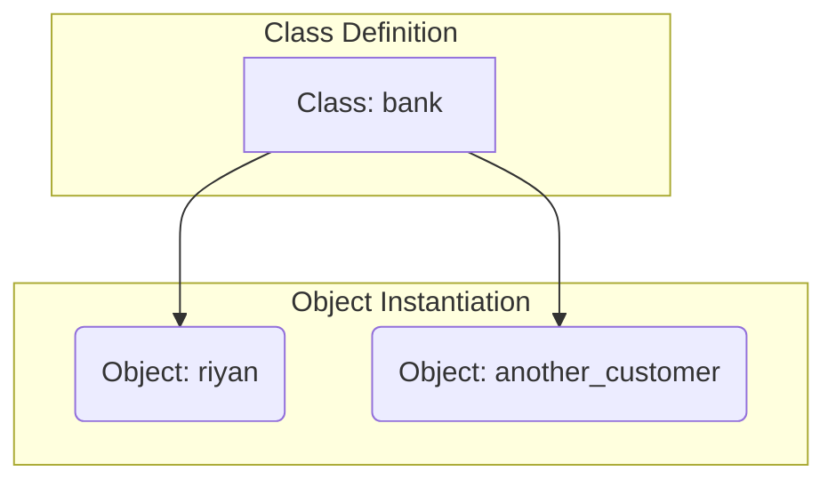
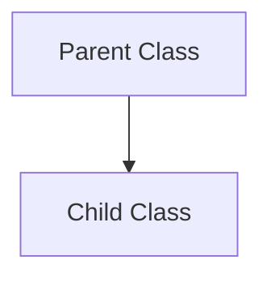

# Week 4, Day 17: Object-Oriented Programming in Python

**Date: 23-7-2025 Wednesday**
## Introduction to Object-Oriented Programming (OOP)

Object-Oriented Programming (OOP) is a programming paradigm that organizes code using objects and classes to represent real-world entities and their behaviors. This approach is particularly useful for writing large and complex programs, as it promotes a clear, modular, and reusable code structure.

### Core Concepts of OOP

The four fundamental principles of OOP are:

1.  **Encapsulation:** This involves bundling data (attributes) and the methods (functions) that operate on that data into a single unit called a class. This helps in data hiding, preventing external code from directly accessing and modifying the internal state of an object.
2.  **Inheritance:** This allows a new class (child or derived class) to inherit attributes and methods from an existing class (parent or base class). This promotes code reusability and establishes a hierarchical relationship between classes.
3.  **Polymorphism:** This principle allows objects of different classes to be treated as objects of a common superclass. The term "polymorphism" means "many forms," and in OOP, it allows a single interface (like a method) to be used for different types of objects.
4.  **Abstraction:** This involves hiding the complex implementation details and exposing only the essential features of an object. This simplifies the use of objects and reduces the impact of changes in the internal implementation.

### Key Terminology

*   **Class:** A blueprint for creating objects. It defines a set of attributes and methods that the created objects will have.
*   **Object:** An instance of a class. When a class is defined, no memory is allocated until an object of that class is created.
*   **Attribute:** A variable that belongs to a class, representing a property of the object.
*   **Method:** A function that is defined inside a class and describes the behavior of an object.

## Visualizing OOP Concepts

The following diagram illustrates the relationship between a class and its objects.



## Practical Implementation in Python

### Bank Account Example

The provided code defines a `bank` class to represent a customer's bank account.

**Class Definition:**

```python
class bank:
    # attribute
    def __init__ (self, AC_No, Name, DoB, Mobile, ID, Branch, Amount):
        self.AC_No = AC_No
        self.Name = Name
        self.DoB = DoB
        self.Mobile = Mobile
        self.ID = ID
        self.Branch = Branch
        self.Amount = Amount
    # functionality
    def info(self):
        print("User info")
        print("Name: ", self.Name)
        print("Account number: ", self.AC_No)
        print("Date of birth: ", self.DoB)
        print("Mobile Number: ", self.Mobile)
        print("User ID: ", self.ID)
        print("Branch: " , self.Branch)
        print("Amount: " , self.Amount)

    def check_balance(self):
        print("Your balance", self.Amount)

    def deposite(self):
        dep_amount = float(input("Enter your deposite amount in INR: "))
        self.Amount = self.Amount + dep_amount
        print("Updated balance", self.Amount)
```

**Object Creation and Usage:**

```python
riyan =  bank(123456, 'Riyan', '14-09-2002', 9381186153, "ABC123", "HYD", 100000000000)
riyan.deposite()
```

### Institute Application Example

This example demonstrates a class for managing student information in an institute.

**Class Definition:**

```python
class sdhub:
    def __init__(self, name, hq, mobile, id, total_fee):
        self.name = name
        self.hq = hq
        self.mobile = mobile
        self.id = id
        self.total_fee = total_fee

    def info(self):
        print("Student Name: ", self.name)
        print("Student Highist qualification: ", self.hq)
        print("Student Phone No: ", self.mobile)
        print("Student ID: ", self.id)
        print("Student Total Fee: ", self.total_fee)

    def check_fee(self):
        print("You Fee is ", self.total_fee)

    def dep_fee(self):
        amt = int(input('Please Pay your fee: '))
        remaining_fee = self.total_fee - amt
        print("the remaining fee is: ", remaining_fee)
```

**Object Creation and Usage:**

```python
riyan = sdhub('MD Riyan Nazeer', 'BE:CSM', 9381186153, 123, 20000)
riyan.info()
riyan.check_fee()
riyan.dep_fee()
```

## Inheritance Explained

Inheritance is demonstrated with a simple `parent` and `child` class example. The `child` class inherits the `property` method from the `parent` class.



**Code Example:**

```python
# inheritence

class parent:
    def property(self):
        print("father property")

class child(parent):
    pass

riyan = child()
riyan.property()
```

## Polymorphism in Action

Polymorphism allows for methods with the same name to behave differently in different classes. While the provided example is basic, it illustrates the concept. A more practical example would involve a common method in different classes.

**Code Example:**

```python
# polymorphism

class calc:
    def add(self, a, b):
        return a+b

obj = calc()
obj.add(2,2)```