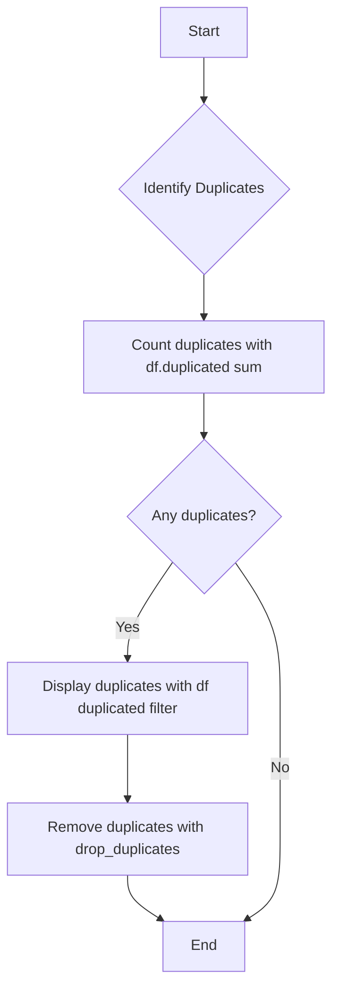
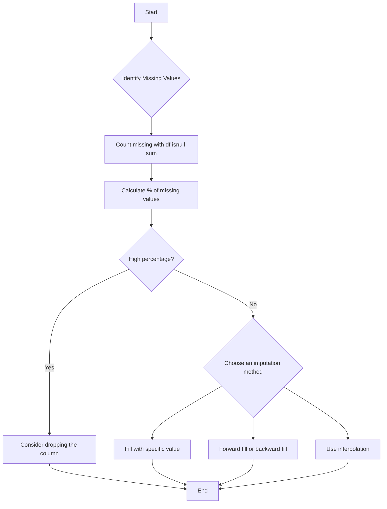

# 📊 Week 7, Day 29: Pandas for Data Analysis & Preprocessing

**Date: August 11, 2025** Monday

Today's session focused on essential data preprocessing and analysis techniques using the Pandas library. We covered how to clean and prepare data for analysis by handling inconsistencies, duplicates, and missing values.

---

## 🚀 Key Topics Covered

1.  **Pandas: Analysis & Manipulation**
    *   Essential functions for data inspection and manipulation.
2.  **Data Preprocessing (Cleaning)**
    *   Fixing Rows and Columns
    *   Handling Duplicates
    *   Managing Missing Values
    *   A brief mention of Outliers

---

## 🐼 Pandas: Analysis & Manipulation

Pandas is a cornerstone of data science in Python, providing powerful and intuitive tools for data analysis and manipulation. Here are some of the fundamental functions we explored:

| Function            | Description                                                                                                              |
| :------------------ | :----------------------------------------------------------------------------------------------------------------------- |
| `info()`            | Provides a concise summary of the DataFrame, including the number of non-null values and data types of each column.      |
| `describe()`        | Generates descriptive statistics that summarize the central tendency, dispersion, and shape of a dataset’s distribution. |
| `head()` / `tail()` | Displays the first or last 'n' rows of the DataFrame.                                                                    |
| `columns`           | Returns the column labels of the DataFrame.                                                                              |
| `dtypes`            | Shows the data type of each column.                                                                                      |
| `sort_values()`     | Sorts the DataFrame by the values of one or more columns.                                                                |
| `sort_index()`      | Sorts the DataFrame by its index.                                                                                        |
| `value_counts()`    | Returns a Series containing counts of unique values.                                                                     |
| `groupby()`         | Groups the DataFrame using a mapper or by a Series of columns.                                                           |
| `pivot_table()`     | Creates a spreadsheet-style pivot table as a DataFrame.                                                                  |
| `crosstab()`        | Computes a cross-tabulation of two or more factors.                                                                      |
| `agg()`             | Aggregates using one or more operations over the specified axis.                                                         |

---

## 🧹 Data Preprocessing (Cleaning)

Data preprocessing is a critical step to ensure the quality and reliability of your analysis. It involves transforming raw data into a clean and understandable format.

### 1. Fixing Rows and Columns

A common task in data cleaning is to restructure columns. For instance, a single column might contain multiple pieces of information.

**Example: Splitting a 'Profit' Column**

Imagine a DataFrame where the 'Profit' column contains both the amount and the currency.

```python
import pandas as pd
import numpy as np

df = pd.DataFrame({'Location':['A','B','C','D'],
                   'Profit':['100 USD','40 CAD','200 CAD','1000 INR']})
```

We can split this into 'Amount' and 'Currency' columns using the `.str.split()` method.

```python
df[['Amount','Currency']] = df['Profit'].str.split(' ',expand=True)
```

This will produce the following DataFrame:

| | Location | Profit | Amount | Currency |
| :--- | :--- | :--- | :--- | :--- |
| **0** | A | 100 USD | 100 | USD |
| **1** | B | 40 CAD | 40 | CAD |
| **2** | C | 200 CAD | 200 | CAD |
| **3** | D | 1000 INR | 1000 | INR |

Next, we might want to standardize the profit to a single currency (e.g., INR). We can create a new column 'Currency Value' and then calculate the 'Total Amount in INR'.

```python
# Add currency conversion rates
df['Currency Value'] = np.where(df['Currency']=='USD',85,np.where(df['Currency']=='CAD',45,1))

# Convert 'Amount' to a numeric type
df['Amount'] = df['Amount'].astype(int)

# Calculate the total amount in INR
df['Total Amount in INR'] = df['Amount']*df['Currency Value']
```

Finally, we can drop the unnecessary columns to tidy up our DataFrame.

```python
df.drop(columns=['Profit','Amount','Currency','Currency Value'],inplace=True)
```

The final cleaned DataFrame looks like this:

| | Location | Total Amount in INR |
| :--- | :--- | :--- |
| **0** | A | 8500 |
| **1** | B | 1800 |
| **2** | C | 9000 |
| **3** | D | 1000 |

### 2. Handling Duplicates

Duplicate records can skew analysis and lead to incorrect conclusions.

#### Flowchart: Handling Duplicates



**Example:**

Consider a DataFrame with a duplicate row:

```python
df = pd.DataFrame({'Location':['A','B','A','D'],
                   'Profit':[100,200,100,400]})
```

| | Location | Profit |
| :--- | :--- | :--- |
| **0** | A | 100 |
| **1** | B | 200 |
| **2** | A | 100 |
| **3** | D | 400 |

1.  **Identify and count duplicates:**
    ```python
    df.duplicated().sum()  # Output: 1
    ```

2.  **Display duplicate records:**
    ```python
    df[df.duplicated()]
    ```

| | Location | Profit |
| :--- | :--- | :--- |
| **2** | A | 100 |

3.  **Delete duplicate records:**
    ```python
    df.drop_duplicates(inplace=True)
    ```

### 3. Handling Missing Values (`NaN`)

Missing data is a common problem that needs to be addressed before analysis.

#### Methods for Handling Missing Values

*   **Dropping:** Deleting rows or columns with missing values. This is suitable when the percentage of missing data is low (e.g., < 5%).
*   **Filling (Imputation):** Replacing missing values with a specific value.
    *   **Constant Value:** Fill with a number like 0 or a string like "missing".
    *   **Mean/Median/Mode:** Use the column's mean for normally distributed data, the median for skewed data with outliers, and the mode for categorical data.
    *   **Forward/Backward Fill:** Use the previous or next value in the column to fill the gap.
    *   **Interpolation:** Estimate the missing value based on the other values in the column.

#### Flowchart: Handling Missing Values



**Example:**

Let's work with a DataFrame containing missing values:

```python
df = pd.DataFrame({'Location':['A','B','A','D'],
                   'Profit':[100,np.nan,np.nan,400],
                   'Discount':[5,15,12,np.nan]})
```

| | Location | Profit | Discount |
| :--- | :--- | :--- | :--- |
| **0** | A | 100.0 | 5.0 |
| **1** | B | NaN | 15.0 |
| **2** | A | NaN | 12.0 |
| **3** | D | 400.0 | NaN |

1.  **Identify and count null values:**
    ```python
    df.isnull().sum()
    ```
    ```
    Location    0
    Profit      2
    Discount    1
    dtype: int64
    ```

2.  **Dropping rows with any null values:**
    ```python
    df.dropna()
    ```
    This would only keep the first row in our example.

3.  **Filling missing 'Profit' values with the mean:**
    ```python
    mean_profit = df['Profit'].mean() # Calculates the mean of non-missing values
    df['Profit'].fillna(mean_profit)
    ```

4.  **Forward filling missing 'Profit' values:**
    ```python
    df['Profit'].fillna(method='ffill') # Deprecated, use df['Profit'].ffill()
    ```

5.  **Using interpolation:**
    Interpolation is a powerful method that fills `NaN` values by treating the values as a sequence.
    ```python
    df.interpolate()
    ```
    
This would result in:

|       | Location | Profit | Discount |
| :---- | :------- | :----- | :------- |
| **0** | A        | 100.0  | 5.0      |
| **1** | B        | 200.0  | 15.0     |
| **2** | A        | 300.0  | 12.0     |
| **3** | D        | 400.0  | 12.0     |

Notice how the missing `Profit` values were filled with values that are linearly spaced between 100 and 400.
