# SQL Class Notes: Intro to SQL 🚀

## 🗄️ 1. What is a Database?

A database is a structured collection of data. Think of it as a digital filing cabinet, designed for efficient storage, retrieval, and management of information.

*   **Data → Information**: Raw data (like names and ages) becomes useful information when organized.
*   **Structured vs. Unstructured**: Databases can handle different types of data.

| Data Type        | Description                                                               | Examples                                            | Database Type       |
| :--------------- | :------------------------------------------------------------------------ | :-------------------------------------------------- | :------------------ |
| **Structured**   | Highly organized, tabular data with a predefined schema (rows & columns). | User profiles, sales transactions, inventory lists. | SQL (Relational DB) |
| **Unstructured** | Data without a predefined model.                                          | Social media posts, comments, images, videos.       | NoSQL DB            |

> [!NOTE]
> ### **Real-World Example: Instagram**
> *   **Structured Data**: Your user profile (`username`, `date_of_birth`, `email`, `mobile_number`). This data fits neatly into a table.
> *   **Unstructured Data**: The content you generate (`comments`, `likes`, `posts`, `shares`). This data is varied and doesn't have a rigid structure.


### Database Deployment: Cloud vs. Local

Databases can be hosted in different environments, depending on the need for scale, control, and resources.

| DB Type | Environment | Examples | Description |
| :--- | :--- | :--- | :--- |
| **SQL** | **Cloud** | Oracle, MySQL, PostgreSQL | Hosted by a provider (like AWS, Azure, Google Cloud). Scalable and managed. |
| | **Local** | CSV files, Excel spreadsheets | Data stored on your personal machine. Good for small-scale analysis. |
| **NoSQL**| **Cloud** | MongoDB Atlas, Amazon DynamoDB | Scalable, flexible databases hosted by cloud providers. |
| | **Local** | HDD/SSD Storage | Storing unstructured files (like JSON, images) directly on your own hardware. |

> [!Tip]
> ### **DBMS vs RDBMS**
> *   **DBMS (Database Management System)**: Software used to manage databases (e.g., SQL Server, MongoDB).
> *   **RDBMS (Relational Database Management System)**: A specific type of DBMS that manages *relational* databases, which store data in tables.


---

## ⚡ 2. Introduction to SQL

**SQL (Structured Query Language)** is the standard language for communicating with relational databases. It allows you to perform tasks like retrieving data, creating tables, and modifying information.

```mermaid
flowchart TD
    A[You 🧑‍💻] --> B{Write SQL Query};
    B --> C[Database 🗄️];
    C --> D[Processes Query];
    D --> E[Returns Data 📊];
    E --> A;
```



> [!TIP]
> ### **Is SQL a Programming Language?**
> While it has language-like syntax, SQL is considered a **declarative language**. You tell it *what* you want, and the database figures out *how* to get it.

---

## 🧩 3. The Five Sub-Languages of SQL

SQL commands are grouped into five main categories based on their function. This is a critical concept to understand.


| Acronym | Full Name | Purpose | Key Commands | Works On |
| :--- | :--- | :--- | :--- | :--- |
| **DDL** | Data Definition Language | Defines or modifies the database structure (schema). | `CREATE`, `ALTER`, `DROP`, `TRUNCATE` | Tables, Columns |
| **DML** | Data Manipulation Language | Inserts, deletes, or changes the data within tables. | `INSERT`, `UPDATE`, `DELETE` | Rows |
| **DQL** | Data Query Language | Retrieves (fetches) data from the database. | `SELECT ... FROM ... WHERE ...` | Rows & Columns |
| **DCL** | Data Control Language | Manages user access and permissions. | `GRANT`, `REVOKE` | Database |
| **TCL** | Transaction Control Language | Manages transactions to ensure data integrity. | `COMMIT`, `ROLLBACK` | Transactions |

---

## 🏗️ 4. DDL: Building Your Database

DDL statements create and manage the database's structure. You use them to build the "container" for your data.

### From Raw Data to a SQL Table

Imagine you have raw, incomplete data points for different people:
```js
{
  p1 : ['Alice'],
  p2 : ['Bob', 22],
  p3 : ['Charlie', 21, 'M'],
}
```
This data is inconsistent. SQL solves this by enforcing a rigid structure with a `CREATE TABLE` statement, ensuring every row has the same set of columns.

### `CREATE`: To Build

#### **1. Create a Database (Schema)**
```sql
-- Creates a new database named 'sdhub'
CREATE DATABASE sdhub;
```

#### **2. Select a Database**

```sql
-- Sets the current database to 'sdhub'
USE sdhub;```
#### **3. Create a Table**

```sql
-- Creates a table to store student details
CREATE TABLE student_details (
    name VARCHAR(15),
    age INT,
    gender VARCHAR(1)
);
```

### `ALTER`, `TRUNCATE`, and `DROP`

*   `ALTER`: Modifies a table (e.g., adding a column).
*   `TRUNCATE`: Removes all rows but keeps the table structure.
*   `DROP`: Deletes the entire table or database.

> [!warning]
> ### **`TRUNCATE` vs. `DROP`**
> *   `TRUNCATE TABLE student_details;` -> The table is now empty but still exists.
> *   `DROP TABLE student_details;` -> The table is completely gone.

---

## ⚙️ 5. DML, DQL, and More

These commands handle the data *within* your tables.

*   **DML (`INSERT`, `UPDATE`, `DELETE`)**: Manipulates data.
*   **DQL (`SELECT`)**: Queries (fetches) data.
*   **DCL (`GRANT`, `REVOKE`)**: Manages permissions.
*   **TCL (`COMMIT`, `ROLLBACK`)**: Manages transactions.

> [!tip]
> ### **SQL is Not Case-Sensitive (Mostly)**
> Keywords like `SELECT` and `FROM` are not case-sensitive. However, table and column names *can* be, so it's best practice to write keywords in **UPPERCASE** for clarity.

---

## 🖥️ 6. Bonus: Understanding a SQL IDE (MySQL Workbench)

A SQL Integrated Development Environment (IDE) like MySQL Workbench is a graphical tool that helps you write and execute queries. Here is a breakdown of the typical layout from your class notes.


| Area | Description | Purpose |
| :--- | :--- | :--- |
| **1. Database Navigator** | (Left Panel) A tree view of all your databases (schemas), tables, and columns. | Lets you see your database structure at a glance. You can `Refresh` this view if you make changes. |
| **2. Query Editor** | (Center Panel) The main text area where you write your SQL code. Also called the Console or Scripting Area. | This is where you'll type `CREATE TABLE...`, `SELECT * FROM...`, etc. |
| **3. Toolbar/Ribbon** | (Top Bar) Contains buttons for common actions. | The most important is the **Run/Execute button** (often a lightning bolt ⚡) to run your query. |
| **4. Output/Results Panel**| (Bottom Panel) Shows the results of your query. | If you run a `SELECT` statement, the data appears here. It also shows status messages (`Success`) or any `Error` messages. |

> [!tip]
> ### **Running a Query**
> You can typically run a query by highlighting the code you want to execute and pressing a keyboard shortcut like `Ctrl + Enter` or clicking the **Run** button.

---

## 📌 References

1.  [Sir Notes](https://github.com/riyann00b/SDHub-DS/blob/main/SDHub-DS/00%20Notes/04_SQL/Sir_Notes/SQL%20Day_01.pdf)
2.  [W3Schools: SQL Introduction](https://www.w3schools.com/sql/sql_intro.asp)
3.  [MySQL 8.0 Reference Manual: Data Types](https://dev.mysql.com/doc/refman/8.0/en/data-types.html)
4.  [PostgreSQL Documentation: TRUNCATE](https://www.postgresql.org/docs/current/sql-truncate.html)
5.  [Microsoft SQL Docs: Case-Sensitivity](https://learn.microsoft.com/en-us/sql/relational-databases/collations/collation-and-unicode-support)
