> [!NOTE]
> All code examples are written for **MariaDB**. While most commands are standard SQL and work across other systems (like MySQL, PostgreSQL, etc.), there might be minor dialect-specific differences.

---

## 🗄️ 1. The Database Structure

At its core, a relational database is a structured set of data. The hierarchy is simple but powerful: a **Database** contains multiple **Tables**, each of which has **Columns** (attributes) and **Rows** (records).

*   **Database**: The main container, like a project folder (e.g., `instagram_db`).
*   **Tables**: Entities within the database, like spreadsheets (e.g., `users`, `posts`).
*   **Columns**: The attributes of an entity, defining the data type (e.g., `username` (TEXT), `post_id` (INT)).
*   **Rows**: The actual records of data.

Here’s a visual representation of this structure:

```mermaid
graph TD
    A(🗄️ Database) --> B[📊 Table 1: Users]
    A --> C[📊 Table 2: Posts]
    %%A --> D[📊 Table 3]

    subgraph table1 [📊 Table 1: Users]
        direction LR
        Col1[UserID INT]
        Col2[Username VARCHAR]
        Col3[JoinDate DATE]
    end

    subgraph table2 [📊 Table 2: Posts]
        direction LR
        PCol1[PostID INT]
        PCol2[UserID_FK INT]
        PCol3[Content TEXT]
    end

    %% Connect the main nodes to their respective subgraph content
    B -.-> table1
    C -.-> table2

    style A fill:#333,stroke:#fff,stroke-width:2px,color:#fff
    style B fill:#264653,stroke:#fff,stroke-width:2px,color:#fff
    style C fill:#2a9d8f,stroke:#fff,stroke-width:2px,color:#fff
    %%style D fill:#e9c46a,stroke:#fff,stroke-width:2px,color:#fff
```



---

## 2. DDL (Data Definition Language)

DDL commands are used to **define and manage the database structure**. Think of them as the blueprint commands.

### `CREATE DATABASE`
Creates a new database container.

```sql
CREATE DATABASE sdhub;
```

### `USE`
Selects a database to work with. All subsequent commands will be executed against this database. ✅

```sql
USE sdhub;
```

### `CREATE TABLE`
Defines a new table with its columns and their respective data types.

```sql
-- Create a table to store student details
CREATE TABLE student_details (
    StudentID INT PRIMARY KEY AUTO_INCREMENT, -- Unique ID for each student
    Name VARCHAR(50) NOT NULL,                -- Student's name, cannot be empty
    Age INT,
    Gender VARCHAR(1),
    Email VARCHAR(50) UNIQUE                  -- Each email must be unique
);
```

### `DROP TABLE`
Deletes a table and all the data within it. ❌ **Use with caution!**

```sql
DROP TABLE IF EXISTS student_details; -- The "IF EXISTS" prevents an error if the table doesn't exist.
```

---

## 🔐 3. SQL Constraints (Rules)

Constraints are rules enforced on data columns to ensure data accuracy and reliability. They prevent invalid data from being entered into the database.

| Constraint        | Description                                                                       |
| ----------------- | --------------------------------------------------------------------------------- |
| **`PRIMARY KEY`** | Uniquely identifies each record in a table. Must contain unique, non-NULL values. |
| **`FOREIGN KEY`** | Links two tables together by referencing the `PRIMARY KEY` of another table.      |
| **`UNIQUE`**      | Ensures that all values in a column are different.                                |
| **`NOT NULL`**    | Ensures that a column cannot have a `NULL` (empty) value.                         |
| **`DEFAULT`**     | Sets a default value for a column when no value is specified.                     |
| **`CHECK`**       | A condition that limits the value range that can be placed in a column.           |

> [!IMPORTANT]
> ### Real-World Example: Instagram
> *   **Structured Data**: Your user profile (`UserID`, `Username`, `PasswordHash`, `Email`) is a perfect example of structured data in a table.
> *   `UserID` would be the `PRIMARY KEY` (a unique number for you).
> *   When you post a picture, the `posts` table would have a `UserID` column. This is a `FOREIGN KEY` that links your post back to your user account.

---

## 4. DML (Data Manipulation Language)

DML commands are used for **adding, modifying, and removing data** from tables.

### `INSERT INTO`
Adds new rows of data into a table.

```sql
-- Insert multiple students at once
INSERT INTO student_details (Name, Age, Gender, Email)
VALUES
	('Riyan', 22, 'M', 'riyan@example.com'),
	('Amaan', 25, 'M', 'amaan@example.com'),
	('Adnan', 25, 'M', 'adnan@example.com'),
	('Taha', 20, 'M', 'taha@example.com'),
	('Sara', 23, 'F', 'sara@example.com'),
	('Priya', 21, 'F', 'priya@example.com');
```

### `UPDATE`
Modifies existing records in a table.

```sql
-- Always use a WHERE clause with UPDATE, or you'll update all rows!
UPDATE student_details
SET Age = 26, Email = 'amaan.khan@example.com'
WHERE Name = 'Amaan';
```

### `DELETE`
Removes existing records from a table.

```sql
-- Always use a WHERE clause with DELETE! 
DELETE FROM student_details
WHERE Name = 'Taha';
```

---

## 📊 5. DQL (Data Query Language)

DQL is used to **fetch and view data**. The `SELECT` statement is the heart of DQL.

### logical processing order for an SQL SELECT statement. 


### The Basic `SELECT`
*   `SELECT *`: Fetches all columns. 📌 Good for exploring, but can be slow on large tables.
*   `SELECT Col1, Col2`: Fetches specific columns. 🚀 More efficient.

```sql
-- Select all columns for all students
SELECT * FROM student_details;

-- Select only the name and age of students
SELECT Name, Age FROM student_details;
```

### `WHERE`: Filtering Data
The `WHERE` clause filters records based on specific conditions.

| Data Type | Operator        | Example                                                  |
| :-------- | :-------------- | :------------------------------------------------------- |
| **Text**  | `=`, `!=`, `LIKE` | `WHERE Name = 'Sara'`                                    |
| **Numeric** | `>`, `<`, `=`, `!=` | `WHERE Age > 21`                                         |
| **Date**  | `=`, `BETWEEN`    | `WHERE registration_date BETWEEN '2023-01-01' AND '2023-12-31'` |

The `LIKE` operator is used for pattern matching in text:
*   `'s%'`: Starts with "s".
*   `'%a'`: Ends with "a".
*   `'%an%'`: Contains "an".

```sql
-- Select students who are older than 21
SELECT * FROM student_details WHERE Age > 21;

-- Select students whose name starts with 'A'
SELECT Name FROM student_details WHERE Name LIKE 'A%';
```

### `ORDER BY`: Sorting Data
Sorts the result set in ascending (`ASC`) or descending (`DESC`) order.

```sql
-- List students sorted by age, oldest first
SELECT Name, Age FROM student_details ORDER BY Age DESC;
```

### `LIMIT`: Restricting Results
Sets a limit on the number of records to return.

```sql
-- Get the top 3 youngest students
SELECT Name, Age FROM student_details ORDER BY Age ASC LIMIT 3;
```

### `DISTINCT`: Unique Values
Returns only unique (different) values from a column.

```sql
-- What are the unique ages of students in the table?
SELECT DISTINCT Age FROM student_details;
```

### Aggregate Functions
These functions perform a calculation on a set of values and return a single value.

| Function    | Description                               |
| :---------- | :---------------------------------------- |
| **`COUNT()`** | Counts the number of rows.                |
| **`SUM()`**   | Returns the total sum of a numeric column. |
| **`AVG()`**   | Calculates the average value.             |
| **`MIN()`**   | Returns the smallest value.               |
| **`MAX()`**   | Returns the largest value.                |

```sql
-- Calculate the average age of all students
SELECT AVG(Age) AS AverageAge FROM student_details;
```

### `GROUP BY`: Grouping Data
The `GROUP BY` statement groups rows that have the same values in specified columns into summary rows. It's often used with aggregate functions.

```sql
-- Count the number of students by gender
SELECT Gender, COUNT(*) AS Total
FROM student_details
GROUP BY Gender;
```

---

## 🧩 6. Table Joins

Joins are used to combine rows from two or more tables based on a related column between them.


| Join Type     | Description                                                                              |
| :------------ | :--------------------------------------------------------------------------------------- |
| `INNER JOIN`  | ✅ Returns records that have matching values in both tables.                             |
| `LEFT JOIN`   | ⬅️ Returns all records from the left table, and the matched records from the right table. |
| `RIGHT JOIN`  | ➡️ Returns all records from the right table, and the matched records from the left table. |
| `FULL OUTER JOIN` | 🌐 Returns all records when there is a match in either left or right table. (MariaDB/MySQL use a `UNION` of `LEFT` and `RIGHT` joins to simulate this). |


> [!TIP]
> ### Visualizing Joins
> Think of Venn diagrams! An `INNER JOIN` is the intersection of two sets, while a `LEFT JOIN` is the entire left set plus the intersection.

```sql
-- Let's imagine we have another table called 'enrollments'
-- CREATE TABLE enrollments (EnrollmentID INT, StudentID INT, CourseName VARCHAR(50));
-- INSERT INTO enrollments VALUES (1, 1, 'SQL Basics'), (2, 2, 'Advanced SQL'), (3, 5, 'SQL Basics');

-- Show which students are enrolled in which courses (only shows enrolled students)
SELECT s.Name, e.CourseName
FROM student_details s
INNER JOIN enrollments e ON s.StudentID = e.StudentID;

-- Show all students and list their course if they are enrolled
SELECT s.Name, e.CourseName
FROM student_details s
LEFT JOIN enrollments e ON s.StudentID = e.StudentID;
```

---

## 📥 7. Importing Data from CSV

Manually inserting data is tedious. Most database tools provide a wizard to import data from files like CSVs.

### General Workflow


> [!TIP]
> ### Importing in DataGrip
> 1.  **Open Database Explorer**: Find this panel on the side of your IDE.
> 2.  **Select Target**: Right-click the schema (e.g., `sdhub`) you want to import into.
> 3.  **Initiate Import**: Go to `Import/Export` > `Import Data from File(s)`.
> 4.  **Choose CSV**: Find and select your `CardioGoodFitness.csv` file.
> 5.  **Configure Settings**:
>     *   Check **"First row is header"**.
>     *   Ensure the **"Delimiter"** is set to a comma (`,`).
>     *   In the mapping section, choose to create a new table and verify that the column names and data types look correct.
> 6.  **Click Import** to execute the process. You can also just drag the CSV file onto the schema name in the Database Explorer to start this process.

---

## 🏋️ 8. Analyzing the CardioGoodFitness Dataset

Now that you've imported the `CardioGoodFitness.csv` file, let's analyze it. This dataset contains information about customers who purchased different models of treadmills.

### Table Schema

> [!note]
> When you import a CSV file using a tool like MySQL Workbench or DataGrip, the table structure is typically created for you automatically. However, understanding the underlying SQL command is essential for scripting, debugging, and database design.

First, let's create the table schema that matches the CSV file. (manual Process done by MySQL WB and DataGrip)

```sql
-- Table schema for the CardioGoodFitness dataset
CREATE TABLE CardioGoodFitness (
    Product VARCHAR(5),
    Age INT,
    Gender VARCHAR(10),
    Education INT,
    MaritalStatus VARCHAR(10),
    Usage INT,          -- Times per week the customer expects to use the treadmill
    Fitness INT,        -- Self-rated fitness level (1-5)
    Income INT,
    Miles INT           -- Expected miles to run per week
);
```

### Sample Analytical Queries

Here are some practical questions we can answer using SQL queries on this dataset.

#### Descriptive Statistics
Get a general feel for the data.

```sql
-- What is the average age, income, and expected weekly miles for all customers?
SELECT
    AVG(Age) AS AvgAge,
    AVG(Income) AS AvgIncome,
    AVG(Miles) AS AvgMiles
FROM CardioGoodFitness;

-- How many customers purchased each treadmill model?
SELECT Product, COUNT(*) AS NumberOfPurchases
FROM CardioGoodFitness
GROUP BY Product
ORDER BY NumberOfPurchases DESC;
```

#### Customer Profiling
Segment customers based on their characteristics.

```sql
-- What's the average income of customers for each product model?
-- This can tell us which product appeals to higher-income customers.
SELECT Product, AVG(Income) AS AverageIncome
FROM CardioGoodFitness
GROUP BY Product
ORDER BY AverageIncome DESC;

-- Who runs more miles on average: Males or Females?
SELECT Gender, AVG(Miles) AS AverageMiles
FROM CardioGoodFitness
GROUP BY Gender;

-- How does marital status correlate with the product purchased?
SELECT MaritalStatus, Product, COUNT(*) as Count
FROM CardioGoodFitness
GROUP BY MaritalStatus, Product
ORDER BY MaritalStatus, Product;
```

#### Advanced Analysis
Combine filters to find specific insights.

```sql
-- Find customers who are in excellent shape (Fitness > 4), plan to use the treadmill heavily (Usage >= 4), 
-- and have an income above the average.
SELECT Name, Age, Gender, Income, Fitness, Usage, Miles
FROM CardioGoodFitness
WHERE Fitness >= 4 
  AND Usage >= 4
  AND Income > (SELECT AVG(Income) FROM CardioGoodFitness);

-- Which product is most popular among users younger than 25?
SELECT Product, COUNT(*) AS PurchaseCount
FROM CardioGoodFitness
WHERE Age < 25
GROUP BY Product
ORDER BY PurchaseCount DESC
LIMIT 1;
```

### Joining `CardioGoodFitness` with `student_details`
To join these two tables, we need a common key. Since there isn't one, let's pretend that the `Name` column could be used to link them. We will add a `Name` column to our `CardioGoodFitness` table for this example.

> [!WARNING]
> This is a hypothetical scenario for educational purposes. In a real-world database, you would use unique IDs (like `CustomerID` and `StudentID`) to join tables reliably.

```sql
-- Let's add a name column to CardioGoodFitness for our join example
ALTER TABLE CardioGoodFitness ADD COLUMN Name VARCHAR(50);
-- Let's pretend the first few customers are students from our other table
UPDATE CardioGoodFitness SET Name = 'Riyan' WHERE Income = 29562;
UPDATE CardioGoodFitness SET Name = 'Amaan' WHERE Income = 31836;

-- Now, let's find which treadmill model our students purchased.
-- An INNER JOIN will only show students who are also in the CardioGoodFitness table.
SELECT
    s.Name,
    s.Age AS StudentAge,
    s.Email,
    c.Product,
    c.Fitness,
    c.Miles
FROM student_details s
INNER JOIN CardioGoodFitness c ON s.Name = c.Name;
```