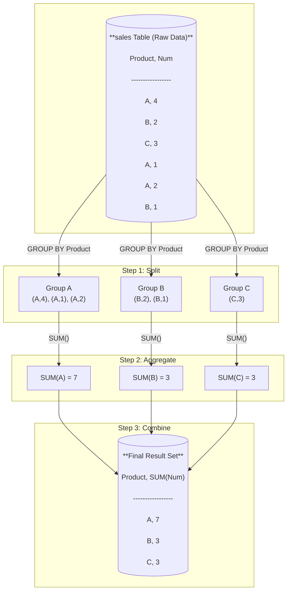
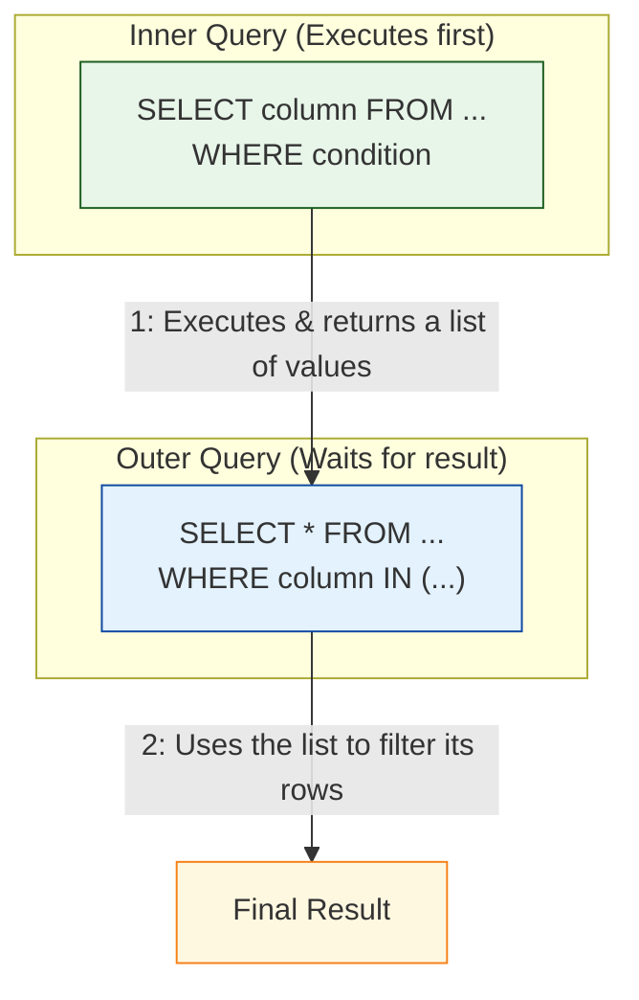
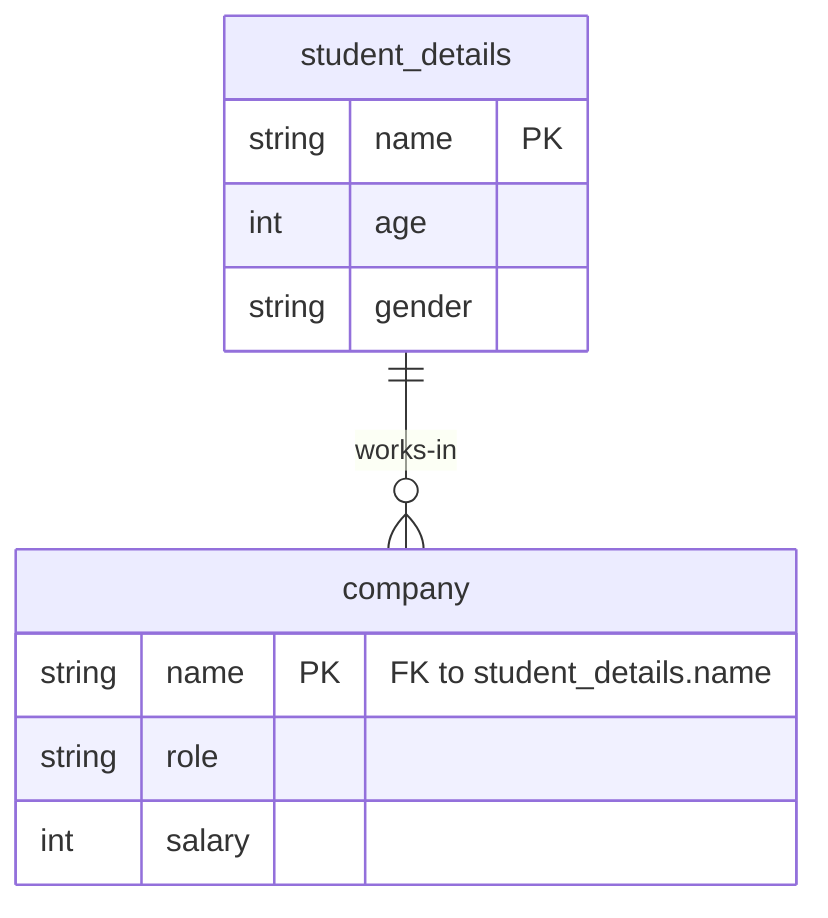

# 🗄️ Advanced SQL: Aggregation, Grouping, and Nested Queries


*<p align="center">Image representing complex data relationships and queries.</p>*

Welcome to this detailed guide on advanced SQL topics. We'll break down the components of a `SELECT` query, explore how to group and aggregate data, and dive into the power of nested queries (subqueries). These notes are designed to be clear, practical, and fully compatible with GitHub and Obsidian.

---

## 📊 The Anatomy of a SELECT Query

A `SELECT` statement has several clauses that allow you to specify exactly what data you want and how it should be presented. While you write them in a certain order, the database actually processes them in a different logical order.

> [!IMPORTANT]
> ### ✍️ Lexical Order vs. Logical Order
> *   **Lexical Order** is the order in which you *write* the query.
> *   **Logical Processing Order** is the sequence in which the database *executes* the query. Understanding this is key to avoiding common errors.

Here’s the breakdown:

| Clause | Lexical Order | Logical Order | Purpose |
| :--- | :---: | :---: | :--- |
| **`FROM`** | 2 | 1 | Specifies the source table(s). |
| **`WHERE`** | 3 | 2 | Filters individual rows *before* grouping. |
| **`GROUP BY`** | 4 | 3 | Aggregates rows into groups based on common values. |
| **`HAVING`** | 5 | 4 | Filters the aggregated groups. |
| **`SELECT`** | 1 | 5 | Specifies the columns to be returned. |
| **`ORDER BY`** | 6 | 6 | Sorts the final result set. |
| **`LIMIT`** | 7 | 7 | Restricts the number of rows in the output. |

### Query Execution Flowchart

This diagram illustrates the logical processing order of a SQL query with color-coded steps.


---

## Aggregating Data with `GROUP BY`

The `GROUP BY` clause is used with aggregate functions (`COUNT()`, `SUM()`, `AVG()`, `MAX()`, `MIN()`) to summarize data. It collapses multiple rows into a single summary row based on column values.

Think of it as a three-step process: **Split -> Aggregate -> Combine**.

Let's visualize this with an example. Suppose we have a table of product sales:

| Product | Num |
| :--- | :---: |
| A | 4 |
| B | 2 |
| C | 3 |
| A | 1 |
| A | 2 |
| B | 1 |

### The `GROUP BY` Process

This diagram shows how the database splits data into groups, applies an aggregate function, and combines the results.



The corresponding SQL query would be:
```sql
SELECT Product, SUM(Num)
FROM sales
GROUP BY Product;
```

---

## Filtering: `WHERE` vs. `HAVING`

A common point of confusion is the difference between `WHERE` and `HAVING`. The key lies in the logical processing order.

> [!NOTE]
> ### `WHERE` Filters Rows, `HAVING` Filters Groups
> *   The `WHERE` clause filters individual rows **before** they are grouped and aggregated.
> *   The `HAVING` clause filters entire groups **after** they have been created by `GROUP BY`.

| Feature | `WHERE` Clause | `HAVING` Clause |
| :--- | :--- | :--- |
| **Purpose** | Filters individual rows. | Filters aggregated groups. |
| **Placement** | Comes before `GROUP BY`. | Comes after `GROUP BY`. |
| **Aggregate Functions** | ❌ Cannot be used. | ✅ Can be used. |
| **Analogy** | Filtering items on a conveyor belt *before* sorting them into boxes. | Inspecting the *full boxes* and removing the ones that don't meet a standard. |

### ✅ Practical Example: Using Both Together

**Goal**: Display the average income by education level, but only for education levels above 15, and only show the groups whose average income is greater than 80,000.

1.  **`FROM`**: Get the `cardiogoodfitness` table.
2.  **`WHERE`**: Filter out rows where `Education` is 15 or less.
3.  **`GROUP BY`**: Group the remaining rows by `Education` level.
4.  **`HAVING`**: From those groups, filter out the ones where `avg(Income)` is not greater than 80,000.
5.  **`SELECT`**: Display the `Education` and `avg(Income)`.

```sql
-- Display avg income by education exclude (education below 15 and group below 80000)
SELECT 
    Education, 
    AVG(Income) AS avg_income
FROM 
    cardiogoodfitness
WHERE 
    Education > 15       -- Step 2: Filters rows BEFORE grouping
GROUP BY 
    Education            -- Step 3: Groups the filtered rows
HAVING 
    AVG(Income) > 80000;  -- Step 4: Filters groups AFTER aggregation
```

> [!TIP]
> While some SQL dialects allow you to use a column alias in the `HAVING` clause (like `HAVING avg_income > 80000`), it is not standard SQL and can fail in other systems. It is always safer and better practice to use the full aggregate function `AVG(Income)` in the `HAVING` clause.

---

## 🧩 Nested Queries (Subqueries)

A Nested Query, or Subquery, is a `SELECT` statement that is nested inside another SQL statement. It's a powerful tool for performing complex filtering and lookups.

> [!IMPORTANT]
> ### The Golden Rule of Subqueries
> The **inner query** (the subquery) is executed **first**. Its result is then used by the **outer query**.

### Subquery Execution Flow



### ✅ Example: Finding Records Based on Another Table

Let's imagine we have two tables, `student_details` and `company`. We want to find the details of all students who work as a 'DA' (Data Analyst).

**Tables:**


**Query Logic:**
1.  **Inner Query**: First, get the `name` of every person in the `company` table whose `role` is 'DA'.
2.  **Outer Query**: Then, select all records from `student_details` where the `name` is in the list generated by the inner query.

```sql
-- Display the records of students who are working as DA
SELECT *
FROM student_details
WHERE name IN (
    -- This inner query runs first
    SELECT name
    FROM company
    WHERE role = 'DA'
);
```

### ✅ Example: Filtering Based on an Aggregate Value

**Goal**: Display all records from the `company` table for employees whose salary is above the company's average salary.

**Query Logic:**
1.  **Inner Query**: Calculate the average salary for the entire `company` table. This will return a single value (e.g., `2100`).
2.  **Outer Query**: Select all records from the `company` table where the `salary` is greater than the value returned by the inner query.

```sql
-- Display records whose salary is above the average salary
SELECT *
FROM company
WHERE salary > (
    -- This runs first and returns a single number
    SELECT AVG(salary)
    FROM company
);
```

---

## 🚀 Today's Class: Practice SQL (MariaDB)

Here is a collection of the queries we practiced, using the `cardiogoodfitness` dataset and the example `student_details`/`company` tables.

```sql
-- Display average income by gender, highest first
SELECT 
    Gender, 
    AVG(Income) AS Avg_Income
FROM 
    cardiogoodfitness
GROUP BY 
    Gender
ORDER BY 
    Avg_Income DESC;

-- Display average usage by product, lowest first
SELECT 
    Product, 
    AVG(`Usage`) AS avg_usage
FROM 
    cardiogoodfitness
GROUP BY 
    Product
ORDER BY 
    avg_usage ASC;

-- Display average income broken down by both product and gender
SELECT 
    Product, 
    Gender, 
    AVG(income)
FROM 
    cardiogoodfitness
GROUP BY 
    Product, Gender;

-- Display average income by age, but only for groups older than 30
SELECT 
    Age, 
    AVG(Income) AS Avg_Income
FROM 
    cardiogoodfitness
GROUP BY 
    Age
HAVING 
    age > 30;

-- Display average income by age, but only for groups with an average income over 50,000
SELECT 
    age, 
    AVG(income) AS avg_income
FROM 
    cardiogoodfitness
GROUP BY 
    age
HAVING 
    AVG(income) > 50000; -- Using the function is safer than the alias

-- Display student records who are earning above 12000 as an AI Engineer
SELECT *
FROM student_details
WHERE name IN (
    SELECT name
    FROM company
    WHERE role = 'AI' AND salary > 12000
);
                
-- Display records whose age is above the average age of all students
SELECT *
FROM student_details
WHERE age > (
    SELECT AVG(age)
    FROM student_details
);
```


> [!NOTE] Title
> Contents
