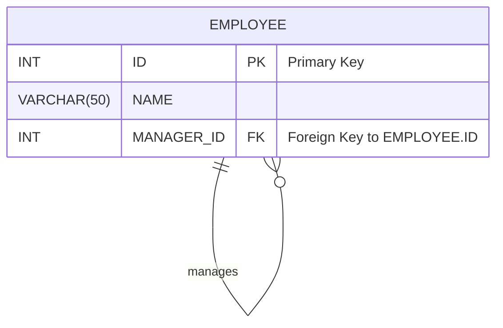
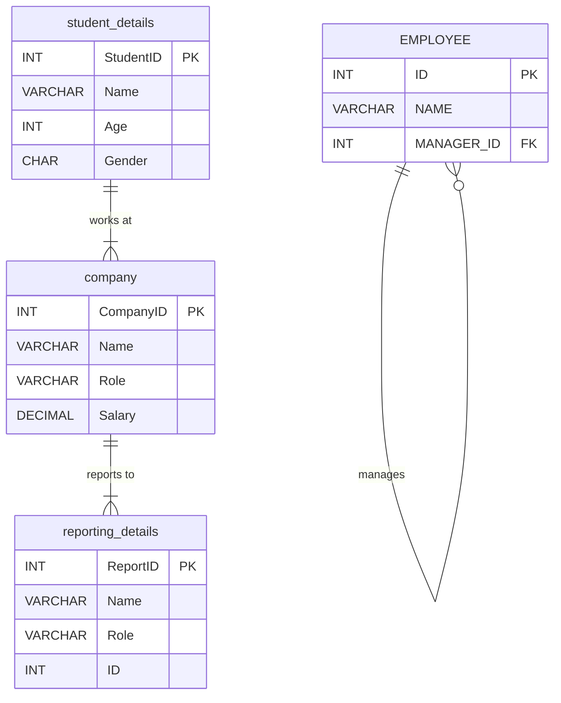

# 🧩 SQL Joins: Mastering Multi-Table Queries

Welcome to your guide on mastering SQL `JOIN`s! In relational databases, data is strategically split across multiple tables to ensure efficiency and integrity. `JOIN` clauses are the powerful tools we use to bring this data back together, allowing us to ask complex questions and uncover meaningful insights.

> [!IMPORTANT]
> ### 🌎 Real-World Example: Instagram
> Think about Instagram. Your user profile (username, bio) is likely in one table. Your posts (image URLs, captions) are in another. When you view your profile, Instagram performs a `JOIN` to fetch data from both tables simultaneously to display a complete page.

---

## 📊 Working with Multiple Tables

When you need data from more than one table, you have two main approaches: Nested Queries (Subqueries) and `JOIN`s.

| Method | Description | Performance | Use Case |
| :--- | :--- | :--- | :--- |
| **Nested Query** | A `SELECT` statement inside another statement. | 🐢 **Slower**: Can be inefficient as it may execute for each row of the outer query. | Good for simple, one-off lookups or when a condition depends on an aggregated value (`WHERE Age > (SELECT AVG(Age)...)`). |
| **JOIN** | A clause that combines rows from two or more tables based on a related column. | 🚀 **Faster**: The database optimizer is highly tuned for `JOIN` operations. | The standard and most efficient way to fetch columns from multiple tables at once. |

---

## 🧩 The Core `JOIN` Types

`JOIN`s let us combine tables. The type of `JOIN` determines *which* rows are included in the final result. Venn diagrams are a popular way to visualize how these `JOIN`s work.

*A visual guide to the most common SQL JOIN operations.*

### 1. `INNER JOIN` (The Intersection)
📌 An `INNER JOIN` returns only the rows that have matching values in **both** tables. It's the most common type of join.

> [!NOTE]
> If you simply use the `JOIN` keyword without specifying a type, the database defaults to `INNER JOIN`.

**Syntax:**
```sql
SELECT T1.column, T2.column
FROM table1 AS T1
INNER JOIN table2 AS T2 ON T1.common_column = T2.common_column;
```

### 2. `LEFT JOIN` (Include Everything from the Left)
📌 A `LEFT JOIN` (or `LEFT OUTER JOIN`) returns **all** rows from the left table and the matched rows from the right table. If there's no match, the columns from the right table will contain `NULL`.

**Syntax:**
```sql
SELECT T1.column, T2.column
FROM table1 AS T1
LEFT JOIN table2 AS T2 ON T1.common_column = T2.common_column;
```

### 3. `RIGHT JOIN` (Include Everything from the Right)
📌 A `RIGHT JOIN` (or `RIGHT OUTER JOIN`) is the mirror image of a `LEFT JOIN`. It returns **all** rows from the right table and the matched rows from the left. If no match exists, the left-side columns are `NULL`.

**Syntax:**
```sql
SELECT T1.column, T2.column
FROM table1 AS T1
RIGHT JOIN table2 AS T2 ON T1.common_column = T2.common_column;
```

### 4. `FULL OUTER JOIN` (Include Everything from Both)
📌 A `FULL OUTER JOIN` returns all rows when there is a match in either the left or the right table. It's essentially a combination of `LEFT JOIN` and `RIGHT JOIN`. If no match exists for a row, the columns from the other table will be `NULL`.

> [!NOTE]
> MariaDB (and MySQL) does not directly support `FULL OUTER JOIN`. You can emulate it by combining a `LEFT JOIN` and a `RIGHT JOIN` with a `UNION`.

**Emulated Syntax (MariaDB/MySQL):**
```sql
-- Select all from left table + matching from right
SELECT * FROM table1
LEFT JOIN table2 ON table1.id = table2.id
UNION
-- Select all from right table + matching from left
SELECT * FROM table1
RIGHT JOIN table2 ON table1.id = table2.id;
```

---

## ⛓️ Special Join Types

### 1. `CROSS JOIN` (The Cartesian Product)
❌ A `CROSS JOIN` returns every possible combination of rows from the joined tables. If Table A has `n` rows and Table B has `m` rows, the result will have `n * m` rows. This is rarely used in practice and can create massive, slow-running queries if used improperly.

**Example:** If you `CROSS JOIN` a table of 3 shirt colors with a table of 3 sizes, you get 3 * 3 = 9 possible shirt combinations.

**Syntax:**
```sql
SELECT * FROM table1 CROSS JOIN table2;
```

### 2. `SELF JOIN` (Joining a Table to Itself)
✅ A `SELF JOIN` is not a distinct join type but a technique where you join a table to itself. This is incredibly useful for querying hierarchical data, like finding an employee's manager within the same `employees` table.

You accomplish this by using aliases to treat the table as two separate entities in the same query.

**Scenario:** We have an `EMPLOYEE` table where `MANAGER_ID` refers to the `ID` of another employee in the *same table*.

**Table Structure:**


**Query to find each employee and their manager:**
```sql
SELECT
    manager.NAME AS ManagerName,
    employee.NAME AS EmployeeName
FROM EMPLOYEE AS employee
JOIN EMPLOYEE AS manager ON employee.MANAGER_ID = manager.ID;
```
In this query, we treat `EMPLOYEE` as two tables: `employee` (for the employee role) and `manager` (for the manager role) to link them together.

---

## 🚀 Putting It All Together: Practice Queries

Let's work with a database for a fictional university and company placement program.

**Database Schema:**


### MariaDB Practice Code

```sql
-- 📌 Fetch student details along with their company role and salary
SELECT
    sd.Name,
    sd.Age,
    cm.Role,
    cm.Salary
FROM student_details AS sd  -- 'sd' is an alias for student_details
JOIN company AS cm ON sd.Name = cm.Name; -- 'cm' is an alias for company

-- 📌 Display the role, salary, and gender for each person
SELECT
    cm.Name,
    cm.Role,
    sd.Gender
FROM company AS cm
JOIN student_details AS sd ON cm.Name = sd.Name;

-- 📌 Display total salary for all male ('M') employees
SELECT SUM(cm.Salary) AS TotalSalaryForMale
FROM company cm
JOIN student_details sd ON cm.Name = sd.Name
WHERE sd.Gender = 'M';

-- 📌 Display the average age for each role, ordered from oldest to youngest
SELECT
    cm.Role,
    AVG(sd.Age) as avg_age
FROM company cm
JOIN student_details sd ON cm.Name = sd.Name
GROUP BY cm.Role
ORDER BY avg_age DESC;

-- 📌 Display students whose age is above the overall average age (using a subquery)
SELECT Name, Age, Gender
FROM student_details
WHERE Age > (SELECT AVG(Age) FROM student_details);

-- 🗄️ Table setup for reporting details
DROP TABLE IF EXISTS reporting_details;
CREATE TABLE reporting_details (
    ReportID INT PRIMARY KEY AUTO_INCREMENT,
    Name VARCHAR(20),
    Role VARCHAR(20),
    ID INT
);
INSERT INTO reporting_details(Name, Role, ID) VALUES
    ('Riyan', 'Manager', 101),
    ('Amaan', 'Employee', 101),
    ('Adnan', 'Employee', 102),
    ('Sara', 'Manager', 102),
    ('Priya', 'Manager', 103);

-- ⛓️ Example of a SELF JOIN on the reporting_details table
-- Find employees and managers who share the same reporting ID (e.g., in the same team)
SELECT
    manager.Name AS ManagerName,
    manager.Role AS ManagerRole,
    employee.Name AS EmployeeName,
    employee.Role AS EmployeeRole
FROM reporting_details AS manager
JOIN reporting_details AS employee
    ON manager.ID = employee.ID
    AND manager.Role = 'Manager'
    AND employee.Role = 'Employee';


-- 🗄️ Table setup for the classic Employee-Manager SELF JOIN example
DROP TABLE IF EXISTS EMPLOYEE;
CREATE TABLE EMPLOYEE (
    ID INT PRIMARY KEY,
    NAME VARCHAR(50),
    MANAGER_ID INT
);
INSERT INTO EMPLOYEE VALUES
    (101, 'ADAM', 103),
    (102, 'BOB', 104),
    (103, 'CASEY', NULL), -- Casey is the top manager, has no manager
    (104, 'DONALD', 103);

-- ✅ Final SELF JOIN to map managers to their direct reports
SELECT
    A.NAME AS ManagerName,
    B.NAME AS EmployeeName
FROM EMPLOYEE AS A
JOIN EMPLOYEE AS B ON A.ID = B.MANAGER_ID;
```