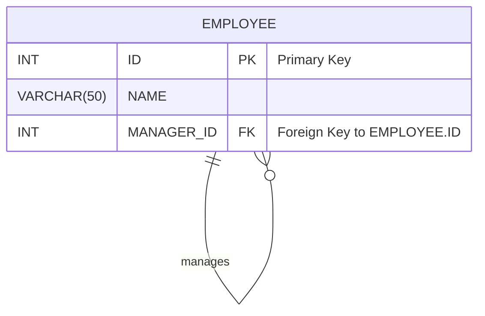
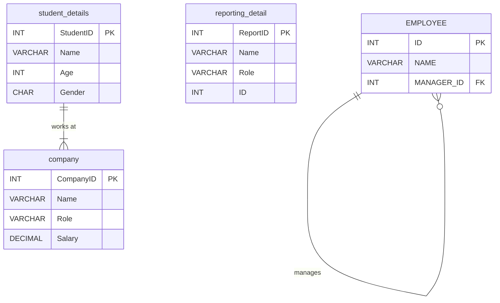

# 🧩 SQL Joins: Mastering Multi-Table Queries

Welcome to your guide on mastering SQL `JOIN`s! In relational databases, data is strategically split across multiple tables to ensure efficiency and integrity. `JOIN` clauses are the powerful tools we use to bring this data back together, allowing us to ask complex questions and uncover meaningful insights.

> [!IMPORTANT]
> ### 🌎 Real-World Example: Instagram
> Think about Instagram. Your user profile (username, bio) is likely in one table. Your posts (image URLs, captions) are in another. When you view your profile, Instagram performs a `JOIN` to fetch data from both tables simultaneously to display a complete page.

---

## 📊 Working with Multiple Tables

When you need data from more than one table, you have two main approaches: Nested Queries (Subqueries) and `JOIN`s.

| Method | Description | Performance | Use Case |
| :--- | :--- | :--- | :--- |
| **Nested Query** | A `SELECT` statement inside another statement. | 🐢 **Slower**: Can be inefficient as it may execute for each row of the outer query. | Good for simple, one-off lookups or when a condition depends on an aggregated value (`WHERE Age > (SELECT AVG(Age)...)`). |
| **JOIN** | A clause that combines rows from two or more tables based on a related column. | 🚀 **Faster**: The database optimizer is highly tuned for `JOIN` operations. | The standard and most efficient way to fetch columns from multiple tables at once. |

---

## 🧩 The Core `JOIN` Types

`JOIN`s let us combine tables. The type of `JOIN` determines *which* rows are included in the final result. Venn diagrams are a popular way to visualize how these `JOIN`s work.

*A visual guide to the most common SQL JOIN operations.*


### 1. `INNER JOIN` (The Intersection)
📌 An `INNER JOIN` returns only the rows that have matching values in **both** tables. It's the most common type of join.

> [!NOTE]
> If you simply use the `JOIN` keyword without specifying a type, the database defaults to `INNER JOIN`.

**Syntax:**
```sql
SELECT T1.column, T2.column
FROM table1 AS T1
INNER JOIN table2 AS T2 ON T1.common_column = T2.common_column;
```

### 2. `LEFT JOIN` (Include Everything from the Left)
📌 A `LEFT JOIN` (or `LEFT OUTER JOIN`) returns **all** rows from the left table and the matched rows from the right table. If there's no match, the columns from the right table will contain `NULL`.

**Syntax:**
```sql
SELECT T1.column, T2.column
FROM table1 AS T1
LEFT JOIN table2 AS T2 ON T1.common_column = T2.common_column;
```

### 3. `RIGHT JOIN` (Include Everything from the Right)
📌 A `RIGHT JOIN` (or `RIGHT OUTER JOIN`) is the mirror image of a `LEFT JOIN`. It returns **all** rows from the right table and the matched rows from the left. If no match exists, the left-side columns are `NULL`.

**Syntax:**
```sql
SELECT T1.column, T2.column
FROM table1 AS T1
RIGHT JOIN table2 AS T2 ON T1.common_column = T2.common_column;
```

### 4. `FULL OUTER JOIN` (Include Everything from Both)
📌 A `FULL OUTER JOIN` returns all rows when there is a match in either the left or the right table. It's essentially a combination of `LEFT JOIN` and `RIGHT JOIN`.

> [!NOTE]
> MariaDB (and MySQL) do not directly support `FULL OUTER JOIN`. You can emulate it by combining a `LEFT JOIN` and a `RIGHT JOIN` with a `UNION`.

**Emulated Syntax (MariaDB/MySQL):**
```sql
-- Select all from left table + matching from right
SELECT * FROM table1
LEFT JOIN table2 ON table1.id = table2.id
UNION
-- Select all from right table + matching from left
SELECT * FROM table1
RIGHT JOIN table2 ON table1.id = table2.id;
```

---

## ⛓️ Special Join Types

### 1. `CROSS JOIN` (The Cartesian Product)
❌ A `CROSS JOIN` returns every possible combination of rows from the joined tables. If Table A has `n` rows and Table B has `m` rows, the result will have `n * m` rows. This is rarely used in practice.

**Syntax:**
```sql
SELECT * FROM table1 CROSS JOIN table2;
```

### 2. `SELF JOIN` (Joining a Table to Itself)
✅ A `SELF JOIN` is a technique where you join a table to itself. This is incredibly useful for querying hierarchical data, like finding an employee's manager within the same `employees` table. You must use aliases to treat the table as two separate entities.

**Table Structure:**


**Query to find each employee and their manager:**
```sql
SELECT
    manager.NAME AS ManagerName,
    employee.NAME AS EmployeeName
FROM EMPLOYEE AS employee
JOIN EMPLOYEE AS manager ON employee.MANAGER_ID = manager.ID;
```

---

## 🚀 Putting It All Together: Practice Queries

Here is a complete set of queries from our class, demonstrating various `JOIN` operations.

**Database Schema:**


### MariaDB Practice Code

```sql
-- 📌 1. Display name, age, role, and salary (long form)
SELECT
    student_details.Name,
    student_details.Age,
    company.Role,
    company.Salary
FROM student_details
JOIN company ON student_details.Name = company.Name;

-- 📌 2. Same query using aliases for brevity (recommended practice)
SELECT
    sd.Name,
    sd.Age,
    cm.Role,
    cm.Salary
FROM student_details AS sd
JOIN company AS cm ON sd.Name = cm.Name;

-- 📌 3. Filter results: Display Name, Age, and Salary only for the 'DS' (Data Scientist) role
SELECT
    sd.Name,
    sd.Age,
    cm.Salary,
    cm.Role
FROM student_details AS sd
INNER JOIN company AS cm ON sd.Name = cm.Name
WHERE cm.Role = 'DS';

-- 📌 4. Combine columns from both tables: Display role, salary, and gender
SELECT
    cm.Role,
    cm.Salary,
    sd.Gender
FROM company AS cm
JOIN student_details AS sd ON cm.Name = sd.Name;

-- 📌 5. Aggregation with a filter: Display the SUM of salaries for all male ('M') employees
SELECT
    SUM(cm.Salary) AS TotalMaleSalary,
    sd.Gender
FROM company AS cm
JOIN student_details AS sd ON cm.Name = sd.Name
WHERE sd.Gender = 'M'
GROUP BY sd.Gender; -- Grouping is good practice even for one result

-- 📌 6. Aggregation with grouping: Display the average age for each role
-- Using LEFT JOIN to include roles from the company table even if no matching student exists
SELECT
    cm.Role,
    AVG(sd.Age) AS avg_age
FROM company AS cm
LEFT JOIN student_details AS sd ON cm.Name = sd.Name
GROUP BY cm.Role
ORDER BY avg_age DESC;

-- 📌 7. Subquery example: Display students whose age is above the overall average
SELECT Name, Age, Gender
FROM student_details
WHERE Age > (SELECT AVG(Age) FROM student_details);

-- ⛓️ 8. Self Join: Find employees under a specific manager ID from reporting_detail table
-- This query finds all entries sharing ID 102
SELECT
    rt.Name,
    rt.Role,
    test.ID
FROM reporting_detail AS rt
JOIN reporting_detail AS test ON rt.ID = test.ID AND rt.ID = 102;

-- ⛓️ 9. Self Join: Find the manager for each employee
-- This is a classic hierarchical query
SELECT
    A.NAME AS ManagerName,
    B.NAME AS EmployeeName
FROM EMPLOYEE AS A
JOIN EMPLOYEE AS B ON A.ID = B.MANAGER_ID;
```