# The Statistical Jargon Buster: A Complete Glossary

> [!NOTE]
>  **A Key Rule of Thumb**: In statistics, we often use **Greek letters (μ, σ)** for parameters of an entire **population** (the true, often unknowable values) and **Latin letters (x̄, s)** for statistics of a **sample** (the values we actually calculate from our data).

## Core Statistical Concepts

| Symbol       | Term                              | Simple Explanation                                                            | Analogy or Example                                                                                                                                                                                  |
| ------------ | --------------------------------- | ----------------------------------------------------------------------------- | --------------------------------------------------------------------------------------------------------------------------------------------------------------------------------------------------- |
| `μ` (Mu)     | **Population Mean**               | The TRUE average of everyone or everything in the group you're interested in. | The average height of _every single man_ in a country. It's the perfect, but often unknowable, number.                                                                                              |
| `x̄` (x-bar) | **Sample Mean**                   | The average of the small group you actually measured.                         | The average height of the 100 men you randomly measured. It's your **best guess** for μ.                                                                                                            |
| `σ` (Sigma)  | **Population Standard Deviation** | The TRUE amount of variation or spread in the entire population.              | How much the heights of _all men_ in the country naturally differ from the average height (μ).                                                                                                      |
| `s` / `std`  | **Sample Standard Deviation**     | The amount of variation or spread found in your measured sample.              | How much the heights of your 100 men differ from their average (x̄). It's your **estimate** for σ.                                                                                                  |
| `σ²` or `s²` | **Variance**                      | The standard deviation squared. A measure of spread in squared units.         | It's a key ingredient for calculations, but less intuitive than standard deviation. Think of it as the "engine room" number that powers the more useful "speedometer" reading (standard deviation). |

## Hypothesis Testing Terms

|Symbol|Term|Simple Explanation|Analogy or Example|
|---|---|---|---|
|`H₀`|**Null Hypothesis**|The "boring" assumption of no effect, no change, or no difference. It's the default state we test against.|**Courtroom**: "The defendant is innocent." **A/B Test**: "The new button color has no effect on clicks."|
|`H₁` or `Hₐ`|**Alternative Hypothesis**|The claim or theory you are trying to prove. The "exciting" result.|**Courtroom**: "The defendant is guilty." **A/B Test**: "The new button color increases clicks."|
|`α` (Alpha)|**Significance Level**|The "bar for reasonable doubt." It's the risk you're willing to take of making a Type I Error. You set this _before_ you test.|You set α = 0.05, meaning "I am willing to accept a 5% chance of concluding there's an effect when there isn't one."|
|**p-value**|**Probability Value**|The "Surprise-o-Meter." The probability of seeing your results (or more extreme ones) _if the null hypothesis were true_.|A p-value of 0.01 means: "There is only a 1% chance of seeing data this extreme if the new button had no effect. This is very surprising, so I should probably reject that 'no effect' idea."|

## Error Types and Test Statistics

|Term|Alternative Name|Simple Explanation|Analogy or Example|
|---|---|---|---|
|**Type I Error**|**False Positive**|Rejecting the null hypothesis when it's actually true.|The jury convicts an innocent person. You launch a new website feature that you think is an improvement, but it actually isn't.|
|**Type II Error**|**False Negative**|Failing to reject the null hypothesis when it's actually false.|The jury acquits a guilty person. You miss out on launching a great feature because your test didn't have enough evidence to prove it was better.|
|**t-score / z-score**|**Test Statistic**|A calculated number that tells you how many standard deviations your sample mean is away from the null hypothesis value.|A z-score of 2.5 means your result is 2.5 standard deviations above the "no effect" line. The further from zero, the more unusual your result is.|

## Probability and Modeling Concepts

|Symbol|Term|Simple Explanation|Analogy or Example|
|---|---|---|---|
|`P(A)`|**Probability of A**|The likelihood of event A happening, on a scale from 0 to 1.|P(Flipping Heads) = 0.5|
|`P(B\|A)`|**Conditional Probability**|The probability of event B happening, _given that_ event A has already happened.|P(Roads are wet \| It just rained) is very high. P(Roads are wet) by itself is lower.|
|`CI`|**Confidence Interval**|A range of values where we are fairly confident the true population value (like μ) lies.|"We are 95% confident that the true average customer age is between 34 and 38." This is more honest and useful than a single guess.|
|`β` (Beta)|**Coefficient (in Regression)**|The slope of the line. It tells you how much the output variable is expected to change for a one-unit increase in the input variable.|In a model predicting sales from ad spend, β = 0.75 means: "For every extra $1 spent on ads, we expect sales to increase by $0.75."|
|`R²`|**R-Squared**|A "goodness of fit" score from 0% to 100%. It tells you what percentage of the variation in your output is explained by your model's inputs.|An R² of 0.85 for a house price model means: "85% of the variation in house prices can be explained by the features in our model (like square footage, location, etc.)."|

---

## Quick Reference Cheat Sheet

### Population vs Sample

- **Greek letters** (μ, σ, π) = Population parameters (true values)
- **Latin letters** (x̄, s, p̂) = Sample statistics (calculated values)

### Hypothesis Testing Flow

1. Set up H₀ (null) and H₁ (alternative)
2. Choose significance level (α)
3. Collect sample data
4. Calculate test statistic (z-score, t-score)
5. Find p-value
6. Decision: Reject H₀ if p-value < α

### Error Types Memory Aid

- **Type I Error (α)**: "False Alarm" - Rejecting truth
- **Type II Error (β)**: "Missed Opportunity" - Missing real effect

## Part I: The Foundation

### 1. What is Statistics?

Statistics is the science of collecting, analyzing, interpreting, and presenting data. For a data scientist, it's the bedrock for making decisions under uncertainty.

> [!INFO]
> **The GPS Analogy**: Think of statistics as a GPS for data. It helps you navigate from raw, confusing numbers to a destination of clear, actionable insights.

It helps us answer fundamental questions like:
- What does our data *actually* look like? (Descriptive)
- What conclusions can we draw about a large group from a small sample? (Inferential)

### 2. Types of Data

Understanding your data's type is the first step. It dictates the statistical methods and visualizations you can use.

| Type | Sub-Type | Description | Examples |
| :--- | :--- | :--- | :--- |
| **Categorical** | Nominal | Categories without a meaningful order. | `Gender`, `City`, `Color (Red/Blue)` |
| | Ordinal | Categories that have a natural order. | `Low/Medium/High`, `Survey Ratings` |
| **Numerical** | Discrete | Whole numbers that are counted. | `Number of Children`, `Page Views` |
| | Continuous| Numbers that are measured and can take any value within a range. | `Height`, `Temperature`, `Salary` |

---

## Part II: Descriptive Statistics (The "What")

Descriptive statistics is about summarizing and visualizing the data you have in a meaningful way. It's the core of **Exploratory Data Analysis (EDA)**.

### A. Measures of Central Tendency

These tell you where the "center" of your data lies.

| Measure | Description | When to Use |
| :--- | :--- | :--- |
| **Mean** | The simple average. | Symmetrical data, no significant outliers. |
| **Median**| The middle value of a sorted dataset. | **Default choice for skewed data or data with outliers.** |
| **Mode** | The most frequent value. | Best for categorical or discrete data. |

### B. Measures of Dispersion (Spread)

These tell you how spread out or varied your data is.

| Measure | Description | Key Insight |
| :--- | :--- | :--- |
| **Range** | `Max - Min`. Simple but very sensitive to outliers. | A quick glimpse of the data's span. |
| **Variance ($s^2$)**| The average squared distance from the mean. | Measures overall variability. Hard to interpret due to squared units. |
| **Standard Deviation ($\sigma$)**| The square root of variance. **Most common measure of spread.** | Measures the typical distance of a data point from the mean. In the original units of the data. |
| **Interquartile Range (IQR)**| `Q3 - Q1`. The range of the middle 50% of the data. | **Robust to outliers.** Excellent for understanding the bulk of the data's spread. |

> [!TIP]
> **Using IQR for Outlier Detection**: A common rule of thumb is to classify any data point outside the following bounds as a potential outlier:
> - **Lower Bound**: $Q1 - 1.5 \times IQR$
> - **Upper Bound**: $Q3 + 1.5 \times IQR$

### C. Shape of Data & Visualizations

The shape of your data's distribution is a critical piece of the story.

1.  **Skewness**: Measures the asymmetry of the distribution.
2.  **Kurtosis**: Measures the "tailedness" or how heavy the tails are, indicating the presence of outliers.

The best way to understand shape is by *visualizing* it.

| Visualization | What it Shows | Best For... |
| :--- | :--- | :--- |
| **Histogram** | The frequency distribution of a single numerical variable. | Understanding shape, central tendency, and spread. |
| **Boxplot** | The five-number summary (Min, Q1, Median, Q3, Max). | **Identifying outliers** and comparing distributions across groups. |
| **Scatterplot**| The relationship between two numerical variables. | Identifying correlation and patterns. |

---

## Part III: Probability (The "How Likely")

Probability is the mathematical foundation for making inferences and predictions under uncertainty.

> [!IMPORTANT]
> **Core Formula**: $P(\text{Event}) = \frac{\text{Number of Favorable Outcomes}}{\text{Total Number of Outcomes}}$

### Key Probability Distributions

| Distribution | Type | Description | Real-World Example |
| :--- | :--- | :--- | :--- |
| **Binomial** | Discrete | Number of successes in a fixed number of trials. | The number of heads in 10 coin flips. |
| **Poisson** | Discrete | Number of events in a fixed interval of time/space. | The number of customers arriving at a store in an hour. |
| **Normal** | Continuous| The classic symmetric "bell curve." | Heights, blood pressure, measurement errors. |
| **Pareto** | Continuous| The "80/20" rule distribution. | Wealth distribution (80% of wealth held by 20% of people). |

---

## Part IV: Inferential Statistics (The "What If")

This is where we move from just describing data to using a **sample** to make educated guesses (inferences) about an entire **population**.

### A. The Core Idea: Sampling

> [!WARNING]
> The validity of your inference depends entirely on the quality of your sample. A biased sample leads to wrong conclusions. **Random sampling** is the gold standard.

### B. Hypothesis Testing: The Formal Framework

Hypothesis testing is a structured process to determine if a signal in your data is real or just random noise.

**The Main Players:**
- **Null Hypothesis ($H_0$)**: The "default" or "boring" state. It assumes no change, no effect, no difference. (e.g., "This new drug has no effect on recovery time.")
- **Alternative Hypothesis ($H_1$ or $H_a$)**: The claim you want to prove. (e.g., "This new drug *reduces* recovery time.")

**The Workflow:**

```mermaid
sequenceDiagram
    participant R as 🧠 Researcher
    participant H as 📋 Hypothesis Setup
    participant S as 📊 Sample Data
    participant C as 🧮 Calculations
    participant D as 🎯 Decision Engine
    participant O as 📈 Outcome

    Note over R, O: 🔬 Statistical Hypothesis Testing Workflow

    R->>H: 1️⃣ Define Research Question
    Note right of H: What do we want to prove?
    
    R->>H: 2️⃣ State Hypotheses
    H-->>H: H₀: No effect/difference (null)
    H-->>H: H₁: There is an effect/difference
    Note right of H: H₀ is innocent until proven guilty

    R->>D: 3️⃣ Set Risk Tolerance
    D-->>D: Choose α (usually 0.05)
    Note right of D: "I accept 5% risk of false positive"

    R->>S: 4️⃣ Collect Sample Data
    Note right of S: Representative sample from population
    
    S->>C: 5️⃣ Calculate Test Statistic
    C-->>C: Compute z-score, t-score, etc.
    Note right of C: How unusual is our sample result?

    C->>D: 6️⃣ Determine P-value
    Note right of D: Probability of seeing this result<br/>if H₀ were true

    alt 🎉 p-value ≤ α (Significant!)
        D->>O: ✅ REJECT H₀
        Note over O: 🎯 Result is statistically significant!<br/>📊 Evidence supports H₁<br/>🚀 We found something interesting!
        O-->>R: 📢 Publish findings with confidence
    else 😐 p-value > α (Not significant)
        D->>O: ❌ FAIL TO REJECT H₀
        Note over O: 🤷 Not enough evidence<br/>📊 Could be due to chance<br/>🔄 Maybe need larger sample
        O-->>R: 📝 Report inconclusive results
    end

    Note over R, O: ⚠️ Remember: Absence of evidence ≠ Evidence of absence

    rect rgb(255, 248, 220)
        Note over R, O: 💡 Pro Tips:<br/>• Plan sample size before collecting data<br/>• Consider practical significance, not just statistical<br/>• Replication is key to building scientific knowledge
    end
```

**Key Concepts in Hypothesis Testing:**

| Concept | Description |
| :--- | :--- |
| **Significance Level ($\alpha$)**| Your pre-defined threshold for "unusual." It's the probability of a **Type I Error**. A common choice is 0.05 (5%). |
| **P-value** | The probability of observing your data (or something more extreme), *assuming the null hypothesis is true*. A small p-value means your data is very surprising under the null hypothesis. |
| **Type I Error** | **False Positive**. You reject H0 when it's actually true. (You conclude the drug works when it doesn't). The probability of this is $\alpha$. |
| **Type II Error** | **False Negative**. You fail to reject H0 when it's actually false. (You conclude the drug doesn't work when it actually does). |

> [!NOTE]
> **P-Value Interpretation**: A p-value is **NOT** the probability that the null hypothesis is true. It's a measure of evidence *against* the null hypothesis.

### C. Choosing the Right Statistical Test

The test you use depends on your data type and the question you're asking.

**A Deeper Look at T-Tests:**

| Test Type                      | Question it Answers                                                                        | Example                                                                                |
| :----------------------------- | :----------------------------------------------------------------------------------------- | :------------------------------------------------------------------------------------- |
| **One-Sample   T-Test**        | Does the mean of my sample significantly differ from a known value?                        | "Is the average response time for our support team different from our 15-minute goal?" |
| **Independent Samples T-Test** | Is there a significant difference between the means of two *independent* groups?           | "Do users in Group A spend more time on the site than users in Group B?"               |
| **Paired Sample T-Test**       | Is there a significant difference in the means of the *same group* at two different times? | "Did our website redesign improve user engagement scores for the same set of users?"   |

> [!WARNING]
> **Assumptions Matter!** Parametric tests like T-tests and ANOVA have rules. If you break them, your results can be misleading. The main assumptions are:
> 1.  **Independence**: Observations should be independent.
> 2.  **Normality**: Data should be roughly normally distributed.
> 3.  **Homogeneity of Variance**: Groups should have similar spreads.
> If these are violated, use a **non-parametric** alternative (e.g., Mann-Whitney U test instead of an independent T-test).

### D. Beyond Significance: Effect Size & Confidence Intervals

- **Effect Size**: Tells you the *magnitude* of the difference. A p-value might be significant, but the effect could be tiny and practically meaningless. (e.g., "The new button increased clicks by a statistically significant, but practically useless, 0.001%.")
- **Confidence Intervals**: Gives a *range* of plausible values for a population parameter (like the mean). "We are 95% confident that the true average user age is between 34 and 38 years old." This is often more useful than a single point estimate.

---

## Part V: Statistics in Action & Advanced Topics

### A. A/B Testing: Hypothesis Testing for Business

A/B testing is a direct commercial application of hypothesis testing, used to compare two versions of a product to see which performs better.

**The A/B Testing Flowchart:**

```mermaid
graph TD
    A[Define a Goal: e.g., Increase Click-Through Rate: CTR] --> B[Formulate Hypothesis: H0: CTR-A = CTR-B,
    H1: CTR-A ≠ CTR-B];
    B --> C[Randomly Split Users into Two Groups];
    C --> D[Group A sees Control: Version A];
    C --> E[Group B sees Variation: Version B];
    D & E --> F[Run Experiment & Collect Data];
    F --> G[Analyze Results with a Statistical Test e.g., T-test];
    G --> H{Is p-value < α?};
    H -- Yes --> I[Launch the Winning Version!];
    H -- No --> J[No significant difference, stick with the original or re-test.];
```

### B. Regression Analysis: The Bridge to Machine Learning

Regression is a statistical technique used to model the relationship between variables and make predictions. It's a cornerstone of predictive analytics.

- **Linear Regression**: Predicts a *continuous* outcome. (e.g., Predicting house price based on square footage).
- **Logistic Regression**: Predicts a *categorical* outcome. (e.g., Predicting if a customer will churn: Yes/No).

### C. Bayesian vs. Frequentist Statistics

The methods described so far are **Frequentist**. It's the most common approach, but not the only one.

| Approach | Philosophy of Probability | Key Idea |
| :--- | :--- | :--- |
| **Frequentist** | Probability is the long-run frequency of an event over many trials. | We make decisions based on p-values and confidence intervals calculated from sample data. |
| **Bayesian** | Probability is a "degree of belief" that can be updated with new evidence. | We start with a *prior belief* and update it with data to get a *posterior belief*. |

> [!TIP]
> Bayesian methods are becoming increasingly popular in data science, especially for problems where you have strong prior knowledge or limited data.