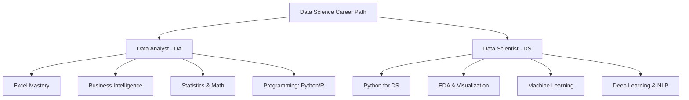
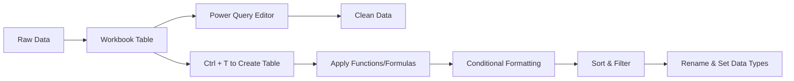
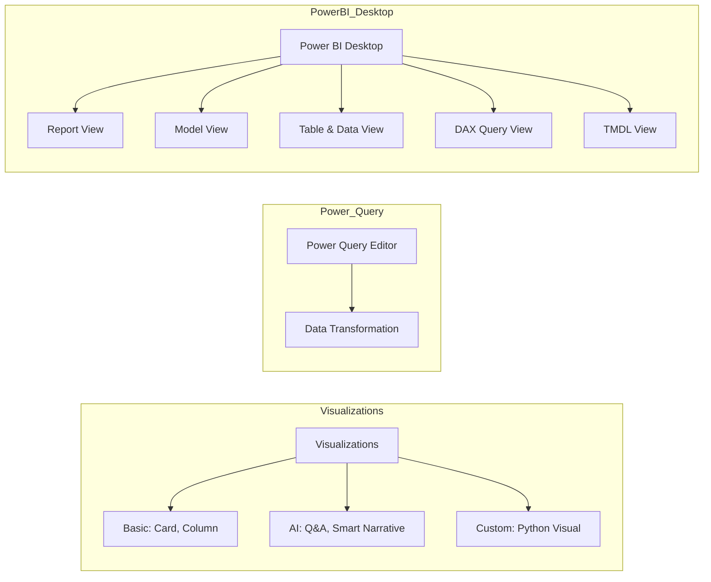
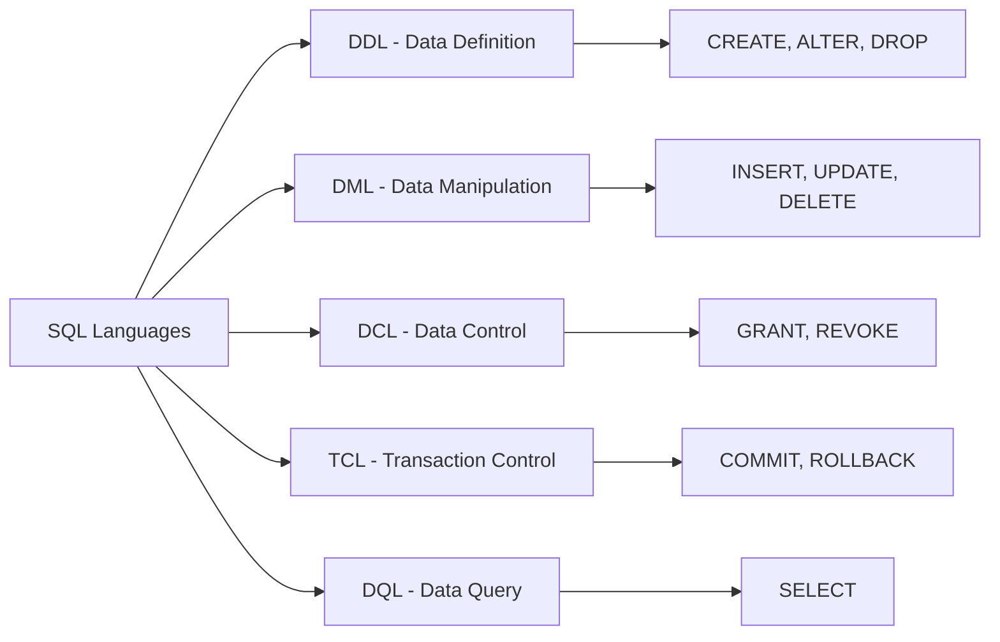
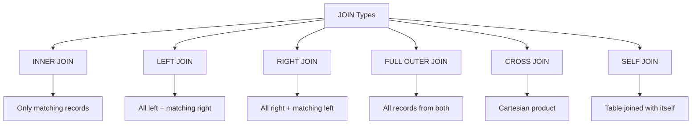
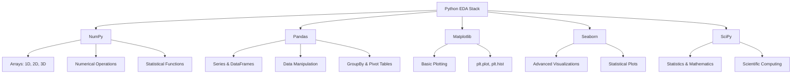

## 🎯 Learning Road-map Overview



**Fallback Overview:**

- **Data Analyst Path:** Excel → BI Tools (Power BI) → Statistics → Programming
- **Data Scientist Path:** Python → EDA → ML → Advanced Topics (DL, NLP)

---

## 📊 Excel Mastery

### Data Import & Preparation

#### Getting Data

1. **Within Workbook** - Internal references
2. **External Import** - Data → Get Data → Select Source → Load

#### Data Cleaning Workflow



### Essential Formulas & Functions

> [!NOTE] 
> **Aggregate Functions** - Essential for data summarization
> 
> |Function|Purpose|Example|Use Case|
> |---|---|---|---|
> |`MAX()`|Maximum value|`=MAX(A1:A10)`|🔥 Find highest sales|
> |`MIN()`|Minimum value|`=MIN(A1:A10)`|❄️ Find lowest score|
> |`COUNT()`|Count numbers|`=COUNT(A1:A10)`|📊 Count responses|
> |`MAXIFS()`|Conditional max|`=MAXIFS(A1:A10, B1:B10, ">50")`|🎯 Max with criteria|
> |`COUNTIF()`|Conditional count|`=COUNTIF(A1:A10, "Yes")`|✅ Count specific values|

> [!TIP] 
> **Text Functions** - Clean and manipulate text data
> 
> |Function|Purpose|Example|Power Level|
> |---|---|---|---|
> |`LOWER()`|Convert to lowercase|`=LOWER(A1)`|⭐ Basic|
> |`PROPER()`|Title case|`=PROPER(A1)`|⭐ Basic|
> |`LEN()`|Text length|`=LEN(A1)`|⭐⭐ Intermediate|
> |`LEFT()`|Left characters|`=LEFT(A1, 5)`|⭐⭐ Intermediate|
> |`TRIM()`|Remove extra spaces|`=TRIM(A1)`|⭐⭐⭐ Advanced|

> [!IMPORTANT] 
> **Date Functions** - Master time-based analysis
> 
> |Function|Purpose|Example|Business Impact|
> |---|---|---|---|
> |`DATE()`|Create date|`=DATE(2024,1,15)`|📅 Generate dates|
> |`YEAR()`|Extract year|`=YEAR(A1)`|🗓️ Annual reports|
> |`DATEDIF()`|Date difference|`=DATEDIF(A1,B1,"Y")`|⏰ Calculate tenure|
> |`TEXT()`|Format date as text|`=TEXT(A1,"MMM YYYY")`|📊 Dashboard labels|

> [!WARNING] 
> **Advanced Lookup Functions** - Interview favorites!
> 
> |Function|Difficulty|Example|Interview Frequency|
> |---|---|---|---|
> |`VLOOKUP()`|⭐⭐ Medium|`=VLOOKUP(A1,Table1,2,FALSE)`|🔥🔥🔥 Very High|
> |`HLOOKUP()`|⭐⭐ Medium|`=HLOOKUP(A1,Table1,2,FALSE)`|🔥 Medium|
> |`INDEX-MATCH`|⭐⭐⭐ Hard|`=INDEX(C:C,MATCH(A1,B:B,0))`|🔥🔥🔥 Very High|
> |`IF-ELSE`|⭐ Easy|`=IF(A1>50,"Pass","Fail")`|🔥🔥🔥 Very High|

### Advanced Features

#### Essential Excel Tools

- **Text to Columns** - Split data by delimiter
- **Data Validation** - Control input values
- **Paste Special** - Advanced paste options
- **Clear** - Remove content/formatting selectively

#### Large Data Handling

1. **Pivot Tables**
    - Group and aggregate data
    - Dynamic summarization
    - Connect with slicers
2. **Pivot Charts & Formatting**
    - Visual representation of pivot data
3. **Dashboard Creation**
    - Combine multiple pivot tables and charts

---

## 🔋 Power BI Deep Dive

### Excel vs Power BI: Key Differences

> [!IMPORTANT] 
> **Platform Selection Guide** - When to use what?
> 
> |Aspect|Excel 📊|Power BI 🔋|Winner|
> |---|---|---|---|
> |**Data Size**|Limited (1M rows)|Massive (billions of rows)|🏆 Power BI|
> |**Data Sources**|Files, basic connections|Multiple cloud/on-premise sources|🏆 Power BI|
> |**Sharing**|File sharing (email/drive)|Cloud-based real-time collaboration|🏆 Power BI|
> |**Visualization**|Basic charts & graphs|Advanced interactive visuals|🏆 Power BI|
> |**Learning Curve**|Easy (familiar interface)|Moderate (new concepts)|🏆 Excel|
> |**Cost**|One-time purchase|Subscription model|🏆 Excel|
> |**Real-time Updates**|Manual refresh|Automatic scheduled refresh|🏆 Power BI|
> |**Mobile Access**|Limited mobile experience|Dedicated mobile apps|🏆 Power BI|

### Power BI Versions

> [!IMPORTANT] 
> Understanding the three main Power BI components

|Version|Purpose|Use Case|
|---|---|---|
|**Desktop**|Building reports|Development & design|
|**Service**|Viewing & collaboration|Cloud sharing & teamwork|
|**Mobile**|Viewing on mobile|On-the-go access|

### Core Components & Views



| Component          | Details / Subcomponents                                               |
| ------------------ | --------------------------------------------------------------------- |
| Power BI Desktop   | Report View, Model View, Table & Data View, DAX Query View, TMDL View |
| Power Query Editor | Data Transformation                                                   |
| Visualizations     | Basic: Card, ColumnAI: Q&A, Smart NarrativeCustom: Python Visual      |

#### Data Modeling Schemas

|Schema Type|Description|Structure|
|---|---|---|
|**Star Schema**|All tables connect directly to fact table|⭐ Fact table at center, dimensions around|
|**Snowflake Schema**|Normalized dimensions, indirect connections|❄️ More complex, normalized structure|

### DAX Language Essentials

> [!NOTE] 
> DAX (Data Analysis Expressions) - Power BI's formula language

| DAX Element | Purpose                | Impact on File Size |
| ----------- | ---------------------- | ------------------- |
| **Measure** | Aggregate calculations | No increase         |
| **Column**  | Row-level calculations | Increases size      |
| **Table**   | Create virtual tables  | Varies              |

### Advanced Power BI Topics

#### Professional Features

- [ ] **Tool Tips** - Custom hover information
- [ ] **Page Navigation** - Interactive report flow
- [ ] **Row Level Security** - Data access control

#### Top 10 Interview DAX Formulas

_Essential formulas to master for Power BI interviews_

---

## 🗃️ SQL Fundamentals

### Language Categories



> [!IMPORTANT] 
> **SQL Language Categories - Quick Reference**
> 
> |Category|Full Name|Purpose|Key Commands|Usage Frequency|
> |---|---|---|---|---|
> |**DDL**|Data Definition Language|🏗️ Structure management|`CREATE`, `ALTER`, `DROP`|🔥 Daily|
> |**DML**|Data Manipulation Language|📝 Data operations|`INSERT`, `UPDATE`, `DELETE`|🔥🔥🔥 Most Used|
> |**DQL**|Data Query Language|🔍 Data retrieval|`SELECT`|🔥🔥🔥 Most Used|
> |**DCL**|Data Control Language|🔐 Access control|`GRANT`, `REVOKE`|🔥 Admin tasks|
> |**TCL**|Transaction Control Language|⚡ Transaction management|`COMMIT`, `ROLLBACK`|🔥🔥 Regular|

### Key Operations Comparison

> [!WARNING] 
> **Critical SQL Operations** - Know these differences by heart!
> 
> |Operation|Category|Purpose|What It Affects|Rollback Possible?|Speed|
> |---|---|---|---|---|---|
> |**DROP**|DDL|🗑️ Delete entire table|Structure + Data|❌ No|⚡ Fastest|
> |**TRUNCATE**|DDL|🧹 Remove all data|Data only (keeps structure)|❌ No|⚡⚡ Very Fast|
> |**DELETE**|DML|🎯 Remove specific rows|Data (based on WHERE)|✅ Yes|🐌 Slower|

### DDL: Data Definition Language

#### Key Constraints (Rules)

> [!IMPORTANT] 
> **Database Constraints** - Data integrity guardians
> 
> |Constraint|Purpose|Allows NULL?|Uniqueness|Use Case|
> |---|---|---|---|---|
> |**PRIMARY KEY**|🔑 Unique row identifier|❌ No|✅ Must be unique|Customer ID, Order ID|
> |**UNIQUE KEY**|🎯 Unique values allowed|✅ Yes|✅ Must be unique|Email addresses|
> |**FOREIGN KEY**|🔗 Link between tables|✅ Yes|❌ Can duplicate|Customer references|
> |**NOT NULL**|❗ Mandatory field|❌ No|❌ Can duplicate|Required fields|
> |**DEFAULT**|🎲 Default value|✅ Yes|❌ Can duplicate|Status = 'Active'|
> |**CHECK**|✅ Custom validation rules|✅ Yes|❌ Can duplicate|Age > 0, Grade IN ('A','B','C')|

#### Essential Data Types

> [!TIP] 
> **Data Type Selection Guide** - Choose wisely for performance!
> 
> |Type|Purpose|Size/Precision|Example Values|Performance|
> |---|---|---|---|---|
> |`INT`|🔢 Integer numbers|Standard 32-bit|`42`, `-1000`, `0`|🚀 Fastest|
> |`DOUBLE`|🔢 Decimal numbers|Smaller precision|`3.14`, `99.99`|⚡ Fast|
> |`FLOAT`|🔢 Decimal numbers|Higher precision|`3.141592653589793`|⚡ Fast|
> |`VARCHAR`|📝 Variable text|Flexible length|`"Hello"`, `"Customer Name"`|💾 Space efficient|

### SQL Query Structure & Order

> [!IMPORTANT] 
> **Write SQL statements in this exact sequence:**

```sql
SELECT column_list          -- 1. Choose fields (AS, DISTINCT)
FROM table_name             -- 2. Choose table
WHERE condition             -- 3. Filter rows (LIKE, BETWEEN, IN, <>=)
GROUP BY column_list        -- 4. Group & aggregate
HAVING condition            -- 5. Filter grouped data  
ORDER BY column_list        -- 6. Sort results
LIMIT number;               -- 7. Limit row count
```

#### Example Query Structure

```sql
SELECT 
    department,
    COUNT(*) as employee_count,
    AVG(salary) as avg_salary
FROM employees 
WHERE hire_date >= '2020-01-01'
GROUP BY department
HAVING COUNT(*) > 5
ORDER BY avg_salary DESC
LIMIT 10;
```

### Multi-table Operations

#### Nested Queries (Subqueries)

```sql
-- Structure for nested queries
SELECT column_list
FROM table_name
WHERE column_name IN (
    SELECT column_name 
    FROM another_table 
    WHERE condition
);
```

#### JOIN Operations



| JOIN Type       | Description               |
| --------------- | ------------------------- |
| INNER JOIN      | Only matching records     |
| LEFT JOIN       | All left + matching right |
| RIGHT JOIN      | All right + matching left |
| FULL OUTER JOIN | All records from both     |
| CROSS JOIN      | Cartesian product         |
| SELF JOIN       | Table joined with itself  |

#### JOIN Syntax Template

```sql
SELECT t1.column1, t2.column2
FROM table1 t1
JOIN table2 t2 ON t1.id = t2.foreign_id
WHERE condition;
```

### Advanced SQL Techniques

#### Window Functions (Analytical Functions)

> [!NOTE] 
> Row-level calculations with aggregate context

|Function|Purpose|Example|
|---|---|---|
|`ROW_NUMBER()`|Sequential numbering|`ROW_NUMBER() OVER (ORDER BY salary DESC)`|
|`RANK()`|Ranking with gaps|`RANK() OVER (ORDER BY score DESC)`|
|`DENSE_RANK()`|Ranking without gaps|`DENSE_RANK() OVER (ORDER BY score DESC)`|

#### Common Table Expressions (CTEs)

```sql
-- CTE Structure: Temporary result set
WITH cte_name AS (
    SELECT column1, column2, COUNT(*) as count_col
    FROM table_name
    GROUP BY column1, column2
)
SELECT * 
FROM cte_name 
WHERE count_col > 5;
```

#### Views (Logical Tables)

```sql
-- Create a view for reusable queries
CREATE VIEW employee_summary AS
SELECT 
    department,
    COUNT(*) as total_employees,
    AVG(salary) as avg_salary
FROM employees
GROUP BY department;
```

---

## 🐍 Python for Data Science

### Programming Fundamentals

#### Basic Syntax Structure

```python
# Example: a = 5
# a        : identifier (variable name)
# =        : operator (assignment)  
# 5        : data type (integer)
```

#### Operators Categories

- **Arithmetic:** `+`, `-`, `*`, `/`, `**`, `//`, `%`
- **Comparison:** `<`, `>`, `<=`, `>=`, `==`, `!=`
- **Logical:** `and`, `or`, `not`
- **Assignment:** `=`, `+=`, `-=`, `*=`, `/=`

### Data Types Hierarchy

#### Basic Data Types

|Type|Description|Example|
|---|---|---|
|`int`|Integer numbers|`42`|
|`float`|Decimal numbers|`3.14`|
|`str`|Text strings|`"Hello World"`|
|`bool`|True/False|`True`|

### Collection Data Types

> [!NOTE] 
> **Python Collections** - Choose the right tool for the job
> 
> |Type|Ordered?|Mutable?|Duplicates?|Example|Best For|
> |---|---|---|---|---|---|
> |`list`|✅ Yes|✅ Yes|✅ Yes|`[1, 2, 3, 2]`|📝 General purpose, sequences|
> |`tuple`|✅ Yes|❌ No|✅ Yes|`(1, 2, 3, 2)`|🔒 Immutable sequences, coordinates|
> |`set`|❌ No|✅ Yes|❌ No|`{1, 2, 3}`|🎯 Unique items, math operations|
> |`dict`|✅ Yes*|✅ Yes|❌ No**|`{"key": "value"}`|🗂️ Key-value pairs, lookups|

*Ordered since Python 3.7  
**Keys must be unique, values can duplicate

### Functions

#### Regular Functions

```python
def function_name(parameters):
    """Function documentation"""
    # Function body
    return result
```

#### Lambda Functions

```python
# Single operation functions
lambda x: x * 2           # Multiply by 2
lambda x, y: x + y        # Add two numbers
```

### Object-Oriented Programming (OOP)

#### Core OOP Concepts

```python
class MyClass:
    def __init__(self, attribute):
        self.attribute = attribute    # Attribute
    
    def my_method(self):             # Method
        return f"Value: {self.attribute}"

# Create object
obj = MyClass("example")
```

#### OOP Properties

|Property|Description|
|---|---|
|**Inheritance**|Child class inherits from parent|
|**Polymorphism**|Same method, different implementations|
|**Encapsulation**|Data hiding and protection|
|**Abstraction**|Hide complex implementation details|

---

## 📈 EDA (Exploratory Data Analysis) Library Stack

### Core Libraries Overview



### Library Details

> [!NOTE] 
> **NumPy - Numerical Computing Foundation**
> 
> - **Purpose:** Array operations and mathematical functions
> - **Key Features:**
>     - Multi-dimensional arrays (1D, 2D, 3D)
>     - Indexing and slicing operations
>     - Numerical, statistical, and mathematical operations
> - **Common Usage:** `import numpy as np`

> [!TIP] 
> **Pandas - Data Manipulation Powerhouse**
> 
> - **Purpose:** Data structures and analysis tools
> - **Key Components:**
>     - **Series:** 1D labeled array (like Excel column)
>     - **DataFrame:** 2D labeled data structure (like Excel worksheet)
> - **Essential Functions:**
>     - Basic operations: `head()`, `tail()`, `info()`, `describe()`
>     - Grouping: `groupby()` operations for aggregation
>     - Pivot tables and cross-tabulations
> - **Common Usage:** `import pandas as pd`

> [!IMPORTANT] 
> **Matplotlib - Basic Plotting Engine**
> 
> - **Purpose:** Fundamental plotting and visualization
> - **Key Functions:**
>     - `plt.plot()` - Line plots for trends
>     - `plt.hist()` - Histograms for distributions
>     - `plt.scatter()` - Scatter plots for relationships
> - **Common Usage:** `import matplotlib.pyplot as plt`

> [!WARNING] 
> **Seaborn - Advanced Statistical Visualizations**
> 
> - **Purpose:** Statistical data visualization with style
> - **Advantages:** Built-in statistical plots and attractive styling
> - **Key Functions:**
>     - `sns.histplot()` - Enhanced histograms with statistics
>     - `sns.scatterplot()` - Advanced scatter plots with categories
>     - `sns.heatmap()` - Correlation matrices and pivot table visualization
> - **Common Usage:** `import seaborn as sns`

> [!NOTE] 
> **SciPy - Scientific Computing Toolkit**
> 
> - **Purpose:** Advanced statistics and mathematics
> - **Key Areas:**
>     - Statistical distributions and hypothesis testing
>     - Mathematical optimization algorithms
>     - Signal processing and linear algebra
> - **Common Usage:** `import scipy.stats as stats`

---

## 🎯 Learning Progress Checklist

### Data Analysis Track - Foundation Building

> [!TIP] 
> **Excel & Business Intelligence Mastery**

**Excel Fundamentals**

- [ ] Master data import from multiple sources
- [ ] Advanced Excel formulas (VLOOKUP, INDEX-MATCH, IF statements)
- [ ] Pivot tables and dashboard creation
- [ ] Data cleaning and preparation techniques
- [ ] Conditional formatting and data validation

**Power BI Development**

- [ ] Power BI Desktop report development
- [ ] DAX formula writing and optimization
- [ ] Data modeling (Star & Snowflake schemas)
- [ ] Creating interactive visualizations
- [ ] Publishing and sharing reports via Power BI Service

**SQL Database Skills**

- [ ] Writing complex SQL queries (JOINs, subqueries)
- [ ] Database design and normalization
- [ ] Query optimization techniques
- [ ] Understanding of different database systems
- [ ] Data warehouse concepts

### Data Science Track - Advanced Analytics

> [!WARNING] 
> **Programming & Machine Learning Pipeline**

**Python Programming**

- [ ] Python syntax and data structures mastery
- [ ] Object-oriented programming concepts
- [ ] Error handling and debugging
- [ ] Writing clean, maintainable code
- [ ] Version control with Git

**Data Science Libraries**

- [ ] NumPy for numerical computing
- [ ] Pandas for data manipulation and analysis
- [ ] Data cleaning and preprocessing
- [ ] Exploratory Data Analysis (EDA)
- [ ] Feature engineering techniques

**Visualization & Communication**

- [ ] Matplotlib for basic plotting
- [ ] Seaborn for statistical visualizations
- [ ] Interactive visualizations (Plotly)
- [ ] Dashboard creation
- [ ] Data storytelling skills

**Statistical Analysis**

- [ ] Descriptive and inferential statistics
- [ ] Hypothesis testing
- [ ] Statistical modeling with SciPy
- [ ] A/B testing and experimental design
- [ ] Probability distributions

**Machine Learning**

- [ ] Supervised learning algorithms
- [ ] Unsupervised learning techniques
- [ ] Model evaluation and validation
- [ ] Feature selection and engineering
- [ ] Cross-validation techniques

**Advanced Topics**

- [ ] Deep learning fundamentals
- [ ] Natural Language Processing (NLP)
- [ ] Time series analysis
- [ ] Big data tools (Spark, Hadoop)
- [ ] MLOps and model deployment

---
## 💡 Quick Reference & Cheat Sheets

### Most Important SQL Joins

> [!IMPORTANT] **SQL JOIN Mastery** - Most common interview questions
> 
> ```sql
> -- INNER JOIN - Most common (only matching records)
> SELECT c.customer_name, o.order_date, o.total_amount
> FROM customers c
> INNER JOIN orders o ON c.customer_id = o.customer_id;
> 
> -- LEFT JOIN - Keep all left records + matching right
> SELECT c.customer_name, COALESCE(o.total_amount, 0) as order_total
> FROM customers c  
> LEFT JOIN orders o ON c.customer_id = o.customer_id;
> 
> -- RIGHT JOIN - Keep all right records + matching left
> SELECT c.customer_name, o.order_date
> FROM customers c
> RIGHT JOIN orders o ON c.customer_id = o.customer_id;
> 
> -- FULL OUTER JOIN - All records from both tables
> SELECT c.customer_name, o.order_date
> FROM customers c
> FULL OUTER JOIN orders o ON c.customer_id = o.customer_id;
> ```

### Essential Python Imports

> [!TIP] **Copy-paste ready imports** - Start every data science project with these
> 
> ```python
> # Core data science stack
> import numpy as np
> import pandas as pd
> import matplotlib.pyplot as plt
> import seaborn as sns
> from scipy import stats
> 
> # Machine learning essentials
> from sklearn.model_selection import train_test_split
> from sklearn.preprocessing import StandardScaler
> from sklearn.metrics import accuracy_score, classification_report
> 
> # Jupyter notebook optimization
> %matplotlib inline
> pd.set_option('display.max_columns', None)
> plt.style.use('seaborn')
> ```

### Power BI DAX Quick Reference

> [!WARNING] **Interview-Ready DAX Formulas** - Practice these syntax patterns
> 
> ```dax
> -- Basic Measures
> Total Sales = SUM(Sales[Amount])
> Average Sales = AVERAGE(Sales[Amount])
> Count Orders = COUNT(Orders[OrderID# Data Science Learning Path: My Technical Notes
> ```

---

> 📚 **Next Steps:** Focus on hands-on practice with real datasets to solidify these concepts. Each tool builds upon the previous ones in your data science journey.