# Machine Learning: From Turing to Modern AI

_Complete Study Notes - From Historical Foundations to Modern Applications_

---

## 🧠 What is Machine Learning?

> **Simple Definition:** Machine Learning is the science of making machines learn patterns from data, just like how we teach children to recognize things through examples.

**Core Concept:** Instead of programming explicit rules, we feed data to algorithms that discover patterns and make predictions on new, unseen data.

---

## 📚 Historical Journey: The Birth of Intelligent Machines

### The Turing Era (1940s-1950s)

#### Alan Turing and the Enigma Story

> [!Note]
> **The Foundation:** Alan Turing's work during WWII laid the groundwork for modern computing and AI.

**The Enigma Challenge:**
- The Enigma machine was used extensively by Nazi Germany during World War II to encrypt military communications
- Turing worked at Bletchley Park, Britain's codebreaking centre, leading Hut 8 responsible for German naval cryptanalysis
- Polish cryptographers first cracked Enigma in the 1930s and shared their knowledge with Britain and France in July 1939

**Turing's Innovation:**
- Turing designed the "Bombe" machine in 1939-1940, which could break German codes much faster than manual methods
- This work demonstrated that machines could perform complex logical operations

#### The Turing Machine Concept (1936)

**Key Insight:** Turing proved that any computation could be performed by a simple machine reading symbols on a tape - the theoretical foundation for all modern computers.

---

### 🕰️ Complete AI/ML Timeline

### Key Milestones Explained

| Year            | Breakthrough                                             | Impact                                              |
| --------------- | -------------------------------------------------------- | --------------------------------------------------- |
| **1950-1952**   | Turing Test concept                                      | Defined machine intelligence criteria               |
| **1960s**       | ELIZA (1964) - First chatbot with basic pattern matching | Showed machines could simulate conversation         |
| **1980s-1990s** | Expert systems + Internet                                | Knowledge-based AI + global data sharing            |
| **1997**        | IBM's Deep Blue defeats chess champion Garry Kasparov    | First AI to beat humans at complex strategic games  |
| **2011**        | Deep Learning revival                                    | Neural networks become practical with GPU computing |
| **2017**        | Transformer architecture                                 | Revolutionary NLP capabilities (GPT lineage starts) |
| **2020s**       | Generative AI explosion                                  | ChatGPT, GPT-4, and mainstream AI adoption          |

---

## 🎯 Interview Success: Core ML Knowledge

> [!Tip]
> **Pro Tip:** 80-90% of ML interviews focus on fundamental concepts. Master these basics!

### Essential Interview Topics:

1. **Types of Machine Learning** (Supervised, Unsupervised, Reinforcement)
2. **Regression vs Classification**
3. **Model evaluation and metrics**
4. **Overfitting and bias-variance tradeoff**
5. **Feature engineering and selection**

---

## 🔬 Types of Machine Learning

### 1. Supervised Learning (80% of industry use)

**Analogy:** _Teaching a child to recognize animals by showing labeled pictures_

- **Data Type:** Labeled data (input-output pairs known)
- **Goal:** Learn mapping from inputs to known outputs
- **Example:** Email spam detection

#### Two Subtypes:

```mermaid
graph TD
    A[Supervised Learning] --> B[Classification]
    A --> C[Regression]
    
    B --> D[Discrete/Categorical Output]
    C --> E[Continuous/Numeric Output]
    
    B --> F["Examples:<br/>• Spam Detection<br/>• Image Recognition<br/>• Disease Diagnosis"]
    C --> G["Examples:<br/>• House Price Prediction<br/>• Weather Forecasting<br/>• Stock Price Prediction"]
    
    style A fill:#f9f,stroke:#333,stroke-width:4px
    style B fill:#bbf,stroke:#333,stroke-width:2px
    style C fill:#bfb,stroke:#333,stroke-width:2px
```

|Aspect|Classification|Regression|
|---|---|---|
|**Output Type**|Categories/Labels|Continuous Numbers|
|**Example Question**|"Is this email spam?"|"What will the temperature be?"|
|**Metrics**|Accuracy, Precision, Recall|MSE, MAE, R²|
|**Common Algorithms**|Logistic Regression, SVM, Random Forest|Linear Regression, Polynomial Regression|

### 2. Unsupervised Learning (15% of industry use)

**Analogy:** _Letting a child group toys without telling them the categories_

- **Data Type:** Unlabeled data (no known outputs)
- **Goal:** Discover hidden patterns in data
- **Example:** Customer segmentation for marketing

#### Two Main Types:

```mermaid
graph TD
    A[Unsupervised Learning] --> B[Clustering]
    A --> C[Dimensionality Reduction]
    
    B --> D["Find Groups<br/>in Data"]
    C --> E["Reduce Number<br/>of Features"]
    
    B --> F["Examples:<br/>• Customer Segmentation<br/>• Gene Sequencing<br/>• Market Basket Analysis"]
    C --> G["Examples:<br/>• Data Visualization<br/>• Feature Selection<br/>• Noise Reduction"]
    
    style A fill:#ffa,stroke:#333,stroke-width:4px
    style B fill:#fbb,stroke:#333,stroke-width:2px
    style C fill:#bff,stroke:#333,stroke-width:2px
```

**Real-World Use Cases:**

- **Netflix Recommendations:** "Users who watched X also watched Y"
- **Google News:** Grouping similar news articles automatically
- **Fraud Detection:** Identifying unusual transaction patterns

### 3. Reinforcement Learning (5% of industry use)

**Analogy:** _Training a pet with rewards and punishments_

- **Data Type:** Environment interactions with rewards/penalties
- **Goal:** Learn optimal actions through trial and error
- **Example:** Game-playing AI, robotics

Examples: Tesla Autopilot, AlphaGo, Robotic Control, Trading Bots

**Key Characteristics:**
- **High Cost:** Requires extensive computational resources
- **Trial & Error:** Learns from mistakes and successes
- **Long-term Rewards:** Considers future consequences of actions

---

## 🧠 Deep Learning: Going Deeper

> [!TIP]
> **Key Insight:** Deep Learning is Machine Learning with neural networks that have many layers (hence "deep")

### Traditional ML vs Deep Learning

| **Traditional ML**                   | **Deep Learning**                         |
| ------------------------------------ | ----------------------------------------- |
| *Manual feature extraction*            | *Automatic feature learning*                |
| *Simpler models*                       | *Complex neural networks*                   |
| *Works well with small data*           | *Requires large datasets*                   |
| *Height, weight for gender prediction* | *Includes skin tone, facial features, etc.* |

### Neural Networks: The Computer Brain

### Deep Learning Applications

#### 1. Natural Language Processing (NLP)
- **Text-based AI:** ChatGPT, language translation, sentiment analysis
- **Key Innovation:** Understanding context and meaning in human language

#### 2. Computer Vision (CV)
- **Image/Video-based AI:** Object detection, facial recognition, medical imaging
- **Example:** Helmet detection in traffic monitoring systems

---

## 🏗️ Building a Machine Learning Model

### The ML Pipeline

### Detailed Process Breakdown

1. **Problem Definition**
    - Is this supervised, unsupervised, or reinforcement learning?
    - Classification or regression?
    - What metrics define success?
    
2. **Data Collection**
    - Gather relevant, high-quality data
    - Ensure sufficient quantity and diversity
    - Consider data privacy and ethics
    
3. **Data Preprocessing**
    - Handle missing values
    - Remove outliers
    - Normalize/standardize features
    
4. **Feature Engineering**
    - Create meaningful features from raw data
    - Feature selection to reduce dimensionality
    - Domain knowledge application
    
5. **Model Selection & Training**
    - Choose appropriate algorithm
    - Split data (train/validation/test)
    - Train model and tune hyperparameters
    
6. **Evaluation & Deployment**
    - Test on unseen data
    - Deploy to production
    - Monitor performance over time

---

## 🔗 The Modern AI Ecosystem

### Evolution Chain

### Key Players in AI Development

| **Role**           | **Responsibilities**                       | **Skills Needed**                               |
| ------------------ | ------------------------------------------ | ----------------------------------------------- |
| **Researcher**     | *Develop new algorithms and theories*      | *PhD-level expertise, publication record*       |
| **Data Scientist** | *Extract insights from data, build models* | *Statistics, programming, domain knowledge*     |
| **ML Engineer**    | *Deploy and scale ML systems*              | *Software engineering, DevOps, cloud platforms* |
| **Developer**      | *Build AI-powered applications*            | *Programming, APIs, user interface design*      |
 
### Large Language Models (LLMs)

> [!NOTE]
> **Analogy:** LLM is like the engine of a car, while the user interface (ChatGPT, Claude) is the body and controls.

**Key Concepts:**

- **APIs:** Provide access to LLM capabilities
- **Model Context Protocol (MCP):** New standard for AI system communication
- **Agentic AI:** AI systems that can take autonomous actions

---

## 📊 Comparative Analysis: ML Approaches

### Comprehensive Comparison Table

| **Aspect**            |          Supervised           |      Unsupervised      |      Reinforcement       |
| :-------------------- | :---------------------------: | :--------------------: | :----------------------: |
| **Data Requirements** |       *Labeled datasets*        |     *Unlabeled data*     | *Environment interactions* |
| **Learning Style**    |        *Teacher-guided*         |     *Self-discovery*     |     *Trial and error*      |
| **Industry Usage**    |       *80% (high demand)*       |   *15% (specialized)*    |    *5% (cutting-edge)*     |
| **Cost**              |           *Moderate*            |      *Low-moderate*      |   *High (computational)*   |
| **Examples**          | *Email spam, medical diagnosis* | *Recommendation systems* |    *Robotics, game AI*     |
| **Evaluation**        |   *Clear metrics (accuracy)*    |   *Harder to evaluate*   |   *Reward-based metrics*   |
| **Time to Results**   |       *Relatively quick*        |         *Quick*          |        *Very long*         |

### When to Use Each Approach

#### ✅ Choose Supervised Learning When:

- You have labeled historical data
- Clear input-output relationships exist
- Need predictable, explainable results
- **Examples:** Loan approval, medical diagnosis, quality control

#### ✅ Choose Unsupervised Learning When:

- No labeled data available
- Want to explore data structure
- Need to find hidden patterns
- **Examples:** Customer segmentation, anomaly detection, data compression

#### ✅ Choose Reinforcement Learning When:

- Sequential decision-making required
- Can define reward/penalty system
- Long-term optimization needed
- **Examples:** Game playing, robotic control, autonomous vehicles

---

## 💡 Key Takeaways & Study Tips

### 🎯 For Interviews

>[!TIP]
**Remember:** Focus on understanding concepts deeply rather than memorizing algorithms.

**Essential Topics to Master:**

1. **Bias-Variance Tradeoff:** How model complexity affects generalization
2. **Cross-Validation:** Techniques for robust model evaluation
3. **Feature Engineering:** Art of creating meaningful inputs
4. **Model Selection:** Choosing the right algorithm for the problem

### 🧠 Memory Aids

**ML Types Mnemonic: "SUR"**

- **S**-upervised = **S**-upervision (teacher present)
- **U**-nsupervised = **U**-nknown patterns (no teacher)
- **R**-einforcement = **R**-eward-based learning

**Classification vs Regression:**

- **Classification** = **Categories** (discrete buckets)
- **Regression** = **Real numbers** (continuous line)

### 🚀 Next Steps for Learning

1. **Hands-on Practice:** Start with simple datasets (Iris, Titanic)
2. **Tools to Learn:** Python (pandas, scikit-learn), R, or cloud ML platforms
3. **Projects to Build:**
    - Predict house prices (regression)
    - Classify emails as spam (classification)
    - Recommend movies (unsupervised)
4. **Advanced Topics:** Neural networks, ensemble methods, model deployment

---

## 📚 Additional Resources

- **Online Courses:** Coursera ML Course (Andrew Ng), Udacity, edX
- **Books:** "Hands-On Machine Learning" by Aurélien Géron
- **Practice Platforms:** Kaggle, Google Colab, Jupyter Notebooks
- **Communities:** Reddit r/MachineLearning, Stack Overflow, GitHub

---

_These notes synthesize fundamental ML concepts with historical context and practical applications. Regular review and hands-on practice will solidify your understanding for both interviews and real-world applications._

