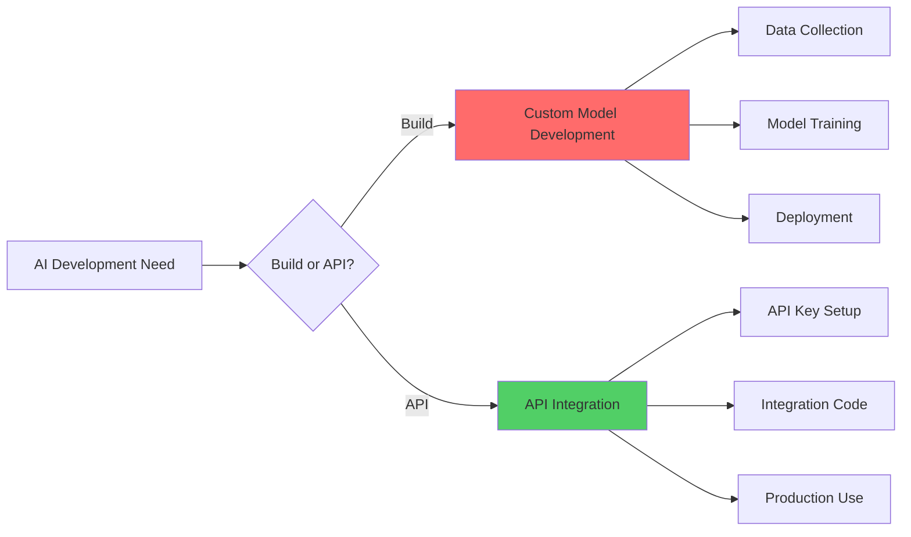
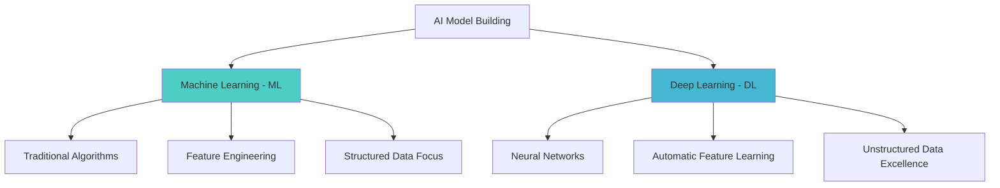
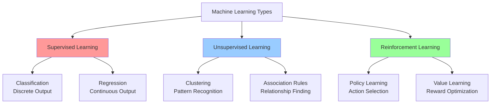
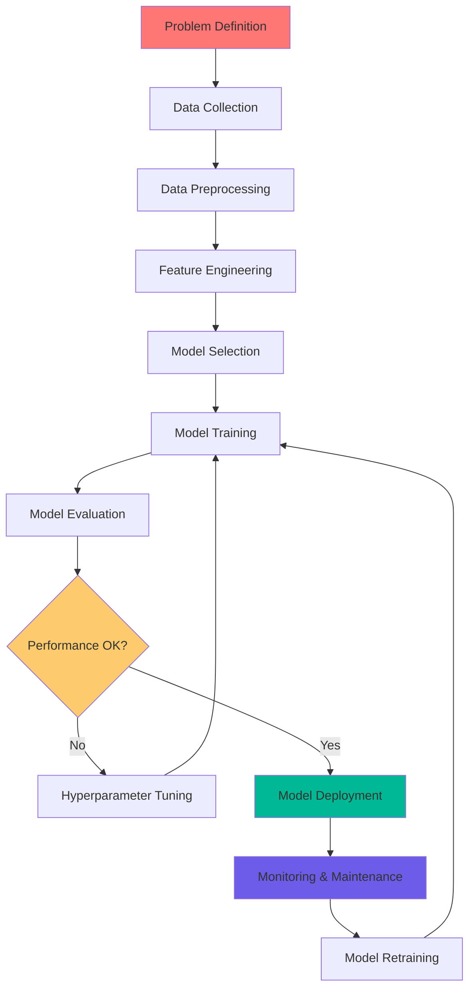
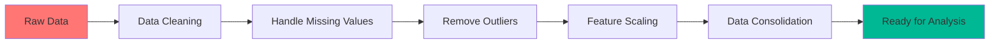
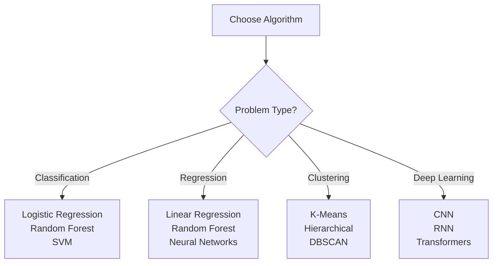
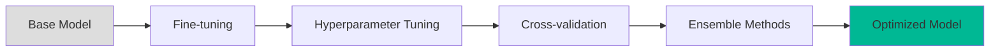

# How to Build AI Models: Workflow to ML & DL

> [!NOTE] 
> Key Insight **Machines only understand numbers** - this fundamental principle drives every decision in AI model development.

### Remember this diagram

---

## 🚀 Two Paths to AI: Build vs API

When approaching AI development, you have **two fundamental choices**:

### 1. **Build Your Own Model** (The Hard Way)

- **Pros**: Full control, customization, no API dependencies
- **Cons**: Requires extensive expertise, time, and computational resources
- **Best for**: Unique problems, sensitive data, long-term projects

### 2. **Use Pre-trained APIs** (The Easy Way)

- **Examples**: OpenAI GPT, Google Gemini, Anthropic Claude, Meta LLaMA
- **Analogy**: Like using Amazon Prime vs building your own delivery network
- **Best for**: Quick prototypes, standard use cases, MVP development

---

## ⚠️ API Drawbacks: Why Building Sometimes Wins

|**Issue**|**Description**|**Impact**|
|---|---|---|
|**Security**|API keys can be compromised|Data breaches, unauthorized access|
|**Reliability**|Dependent on external service uptime|Service outages affect your app|
|**Accuracy**|Generic models may not fit your specific domain|Poor performance on niche tasks|
|**Cost**|Pay-per-use pricing can escalate|Unpredictable scaling costs|

---

## 🤖 The Two Pillars of AI Model Building

---

## 📊 Machine Learning Types: The Holy Trinity

### 1. **Supervised Learning** 🎯

- **Definition**: Learning with labeled data where the output is known
- **Analogy**: Like learning with a teacher who shows you the correct answers

> [!TIP] 
> Supervised Learning Think of it like studying for an exam with answer keys - you learn patterns by seeing input-output pairs.

**Real-world Examples**:

- **Car Price Prediction**: Features (model, seats, engine) → Price
- **House Price Estimation**: Features (location, size, rooms) → Price
- **Email Spam Detection**: Email content → Spam/Not Spam
- **Medical Diagnosis**: Symptoms → Disease probability

### 2. **Unsupervised Learning** 🔍

- **Definition**: Finding hidden patterns in unlabeled data
- **Analogy**: Like being a detective finding clues without knowing what crime was committed

**Applications**:

- **Recommendation Systems**: Amazon's "Customers who bought this also bought..."
- **Customer Segmentation**: Grouping customers by behavior patterns
- **Market Basket Analysis**: "People who buy bread also buy butter"
- **Anomaly Detection**: Identifying unusual patterns in data

### 3. **Reinforcement Learning** 🎮

- **Definition**: Learning through trial and error with rewards and penalties
- **Analogy**: Like training a pet with treats and corrections

**Real-world Applications**:

- **Game AI**: AlphaGo, Chess engines
- **Autonomous Vehicles**: Learning to navigate safely
- **Trading Algorithms**: Learning optimal buy/sell strategies
- **Robotics**: Teaching robots to perform complex tasks

---

## 🔢 Output Types: Classification vs Regression

### **Classification** (Discrete/Categorical Output)

- **Examples**:
    - Email → [Spam, Not Spam]
    - Image → [Cat, Dog, Bird]
    - Customer → [High Risk, Low Risk]

### **Regression** (Continuous/Numerical Output)

- **Examples**:
    - House features → $450,000
    - Stock data → Future price
    - Weather data → Temperature

---

## 🔄 The AI Model Development Lifecycle

The machine learning lifecycle is a systematic process that includes business understanding, data collection, preprocessing, modeling, evaluation, and deployment phases.

---

## 📋 Detailed Lifecycle Breakdown

### **Phase 1: Problem Definition & Requirements** 🧠

- **Stakeholder interviews** and requirement gathering
- **Business objective** clarification
- **Success metrics** definition
- **Feasibility assessment**

> [!IMPORTANT] 
> ### Foundation Phase  
> This phase determines 80% of your project's success. Get it wrong here, and even perfect technical execution won't save you.

### **Phase 2: Data Collection** 📥

**Data Sources:**

|**Type**|**Examples**|**Pros**|**Cons**|
|---|---|---|---|
|**Public Data**|Kaggle, Government APIs, Open datasets|Free, readily available|Generic, may not fit your needs|
|**Private Data**|Internal databases, customer data|Specific to your domain|Expensive to collect, privacy concerns|
|**Real-time Data**|Streaming APIs, IoT sensors|Current, dynamic|Complex infrastructure needed|

### **Phase 3: Data Preprocessing** 🧹

The most **time-consuming phase** (typically 60-80% of project time):

**Step-by-step Process:**

1. **Structure Fix**: Rename columns, fix data types, add/drop columns
2. **Duplicate Removal**: Remove identical records
3. **Missing Value Handling**:
    - **Drop**: If >30% of data is missing
    - **Fill**: Use mean/median/mode (Central Tendency Measures)
4. **Outlier Treatment**:
    - **Detect**: Statistical methods (Z-score, IQR)
    - **Handle**: Drop, cap, or transform outliers
5. **Data Consolidation**:
    - **Merge**: Horizontal combination (requires common column)
    - **Append**: Vertical combination (requires same columns)

### **Phase 4: Feature Engineering & Analysis** 🔧

> [!TIP] 
> #### Feature Engineering **"Garbage in, garbage out"**
> The quality of your features determines model performance more than the algorithm choice.

**Key Tasks:**

- **Encoding**: Convert text to numbers (One-hot, Label encoding)
- **Feature Scaling**: Standardization/Normalization
- **Feature Selection**: Remove irrelevant features
- **Feature Creation**: Combine existing features meaningfully

**Example**: For employee retention prediction

- Raw: Experience (2 years), Salary ($50K), Role (Engineer)
- Engineered: Salary_per_year_experience ($25K), Role_encoded (1), Promotion_eligible (True)

### **Phase 5-7: Model Development** 🤖

**Algorithm Selection Considerations:**

### **Phase 8: Model Evaluation & Optimization ** 📊

**Common Metrics:**

|**Task Type**|**Metrics**|**When to Use**|
|---|---|---|
|**Classification**|Accuracy, Precision, Recall, F1-Score|Balanced/Imbalanced datasets|
|**Regression**|MAE, MSE, RMSE, R²|Continuous predictions|
|**Clustering**|Silhouette Score, Elbow Method|Unsupervised learning|

### **Phase 9-10: Deployment & Maintenance** 🚀

**Deployment Options:**

- **Cloud Platforms**: AWS SageMaker, Google AI Platform, Azure ML
- **Edge Deployment**: Mobile apps, IoT devices
- **On-premises**: Private servers, local infrastructure

**Monitoring Essentials:**

- **Performance Drift**: Model accuracy degrading over time
- **Data Drift**: Input data changing distribution
- **Concept Drift**: Target variable relationship changing

---

## 🎯 Feature Scaling: Why Numbers Need Normalization

**Problem**: Consider employee data:

- Experience: 2 years
- Salary: $75,000
- Age: 28 years

The machine gets confused by salary's large scale vs other features.

**Solution**: Feature Scaling

$$\text{Standardization: } z = \frac{x - \mu}{\sigma}$$

$$\text{Normalization: } x_{norm} = \frac{x - x_{min}}{x_{max} - x_{min}}$$

---

## 💼 Career Insights & Interview Prep

### **Role Difficulty Ranking:**

1. **Data Engineering** (Hardest) - Infrastructure & pipelines
2. **ML Engineering** - Similar to Data Scientist + deployment
3. **Data Scientist** - Modeling & analysis
4. **Data Analyst** (Easiest) - Reporting & dashboards

### **Common Interview Questions:**

> [!WARNING] 
> Interview Alert **Q**: 
> "What can cause a model to fail or lose accuracy?"
> 
> **A**: Insufficient data, wrong algorithm choice, data drift, overfitting, poor feature engineering, biased training data

**Key Technical Topics:**

- What is **standardization**? (Scaling features to standard distribution)
- What is **encoding**? (Converting categorical to numerical data)
- Explain **feature scaling** (Making features comparable in magnitude)
- Difference between **ML and DL**? (Traditional vs Neural approaches)

---

## 🔧 Advanced Topics: Fine-tuning & Model Optimization

**Fine-tuning** involves:

- **Transfer Learning**: Using pre-trained models as starting points
- **Hyperparameter Optimization**: Grid search, random search, Bayesian optimization
- **Ensemble Methods**: Combining multiple models for better performance
- **Cross-validation**: Robust model evaluation techniques

---

## 📈 Business Applications: Where AI Drives Value

**Industry Applications:**

|**Sector**|**Use Case**|**ML Type**|**Business Impact**|
|---|---|---|---|
|**E-commerce**|Recommendation Systems|Unsupervised|↑ Sales, ↑ Customer retention|
|**Finance**|Fraud Detection|Supervised|↓ Losses, ↑ Security|
|**Healthcare**|Diagnosis Assistance|Supervised|↑ Accuracy, ↓ Costs|
|**Transportation**|Route Optimization|Reinforcement|↓ Time, ↓ Fuel costs|
|**Marketing**|Customer Segmentation|Unsupervised|↑ Conversion rates|

---

## 🎯 Key Takeaways

> [!SUCCESS] 
> Remember These Fundamentals
> 
> 1. **Data Quality > Algorithm Choice** - Clean, relevant data beats fancy algorithms
> 2. **Start Simple** - Begin with basic models before going complex
> 3. **Business First** - Always align technical solutions with business goals
> 4. **Continuous Learning** - AI is iterative, not a one-time implementation
> 5. **Ethics Matter** - Consider bias, fairness, and societal impact

---

## 📚 Next Steps & Resources

**For Beginners:**

1. Learn Python basics and pandas for data manipulation
2. Practice on Kaggle competitions
3. Take online courses (Coursera ML Course, Fast.ai)

**For Intermediate:**

1. Master feature engineering techniques
2. Learn MLOps and deployment strategies
3. Contribute to open-source ML projects

**For Advanced:**

1. Research cutting-edge papers
2. Experiment with novel architectures
3. Build end-to-end ML systems

---

[^1]: The 70-30 or 80-20 rule for train-test split is a general guideline; actual ratios depend on dataset size and complexity.