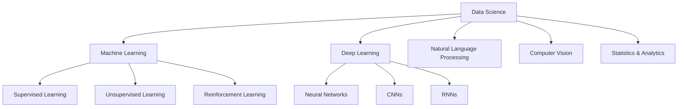
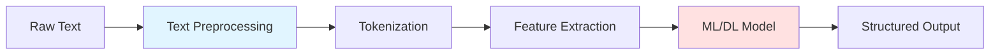
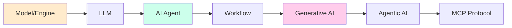
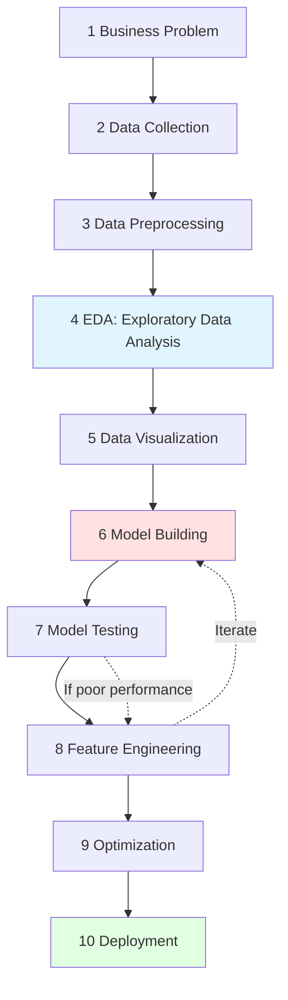
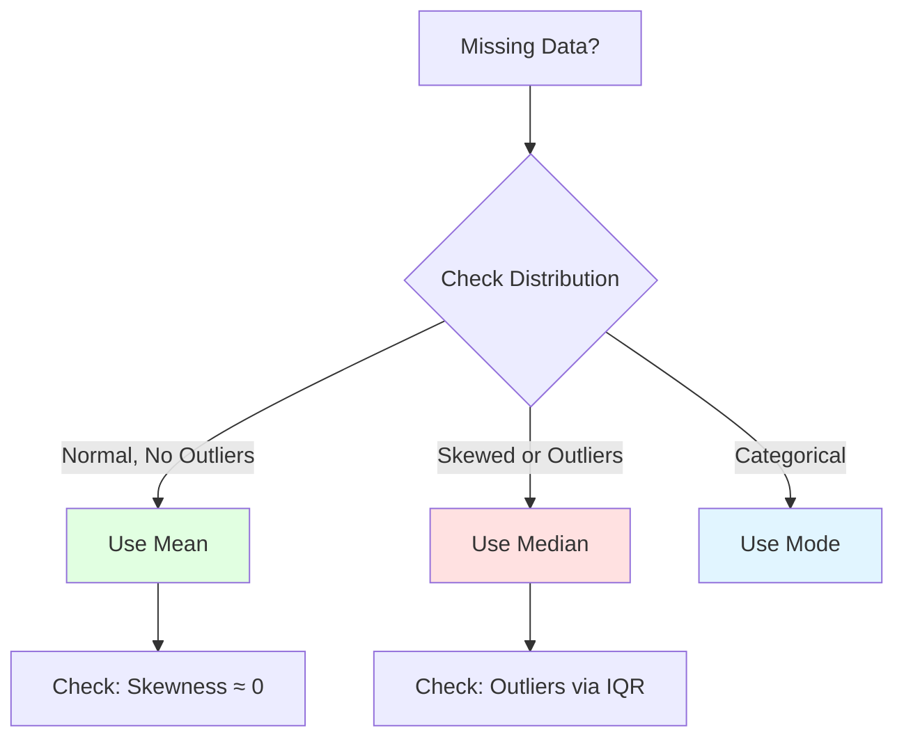
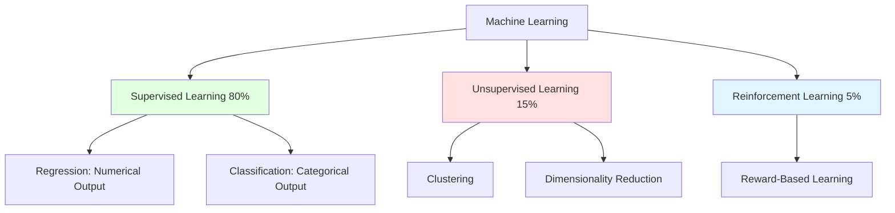
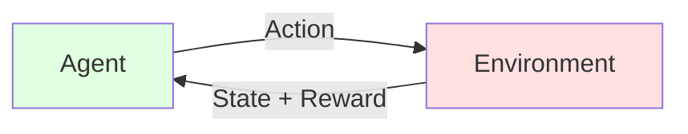
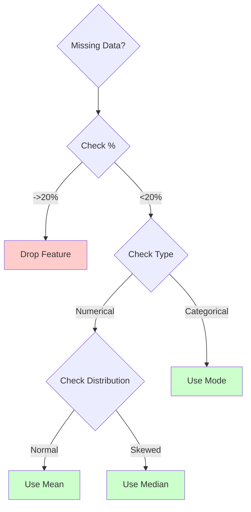

# Machine Learning Fundamentals

> [!NOTE] 
> These notes cover the foundational concepts of Machine Learning, Data Science workflow, and practical implementation techniques. The content is organized from basic concepts to advanced applications.

---

## Table of Contents

1. [Overview of Data Science & ML](#overview-of-data-science--ml)
2. [Natural Language Processing (NLP)](#natural-language-processing-nlp)
3. [Models and AI Architecture](#models-and-ai-architecture)
4. [Machine Learning Lifecycle](#machine-learning-lifecycle)
5. [Data Preparation](#data-preparation)
6. [Types of Machine Learning](#types-of-machine-learning)
7. [Practical Implementation](#practical-implementation)

---

## Overview of Data Science & ML

### Data Science Ecosystem



> [!IMPORTANT] 
> **Key Relationship**: Machine Learning and Deep Learning are subsets of Data Science. NLP can use either ML or DL techniques depending on the complexity of the task.

### Real-World Applications

|**Application**|**Technology Used**|**Example**|
|---|---|---|
|Product Recommendations|ML + NLP|Flipkart suggestion engine|
|AI Summaries|DL + NLP|Flipkart review summaries|
|Visual Q&A|ML + Computer Vision|PowerBI Q&A visuals|
|Conversational AI|All techniques|ChatGPT|

---

## Natural Language Processing (NLP)

### What is NLP?

**NLP** is the process of enabling computers to understand, interpret, and generate human language.

> [!TIP] **Analogy**: Think of NLP as teaching a computer to read and write like a human. Just as you learned grammar rules to understand language, NLP teaches machines patterns in text.

### NLP Pipeline



### NLP + ML vs NLP + DL

|**Aspect**|**NLP + ML**|**NLP + DL**|
|---|---|---|
|**Training Time**|Fast (minutes to hours)|Slow (hours to days)|
|**Data Required**|Less (~1K-10K samples)|More (~100K+ samples)|
|**Accuracy**|Good for simple tasks|Excellent for complex tasks|
|**Cost**|Low|High (GPU required)|
|**Use Case**|Spam detection, sentiment analysis|Text generation, translation|

**Example Workflow:**

1. **Raw Data**: User reviews and comments
2. **NLP Processing**: Clean text, remove noise, extract features
3. **Structured Data**: Sentiment scores, keywords
4. **ML/DL Model**: Classification or summarization
5. **Output**: Product recommendations or AI-generated summary

---

## Models and AI Architecture

### The Evolution of AI Systems



### Key Terms

- **Model/Engine**: The core algorithm (e.g., GPT model) - like a car engine
- **LLM** (Large Language Model): Pre-trained model on massive text data
- **AI Agent**: Application using the model (e.g., ChatGPT) - like the complete car
- **Generative AI**: Systems that create new content
- **Agentic AI**: AI that can take actions autonomously
- **MCP** (Model Context Protocol): Communication standard between AI systems[^1]

### Model Development Approaches

> [!IMPORTANT] 
> **90% of ML work uses traditional ML** due to:> 
> - Lower cost
> - Faster training
> - Sufficient accuracy for most problems
> 
> **10% uses Deep Learning** when:
> - Complex patterns needed (images, speech, text generation)
> - Large datasets available
> - High accuracy is critical

### GPT Model Example

**GPT (Generative Pre-trained Transformer)** is a model that:

1. Was trained on all publicly available text data
2. Learns patterns and relationships in language
3. Powers applications like ChatGPT

> [!NOTE] 
> **Model vs Application**: GPT is the model (engine), ChatGPT is the application (car). The same model can power multiple applications.

---

## Machine Learning Life-cycle

### Complete ML Workflow



### Detailed Phase Breakdown

#### **Phase 1-5: Exploratory Data Analysis (EDA)**

**Purpose**: Understand the data before modeling

1. **Business Problem**: Define what you're trying to predict
2. **Data Collection**: Gather relevant data
3. **Data Preprocessing**: Clean and prepare data
4. **Data Analysis**: Statistical examination
5. **Data Visualization**: Create charts and graphs

#### **Phase 6-10: Machine Learning / Deep Learning**

**Purpose**: Build, test, and deploy the model

6. **Model Building (Training)**: Select algorithm and train
7. **Model Testing**: Evaluate performance with measures
8. **Feature Engineering**: Improve input features
    - Standardization
    - Feature scaling
    - Normalization
9. **Optimization**: Fine-tune for better performance
10. **Deployment**: Put model into production

---

## Data Preparation

### Data Splitting Strategy

> [!IMPORTANT] **80:20 Rule**: The standard split ratio
> 
> - **80% Training Data**: Used to teach the model
> - **20% Test Data**: Used to evaluate the model's performance on unseen data

**Sampling Methods:**

- **Random Sampling**: Each data point has equal probability
- **Stratified Sampling**: Maintains class distribution
- **Convenient Sampling**: Based on availability (use cautiously)

```python
# Example: Train-Test Split
from sklearn.model_selection import train_test_split

X_train, X_test, y_train, y_test = train_test_split(
    X, y, test_size=0.2, random_state=42
)
```

### Feature Scaling (Normalization)

**Why Scale?** To remove bias from features with different ranges.

**Example Problem:**

|Gender|Height|Weight|
|---|---|---|
|?|165|80|
|?|175|75|
|?|180|80|
|?|150|50|

==Height values (150-180) dominate weight values (50-80)== - the model might give too much importance to height!

**Solution: Normalize/Scale Features**

$$ \text{Normalized Value} = \frac{x - x_{min}}{x_{max} - x_{min}} $$

> [!TIP] 
> **Analogy**: Imagine comparing apples to watermelons by weight alone - watermelons would always "win". Scaling puts both on the same 0-1 scale so we can fairly compare their other properties.

### Handling Missing Data

**Common Strategies:**

1. **Mean Imputation**: Replace with average (for normally distributed data)
2. **Median Imputation**: Replace with median (for skewed data with outliers)
3. **Mode Imputation**: Replace with most frequent value (for categorical data)

**Decision Flow:**



### Practical Example: Handling Missing Values

**Dataset: Titanic Passenger Data**

```python
# Check missing values
df.isnull().sum()
# Age: 15 missing (7.5%)
# Fare: 9 missing (4.5%)

# For Age (normally distributed, minimal outliers)
df['Age'].fillna(df['Age'].mean(), inplace=True)

# For Fare (skewed with outliers)
# Step 1: Check distribution
df['Fare'].describe()
# Skewness present, use median

# Step 2: Remove outliers using IQR method
Q1 = df['Fare'].quantile(0.25)  # 12.075
Q3 = df['Fare'].quantile(0.75)  # 56.460
IQR = Q3 - Q1
lower_bound = Q1 - (1.5 * IQR)  # -54.0
upper_bound = Q3 + (1.5 * IQR)  # 122.0

# Step 3: Filter outliers and calculate median
df_clean = df[(df['Fare'] >= lower_bound) & (df['Fare'] <= upper_bound)]
median_fare = df_clean['Fare'].median()  # 27.98

# Step 4: Fill missing values
df['Fare'].fillna(median_fare, inplace=True)
```

> [!NOTE] 
> **IQR (Interquartile Range) Method**: A statistical technique to identify outliers
> 
> - Values below Q1 - 1.5 × IQR or above Q3 + 1.5 × IQR are considered outliers
> - Helps in robust estimation of central tendency

---

## Types of Machine Learning

### ML Algorithm Classification



### 1. Supervised Learning (80% of ML Usage)

**Definition**: Learning from **labeled data** where output is known.

#### A. Regression (Numerical Prediction)

**Purpose**: Predict continuous numerical values

**Example Use Cases:**

- Weather forecasting (temperature in °C)
- House price prediction
- Stock price prediction

**Example:**

|Bedrooms|Age|Area (sqft)|→|**Price**|
|---|---|---|---|---|
|3|5|1500|→|$250,000|
|4|10|2000|→|$350,000|

$$ \text{Price} = \beta_0 + \beta_1(\text{Bedrooms}) + \beta_2(\text{Age}) + \beta_3(\text{Area}) $$

#### B. Classification (Categorical Prediction)

**Purpose**: Predict discrete categories/classes

**Example Use Cases:**

- Spam email detection (Spam/Not Spam)
- Disease diagnosis (Yes/No)
- Image recognition (Cat/Dog/Bird)

**Example:**

|Email Content Features|→|**Class**|
|---|---|---|
|"Win money now!!!"|→|Spam|
|"Meeting at 3pm"|→|Not Spam|

---

### 2. Unsupervised Learning (15% of ML Usage)

**Definition**: Learning from **unlabeled data** where output is unknown.

#### A. Clustering

**Purpose**: Group similar data points together

**Example Use Cases:**

- Customer segmentation
- YouTube video recommendations
- Instagram content grouping

> [!TIP] **Analogy**: Like organizing your closet - you naturally group similar clothes together (shirts, pants, etc.) without anyone telling you how to categorize them.

**How YouTube Uses Clustering:**

1. Analyzes your watch history
2. Groups similar videos together
3. Recommends videos from clusters you engage with

#### B. Dimensionality Reduction

**Purpose**: Reduce number of features while retaining information

**Technique**: **PCA (Principal Component Analysis)**

**Example:**

- Dataset with 100 features → Reduced to 10 most important features
- Speeds up training
- Reduces overfitting
- Easier visualization

$$ \text{Variance Retained} = \frac{\sum \lambda_{\text{selected}}}{\sum \lambda_{\text{total}}} \times 100% 
$$

---

### 3. Reinforcement Learning (5% of ML Usage)

**Definition**: Learning through **trial and error** with rewards and penalties.

**Key Concepts:**

- **Agent**: The learner (e.g., robot, game player)
- **Environment**: The world the agent interacts with
- **Action**: Choices the agent makes
- **Reward**: Feedback (+positive or -negative)
- **Policy**: Strategy the agent learns

**Example Use Cases:**

- Robotics (learning to walk)
- Self-driving cars
- Game playing (AlphaGo, Chess engines)



> [!NOTE] 
> **Analogy**: Like training a dog - it tries different actions, and you reward good behavior (treats) and discourage bad behavior (no treat). Over time, the dog learns the optimal actions.

---

## Practical Implementation

### Use Case: House Price Prediction

#### **Approach 1: Excel (Not Recommended)**

```
Price = (Bedrooms × 50000) + (Area × 100) - (Age × 2000)
```

**Limitations:**

- ❌ Too simplistic
- ❌ Can't capture complex relationships
- ❌ No learning from data patterns
- ❌ Fixed formula doesn't adapt

#### **Approach 2: ML Model (Recommended)**

**Advantages:**

- ✅ Learns from data
- ✅ Captures non-linear relationships
- ✅ Adapts to new patterns
- ✅ Higher accuracy
- ✅ More parameters considered automatically

**Example Code:**

```python
from sklearn.linear_model import LinearRegression
from sklearn.model_selection import train_test_split

# Prepare data
X = df[['Bedrooms', 'Age', 'Area', 'Location_Score', 'School_Nearby']]
y = df['Price']

# Split data
X_train, X_test, y_train, y_test = train_test_split(
    X, y, test_size=0.2, random_state=42
)

# Train model
model = LinearRegression()
model.fit(X_train, y_train)

# Evaluate
score = model.score(X_test, y_test)
print(f"Model R² Score: {score:.2f}")

# Predict
new_house = [[3, 5, 1500, 8, 1]]  # Features
predicted_price = model.predict(new_house)
print(f"Predicted Price: ${predicted_price[0]:,.2f}")
```

---

## Data Preprocessing - Detailed Example

### Titanic Dataset Analysis

**Dataset Structure:**

|Age|Fare|Sex|Embarked|Pclass|Survived|
|---|---|---|---|---|---|
|41.0|83.94|male|n|1|0|
|33.3|54.00|female|C|3|0|
|NaN|54.82|male|Q|3|0|

### Step-by-Step Preprocessing

#### 1. **Check Data Info**

```python
df.info()
# Age: 185 non-null (15 missing)
# Fare: 191 non-null (9 missing)
# Sex: 200 non-null (categorical)
# Embarked: 200 non-null (categorical)
```

#### 2. **Analyze Missing Data Percentage**

```python
(df.isnull().sum() / len(df)) * 100
# Age: 7.5%
# Fare: 4.5%
```

> [!WARNING] 
> **Rule of Thumb**: If >20% data is missing for a feature, consider dropping the feature entirely rather than imputing.

#### 3. **Handle Age Column**

```python
# Check distribution
df['Age'].describe()
# mean: 34.33, median: 35.1

# Check skewness
df['Age'].skew()  # 0.029 (nearly 0 = normal distribution)

# Check kurtosis
df['Age'].kurt()  # -0.076 (close to 0 = no heavy tails)

# Visualize
import matplotlib.pyplot as plt
import seaborn as sns

plt.figure(figsize=(8, 6))
sns.histplot(df['Age'], kde=True)
plt.title("Age Distribution")
plt.show()
```

**Decision**: Use **mean** (no significant outliers, normal distribution)

```python
df['Age'].fillna(df['Age'].mean(), inplace=True)
```

#### 4. **Handle Fare Column**

```python
# Check distribution
df['Fare'].describe()
# mean: 46.88, median: 30.32, max: 579.0 (outlier!)

# Visualize
sns.histplot(df['Fare'], kde=True)
# Right-skewed distribution visible

# Identify outliers using IQR
Q1 = df['Fare'].quantile(0.25)  # 12.075
Q3 = df['Fare'].quantile(0.75)  # 56.460
IQR = Q3 - Q1  # 44.385

lower = Q1 - (1.5 * IQR)  # -54.0
upper = Q3 + (1.5 * IQR)  # 122.0

# Filter outliers
df_clean = df[(df['Fare'] >= lower) & (df['Fare'] <= upper)]

# Recalculate mean without outliers
clean_mean = df_clean['Fare'].mean()  # 34.72

# Fill missing values
df['Fare'].fillna(clean_mean, inplace=True)
```

**Decision**: Use **mean after removing outliers** (skewed distribution with extreme values)

---

## Key Statistical Concepts

### Skewness

**Definition**: Measure of asymmetry in data distribution

$$ \text{Skewness} = \frac{E[(X - \mu)^3]}{\sigma^3} $$

- **Skewness ≈ 0**: Symmetric (normal) distribution → Use **mean**
- **Skewness > 0**: Right-skewed (tail on right) → Use **median**
- **Skewness < 0**: Left-skewed (tail on left) → Use **median**

### Kurtosis

**Definition**: Measure of "tailedness" (outliers) in distribution

- **Kurtosis ≈ 0**: Normal distribution (few outliers)
- **Kurtosis > 0**: Heavy tails (many outliers)
- **Kurtosis < 0**: Light tails (few outliers)

### IQR (Interquartile Range) Method

**Formula:**

$$ \begin{align} \text{IQR} &= Q3 - Q1 \ \text{Lower Bound} &= Q1 - 1.5 \times \text{IQR} \ \text{Upper Bound} &= Q3 + 1.5 \times \text{IQR} \end{align} $$

**Purpose**: Identify and handle outliers robustly

---

## Summary & Best Practices

### ✅ Do's

- [ ] Always perform EDA before modeling
- [ ] Check for missing data and handle appropriately
- [ ] Scale/normalize features with different ranges
- [ ] Use 80:20 train-test split as default
- [ ] Visualize distributions before choosing imputation method
- [ ] Remove outliers when using mean imputation
- [ ] Use cross-validation for robust evaluation
- [ ] Document your preprocessing steps

### ❌ Don'ts

- [ ] Don't skip data visualization
- [ ] Don't use mean when data has significant outliers
- [ ] Don't ignore missing data patterns
- [ ] Don't use the same model for all problems
- [ ] Don't forget to scale features
- [ ] Don't test on training data
- [ ] Don't ignore correlation between features

---

## Quick Reference

### When to Use Which ML Type?

|**Problem Type**|**ML Category**|**Example**|
|---|---|---|
|Predict number|Supervised: Regression|House prices|
|Predict category|Supervised: Classification|Spam detection|
|Find patterns|Unsupervised: Clustering|Customer groups|
|Reduce features|Unsupervised: PCA|100 → 10 features|
|Learn by doing|Reinforcement|Robot control|

### Missing Data Strategy



---

## Footnotes

[^1]: MCP (Model Context Protocol) is a standardized way for AI systems to communicate context and maintain consistency across interactions. It's becoming increasingly important in multi-agent AI systems.

---

> [!CAUTION] 
> **Common Pitfalls to Avoid:**
> 
> 1. **Data Leakage**: Don't let test data influence training
> 2. **Overfitting**: Model performs well on training but poorly on test data
> 3. **Underfitting**: Model is too simple to capture patterns
> 4. **Ignoring Business Context**: Technical accuracy doesn't always mean business value
