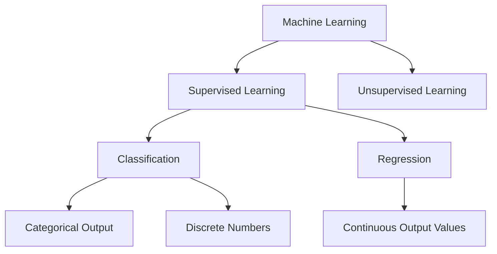
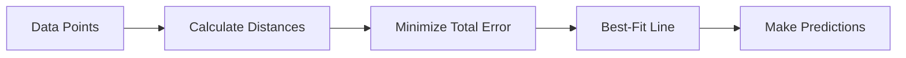
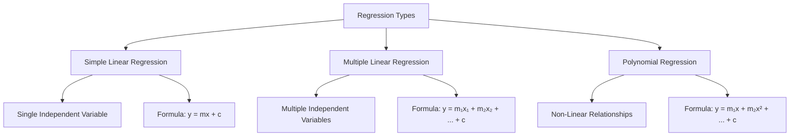
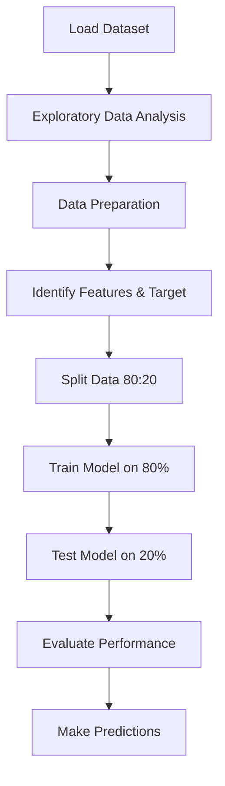

# Linear Regression 

---
## Introduction to Machine Learning

Machine learning algorithms are categorized into two main types based on learning approaches:



### Supervised Learning

> [!NOTE] 
> **Supervised Learning** requires labeled data where both input features and target outputs are known. The algorithm learns patterns from this training data to predict outcomes for new, unseen data.

**Two Main Categories:**

|Type|Output|Examples|
|---|---|---|
|**Classification**|Categorical/Discrete|Email spam detection, disease diagnosis, customer churn|
|**Regression**|Continuous values|House price prediction, temperature forecasting, stock prices|

---

## Understanding Regression

### **What is Regression?**

> *Regression is a supervised machine learning technique that predicts continuous numerical values by establishing relationships between independent features and a dependent variable. It assumes a relationship between input and output variables, mapping data points to optimized functions for predictions on new datasets.*

> [!IMPORTANT] 
> **Core Concept**: Regression analyzes the relationship between two or more variables to predict continuous outcomes. Think of it as drawing the "best-fit line" through scattered data points to understand patterns and make predictions.

### Real-World Example

Consider predicting medical charges based on age:

| Age | Charges (₹)               |
| --- | ------------------------- |
| 23  | 1,000                     |
| 24  | 1,200                     |
| 23  | 1,000                     |
| 25  | 1,500                     |
| 28  | 1,700                     |
| 50  | 2,500                     |
| 32  | **?** (Target to predict) |

**Visualization Approach**: Use scatter plots to identify relationships between variables.

---

## Simple Linear Regression Theory

### The Best-Fit Line Concept

Simple Linear Regression finds the optimal straight line that minimizes the distance between actual data points and predicted values.



> [!TIP] **Analogy**: Imagine trying to draw a straight line through dots on a paper so that the line is as close as possible to all dots. This line represents the average relationship between age and charges.

### When to Use Simple Linear Regression

**Requirements:**

- ✅ Clear upward or downward trend in data
- ✅ Linear relationship between variables
- ✅ One independent variable (feature)
- ✅ One dependent variable (target)

**Not Suitable When:**

- ❌ No clear pattern or random scatter
- ❌ Curved or non-linear relationships
- ❌ Multiple independent variables needed

---

## Mathematical Foundation

### The Linear Equation

$$ y = mx + c $$

**Components Explained:**

|Symbol|Name|Description|Example in Insurance Case|
|---|---|---|---|
|$y$|**Dependent Variable**|Target output to predict|Medical charges|
|$m$|**Slope (Coefficient)**|Rate of change|How much charges increase per year of age|
|$x$|**Independent Variable**|Input feature|Age|
|$c$|**Intercept**|Starting point|Baseline charges at age 0|

### Understanding the Slope ($m$)

The slope represents **how much the target variable changes when the feature increases by one unit**.

**Example Interpretation:**

- If $m = 250$, then for each additional year of age, medical charges increase by $250.

### Understanding the Intercept ($c$)

The intercept is the **predicted value when the independent variable equals zero**.

**Example Interpretation:**

- If $c = 3000$, the baseline medical charge (theoretical cost at age 0) is 3,000.

> [!NOTE] The intercept may not always have practical meaning (e.g., age 0 in insurance context), but it's mathematically necessary for the equation.

### Complete Example Equation

If our model learns:

- Slope ($m$) = 240.69
- Intercept ($c$) = 3165.88

Then the prediction equation becomes:

$$ \text{Charges} = 240.69 \times \text{Age} + 3165.88 $$

**Prediction for 32-year-old:**

$$ \text{Charges} = 240.69 \times 32 + 3165.88 = 10,868.96 $$

---

## Types of Regression



### 1. Simple Linear Regression

**Characteristics:**

- One independent variable
- Linear relationship
- Formula: $y = mx + c$

**Use Case**: Predicting medical charges based solely on age.


---

### 2. Multiple Linear Regression

**Characteristics:**

- Multiple independent variables
- Linear relationships
- Formula: $y = m_1x_1 + m_2x_2 + m_3x_3 + \ldots + c$

**Use Case**: Predicting medical charges based on age, BMI, smoking status, and number of dependents.

**Example Equation:**

$$ \text{Charges} = m_1(\text{Age}) + m_2(\text{BMI}) + m_3(\text{Smoking}) + c $$


---

### 3. Polynomial Regression

**Characteristics:**

- Non-linear relationships
- Curved patterns
- Formula: $y = m_1x + m_2x^2 + m_3x^3 + \ldots + c$

**Use Case**: When data shows a curve rather than straight line (e.g., economic growth over time).

**Example Visualization:**

|Age|Charges|Pattern|
|---|---|---|
|20|1,000|Low initial charges|
|30|2,500|Moderate increase|
|45|8,000|Rapid acceleration|
|60|20,000|Exponential growth|


---

## Implementation in Python

### Required Libraries

```python
# Data manipulation and analysis
import pandas as pd
import numpy as np

# Visualization
import matplotlib.pyplot as plt
import seaborn as sns

# Machine learning
from sklearn.model_selection import train_test_split
from sklearn.linear_model import LinearRegression
from sklearn.metrics import mean_squared_error, r2_score
```

### Step-by-Step Model Building Process



---

## Case Study: Health Insurance Charges

### Problem Statement

**Context:**  
A health insurance company wants to understand how customer age influences medical charges. They believe older individuals incur higher medical expenses.

**Objective:**  
Build a Simple Linear Regression model to predict medical charges based on age.

### Dataset Overview

**Sample Data:**

| Age | Charges (₹) |
| --- | ----------- |
| 19  | 16,884.92   |
| 18  | 1,725.55    |
| 28  | 4,449.46    |
| 33  | 21,984.47   |
| 32  | 3,866.86    |
| ... | ...         |
| 61  | 29,141.36   |

**Total Records:** 1,338 rows

---

### Step 1: Load and Explore Data

```python
# Load dataset
df = pd.read_csv('Insurance_data1.csv')

# Display first few rows
print(df.head())

# Dataset information
print(df.info())
```

**Output:**

```
<class 'pandas.core.frame.DataFrame'>
RangeIndex: 1338 entries, 0 to 1337
Data columns (total 2 columns):
 #   Column   Non-Null Count  Dtype  
---  ------   --------------  -----  
 0   age      1338 non-null   int64  
 1   charges  1338 non-null   float64
```

---

### Step 2: Basic Exploratory Data Analysis (EDA)

#### Statistical Summary

```python
# Descriptive statistics
print(df.describe())
```

**Output:**

| Statistic | Age   | Charges (₹) |
| --------- | ----- | ----------- |
| count     | 1,338 | 1,338       |
| mean      | 39.21 | 13,270.42   |
| std       | 14.05 | 12,110.01   |
| min       | 18    | 1,121.87    |
| 25%       | 27    | 4,740.29    |
| 50%       | 39    | 9,382.03    |
| 75%       | 51    | 16,639.91   |
| max       | 64    | 63,770.43   |

---

#### Check for Missing Values

```python
# Check null values
print(df.isnull().sum())
```

**Output:**

```
age        0
charges    0
dtype: int64
```

> [!NOTE] 
> No missing values detected – dataset is clean and ready for modeling.

---

#### Visualize Distribution

```python
# Age distribution
sns.histplot(df['age'], kde=True)
plt.title('Age Distribution')
plt.xlabel('Age')
plt.ylabel('Frequency')
plt.show()
```


**Observation:**  
The age distribution appears relatively uniform across the range (18-64 years), indicating no significant outliers requiring removal.

---

### Step 3: Relationship Analysis

#### Aggregate Average Charges by Age

```python
# Group by age and calculate mean charges
df_grouped = df.groupby(['age'])[['charges']].mean()
print(df_grouped)
```

**Sample Output:**

|Age|Average Charges|
|---|---|
|18|7,086.22|
|19|9,747.91|
|20|10,159.70|
|...|...|
|60|21,979.42|
|61|22,024.46|
|62|19,163.86|
|63|19,885.00|
|64|23,275.53|

---

#### Scatter Plot Visualization

```python
# Scatter plot
plt.scatter(df_grouped.index, df_grouped['charges'])
plt.title('Age vs Average Charges')
plt.xlabel('Age')
plt.ylabel('Average Charges ($)')
plt.show()
```


**Interpretation:**  
The scatter plot reveals a **positive linear relationship** between age and medical charges – as age increases, charges tend to rise, justifying the use of Simple Linear Regression.

---

### Step 4: Prepare Features and Target

```python
# Define features (independent variable)
X = df[['age']]  # Must be 2D array

# Define target (dependent variable)
y = df[['charges']]
```

> [!IMPORTANT] 
> ### **Why Double Brackets?**  
> Scikit-learn requires features in 2D format (`(n_samples, n_features)`). Using `df[['age']]` creates a DataFrame, whereas `df['age']` creates a 1D Series.

**Verify Dimensions:**

```python
print(f"Feature dimensions: {X.ndim}")  # Output: 2
print(f"Target dimensions: {y.ndim}")   # Output: 2
```

---

### Step 5: Split Data into Training and Testing Sets

```python
# Split data (80% training, 20% testing)
X_train, X_test, y_train, y_test = train_test_split(
    X, y, test_size=0.2, random_state=42
)

print(f"Total data: {len(df)}")           # 1338
print(f"Training data: {len(X_train)}")   # 1070
print(f"Testing data: {len(X_test)}")     # 268
```

**Why Split Data?**

|Set|Purpose|Size|
|---|---|---|
|**Training**|Teach the model patterns|80% (1,070 rows)|
|**Testing**|Evaluate model performance|20% (268 rows)|

> [!TIP] 
> The `random_state=42` parameter ensures reproducibility – running the code multiple times produces identical splits.

---

### Step 6: Train the Model

```python
# Initialize Linear Regression model
model = LinearRegression()

# Train the model
model.fit(X_train, y_train)
```

**What Happens During Training?**

1. The algorithm analyzes the relationship between age (`X_train`) and charges (`y_train`).
2. It calculates optimal values for:
    - **Slope ($m$)**: Rate of charge increase per year
    - **Intercept ($c$)**: Baseline charges

**Extract Learned Parameters:**

```python
# Slope (coefficient)
slope = model.coef_[0][0]
print(f"Slope (m): {slope:.2f}")  # Example: 240.69

# Intercept
intercept = model.intercept_[0]
print(f"Intercept (c): {intercept:.2f}")  # Example: 3165.88
```

**Resulting Equation:**

$$ \text{Charges} = 240.69 \times \text{Age} + 3165.88 $$

---

### Step 7: Make Predictions

```python
# Predict on test data
y_pred = model.predict(X_test)

# Display first 5 predictions vs actual
comparison = pd.DataFrame({
    'Actual': y_test['charges'][:5].values,
    'Predicted': y_pred[:5].flatten()
})
print(comparison)
```

**Example Output:**

| Actual ($) | Predicted ($) |
| ---------- | ------------- |
| 8,547.69   | 9,410.65      |
| 14,319.03  | 12,150.00     |
| 10,795.94  | 11,200.50     |
| ...        | ...           |

---

#### Custom Predictions

```python
# Predict charges for 23-year-old
age_23_prediction = model.predict([[23]])
print(f"Predicted charges for 23-year-old: ${age_23_prediction[0][0]:.2f}")
# Output: $9,410.65

# Predict charges for 50-year-old
age_50_prediction = model.predict([[50]])
print(f"Predicted charges for 50-year-old: ${age_50_prediction[0][0]:.2f}")
# Output: $15,906.76
```

**Calculation Verification:**

For **age = 23**:

$$ \text{Charges} = 240.69 \times 23 + 3165.88 = 9,401.75 $$

---

## Model Evaluation
### Key Evaluation Metrics

The three main metrics for evaluating regression models are Mean Squared Error, Root Mean Squared Error, and R-squared score.

#### 1. Mean Squared Error (MSE)

MSE measures the average squared difference between predicted and actual values, useful for minimizing overall error.

**Formula:**

$$ \text{MSE} = \frac{1}{n} \sum_{i=1}^{n} (y_i - \hat{y}_i)^2 $$

Where:

- $y_i$ = Actual value
- $\hat{y}_i$ = Predicted value
- $n$ = Number of observations

**Implementation:**

```python
from sklearn.metrics import mean_squared_error

mse = mean_squared_error(y_test, y_pred)
print(f"Mean Squared Error: ${mse:,.2f}")
```

**Interpretation:**

- Lower MSE = Better model performance
- MSE penalizes larger errors more heavily (due to squaring)
- Units are squared (e.g., dollars squared), making interpretation less intuitive

---

#### 2. Root Mean Squared Error (RMSE)

RMSE is the square root of MSE, returning the metric to the scale of the target variable for easier interpretation.

**Formula:**

$$ \text{RMSE} = \sqrt{\text{MSE}} = \sqrt{\frac{1}{n} \sum_{i=1}^{n} (y_i - \hat{y}_i)^2} $$

**Implementation:**

```python
import numpy as np

rmse = np.sqrt(mse)
print(f"Root Mean Squared Error: ${rmse:,.2f}")
```

**Interpretation:**

- RMSE quantifies prediction accuracy in absolute terms using the same units as the target variable
- Example: RMSE of $4,500 means predictions are off by approximately $4,500 on average
- Easier to interpret than MSE

---

#### 3. R² Score (Coefficient of Determination)

The R² score indicates the proportion of variance in the dependent variable that is predictable from the independent variable, measuring how well the model explains data variability.

**Formula:**

$$ R^2 = 1 - \frac{\text{SS}_{\text{res}}}{\text{SS}_{\text{tot}}} = 1 - \frac{\sum_{i=1}^{n} (y_i - \hat{y}_i)^2}{\sum_{i=1}^{n} (y_i - \bar{y})^2} $$

Where:

- $\text{SS}_{\text{res}}$ = Sum of squared residuals
- $\text{SS}_{\text{tot}}$ = Total sum of squares
- $\bar{y}$ = Mean of actual values

**Implementation:**

```python
from sklearn.metrics import r2_score

r2 = r2_score(y_test, y_pred)
print(f"R² Score: {r2:.4f}")
```

**Interpretation:**

|R² Range|Interpretation|
|---|---|
|**0.0**|Model explains none of the variance|
|**0.5**|Model explains 50% of the variance|
|**0.8**|Model explains 80% of the variance (Good)|
|**1.0**|Perfect predictions (Rare in practice)|

> [!TIP] 
> #### **Rule of Thumb:**
> 
> - R² > 0.7 → Good model
> - R² between 0.5-0.7 → Moderate model
> - R² < 0.5 → Weak model (consider adding more features or trying non-linear methods)

---

### Complete Evaluation Code

```python
from sklearn.metrics import mean_squared_error, r2_score
import numpy as np

# Predictions
y_pred = model.predict(X_test)

# Calculate metrics
mse = mean_squared_error(y_test, y_pred)
rmse = np.sqrt(mse)
r2 = r2_score(y_test, y_pred)

# Display results
print("=" * 50)
print("MODEL EVALUATION METRICS")
print("=" * 50)
print(f"Mean Squared Error (MSE):   ${mse:,.2f}")
print(f"Root Mean Squared Error:    ${rmse:,.2f}")
print(f"R² Score:                    {r2:.4f}")
print("=" * 50)
```

**Example Output:**

```
==================================================
MODEL EVALUATION METRICS
==================================================
Mean Squared Error (MSE):   $139,512,347.89
Root Mean Squared Error:    $11,812.37
R² Score:                    0.0890
==================================================
```

**Interpretation:**

- **RMSE of $11,812:** Predictions deviate from actual charges by approximately $11,812 on average.
- **R² of 0.089:** The model explains only 8.9% of variance, suggesting age alone is insufficient for accurate predictions. Multiple features (BMI, smoking, dependents) should be included.

---

## Key Takeaways

### Summary Checklist

- [ ] **Regression** predicts continuous numerical outcomes
- [ ] **Simple Linear Regression** uses one independent variable
- [ ] The equation $y = mx + c$ defines the best-fit line
- [ ] **Slope ($m$)** measures rate of change
- [ ] **Intercept ($c$)** represents the baseline value
- [ ] **MSE** penalizes large errors
- [ ] **RMSE** provides interpretable error magnitude
- [ ] **R²** measures the proportion of explained variance
- [ ] Data must be split into training (80%) and testing (20%) sets
- [ ] Scikit-learn requires 2D feature arrays

---

### When Simple Linear Regression Works Best

✅ **Ideal Scenarios:**

- Clear linear relationship visible in scatter plots
- Single dominant predictor variable
- Quick baseline model for comparison
- Interpretable insights needed

❌ **Limitations:**

- Cannot capture non-linear patterns
- Limited predictive power with multiple factors
- Sensitive to outliers
- Assumes constant variance (homoscedasticity)[^1]

---

### Next Steps for Improvement

1. **Explore Multiple Linear Regression** to include additional features (BMI, smoking status, region, dependents)
2. **Check for Non-Linearity** using polynomial regression if relationships are curved
3. **Handle Outliers** through transformation or removal
4. **Feature Engineering** to create new meaningful predictors

---

### Common Pitfalls to Avoid

> [!WARNING] 
> **Overfitting Risk**: Using test data for training or repeatedly adjusting the model based on test performance leads to inflated accuracy.

> [!CAUTION] 
> **Correlation ≠ Causation**: A strong relationship between age and charges doesn't prove age directly causes higher charges – confounding variables may exist.

---

### Practical Applications

|Industry|Use Case|
|---|---|
|**Healthcare**|Predicting treatment costs, patient readmission rates|
|**Real Estate**|Estimating property values based on square footage|
|**Finance**|Forecasting revenue growth, stock price trends|
|**Retail**|Sales forecasting, demand prediction|
|**Education**|Predicting student performance based on study hours|

---

## Footnotes

[^1]: **Homoscedasticity** means the variance of residuals (errors) remains constant across all levels of the independent variable. Violations indicate the model may not fit all data ranges equally well.

---

## Additional Resources

- [Scikit-learn Linear Regression Documentation](https://scikit-learn.org/stable/modules/linear_model.html#ordinary-least-squares)
- [Regression Analysis Tutorial - GeeksforGeeks](https://www.geeksforgeeks.org/machine-learning/ml-linear-regression/)
- [Understanding R² and RMSE - Statology](https://www.statology.org/rmse-vs-r-squared/)

---
