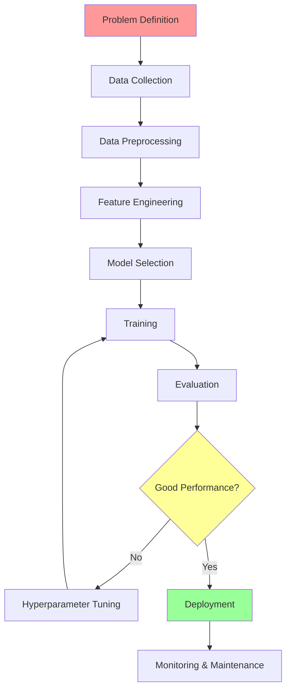

# How to make AI models (ML, DL,..)

there are possibly 2 ways 
1. create / building your own Model (oldest way) (hard way)
2. By using API (Pre-Train models) (API keys, / secrets) (easy way)  (GTP / Llma / Gimini /Claude : API keys)

api example (amazon / YouTube accounts and access)

---
application of gen ai
1. chatgpt

---
drawbacks of APIs
1. security
2. reliability
3. accuracy

---
Creating Ai Model

we have 2 choices when it comess to building a model
1. ML
2. DL

Types of ML
1. supervised = Labelled data output is known
2. unsupervised = Un-Labelled data output is Unknown
3. reinforcement = reward / panality

Type of output
1. discrete classification numeric
2. continues reggration 

example: car price prediction model

use features  like car model , seats , engine, etc  

historical data, known data 

can be sloved using suprviced learning and reggrasion

example 2: house price predictors

example 3: shoe size predictor

### supervised learning

---

### Un-supervised learning

pattern recognition / recognition engine / algorithm  

example : amazon recommendation / swiggy / zomato messages/ notification

---
interview question : what kind of model can we use to fix a specific model 

research about company as data scientist / analyst

how to be useful to them

---

example: swiggy / zomato = maps time of delivery
example 2 : Reels (new content every time)

---
common application of all models: Business

---
## Life cycle of AI model creation or Data science project

>[!NOTE]
> Machine only understand numbers

1.  data definition :/ Understanding /  Requirement / brain storming / interview with stakeholders / serways/ Documentation
2.  data collection: data sources : 
	1. public : online cloud data (SQL database) offile: CSV etc 
	2. privet data: offline CSV Cloud csv

3. Data preparation / prepossessing: 
	1. example: selecting an employee candidate using there CVs, ATS Tool or critaria (removing outliers or non deseving candidate)
	2. Sequence : fixing Rows and columns (rename / drop / change data types/ addition rows and columns drops  ) -> Drop duplicates -> null values (drop (record or drop when you have more then 30% of data missing percentages of  recorads total record/ total values x 100) or fill (logic CTM central tentency mesure)) -> Outliers (Drop or ignore or replace outliers (replace with mean median mod (Centrel tendency measure)))    -> consolidation of data (combind data, merage (horizontal/ condiation atlest one common column) or append (vertical / equal number of columns with same data) )
	3. Analysis or visualisation or data Exploration: 
		1. Encoding (convert text data to numeric data) and decoding data 
	4. Model Training:
		1. model selection / Algorithm (step by step instruction / or predefined set of instructions) 
			1. Classificationg algo
			2. regration algo
	5. Model testing:
		1. performance / accuracy
	6. Model selection / optimisation
	7. Deployment

numerical data (Preprocessing step if known earlier or in data exploration )
standardisation / feature scaling
example: we have 3 column : experience role salary : base of these columns what is the life span of employee in the company
machine confusion on salary (to fix  these issues we do feature scaling and standardisation)

---

communication and leadership

example:

---
Interview: what can lead to fail model or lose accuracy
Answers: model data is insufficient , wrong algo , 
what is standardisation / what is encoding / feature scaling

---

Data Engineering hardest
Data Scientist 
data Analyst easyest
ML engineering similer to DS

---

Fine tuning models 
example:  
