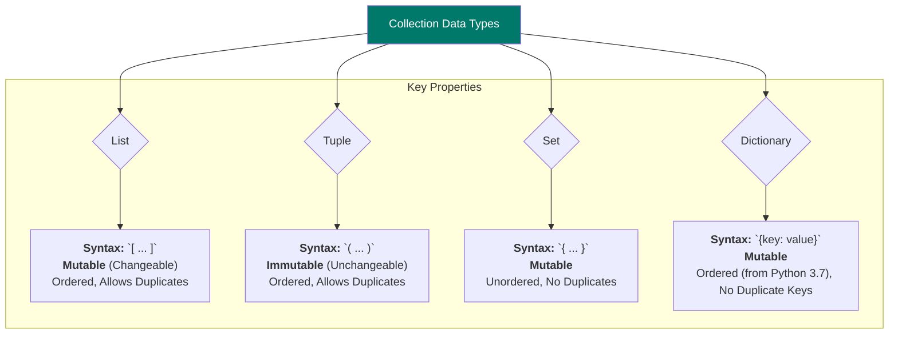

# 📚 My Notes: Week 2, Day 6 - Advanced Strings & Intro to Lists

**📅 Date:** July 8th, 2025
**🎯 Today's Goal:** Master built-in string methods and understand the first collection data type: the List.

---

## Part 1: Advanced String Operations (String Methods)

We started today's class by continuing our exploration of strings, moving from basic slicing to powerful built-in methods. These methods help us analyze and manipulate strings easily.

### ► Key String Methods

Here’s a summary of the most useful methods we covered:

| Method | What It Does | My Example Code |
| :--- | :--- | :--- |
| `len()` | **Calculates the total length** (number of characters) of a string. | `len("Riyan")` → `5` |
| `.lower()` | Converts the entire string to **lowercase**. | `"RIYAN".lower()` → `"riyan"` |
| `.upper()` | Converts the entire string to **uppercase**. | `"riyan".upper()` → `"RIYAN"` |
| `.title()` | Converts the string to **Title Case** (first letter of each word is uppercase). | `"riyan nazeer".title()` → `"Riyan Nazeer"` |
| `.capitalize()` | Capitalizes **only the first letter** of the entire string. | `"riyan nazeer".capitalize()` → `"Riyan nazeer"` |
| `.count('char')`| **Counts how many times** a specific character or substring appears. | `"banana".count('a')` → `3` |
| `.strip('char')`| **Removes specified characters** from the beginning and end of a string. | `"###Riyan###".strip('#')` → `"Riyan"` |
| `.split('char')`| **Breaks the string into a list** of smaller strings, using a separator. | `"riyan@sdhub.in".split('@')` → `['riyan', 'sdhub.in']` |
| `.find('char')` | **Finds the index** of the first occurrence of a character. Returns `-1` if not found. | `"Riyan".find('y')` → `2` |

### ► Practical Application: Extracting Info from an Email

This was a great exercise to see how these methods work together.
**Task:** Given an email, extract the username and the company name.

```python
# My dynamic solution for the email problem
email = input("Please enter your email: ")

# Find the position of the '@' and '.' symbols
at_position = email.find('@')
dot_position = email.find('.')

# Slice the string based on these positions
username = email[:at_position]
company_name = email[at_position + 1 : dot_position]

# Display the results using .title() to make it look clean
print(f"\nYour username is: {username.title()}")
print(f"Your company is: {company_name.title()}")
```

---

## Part 2: Introduction to Collection Data Types

After strings, Sir introduced **Collection Data Types**. These are special data types in Python that can hold multiple values inside a single variable.

### ► The Four Main Collection Types



## Part 3: Deep Dive into Lists

Our main focus for the rest of the class was the **List**.

> A list is an **ordered** and **mutable** (changeable) collection that allows duplicate elements.

### ► How to Create a List

1.  **Using Square Brackets `[]`:** The most common way.

    ```python
    # A list of numbers
    my_list = [10, 20, 30, 40]
    ```

2.  **Using the `list()` constructor:** Useful for converting other data types (like a tuple or a range).

    ```python
    # Converting a tuple to a list
    my_list_from_tuple = list((10, 20, 30))
    ```

3.  **Using `range()`:** A powerful way to quickly create a list of sequential numbers.

    ```python
    # Create a list of numbers from 10 up to (but not including) 15
    my_numbers = list(range(10, 15))
    # my_numbers is now [10, 11, 12, 13, 14]
    ```

### ► Accessing and Modifying List Elements

Lists work just like strings for indexing and slicing. The key difference is that **lists are mutable**.

**Modifying an element:**

```python
my_list = [10, 20, 30, 40]
print(f"Original list: {my_list}")

# Change the last element (index -1) from 40 to 99
my_list[-1] = 99
print(f"Modified list: {my_list}")

### ► Key List Methods

| Method | What It Does | My Example Code |
| :--- | :--- | :--- |
| `.append(item)` | **Adds an item** to the very end of the list. | `my_list.append("Riyan")` |
| `.pop(index)` | **Removes and returns** the item at a specific index. If no index, removes the last item. | `my_list.pop(1)` |
| `.index(item)` | **Returns the index** of the first occurrence of an item. | `my_list.index(30)` |
| `len()` | **Calculates the total number of items** in the list. | `len(my_list)` |

---

## Part 4: List Practice Challenge

To test our understanding, Sir gave us a challenge to create and manipulate a large list.

**Task:** Create a list containing numbers from 50 to 100 and perform the following operations.

```python
# Step 1: Create the list
my_list = list(range(50, 101))
print(f"Original list created with {len(my_list)} elements.")

# Display the last element
print(f"\nLast element: {my_list[-1]}")

# Display elements from 90 to 100
# The index of 90 is 40 (90-50). So we slice from index 40 to the end.
print(f"Elements from 90 to 100: {my_list[40:]}")

# Display the last three elements
print(f"Last 3 elements: {my_list[-3:]}")

# Display the list in reverse
# Note: This just displays the reversed list, it doesn't change the original my_list
print(f"\nList in reverse: {my_list[::-1]}")

# Display the list by skipping odd numbers (i.e., show only even numbers)
# We start at the first element (50, which is at index 0) and jump by 2.
print(f"\nSkipping odd numbers: {my_list[::2]}")
```

> **Important Note:** I tried using `my_list.find(90)` but got an `AttributeError`. This is because `.find()` is a **string method**, not a list method. For lists, we use `.index()`. This was a good learning mistake!

## Summary & To-Do

*   **Today's Learning:** Mastered essential string methods and got a solid introduction to Python lists, including how to create, access, and modify them.
*   **Key Takeaway:** Lists are mutable (changeable), while strings are immutable.
*   **To-Do for Next Class:**
    *   Research how **Tuples** work and how they are different from lists.
    *   Figure out how to create a "list of lists" (a nested list).