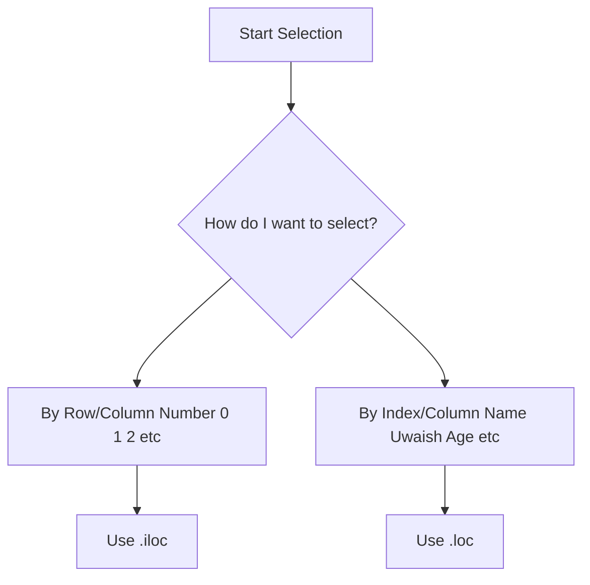
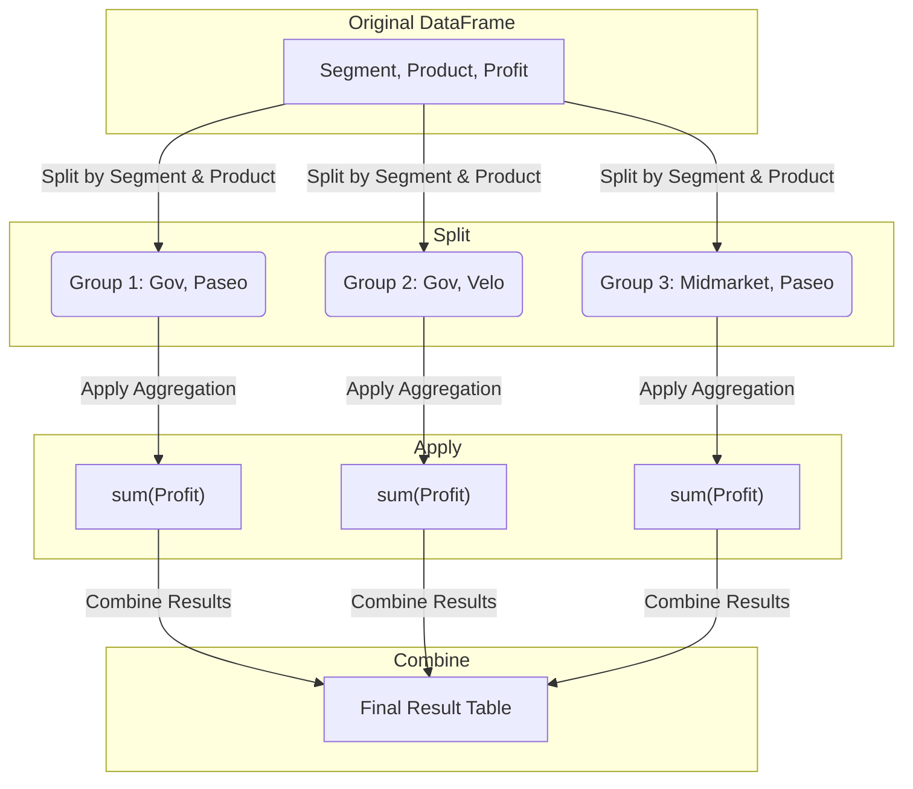

### **Week 6, Day 25-28: Advanced Indexing & Slicing**

**Date:** August 4, 2025 Monday
**Topic:** Precise Data Selection with `.loc`, `.iloc`, and Conditional Filtering

Today's class moves beyond basic column selection into the core of how you retrieve specific data from a DataFrame. Mastering `.loc` and `.iloc` is fundamental to effective data manipulation in Pandas.

#### Key Concepts

1.  **Basic Selection Review**: Slicing rows and selecting columns.
2.  **Position-Based Indexing**: Using `.iloc` to select data by its integer position.
3.  **Label-Based Indexing**: Using `.loc` to select data by its index label/name.
4.  **Conditional Filtering**: Selecting data that meets specific criteria.

---

#### `.iloc` vs `.loc`: The Core Difference

This is the most crucial concept of the day. Choosing the right one prevents errors and makes your code more readable.

| Accessor | Selection Method | Description | Example |
| :--- | :--- | :--- | :--- |
| **`.iloc`** | **I**nteger **LOC**ation | Selects data based on its zero-indexed *position*. Ignores index labels. | `df.iloc[0, 2]` |
| **`.loc`** | **LOC**ation (Label) | Selects data based on its *index label*. Can be numbers, but are treated as labels. | `df.loc[0, 'Age']` |

##### Visual Decision Flowchart



---

#### Code Examples

Let's use the sample DataFrame from class:

```python
df = pd.DataFrame({
    'Name':['Uwaish', 'Husain', 'Khan', 'Salman'],
    'Age':[22, 23, 24, 25],
    'Gender':['M', 'M', 'F', 'M']
})
```

##### `.iloc` Examples (Position)

```python
# Select the first row
df.iloc[0]

# Select the first two rows
df.iloc[0:2]

# Select the first row, first column (cell value)
df.iloc[0, 0] # Returns 'Uwaish'

# Select all rows, but only the first two columns ('Name', 'Age')
df.iloc[:, 0:2]
```

##### `.loc` Examples (Label)

`.loc` is most powerful when you have a meaningful index.

```python
# Set 'Name' as the index to demonstrate label-based selection
df_indexed = df.set_index('Name')

# df_indexed looks like this:
#         Age Gender
# Name
# Uwaish   22      M
# Husain   23      M
# ...

# Select the row with the index label 'Uwaish'
df_indexed.loc['Uwaish']

# Select rows from 'Uwaish' to 'Khan' (inclusive)
df_indexed.loc['Uwaish':'Khan']

# Select the 'Age' for 'Salman'
df_indexed.loc['Salman', 'Age'] # Returns 25
```

> **Key Difference in Slicing**:
> *   `.iloc[0:2]` includes index 0 and 1 (it **excludes** the end point).
> *   `.loc['Uwaish':'Khan']` includes 'Uwaish', 'Husain', and 'Khan' (it **includes** the end point).

##### Conditional Filtering

This allows you to "ask questions" of your data.

```python
# Get all rows where Age is greater than 22
df[df['Age'] > 22]

# Combine with .loc for more complex queries
# Get the 'Name' and 'Gender' for people older than 22
df.loc[df['Age'] > 22, ['Name', 'Gender']]
```

---

### **Week 6, Day 25: Data Inspection & Descriptive Statistics**

**Date:** August 5, 2025 Tuesday
**Topic:** Understanding Your Dataset

Before you can analyze your data, you need to understand it. This process is called **Data Inspection** or **Exploratory Data Analysis (EDA)**. Today we learned the essential toolkit for this.

#### The Data Inspection Toolkit

Think of these as your first five commands after loading any new dataset.

| Method | Purpose | What it tells you |
| :--- | :--- | :--- |
| `df.head()` | **Preview First Rows** | See the first 5 rows to understand column names and data format. |
| `df.tail()` | **Preview Last Rows** | Check the end of the data; useful for spotting summary rows or import issues. |
| `df.info()` | **DataFrame Summary** | Get column names, non-null counts, and data types (`Dtype`). **Crucial for finding missing data**. |
| `df.describe()` | **Statistical Summary** | Calculates mean, std, min, max, and percentiles for all **numerical** columns. |
| `df.describe(include='object')` | **Categorical Summary** | Shows count, unique values, top (most frequent) value, and freq for **text** columns. |

#### Code Examples

Using the financial data from `FinData.csv`:

```python
# Assuming df is loaded from FinData.csv
# df = pd.read_csv('FinData.csv')

# 1. Preview the data
df.head()

# 2. Get the technical summary
df.info()
# Output tells us 'Discount Band' has missing values (628 non-null vs 681 total)
# And that 'Date' is an object, not a datetime. We'll fix that later.

# 3. Get numerical statistics
df.describe()
# From this, we can quickly see the average profit is ~24k, but the min is ~-40k (a loss).

# 4. Get categorical statistics
df.describe(include='object')
# We learn that 'Government' is the most frequent Segment and 'Paseo' is the top Product.
```

#### Basic Calculations and Sorting

You can easily perform calculations on entire columns.

```python
# Total profit across all records
df['Profit'].sum()

# Average Gross Sales for the 'Montana' product
df[df['Product'] == 'Montana']['Gross Sales'].mean()

# Sort the entire DataFrame to find the 5 most profitable records
df.sort_values('Profit', ascending=False).head(5)
```

---

### **Week 6, Day 26: Grouping, Aggregating, and Reshaping**

**Date:** August 7, 2025 Thursday
**Topic:** Summarizing Data to Find Insights

This is where the real analysis begins. We learned how to group data into meaningful categories and then calculate summary statistics for those groups. This is done using the **Split-Apply-Combine** strategy.

#### The Split-Apply-Combine Strategy

This is the mental model behind `groupby()`.



#### `.groupby()`

This is the primary tool for the Split-Apply-Combine method.

```python
# Simple Grouping: Calculate the average profit for each Product.
df.groupby('Product')['Profit'].mean()

# Grouping by multiple columns
# This creates a MultiIndex
df.groupby(['Segment', 'Product'])['Profit'].sum()

# Using .agg() for multiple aggregations
# Get the total profit and average gross sales for each Segment
df.groupby('Segment').agg(
    Total_Profit=('Profit', 'sum'),
    Average_Sales=('Gross Sales', 'mean')
)
```

#### Reshaping Data for Better Reporting

Sometimes, the grouped output isn't the most readable format. We can reshape it.

##### `.pivot_table()`

Creates a familiar spreadsheet-style summary.

| Argument | Description |
| :--- | :--- |
| `index` | Column to use for the rows. |
| `columns`| Column to use for the columns. |
| `values` | Column to aggregate. |
| `aggfunc`| The aggregation function to use (e.g., 'sum', 'mean', 'count'). |

```python
# Create a pivot table of total profit, with Products as rows and Segments as columns
df.pivot_table(index='Product', columns='Segment', values='Profit', aggfunc='sum')
```

##### `pd.crosstab()`

A specialized tool for computing a **frequency table** (i.e., counting occurrences).

```python
# How many times was each product sold in each country?
pd.crosstab(df['Product'], df['Country'])
```

---

### **Week 6, Day 27: Working with Time Series & String Data**

**Date:** August 8, 2025 Friday
**Topic:** Data Cleaning and Feature Engineering

Real-world data is often "messy". Dates are stored as text, and text columns contain combined information. Today's class focused on cleaning this data and creating new, useful columns (**Feature Engineering**).

#### The Magic of Accessors: `.dt` and `.str`

Pandas provides special "accessors" for columns with datetime and string data types. They unlock a huge amount of functionality.

| Accessor | Used On | Purpose |
| :--- | :--- | :--- |
| **`.dt`** | `datetime64` columns | To access date and time properties (year, month, day, etc.). |
| **`.str`** | `object` (string) columns | To perform string operations (split, lower, upper, replace, etc.). |

#### Handling Time Series with `.dt`

1.  **Convert to Datetime**: First, always ensure your date column is the correct type.
2.  **Use the Accessor**: Extract components to create new features.

```python
# Step 1: Convert the 'Date' column from object to datetime
# The format argument helps pandas understand your specific date format
df['Date'] = pd.to_datetime(df['Date'], format='%Y-%m-%d')

# Step 2: Create new columns using the .dt accessor
df['Year'] = df['Date'].dt.year
df['Month_Name'] = df['Date'].dt.month_name()
df['Day_of_Week'] = df['Date'].dt.day_name()
```

#### Manipulating Strings with `.str`

This is incredibly useful for cleaning text data or extracting information.

```python
# Create a sample DataFrame
email_df = pd.DataFrame({
    'Email': ['Uwaish@deloitte.com', 'Husain@gmail.com', 'Aisha@sdhub.in']
})

# Make all emails lowercase
email_df['Email_lower'] = email_df['Email'].str.lower()

# Extract the domain from the email
# .str.split() returns a list; expand=True turns the list into new columns
email_df[['Username', 'Domain']] = email_df['Email'].str.split('@', expand=True)

# Capitalize the first letter of the username
email_df['Username_Proper'] = email_df['Username'].str.title()
```

#### Other Essential Operations

*   **Dropping Columns**: `df.drop(columns=['Column_to_Drop'], inplace=True)`
    > **Caution**: `inplace=True` modifies the DataFrame directly. Use with care.
*   **Renaming Columns**: `df.rename(columns={'Old_Name': 'New_Name', 'Another_Old': 'Another_New'})`
*   **Changing Data Type**: `df['Column'].astype(int)`