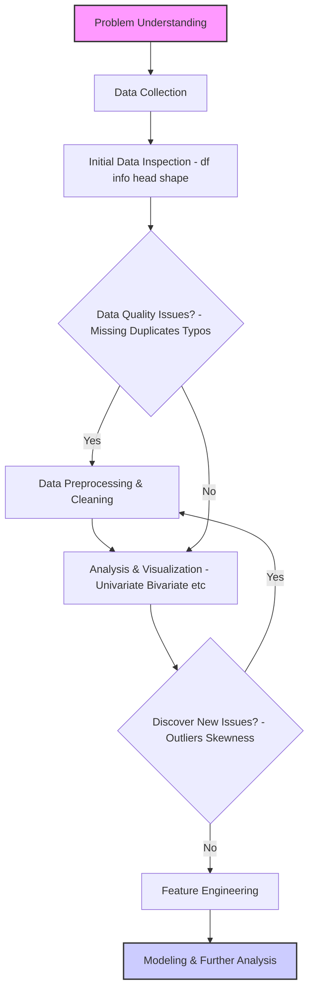
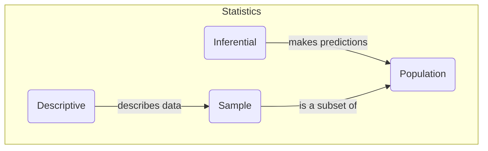
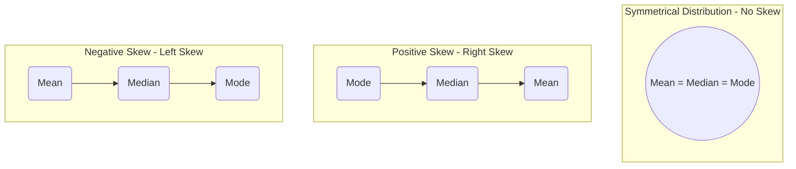
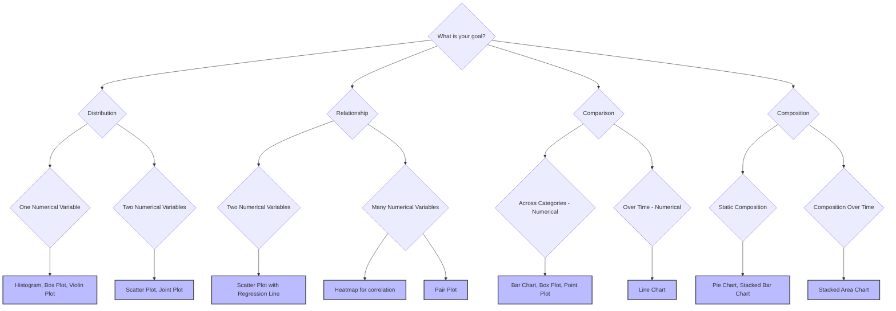

## 1. Exploratory Data Analysis (EDA): A Deeper Inquiry into Data

At its heart, EDA is a philosophy of data investigation. It's about approaching a dataset with genuine curiosity and a structured plan to uncover its secrets. It's an iterative cycle of asking questions, visualizing the answers, and refining your understanding.

### The EDA Workflow: An Iterative Process

Your notes show a linear lifecycle, but in practice, EDA is often a loop. What you find in the analysis phase can send you back to the preprocessing phase to handle newly discovered issues.



### Deeper Dive into Data Preprocessing

This is arguably the most critical and time-consuming part of EDA (often 70% of the work, as your notes suggest). Let's break down the "why" and "how."

#### **Handling Outliers**

Outliers are extreme values that can disproportionately affect your statistical measures and models.

*   **Why they matter:**
    *   **Mean:** The mean is very sensitive to outliers. A single extreme value can pull the average significantly.
    *   **Standard Deviation:** Since it's based on the mean, it's also heavily influenced.
    *   **Models:** Linear models (like Linear Regression) are sensitive, while tree-based models (like Decision Trees, Random Forests) are more robust.
*   **Identification Methods:**
    1.  **Visualization:** **Box plots** are the best visual tool. Any point beyond the whiskers is a potential outlier.
    2.  **Statistical Methods:**
        *   **Interquartile Range (IQR):** As shown in your notes, this is the most common method. Data points outside the range of **[Q1 - 1.5 * IQR, Q3 + 1.5 * IQR]** are flagged.
        *   **Z-Score:** For data that is approximately normally distributed, a Z-score measures how many standard deviations a point is from the mean. A Z-score greater than 3 or less than -3 is often considered an outlier.

#### **Handling Missing Data**

Not all missing data is the same. The reason *why* data is missing can influence how you handle it.

*   **Types of Missing Data:**
    *   **MCAR (Missing Completely At Random):** The missingness has no relationship with any value, observed or missing. This is the ideal scenario.
    *   **MAR (Missing At Random):** The missingness is related to some other observed variable in the dataset (e.g., men are less likely to fill out a depression survey).
    *   **MNAR (Missing Not At Random):** The missingness is related to the value of the variable itself (e.g., people with high incomes are less likely to report their income).
*   **Imputation Strategies:**
    *   **Simple Imputation:** Filling with `mean()`, `median()`, or `mode()`. Use the median if the data is skewed.
    *   **Dropping:** `dropna()` is an option, but be cautious as you might lose valuable information, especially if many rows have missing values.
    *   **Advanced Imputation:** For more critical applications, methods like K-Nearest Neighbors (KNN) imputation or model-based imputation (predicting the missing value based on other features) can be used.

#### **Feature Engineering (A key EDA step)**

This is the art of creating new, more informative features from the existing data. It often arises from insights gained during EDA.
*   **Extraction:** Creating a `Month` or `DayOfWeek` column from a `Date` column.
*   **Binning:** Converting a continuous numerical variable (like Age) into a categorical one (like '0-18', '19-35', '36-60').
*   **Interaction Features:** Combining two features to create a new one (e.g., `Profit per Unit Sold` = `Profit / Units Sold`).

***

## 2. Statistics: Deeper Foundations

Statistics gives us the language and tools to interpret the patterns we see in EDA.



### Deeper Dive into Descriptive Statistics

#### **Central Tendency in Skewed Distributions**

Your notes correctly identify that outliers affect the mean. This is because the distribution becomes "skewed." Visualizing the relationship between mean, median, and mode makes this concept much clearer.


> **Pro-Tip:** The mean is always pulled towards the long tail of the distribution. This is why the **median** is a more robust measure of central tendency for skewed data (like income or house prices).

#### **Understanding Standard Deviation**

The standard deviation is the most important measure of spread. It tells you, on average, how far each data point is from the mean.

*   **Low Standard Deviation:** Data points are clustered tightly around the mean. The distribution curve is tall and narrow.
*   **High Standard Deviation:** Data points are spread out over a wider range. The distribution curve is short and wide.

**The Empirical Rule (68-95-99.7 Rule):** For a normal (bell-shaped) distribution:
*   ~**68%** of data falls within **1** standard deviation of the mean.
*   ~**95%** of data falls within **2** standard deviations of the mean.
*   ~**99.7%** of data falls within **3** standard deviations of themean.

This rule is a powerful mental shortcut for understanding data spread.

#### **Correlation vs. Causation: A Critical Distinction**

Your notes mention correlation as a measure of the relationship between two numerical variables. This is a crucial concept, but it comes with a major warning.

> **Correlation does not imply causation!**

This means that just because two variables move together doesn't mean one is causing the other to change. There could be a third, unobserved variable (a "lurking variable") causing both to change.

*   **Example:** Ice cream sales are highly correlated with the number of drowning incidents.
    *   **False Conclusion (Causation):** Eating ice cream causes drowning.
    *   **Correct Conclusion (Correlation):** A lurking variable, **hot weather**, causes both an increase in ice cream sales and an increase in people swimming (and thus, more drowning incidents).

**Interpreting the Correlation Coefficient (r):**
*   Ranges from **-1 to +1**.
*   The **sign** indicates the direction (positive or negative).
*   The **magnitude** indicates the strength.

| r value | Strength of Relationship |
| :--- | :--- |
| `0.0` to `0.3` | Weak |
| `0.3` to `0.7` | Moderate |
| `0.7` to `1.0` | Strong |

***

## 3. Matplotlib & Seaborn: Deeper Visualization Techniques

While Matplotlib is the engine, Seaborn is the user-friendly dashboard. In practice, you'll use both—Seaborn for high-level plotting and Matplotlib for fine-tuning.

### Matplotlib's Two APIs

Matplotlib has two primary ways of being used. Understanding this is key to advancing your skills.

1.  **The `pyplot` API (Stateful):**
    *   This is the simpler, beginner-friendly approach (`plt.plot()`, `plt.title()`, etc.).
    *   Matplotlib keeps track of the "current" figure and axes, and any `plt` command applies to it.
    *   It's great for quick, simple plots.

2.  **The Object-Oriented (OO) API (Stateless):**
    *   This is the more powerful and flexible approach.
    *   You explicitly create and manage `figure` and `axes` objects.
    *   **Syntax:** `fig, ax = plt.subplots()`
    *   Commands are called on the `axes` object (e.g., `ax.plot()`, `ax.set_title()`).
    *   This is essential for creating complex plots, multiple subplots, and having full control.

**Example Comparison:**

```python
import matplotlib.pyplot as plt
import numpy as np

x = np.linspace(0, 10, 100)
y1 = np.sin(x)
y2 = np.cos(x)

# Pyplot API Approach
plt.figure()
plt.plot(x, y1, label='sin(x)')
plt.plot(x, y2, label='cos(x)')
plt.title("Pyplot API")
plt.legend()
plt.show()

# Object-Oriented API Approach
fig, ax = plt.subplots() # Create figure and axes objects
ax.plot(x, y1, label='sin(x)')
ax.plot(x, y2, label='cos(x)')
ax.set_title("Object-Oriented API")
ax.legend()
plt.show()
```
> **Pro-Tip:** As you advance, always try to use the Object-Oriented API. It's more explicit, less prone to errors, and the standard for complex visualizations.

### The Power of Seaborn

Seaborn shines because it's "data-aware." It understands Pandas DataFrames, allowing you to create complex plots with very little code.

**Key Seaborn Features:**

*   **`hue` parameter:** This is a game-changer. You can add a third (categorical) dimension to many plots by coloring points or bars based on that category.
    ```python
    sns.scatterplot(data=df, x='Gross Sales', y='Profit', hue='Product')
    ```
*   **Statistical Plots:** Seaborn can automatically add statistical information, like regression lines (`lmplot`) or confidence intervals on bar plots.
*   **Distribution Plots:** `sns.jointplot` creates a scatter plot with histograms for each variable on the margins, giving you a comprehensive view of a bivariate distribution.

### Choosing the Right Chart: A Decision Flowchart

This flowchart helps you decide which chart to use based on your analysis goal.



By following this expanded guide, you can move from simply executing the code in your notes to truly understanding the principles behind each step of your data analysis journey.