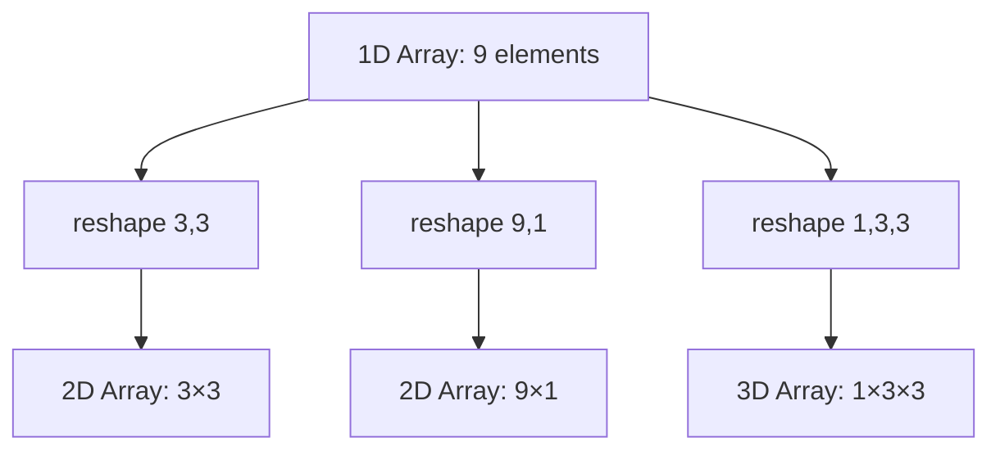
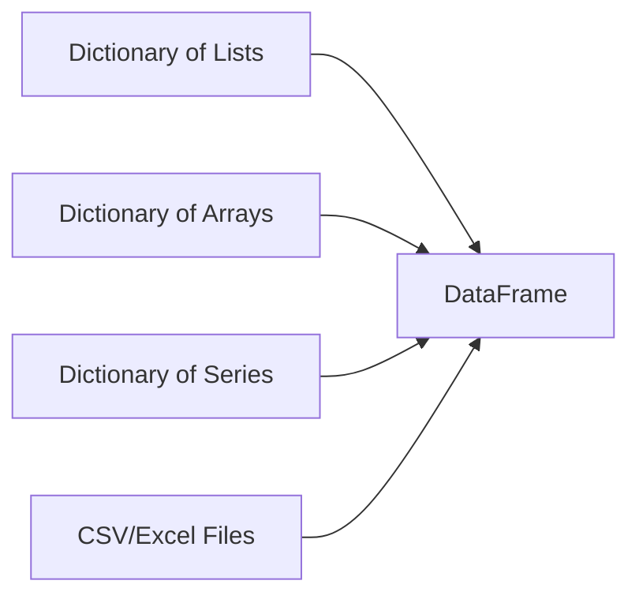
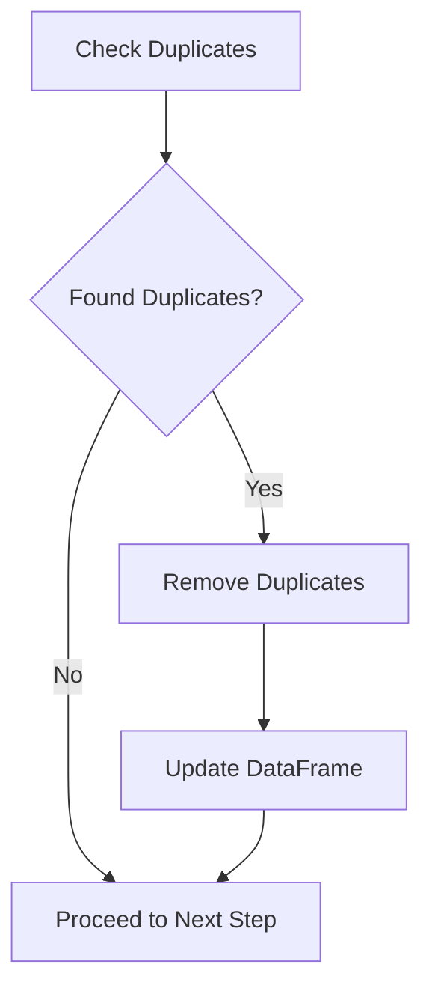
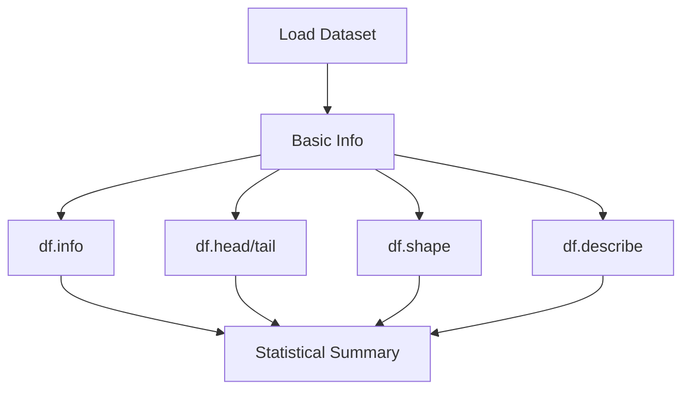
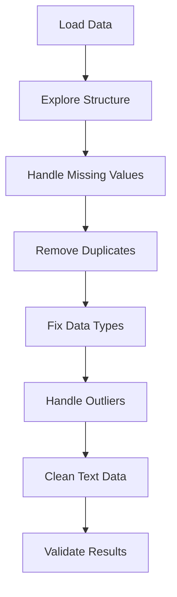

# Complete Data Science Learning Guide: NumPy, Pandas, and EDA

## Table of Contents

1. [NumPy Fundamentals](#numpy-fundamentals)
2. [Pandas Data Structures](#pandas-data-structures)
3. [Data Cleaning Techniques](#data-cleaning-techniques)
4. [Exploratory Data Analysis (EDA)](#exploratory-data-analysis-eda)
5. [Visualization with Matplotlib & Seaborn](#visualization)
6. [Quick Reference Tables](#quick-reference-tables)

---

## NumPy Fundamentals

### 1. Array Creation and Properties

#### Basic Array Creation

```python
import numpy as np

# Creating arrays from different data types
arr = np.array([1,2,3,4])           # From list
arr1 = np.array((2,3,4,5))          # From tuple
arr2 = np.array({2,3,4,5})          # From set (unordered)
arr3 = np.array({'a':10,'b':20})    # From dict (values only)
arr4 = np.array(range(10))          # From range
```

**Key Array Properties:**

- `arr.ndim` → Number of dimensions
- `arr.shape` → Shape as tuple (rows, columns, ...)
- `arr.size` → Total number of elements
- `arr.dtype` → Data type of elements
- `type(arr)` → Object type (numpy.ndarray)

#### Array Creation Functions

|Function|Purpose|Example|Output Shape|
|---|---|---|---|
|`np.arange(start, stop, step)`|Create array with range|`np.arange(2,10,1)`|(8,)|
|`np.linspace(start, stop, num)`|Create array with equal spacing|`np.linspace(2,20,12)`|(12,)|
|`np.ones(shape)`|Array filled with 1s|`np.ones((3,4))`|(3,4)|
|`np.zeros(shape)`|Array filled with 0s|`np.zeros((3,4))`|(3,4)|
|`np.identity(n)`|Identity matrix|`np.identity(4)`|(4,4)|
|`np.random.randint(max, size)`|Random integers|`np.random.randint(100, size=(3,4))`|(3,4)|

### 2. Array Reshaping and Manipulation



**Reshaping Rules:**

- Total elements must remain the same
- Use `arr.reshape(new_shape)` or `arr.reshape(-1)` for 1D

### 3. Array Indexing and Slicing

#### 1D Arrays

```python
arr1d = np.array(range(10,50,2))  # [10,12,14,16,18,20,22,24,26,28,30,32,34,36,38,40,42,44,46,48]

arr1d[0]      # First element: 10
arr1d[:2]     # First two: [10,12]
arr1d[-2:]    # Last two: [46,48]
```

#### 2D Arrays

```python
arr2d = np.array(range(1,13)).reshape(4,3)
# [[1,2,3],
#  [4,5,6], 
#  [7,8,9],
#  [10,11,12]]

arr2d[0]      # First row: [1,2,3]
arr2d[-2:]    # Last two rows: [[7,8,9],[10,11,12]]
arr2d[:,0]    # First column: [1,4,7,10]
arr2d[:,-2:]  # Last two columns: [[2,3],[5,6],[8,9],[11,12]]
```

### 4. Array Operations

#### Mathematical Operations

```python
arr1 = np.array(range(12)).reshape(4,3)
arr2 = np.array(range(10,22)).reshape(4,3)

# Element-wise operations
arr1 * 10           # Multiply by scalar
arr1 + arr2         # Element-wise addition
np.add(arr1, arr2)  # Same as above
np.multiply(arr1, arr2)  # Element-wise multiplication
np.dot(arr1, arr2)  # Matrix multiplication (if compatible)
```

#### Statistical Functions

```python
np.max(arr)    # Maximum value
np.min(arr)    # Minimum value  
np.sum(arr)    # Sum of all elements
np.mean(arr)   # Average
np.std(arr)    # Standard deviation
np.var(arr)    # Variance
```

---

## Pandas Data Structures

### 1. Series Creation

```python
import pandas as pd

# Different ways to create Series
series1 = pd.Series([10,20,30,40])                    # From list
ser2 = pd.Series(('Uwaish','Husain','Aisha'))        # From tuple
ser3 = pd.Series({101:'Uwaish', 102:'Faiz'})         # From dict (keys become index)
ser4 = pd.Series(np.array(range(10,20)))             # From NumPy array
```

**Series Properties:**

- `series.ndim` → Always 1
- `series.shape` → (length,)
- `series.size` → Number of elements
- `series.dtypes` → Data type

### 2. DataFrame Creation



#### Method 1: Dictionary of Collections

```python
# Dictionary of lists
df = pd.DataFrame({
    'emp_id': [101,102,103,104],
    'name': ['Salman','Uwaish','Aisha','Sayeeda'],
    'role': ['DS','AI','ML','DA'],
    'salary': [100,200,300,400]
})
```

#### Method 2: From Files

```python
df = pd.read_csv('filename.csv')
df = pd.read_excel('filename.xlsx')
```

#### Method 3: Custom Index

```python
df = pd.DataFrame(
    {'name': ['Salman','Uwaish'], 'age': [25,22]},
    index=[101,102]  # Custom row indices
)
```

### 3. DataFrame Indexing Methods

#### Comparison of Indexing Methods

|Method|Type|Example|Use Case|
|---|---|---|---|
|`df[column]`|Label-based|`df['Name']`|Select columns|
|`df.iloc[]`|Integer-based|`df.iloc[0]`|Position-based selection|
|`df.loc[]`|Label-based|`df.loc[0]` or `df.loc['index_name']`|Label-based selection|

```python
# Basic selection
df[['Name']]           # Single column as DataFrame
df[['Name','Gender']]  # Multiple columns
df[0:3]                # First 3 rows

# iloc - Integer location
df.iloc[0]      # First row
df.iloc[:,0]    # First column  
df.iloc[0:2]    # First two rows
df.iloc[:,0:2]  # First two columns

# loc - Label location  
df.loc[0]                    # Row with index 0
df.loc['Uwaish']            # Row with index 'Uwaish' (if set)
df.loc[df['Age']>22]        # Conditional selection
df.loc[df['Age']>22, 'Name'] # Conditional + column selection
```

---

## Data Cleaning Techniques

### 1. Duplicate Handling



```python
# Check duplicates
df.duplicated().sum()           # Count duplicates
df[df.duplicated()]            # View duplicate rows

# Remove duplicates  
df.drop_duplicates(inplace=True)
```

### 2. Missing Values (Null/NaN) Handling

#### Detection

```python
df.isnull().sum()              # Count nulls per column
df.isnull().sum()/len(df)      # Null percentage
(df.isnull().sum()/len(df))*100 # Null percentage
```

#### Treatment Options

|Method|Code|When to Use|
|---|---|---|
|**Drop rows**|`df.dropna()`|<5% missing, random pattern|
|**Fill with constant**|`df['col'].fillna(150)`|Domain knowledge available|
|**Fill with mean**|`df['col'].fillna(df['col'].mean())`|Numeric, normal distribution|
|**Fill with median**|`df['col'].fillna(df['col'].median())`|Numeric, skewed distribution|
|**Forward fill**|`df['col'].fillna(method='ffill')`|Time series data|
|**Backward fill**|`df['col'].fillna(method='bfill')`|Time series data|
|**Interpolate**|`df.interpolate()`|Continuous numeric data|

### 3. Outlier Detection and Treatment

```python
# Statistical method
Q1 = df['column'].quantile(0.25)
Q3 = df['column'].quantile(0.75)
IQR = Q3 - Q1
lower_bound = Q1 - 1.5 * IQR
upper_bound = Q3 + 1.5 * IQR

# Identify outliers
outliers = df[(df['column'] < lower_bound) | (df['column'] > upper_bound)]

# Treatment options
df[df['column'] < upper_bound]           # Remove outliers
df['column'].replace(outlier_value, new_value)  # Replace outliers
```

### 4. Data Type Conversions

```python
# Check data types
df.dtypes

# Convert data types
df['Age'] = df['Age'].astype(int)
df['Date'] = pd.to_datetime(df['Date'])
df['Category'] = df['Category'].astype('category')
```

### 5. String Data Cleaning

```python
# String operations
df['Name'].str.upper()                    # Convert to uppercase
df['Name'].str.lower()                    # Convert to lowercase  
df['Name'].str.title()                    # Title case
df['Name'].str.strip()                    # Remove leading/trailing spaces
df[['First','Last']] = df['Name'].str.split(' ', expand=True)  # Split strings
```

---

## Exploratory Data Analysis (EDA)

### 1. Data Overview Methods



```python
# Essential EDA commands
df.info()                    # Data types, non-null counts, memory usage
df.head(n)                   # First n rows (default 5)
df.tail(n)                   # Last n rows (default 5)  
df.shape                     # (rows, columns)
df.columns                   # Column names
df.dtypes                    # Data types
df.describe()                # Statistical summary for numeric columns
df.describe(include='object') # Summary for categorical columns
```

### 2. Univariate Analysis

#### For Categorical Variables

```python
df['Category'].value_counts()           # Frequency count
df['Category'].value_counts(normalize=True)  # Proportions
df['Category'].unique()                 # Unique values
len(df['Category'].unique())            # Number of unique values
```

#### For Numerical Variables

```python
df['Price'].mean()          # Average
df['Price'].median()        # Middle value
df['Price'].std()           # Standard deviation
df['Price'].var()           # Variance
df['Price'].min()           # Minimum
df['Price'].max()           # Maximum
df['Price'].quantile([0.25, 0.5, 0.75])  # Quartiles
```

### 3. Bivariate Analysis

#### Categorical vs Categorical

```python
pd.crosstab(df['Category1'], df['Category2'])  # Cross-tabulation
df.groupby('Category')['Target'].value_counts()  # Grouped counts
```

#### Numerical vs Categorical

```python
df.groupby('Category')['Price'].mean()      # Mean by category
df.groupby('Category')['Price'].agg(['mean', 'std', 'count'])  # Multiple stats
```

#### Numerical vs Numerical

```python
df[['Price', 'Quantity']].corr()           # Correlation matrix
df['Price'].corr(df['Quantity'])           # Pairwise correlation
```

### 4. Time Series Analysis

```python
# Convert to datetime
df['Date'] = pd.to_datetime(df['Date'])

# Extract date components
df['Year'] = df['Date'].dt.year
df['Month'] = df['Date'].dt.month
df['Day'] = df['Date'].dt.day
df['Weekday'] = df['Date'].dt.dayofweek

# Group by time periods
df.groupby('Year')['Sales'].sum()          # Yearly totals
df.groupby('Month')['Sales'].mean()        # Monthly averages
```

---

## Visualization with Matplotlib & Seaborn

### 1. Matplotlib Basics

```python
import matplotlib.pyplot as plt

# Basic plotting
plt.plot(x, y)                    # Line plot
plt.scatter(x, y)                 # Scatter plot  
plt.bar(x, y)                     # Bar plot
plt.hist(data, bins=10)           # Histogram
plt.pie(values, labels=labels)    # Pie chart

# Customization
plt.title('Chart Title')
plt.xlabel('X-axis Label')
plt.ylabel('Y-axis Label')
plt.legend()
plt.figure(figsize=(10, 6))       # Set size
plt.show()                        # Display plot
```

### 2. Seaborn for Statistical Plots

#### Distribution Plots

```python
import seaborn as sns

sns.histplot(df['column'])              # Histogram with KDE
sns.boxplot(df['column'])               # Box plot for outliers
sns.violinplot(df['column'])            # Violin plot for distribution
sns.distplot(df['column'])              # Distribution plot
```

#### Relationship Plots

```python
sns.scatterplot(x='col1', y='col2', data=df)     # Scatter plot
sns.lineplot(x='col1', y='col2', data=df)        # Line plot
sns.barplot(x='category', y='value', data=df)    # Bar plot
sns.heatmap(correlation_matrix, annot=True)      # Correlation heatmap
sns.pairplot(df[numeric_columns])                # Pairwise relationships
```

#### Categorical Plots

```python
sns.countplot(x='category', data=df)             # Count plot
sns.boxplot(x='category', y='value', data=df)    # Box plot by category
sns.violinplot(x='category', y='value', data=df) # Violin plot by category
```

### 3. Advanced Visualizations

```python
# Subplots
fig, axes = plt.subplots(2, 2, figsize=(12, 8))
sns.histplot(df['col1'], ax=axes[0,0])
sns.boxplot(df['col2'], ax=axes[0,1])
sns.scatterplot(x='col1', y='col2', data=df, ax=axes[1,0])
sns.heatmap(df.corr(), ax=axes[1,1])

# Multiple plots on same axes
plt.bar(categories, values1, label='Series 1')
plt.bar(categories, values2, label='Series 2')
plt.legend()
```

---

## Quick Reference Tables

### Data Cleaning Decision Matrix

|Problem|Detection|Treatment Options|
|---|---|---|
|**Duplicates**|`df.duplicated().sum()`|`drop_duplicates()`|
|**Missing Values**|`df.isnull().sum()`|Drop, Fill, Interpolate|
|**Outliers**|`df.describe()`, Box plots|Remove, Cap, Transform|
|**Wrong Data Types**|`df.dtypes`|`astype()`, `pd.to_datetime()`|
|**Inconsistent Formats**|`df['col'].unique()`|String methods, `replace()`|

### EDA Analysis Types

|Analysis Type|Variables|Methods|Visualizations|
|---|---|---|---|
|**Univariate**|Single|`value_counts()`, `describe()`|Histogram, Box plot, Count plot|
|**Bivariate**|Two|`groupby()`, `corr()`, `crosstab()`|Scatter, Bar, Heatmap|
|**Multivariate**|Multiple|`pairplot()`, correlation matrix|Pair plots, Parallel coordinates|

### Common Pandas Operations

|Operation|Syntax|Purpose|
|---|---|---|
|**Filtering**|`df[df['col'] > value]`|Conditional selection|
|**Grouping**|`df.groupby('col')['target'].agg()`|Aggregate by groups|
|**Sorting**|`df.sort_values('col', ascending=False)`|Sort by column|
|**Merging**|`pd.merge(df1, df2, on='key')`|Join dataframes|
|**Pivoting**|`df.pivot_table(index, columns, values)`|Reshape data|

### Data Types and When to Use

|Data Type|Use Case|Example|
|---|---|---|
|**int64**|Counting, IDs|Customer ID, Quantity|
|**float64**|Measurements|Price, Weight, Temperature|
|**object**|Text, Mixed|Names, Categories|
|**datetime64**|Dates/Times|Purchase Date, Timestamp|
|**category**|Limited categories|Gender, Status|
|**bool**|True/False|Is_Premium, Has_Discount|

---

## Key Takeaways for Your Hackathon

### 1. Data Cleaning Pipeline



### 2. EDA Best Practices

1. **Always start with** `df.info()`, `df.head()`, `df.describe()`
2. **Check data quality** before analysis
3. **Use visualizations** to understand patterns
4. **Document insights** as comments in code
5. **Create summary statistics** for key findings

### 3. Common Pitfalls to Avoid

- Not checking data types after loading
- Ignoring missing value patterns
- Removing outliers without investigation
- Not validating cleaning results
- Overcomplicating visualizations

### 4. Speed Tips for Hackathons

- Use `df.sample(1000)` for quick exploration of large datasets
- Create functions for repetitive cleaning tasks
- Use `df.pipe()` for chaining operations
- Keep a template notebook with common code snippets
- Practice keyboard shortcuts in Jupyter

This comprehensive guide covers all the concepts from your code with practical examples, visual explanations, and quick reference materials. Focus on understanding the logic behind each operation rather than memorizing syntax, and practice with different datasets to build confidence!