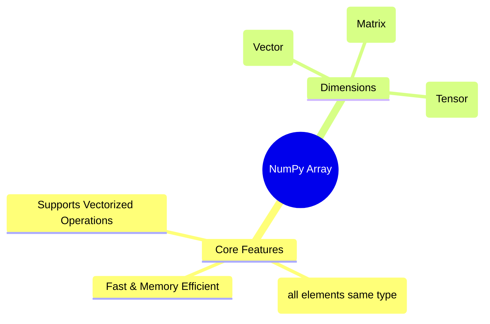
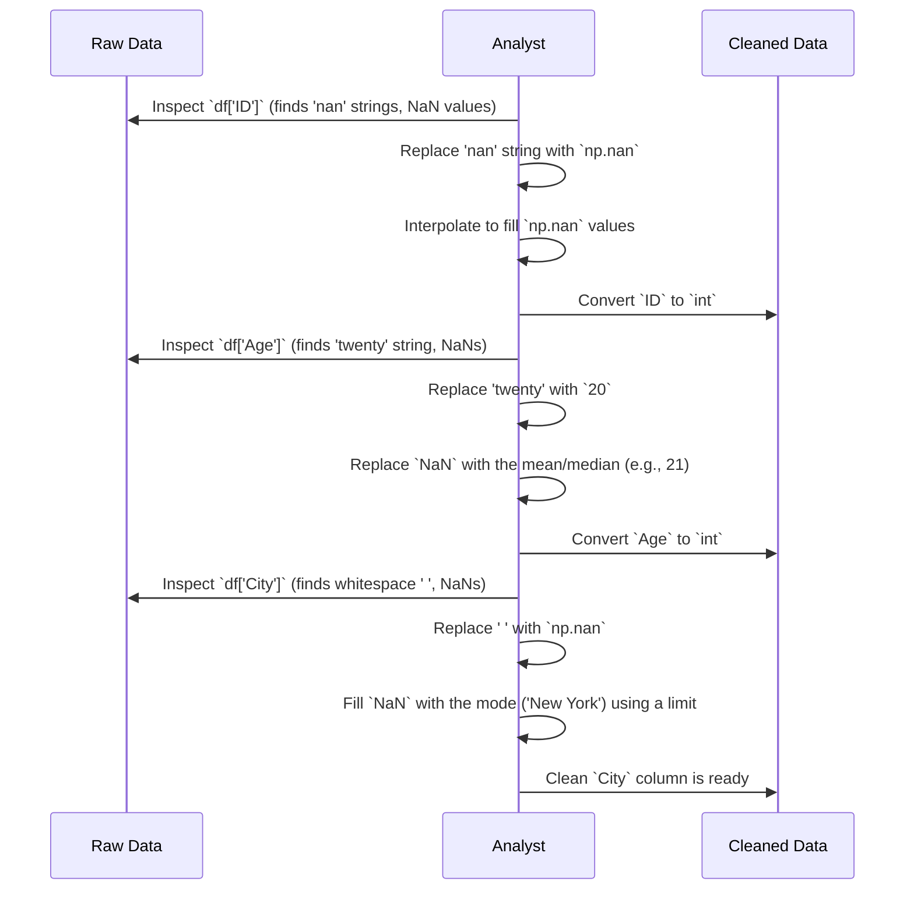

Of course! This is an excellent set of scripts to prepare for a Data Science hackathon. Let's break down every concept and line of code into a comprehensive learning guide.

Here is your detailed guide for Data Cleaning and EDA, based on the code you've written.

---

# The Ultimate Data Cleaning & EDA Learning Guide

This guide analyzes your Python code to explain every concept, function, and library used. It's designed to be a quick and thorough revision tool for your Data Science hackathon.

## Table of Contents
1.  **Part 1: NumPy - The Foundation of Numerical Data**
    *   1.1. What is a NumPy Array?
    *   1.2. Creating NumPy Arrays
    *   1.3. Array Attributes: Shape, Dimension, and Size
    *   1.4. Reshaping Arrays
    *   1.5. Advanced Array Creation
    *   1.6. Accessing and Slicing Data
    *   1.7. Manipulating Arrays: Stacking and Splitting
    *   1.8. Conditional Logic with `np.where`
    *   1.9. Essential NumPy Operations

2.  **Part 2: Pandas - Your Data Analysis Powerhouse**
    *   2.1. Pandas Data Structures: Series and DataFrame
    *   2.2. Creating a DataFrame
    *   2.3. Reading and Writing Data
    *   2.4. Indexing and Selecting Data (`loc` vs. `iloc`)
    *   2.5. Inspecting Your Data
    *   2.6. Essential Data Cleaning Techniques
    *   2.7. Grouping and Aggregating Data

3.  **Part 3: Matplotlib & Seaborn - Visualizing Your Insights**
    *   3.1. Introduction to Data Visualization
    *   3.2. Common Plots for EDA and Their Purpose
    *   3.3. Practical Visualization Examples

4.  **Part 4: Case Studies - Putting It All Together**
    *   4.1. Analyzing Customer Behavior (Cardio Dataset)
    *   4.2. Exploring Sales Data (Adidas Dataset)
    *   4.3. Titanic Survival Analysis
    *   4.4. Full Data Cleaning Walkthrough (Uncleaned Dataset)

---

## Part 1: NumPy - The Foundation of Numerical Data

NumPy (Numerical Python) is a fundamental library for numerical computation in Python. It provides a high-performance multidimensional array object and tools for working with these arrays. It's the bedrock upon which Pandas and other data science libraries are built.

### 1.1. What is a NumPy Array?

A NumPy array, or `ndarray`, is a grid of values, all of the same type. It's similar to a Python list but is optimized for numerical operations, making it much faster.



### 1.2. Creating NumPy Arrays

You can create arrays from various Python objects like lists, tuples, and ranges.

*   **Concept Covered:** `np.array()`
    *   The core function to create a NumPy `ndarray`.

*   **Step-by-step Breakdown:**
    *   **What it does:** It takes a collection-like object (e.g., list, tuple, range) and converts it into a NumPy array.
    *   **Why it's used:** This is the primary way to create an array when you already have data in a standard Python structure.
    *   **How it helps:** It allows you to transform standard Python data into a high-performance array for numerical analysis.

*   **Practical Examples:**
    *   **From a list:**
        ```python
        # Input (Python List)
        my_list = [1, 2, 3, 4]
        # Code
        arr = np.array(my_list)
        # Output: array([1, 2, 3, 4])
        ```
    *   **From a `range` object:**
        ```python
        # Input (Python Range)
        my_range = range(10)
        # Code
        arr4 = np.array(my_range)
        # Output: array([0, 1, 2, 3, 4, 5, 6, 7, 8, 9])
        ```
    *   **From a tuple:**
        ```python
        # Input (Python Tuple)
        my_tuple = (2, 3, 4, 5)
        # Code
        arr1 = np.array(my_tuple)
        # Output: array([2, 3, 4, 5])
        ```

### 1.3. Array Attributes: Shape, Dimension, and Size

Once you have an array, you can inspect its properties.

*   **Concepts Covered:**
    *   `.ndim`: An attribute that stores the number of dimensions (axes) of the array.
    *   `.shape`: A tuple representing the size of the array in each dimension.
    *   `.size`: The total number of elements in the array.
    *   `.dtype`: The data type of the elements in the array.

*   **Step-by-step Breakdown:**
    1.  You create a multi-dimensional array, for example, a 2D array (a matrix).
    2.  Accessing `.ndim` tells you if it's a 1D, 2D, or 3D array.
    3.  `.shape` gives you the `(rows, columns)` for a 2D array.
    4.  `.size` gives you the total count of elements, which is `rows * columns`.

*   **Summary Table:**

| Attribute | Description | Example Input: `arr = np.array([[1,2,3],[4,5,6]])` | Example Output |
| :--- | :--- | :--- | :--- |
| `arr.ndim` | Number of dimensions | `arr.ndim` | `2` |
| `arr.shape`| Size of each dimension | `arr.shape` | `(2, 3)` |
| `arr.size` | Total number of elements | `arr.size` | `6` |
| `arr.dtype`| Data type of elements | `arr.dtype` | `dtype('int64')` |

### 1.4. Reshaping Arrays

*   **Concept Covered:** `.reshape()`
    *   A method that changes the shape of an array without changing its data. The new shape must have the same total number of elements.

*   **Step-by-step Breakdown:**
    *   **What it does:** The code `arr1d.reshape(3,3)` takes a 1D array with 9 elements and reorganizes it into a 2D array (a matrix) with 3 rows and 3 columns.
    *   **Why it's used:** Data often comes in a flat structure. Reshaping is a fundamental step to structure it correctly for analysis (e.g., preparing image data).
    *   **How it helps:** It allows you to dynamically create multi-dimensional arrays from a simple sequence of numbers.

*   **Visual Explanation (Before vs. After):**

| Before: `arr1d` (Shape: (24,)) | After: `arr3d` (Shape: (2, 3, 4)) |
| :--- | :--- |
| `[0, 1, ..., 23]` | `[[[ 0,  1,  2,  3],`<br>`  [ 4,  5,  6,  7],`<br>`  [ 8,  9, 10, 11]],`<br>` [[12, 13, 14, 15],`<br>`  [16, 17, 18, 19],`<br>`  [20, 21, 22, 23]]]` |

*   **Alternative Approaches:**
    *   Use `-1` in one of the dimensions, and NumPy will automatically calculate the correct size for you. This is very efficient.
        ```python
        arr = np.arange(24)
        # Let NumPy figure out the number of columns
        arr.reshape(2, 3, -1) # Shape will be (2, 3, 4)
        ```

### 1.5. Advanced Array Creation

Your code uses several efficient NumPy functions to generate arrays from scratch.

*   **Concepts Covered & Summary Table:**

| Function | Description | Example | Output |
| :--- | :--- | :--- | :--- |
| `np.arange(start, stop, step)` | Creates an array with evenly spaced values within a given interval. | `np.arange(2, 10, 2)` | `array([2, 4, 6, 8])` |
| `np.linspace(start, stop, num)` | Creates an array with a specified number (`num`) of evenly spaced values between `start` and `stop`. | `np.linspace(1, 10, 4)` | `array([ 1.,  4.,  7., 10.])` |
| `np.ones(shape)` | Creates an array of the given shape, filled with `1`s. | `np.ones((2, 3))` | `array([[1., 1., 1.],`<br>`       [1., 1., 1.]])` |
| `np.zeros(shape)` | Creates an array of the given shape, filled with `0`s. | `np.zeros((3, 2))` | `array([[0., 0.],`<br>`       [0., 0.],`<br>`       [0., 0.]])` |
| `np.identity(n)` | Creates a square identity matrix of size `n x n`. | `np.identity(3)` | `array([[1., 0., 0.],`<br>`       [0., 1., 0.],`<br>`       [0., 0., 1.]])` |
| `np.random.randint(high, size)` | Creates an array of a given `size` with random integers from `0` to `high-1`. | `np.random.randint(10, size=(2, 3))` | `array([[5, 0, 3],`<br>`       [3, 7, 9]])` (values will vary) |

### 1.6. Accessing and Slicing Data

Slicing is crucial for selecting subsets of your data for analysis.

*   **Concepts Covered:**
    *   **Indexing:** Accessing a single element using its position (e.g., `arr[0]`).
    *   **Slicing:** Accessing a range of elements (e.g., `arr[start:stop:step]`).
    *   **Multi-dimensional Indexing:** Using commas to separate indices for each dimension (e.g., `arr[row, column]`).

*   **Visual Explanation (2D Array Slicing):**
    Let's take `arr2d = np.arange(1, 13).reshape(4, 3)`
    ```
    [[ 1,  2,  3],
     [ 4,  5,  6],
     [ 7,  8,  9],
     [10, 11, 12]]
    ```

| Code | What it Does | Result |
| :--- | :--- | :--- |
| `arr2d[0]` | Selects the first row. | `array([1, 2, 3])` |
| `arr2d[:, 0]` | Selects the first column. The `:` means "all rows". | `array([1, 4, 7, 10])` |
| `arr2d[-2:]` | Selects the last two rows. | `array([[ 7,  8,  9], [10, 11, 12]])` |
| `arr2d[2:, 1:]`| Selects rows from index 2 onwards and columns from index 1 onwards. | `array([[ 8,  9], [11, 12]])` |

*   **Flipping Arrays:** A special slicing trick `[::-1]` reverses the order of elements along an axis.
    *   `arr2d[::-1]` flips the rows.
    *   `arr2d[:, ::-1]` flips the columns.

### 1.7. Manipulating Arrays: Stacking and Splitting

*   **Concepts Covered:**
    *   `np.hstack()`: Stacks arrays in sequence horizontally (column-wise).
    *   `np.vstack()`: Stacks arrays in sequence vertically (row-wise).
    *   `np.dstack()`: Stacks arrays in sequence depth-wise (along a third axis).
    *   `np.hsplit()`, `np.vsplit()`: Splits an array into multiple sub-arrays horizontally or vertically.

*   **Visual Explanation (`hstack` vs. `vstack`):**

```mermaid
graph TD
    subgraph hstack (Horizontal)
        A[1<br>2] --> C[(1,3)<br>(2,4)];
        B[3<br>4] --> C;
    end
    subgraph vstack (Vertical)
        D[1, 2] --> F[(1,2)<br>(3,4)];
        E[3, 4] --> F;
    end
```

### 1.8. Conditional Logic with `np.where`

*   **Concept Covered:** `np.where(condition, value_if_true, value_if_false)`
    *   This is a powerful vectorized equivalent of an if-else statement.

*   **Step-by-step Breakdown:**
    *   **What it does:** It checks an array against a `condition`. For every element where the condition is `True`, it yields `value_if_true`; otherwise, it yields `value_if_false`.
    *   **Why it's used:** It's incredibly efficient for conditional data transformation. A `for` loop would be much slower.
    *   **How it helps in cleaning:** You can use it to find and replace values, categorize data, or handle outliers. For example, replacing all negative numbers in a dataset with 0.

*   **Practical Example:**
    *   **Task:** In a matrix of random numbers, label numbers as 'Even' or 'Odd'.
    *   **Input Array (`arr`):**
        ```
        [[78, 13],
         [92, 43]]
        ```
    *   **Code:**
        ```python
        np.where(arr % 2 == 0, 'Even', 'Odd')
        ```
    *   **Output:**
        ```
        [['Even', 'Odd'],
         ['Even', 'Odd']]
        ```

### 1.9. Essential NumPy Operations

Your code covers several key operations for data analysis.

*   **Concepts Covered & Summary Table:**

| Operation | Function/Method | Description |
| :--- | :--- | :--- |
| **Transpose** | `.T` or `.transpose()` | Flips the array's dimensions (rows become columns and vice versa). |
| **Flattening** | `.flatten()` or `.ravel()`| Converts a multi-dimensional array into a 1D array. |
| **Broadcasting**| `arr + 100` | The ability of NumPy to treat arrays with different shapes during arithmetic operations. A smaller array is "broadcast" across the larger array. |
| **Aggregations**| `np.sum()`, `np.mean()`, `np.min()`, `np.max()`, `np.std()` | Functions that perform a calculation on an entire array (or an axis) and return a single value. |
| **Iteration** | `np.nditer()` | An efficient multi-dimensional iterator object to iterate through an array. |

---

## Part 2: Pandas - Your Data Analysis Powerhouse

Pandas is built on top of NumPy and is the most popular library for data manipulation and analysis in Python. It introduces two key data structures: the `Series` and the `DataFrame`.

### 2.1. Pandas Data Structures: Series and DataFrame

```mermaid
mindmap
  root((Pandas))
    Series (1D)
      Like a single column in a spreadsheet
      Labeled index
      Homogeneous data type
    DataFrame (2D)
      Like a full spreadsheet or SQL table
      Made of multiple Series
      Labeled rows (index) and columns
```

### 2.2. Creating a DataFrame

A DataFrame is typically created from a dictionary or by reading a file.

*   **Concept Covered:** `pd.DataFrame()`
    *   The primary function to create a DataFrame.

*   **Step-by-step Breakdown:**
    *   **What it does:** The most common way is to pass a dictionary where keys become column names and values (lists, arrays, or Series) become the data for those columns.
    *   **Why it's used:** It allows you to programmatically construct a structured dataset for analysis.

*   **Practical Example (from a dictionary of lists):**
    ```python
    # Input: Dictionary
    di = {'emp_id':[101, 102], 'name':['Salman', 'Uwaish'], 'salary':[100, 200]}
    # Code
    df = pd.DataFrame(di)
    # Output (DataFrame):
    #    emp_id    name  salary
    # 0     101  Salman     100
    # 1     102  Uwaish     200
    ```

### 2.3. Reading and Writing Data

In a hackathon, you'll almost always start by reading a file.

*   **Concepts Covered:**
    *   `pd.read_csv('filename.csv')`: Reads data from a Comma-Separated Values file.
    *   `pd.read_excel('filename.xlsx')`: Reads data from an Excel file.
    *   `df.to_excel('output.xlsx')`: Saves a DataFrame to an Excel file.

### 2.4. Indexing and Selecting Data (`loc` vs. `iloc`)

This is one of the most critical concepts in Pandas.

*   **Concepts Covered:**
    *   **`iloc` (integer-location based):** Selects data using integer positions (like in NumPy or Python lists). It is exclusive of the final index in a range.
    *   **`loc` (label-based):** Selects data using index labels and column names. It is inclusive of the final index in a range.
    *   **Boolean Indexing:** Selecting data using a boolean condition (e.g., `df[df['Age'] > 22]`).

*   **Comparison Table:**
    Let's use this DataFrame with a custom index:
    `df = pd.DataFrame({'Age':[22, 23], 'Score':[80, 95]}, index=['Uwaish', 'Husain'])`

| Task | `iloc` (by position) | `loc` (by label) | Output |
| :--- | :--- | :--- | :--- |
| **Select first row** | `df.iloc[0]` | `df.loc['Uwaish']` | `Age: 22, Score: 80` |
| **Select first two rows** | `df.iloc[0:2]` | `df.loc['Uwaish':'Husain']` | The entire DataFrame |
| **Select 'Age' column** | `df.iloc[:, 0]` | `df.loc[:, 'Age']` | `Uwaish: 22, Husain: 23`|
| **Select specific cell** | `df.iloc[0, 1]` | `df.loc['Uwaish', 'Score']`| `80` |

*   **Conditional Selection Breakdown:** `df.loc[df['Salary'] > 200, 'Emp_id']`
    1.  `df['Salary'] > 200`: This creates a boolean Series (`[False, False, True, True]`).
    2.  `df.loc[...]`: The `.loc` indexer receives this boolean Series. It keeps only the rows where the value is `True`.
    3.  `'Emp_id'`: After filtering the rows, it selects only the `Emp_id` column for those rows.

### 2.5. Inspecting Your Data

After loading data, the first step of EDA is to get a feel for it.

| Method | Description |
| :--- | :--- |
| `df.info()` | Provides a concise summary: index dtype, column dtypes, non-null values, and memory usage. **First thing to run!** |
| `df.head(n)` | Returns the first `n` rows (default is 5). |
| `df.tail(n)` | Returns the last `n` rows (default is 5). |
| `df.describe()` | Generates descriptive statistics for numerical columns (count, mean, std, min, max, quartiles). |
| `df.describe(include='object')` | Generates statistics for categorical columns (count, unique, top, freq). |
| `df.columns` | Returns a list of the column names. |
| `df.dtypes` | Returns the data type of each column. |
| `df.shape` | Returns a tuple of (number of rows, number of columns). |

### 2.6. Essential Data Cleaning Techniques

This is where you'll spend a lot of your time in a hackathon.

```mermaid
flowchart TD
    A[Load Data] --> B{Inspect with .info() & .isnull()}
    B --> C[Handle Missing Values];
    C --> D[Correct Data Types];
    D --> E[Handle Duplicates];
    E --> F[String Manipulation];
    F --> G[Handle Outliers];
    G --> H[Cleaned Data Ready for EDA];
```

*   **Handling Missing Values:**
    *   **Detection:** `df.isnull().sum()` shows the count of `NaN` values in each column.
    *   **Deletion:** `df.dropna()` removes rows with any missing values. **Use with caution**, as you might lose valuable data.
    *   **Imputation (Filling):** `df['col'].fillna(value)` is the preferred method.
        *   **Constant:** `fillna(0)`
        *   **Statistical:** `fillna(df['col'].mean())` or `median()`
        *   **Propagation:** `fillna(method='ffill')` (forward fill) or `'bfill'` (backward fill).
        *   **Interpolation:** `df.interpolate()` fills `NaN` values by treating them as points on a line. Excellent for time-series data.

*   **Handling Duplicates:**
    *   **Detection:** `df.duplicated().sum()` counts the number of fully duplicate rows.
    *   **Deletion:** `df.drop_duplicates(inplace=True)` removes them.

*   **String Manipulation (`.str` accessor):**
    *   **Splitting:** `df['Email'].str.split('@', expand=True)` splits a column into multiple new columns. The `expand=True` is crucial for creating a DataFrame.
    *   **Cleaning:** `.str.strip()` removes whitespace, `.str.lower()` converts to lowercase, `.str.title()` capitalizes.

*   **Working with Dates (`.dt` accessor):**
    *   **Conversion:** `pd.to_datetime(df['date_col'])` is essential to convert string dates into proper datetime objects.
    *   **Feature Extraction:** Once converted, you can access properties like `df['date_col'].dt.year`, `.dt.month`, `.dt.day`, `.dt.dayofweek`. This is key for time-series analysis.

### 2.7. Grouping and Aggregating Data

This is how you start to find insights. It's the core of EDA.

*   **Concepts Covered:**
    *   `df.groupby('col')`: Groups the DataFrame by a categorical column.
    *   `value_counts()`: Counts unique values in a Series. Great for checking the distribution of a categorical variable.
    *   `pivot_table()`: Creates a spreadsheet-style pivot table. Excellent for multi-dimensional summaries.
    *   `crosstab()`: Computes a cross-tabulation of two (or more) factors. Useful for seeing the relationship between two categorical variables.

*   **`groupby` Breakdown:** `df.groupby('Year')['Profit'].sum()`
    1.  `df.groupby('Year')`: The data is split into groups, one for each unique year.
    2.  `['Profit']`: Within each group, we select the 'Profit' column.
    3.  `.sum()`: An aggregation function is applied to the 'Profit' column for each group, calculating the sum.
    4.  The results are combined into a new Series where the index is the grouping key ('Year').

---

## Part 3: Matplotlib & Seaborn - Visualizing Your Insights

Visualizations make your findings understandable. Matplotlib is the foundational library, while Seaborn is built on top of it to provide more attractive and statistically-oriented plots.

### 3.1. Introduction to Data Visualization

*   **`matplotlib.pyplot as plt`**: The main plotting interface.
*   **`seaborn as sns`**: High-level interface for statistical graphics.

### 3.2. Common Plots for EDA and Their Purpose

| Plot Type | Seaborn Function | Matplotlib Function | Purpose |
| :--- | :--- | :--- | :--- |
| **Histogram** | `sns.histplot()` | `plt.hist()` | Understand the distribution of a single numerical variable. |
| **Box Plot** | `sns.boxplot()` | - | Identify outliers and see the spread (quartiles) of a numerical variable. |
| **Bar Chart** | `sns.barplot()` / `sns.countplot()` | `plt.bar()` | Compare a numerical value across different categories. `countplot` is specifically for frequencies. |
| **Line Chart** | `sns.lineplot()` | `plt.plot()` | Show a trend over time or a continuous interval. |
| **Scatter Plot** | `sns.scatterplot()`| `plt.scatter()`| Investigate the relationship between two numerical variables. |
| **Pie Chart** | - | `plt.pie()` | Show the proportion of categories. **Use sparingly**; bar charts are often better. |
| **Heatmap** | `sns.heatmap()` | - | Visualize a matrix of data, like a correlation matrix. |
| **Pair Plot** | `sns.pairplot()` | - | Show pairwise relationships between all numerical variables in a dataset. **Powerful first-look EDA tool.** |

### 3.3. Practical Visualization Examples

*   **Distribution of a single variable (Histogram):**
    ```python
    sns.histplot(df['Profit'])
    plt.title("Profit Distribution")
    plt.show()
    ```
    *   **Insight:** This helps you see if the profit is normally distributed, skewed, or has multiple peaks.

*   **Relationship between two variables (Scatter Plot):**
    ```python
    sns.scatterplot(x=df['Gross Sales'], y=df['Profit'])
    plt.title("Relationship between Gross Sales and Profit")
    plt.show()
    # Also check the correlation
    print(df[['Gross Sales', 'Profit']].corr())
    ```
    *   **Insight:** Reveals if there is a positive, negative, or no correlation between sales and profit.

*   **Comparison across categories (Bar Plot):**
    ```python
    # First, aggregate the data
    df_agg = df.groupby('Product')['Profit'].mean().reset_index()
    # Then, plot
    sns.barplot(x='Product', y='Profit', data=df_agg)
    plt.title("Average Profit by Product")
    plt.show()
    ```
    *   **Insight:** Clearly shows which products are the most and least profitable on average.

---

## Part 4: Case Studies - Putting It All Together

Your final scripts demonstrate a standard EDA workflow.

### EDA Workflow Mindmap

```mermaid
mindmap
  root((EDA Project))
    1. Data Loading & Inspection
      `pd.read_csv()`
      `.info()`
      `.head()`
      `.describe()`
      `.columns`
    2. Data Preprocessing (Cleaning)
      `.isnull().sum()` (Missing Values)
      `.duplicated().sum()` (Duplicates)
      `pd.to_datetime()` (Types)
      `.drop()` (Irrelevant Columns)
    3. Univariate Analysis (One Variable)
      `.value_counts()`
      `sns.countplot()`
      `sns.histplot()`
      `sns.boxplot()`
    4. Bivariate Analysis (Two Variables)
      `df.groupby()`
      `pd.crosstab()`
      `sns.scatterplot()`
      `sns.barplot()`
      `.corr()` & `sns.heatmap()`
    5. Summarize & Conclude
      Draw insights
      Make recommendations
```

Your `Cardio.csv`, `Adidas_US_Sales_Sample.xlsx`, `titanic`, and `uncleaned_dataset.csv` analyses are perfect examples of this workflow in action. They correctly follow the steps of loading, cleaning, and then analyzing data from simple to complex relationships (univariate to bivariate) to draw conclusions. Continue practicing this structured approach, and you'll be well-prepared for your hackathon. Good luck

You are absolutely right. The initial guide covered the fundamentals, but your scripts contain much more advanced and practical applications that are crucial for a hackathon. Let's continue and dive deeper into the more complex topics you've explored.

---

## Part 5: Advanced Pandas - From Messy Data to Actionable Features

This section focuses on the more realistic and challenging data cleaning tasks you tackled, especially in the `uncleaned_dataset.csv` and other examples.

### 5.1. Feature Engineering: Creating New Data from Old

Feature engineering is the art of creating new, informative columns from your existing data. This is often the key to unlocking powerful insights.

*   **Concept Covered:** String Splitting and Column Creation
    *   **What it does:** The code `df['Email'].str.split('@', expand=True)` takes a column of strings and splits each string by a delimiter (`@`). The `expand=True` argument is critical; it tells Pandas to create new columns for each split part.
    *   **Why it's used:** It's a powerful way to extract structured information from unstructured text fields like emails, addresses, or IDs.
    *   **How it helps:** In your example, you successfully extracted the username and the domain from an email address, which could be used to analyze which companies your customers are from.

*   **Before vs. After Comparison:**

| Before: `df` | After: `df[['Fname', 'Domain']] = df['Email'].str.split('@', expand=True)` |
| :--- | :--- |
| `Email` | `Email` | `Fname` | `Domain` |
| `Uwaish@deloitte.com` | `Uwaish@deloitte.com` | `Uwaish` | `deloitte.com` |
| `Husain@gmail.com` | `Husain@gmail.com` | `Husain` | `gmail.com` |

*   **Concept Covered:** Creating Columns with Conditional Logic (`np.where`)
    *   **Step-by-step Breakdown:** Your code for handling different currencies is a perfect example of advanced feature engineering.
        1.  `df[['Amount','Currency']] = df['Profit'].str.split(' ',expand=True)`: You first separated the numerical amount from the currency symbol.
        2.  `df['Currency Value'] = np.where(df['Currency']=='USD', 85, np.where(df['Currency']=='CAD', 45, 1))`: This is a nested `np.where`.
            *   It first checks if `Currency` is 'USD'. If true, it assigns `85`.
            *   If false, it moves to the next `np.where`, which checks for 'CAD' and assigns `45`.
            *   If that is also false, it assigns the default value of `1` (for INR).
        3.  `df['Total Amount in INR'] = df['Amount'] * df['Currency Value']`: Finally, you created a standardized 'Total Amount' column by performing an element-wise multiplication.

    *   **Why it's powerful:** This workflow standardizes a messy, mixed-type column into a single, clean numerical column that can be used for aggregation and visualization. This is a very common and high-value hackathon task.

### 5.2. Advanced Data Cleaning Walkthrough

Let's break down the cleaning process from your `uncleaned_dataset.csv` script, as it's a fantastic real-world example.



*   **Handling Mixed-Type Columns (`Age`):**
    *   **Problem:** The `Age` column contained numbers, strings (`'twenty'`), and `NaN` values. This prevents any numerical analysis.
    *   **Solution:**
        1.  **Identify non-numeric data:** You correctly used `df['Age'].str.isdigit()==False` to find rows that were not clean digits.
        2.  **Manual Replacement:** `df['Age'] = df['Age'].replace('twenty', 20)`. This handles specific, known text values.
        3.  **Type Conversion:** `df['Age'] = df['Age'].astype(int)` converts the entire column to a numerical type, which would have failed before the replacement step.

*   **Handling Whitespace and Limited Fills (`City`):**
    *   **Problem:** The `City` column had missing values represented by both `NaN` and empty strings/whitespace (`'   '`).
    *   **Solution:**
        1.  **Standardize Missing Values:** `df['City'] = df['City'].replace('   ', np.nan)` is a crucial first step. It ensures all missing data is represented by `np.nan`, which Pandas functions recognize.
        2.  **Limited Fill:** `df['City'] = df['City'].fillna('New York', limit=29)`. Using `limit` is an interesting approach. It fills only the first `n` missing values, which can be useful if you suspect the missing data is not random and occurs in blocks. A more common approach would be to fill all `NaN`s with the mode (most frequent value): `df['City'].fillna(df['City'].mode()[0], inplace=True)`.

### 5.3. The `inplace=True` Parameter

*   **Concept Covered:** Modifying a DataFrame directly.
*   **What it does:** Many Pandas methods (like `drop`, `fillna`, `reset_index`) return a *new* copy of the DataFrame with the changes. When you add `inplace=True`, the method modifies the original DataFrame directly and returns `None`.

*   **Comparison of Approaches:**

| Method 1: Re-assignment (Preferred) | Method 2: Using `inplace=True` |
| :--- | :--- |
| `df = df.drop_duplicates()` | `df.drop_duplicates(inplace=True)` |
| **Why it's often better:** It's more explicit. It also works with method chaining, a powerful Pandas feature: <br> `df_cleaned = df.dropna().drop_duplicates()` | **Why it's used:** Can be slightly more memory-efficient as it avoids creating a new object in memory. However, it can lead to unexpected errors in complex workflows. |

---

## Part 6: A Deeper Dive into Visualization for EDA

Let's move beyond just listing the plots and analyze *why* you used them and *what insights* they provide, using your code as the guide.

| Plot Type | Your Code Example | What It Answers | How to Interpret It |
| :--- | :--- | :--- | :--- |
| **Violin Plot** | `sns.violinplot(x=df['Profit'])` | How is the data distributed? It's a combination of a box plot and a histogram. | The wider parts of the violin show where the data is more concentrated. The white dot is the median. The thick bar is the interquartile range (IQR). Great for comparing distributions across categories. |
| **Box Plot** | `sns.boxplot(df['Profit'])` | What is the summary of the data and are there outliers? | The box represents the middle 50% of the data (IQR). The line inside is the median. The "whiskers" show the range of the data, and any points outside the whiskers are potential outliers. **Your #1 tool for outlier detection.** |
| **Pair Plot** | `sns.pairplot(df[['Gross Sales','Profit',...]])` | How does every numerical variable relate to every other numerical variable? | This is a powerhouse for initial EDA. The diagonal shows the distribution (histogram) of each variable. The off-diagonal plots are scatter plots showing the relationship between variable pairs. Look for linear patterns, clusters, or lack of correlation. |
| **Count Plot** | `sns.countplot(x=df['Segment'])` | How many occurrences are there for each category in a column? | A simple but effective bar chart showing the frequency of each segment. Helps you immediately see if your dataset is balanced or imbalanced across categories. |
| **Heatmap** | `sns.heatmap(corr_table, annot=True)`| How strongly correlated are my numerical variables? | Used to visualize a correlation matrix. `annot=True` writes the correlation value on the map. Look for bright colors (strong positive correlation) and dark colors (strong negative correlation). Values near 0 mean no linear correlation. |
| **Grouped Bar Chart**| `plt.bar(df4.index, df4['Gross Sales'], label=...)` <br> `plt.bar(df4.index, df4['Profit'], label=...)` | How do two different numerical measures compare across the same set of categories? | By plotting two sets of bars on the same axes, you can directly compare values. In your case, it powerfully visualizes the relationship between Gross Sales and final Profit for each product. |
| **Pie Chart** | `plt.pie(..., autopct='%1.1f%%', explode=...)` | What is the percentage breakdown of a categorical variable? | `autopct` displays the percentage value on each slice. `explode` pulls a slice out for emphasis. Good for showing parts of a whole, but a bar chart is often easier to read if you have more than 4-5 categories. |

---

## Part 7: Hackathon Strategy - A Case Study Walkthrough (Titanic Dataset)

This script is a perfect template for a mini-analysis. Let's frame it as a hackathon response.

**Objective:** Analyze the Titanic dataset to understand the factors that influenced a passenger's chance of survival.

**Step 1: Data Loading and Initial Cleaning**
*   **Code:**
    ```python
    df = sns.load_dataset('titanic')
    df.drop(columns=['who','adult_male','embarked','embark_town','alive'], inplace=True)
    ```
*   **Analyst's Thought Process:** "The dataset has several redundant or unhelpful columns. `alive` is the same as `survived`. `who`, `adult_male` can be derived from age and sex. Let's remove them to simplify the analysis."

**Step 2: Feature Engineering**
*   **Code:**
    ```python
    df['No_of_Person'] = df['sibsp'] + df['parch']
    df.drop(columns=['sibsp','parch'], inplace=True)
    ```
*   **Analyst's Thought Process:** "`sibsp` (siblings/spouses) and `parch` (parents/children) both represent family members. Combining them into a single `No_of_Person` feature might give a clearer signal about the effect of family size on survival."

**Step 3: Handling Missing Data**
*   **Code:**
    ```python
    # Check percentage of nulls
    null_perc_age = df['age'].isnull().sum() / len(df) # 19.8%
    # Fill with median
    df['age'].fillna(df['age'].median(), inplace=True)
    # Drop 'deck' due to too many nulls
    df.drop(columns=['deck'], inplace=True) # 77.2% null
    ```
*   **Analyst's Thought Process:** "'Age' is missing about 20% of its values. That's too much to drop the rows. Since the age distribution might be skewed (more young people), the median is a safer statistic than the mean to fill the missing values. 'Deck' is missing over 77% of its data; it's unusable. We must drop this column."

**Step 4: Answering a Key Question with `crosstab`**
*   **Question:** Did passenger class affect survival rates?
*   **Code:**
    ```python
    df2 = pd.crosstab(df['class'], df['survived'])
    df2.rename(columns={0:'Died', 1:'Survived'}, inplace=True)
    df2['Sur_Perc'] = round((df2['Survived'] / (df2['Died'] + df2['Survived'])) * 100, 2)
    print(df2)
    sns.barplot(x=df2.index, y=df2['Sur_Perc'])
    plt.show()
    ```
*   **Analysis and Insight:**
    1.  The `crosstab` creates a frequency table showing the counts of survived/died passengers for each class.
    2.  Creating the `Sur_Perc` (Survival Percentage) column is the most crucial step. Raw counts can be misleading if the group sizes are different. Percentages provide a fair comparison.
    3.  The final bar plot visualizes this percentage, leading to a clear and powerful insight: **First-class passengers had a much higher survival rate (over 60%) compared to third-class passengers (around 24%).** This is a key finding.

## Final Hackathon Tips Based on Your Code

1.  **Structure is Key:** Your scripts follow a logical flow: Import -> Load -> Clean -> Analyze -> Visualize. Stick to this. It's clean, reproducible, and easy for judges to follow.
2.  **You Understand the Tools:** You've used a wide range of functions from `groupby` to `crosstab` to `pivot_table`. In a hackathon, know which tool to use for which question.
    *   `groupby`: Best for calculating a metric (mean, sum) for different categories.
    *   `value_counts`: Quickest way to check category frequencies.
    *   `crosstab`: Best for seeing the relationship between two categorical variables.
3.  **Visualization Tells the Story:** Don't just print tables. Every key finding should have a clear, well-labeled visualization like you've created. Your use of `plt.title`, labels, and `figsize` shows you know how to make readable plots.
4.  **Keep Iterating:** Your code shows a process of exploration (e.g., checking `df.describe()`, then plotting a `histplot`, then a `boxplot`). This iterative process of asking a question, writing code to answer it, and then asking the next question is the essence of a successful data science project.

This detailed breakdown covers the remaining parts of your scripts. You have a very solid foundation. The key is to practice this workflow so you can execute it quickly and accurately under pressure.