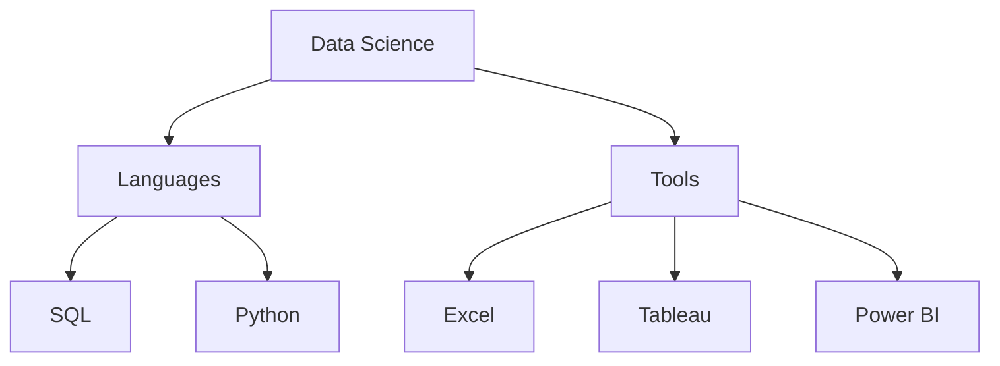
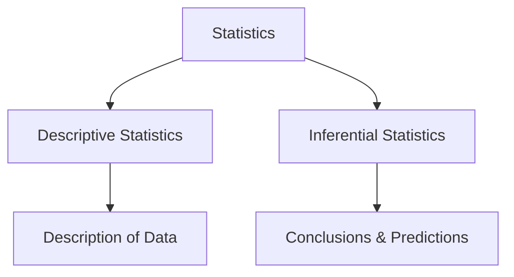
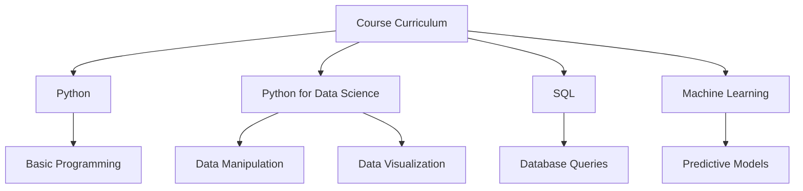

# SDHub Data Science Course - Class 1 Notes

## Course Introduction & Overview

### Learning Path Flow Diagram

---

## What is Data Science?

**Definition**: Data Science is simply the **study of data**.

### Data Science vs Data Analysis

#### Data Science

- **Focus**: Predicting the future using AI/ML
- **Statistics Used**: Inferential Statistics
- **Purpose**: Make predictions and forecasts
- **Example**: "How many students will join SDHub in the future?"

#### Data Analysis

- **Focus**: Taking insights from the past (historical events)
- **Statistics Used**: Descriptive Statistics
- **Purpose**: Categorize and describe existing data
- **Example**: "How many girls vs boys are in SDHub? What's the average age of students?"

### Data Science Venn Diagram

_Data Science encompasses AI/ML and uses statistics for future predictions_

---

## Statistics Framework

### Types of Statistics:

- **Descriptive Statistics**: Describes and summarizes data
- **Inferential Statistics**: Makes conclusions and predictions from data

---

## The What, Why, and How of Data Science

|Aspect|Explanation|
|---|---|
|**What**|Study of Data|
|**Why**|To extract insights from data|
|**How**|Using tools like Python, Tableau, Power BI|

---

## Data Science vs Data Analytics Relationship

> **Key Point**: Data Science and Analytics work hand in hand
> 
> - **Data Analytics**: Deals with past events
> - **Data Science**: Deals with both past and future events

**Real-world Example**: Indian exit polls for elections - analyzing past voting patterns to predict future election outcomes

---

## Career Opportunities

### Data Analytics Roles

- Data Analyst
- Business Analyst
- Marketing Analyst
- Financial Analyst
- Operations Analyst
- Research Analyst
- Product Analyst

### Data Science Roles

- Data Scientist
- Data Engineer
- Machine Learning Engineer
- AI Engineer
- Research Scientist
- Data Science Consultant
- MLOps Engineer
- Big Data Engineer

---

## Course Curriculum

### Core Learning Areas

1. **Statistics**
2. **Tools and Languages**
3. **Communication Skills**

### Detailed Curriculum

#### Subjects to Cover:

1. **Python** - Programming fundamentals
2. **Python for Data Science** - Libraries like Pandas, NumPy, Matplotlib
3. **SQL** - Database management and queries
4. **Machine Learning** - Algorithms and model building

---

## Key Takeaways from Class 1

- Data Science is fundamentally about studying and understanding data
- It combines past analysis with future predictions
- Statistics forms the backbone of data science work
- Multiple career paths available in both analytics and science domains
- Comprehensive curriculum covering programming, databases, and ML
- Tools and communication skills are essential for success

---

## Next Steps

- Prepare for upcoming Python fundamentals
- Review basic statistics concepts
- Familiarize yourself with the tools mentioned (Excel, Tableau, Power BI)