Of course! I have taken your rough notes, formatted them into a structured Markdown document, fact-checked the historical details, elaborated on key concepts, and created Mermaid diagrams for the visual elements.

Here are your polished and enhanced class notes:

---

# Data Science - Class 2 Notes

## 1. Applications of Data Science & Generative AI

Data Science powers the generative models that create new content across various media.

| Category | Description | Examples |
| :--- | :--- | :--- |
| 🖼️ **Image** | AI models that generate novel images from text prompts. | Midjourney, DALL-E 3, Stable Diffusion |
| 📹 **Video** | AI that creates realistic video clips from text or image inputs. | Google Veo, OpenAI Sora, RunwayML |
| 📝 **Text** | Models that generate human-like text for conversation, summarization, etc. | ChatGPT (OpenAI), Gemini (Google), Claude (Anthropic) |
| 🔊 **Audio** | AI that can generate speech, music, or sound effects. | ElevenLabs (TTS), Suno AI (Music), Voice-enabled Chatbots |

---

## 2. What is Artificial Intelligence (AI)?

**Definition**: Artificial Intelligence is a broad field of computer science focused on creating machines or systems that can perform tasks that typically require human intelligence. This includes abilities like reasoning, learning, problem-solving, and understanding language.

AI itself is a foundational concept, not a specific application. We interact with its various sub-fields:
-   **Machine Learning (ML)**
-   **Deep Learning (DL)**
-   **Natural Language Processing (NLP)**
-   **Generative AI**

### A Note on AI's Origins

The theoretical foundations of AI were significantly influenced by the work of **Alan Turing** during **World War II**. While Turing didn't "discover AI," his work was pivotal. He led a team at Bletchley Park, UK, that created a machine called the **Bombe**. This electro-mechanical device was designed to decipher the messages encrypted by the Nazi's **Enigma machine**.

By breaking the Enigma codes, Turing and his team demonstrated that a machine could perform complex logical reasoning, a task previously thought to be exclusive to humans. This laid the practical and philosophical groundwork for the concept of "thinking machines," which Turing later explored in his 1950 paper, "Computing Machinery and Intelligence," introducing the famous "Turing Test."

---

## 3. Data Science, ML, & DL: What Do They Do?

The core function of these fields is to find patterns in data to make predictions.

**Example**: Predicting tomorrow's temperature.
-   **Requirement**: Historical data (e.g., the last 10-100 days).
-   **Features (Inputs)**: `Date`, `Humidity`, `Wind Speed`, `Previous Day's Temp`.
-   **Label (Output)**: `Tomorrow's Temperature`.
-   The model learns the relationship between the features and the label to make a prediction.

### The "What, Why, and How"

| Field | What is it? | Why use it? | How does it work? |
| :--- | :--- | :--- | :--- |
| **Machine Learning (ML)** | A process enabling a machine to **learn from data** to solve a specific problem. It excels at finding patterns in structured, linear data. | To **make predictions** or classify information based on patterns in historical data. | By feeding it labeled data and allowing it to learn the underlying relationships using algorithms. |
| **Deep Learning (DL)** | A sub-field of ML that uses neural networks with many layers (**deep** networks) to learn from vast amounts of data, especially complex, non-linear data like images and text. | To solve **highly complex problems** that require understanding intricate patterns, like image recognition or language translation. | By processing data through multiple layers of a neural network, allowing it to learn hierarchical features from the data. |

---

## 4. Key Terminology

-   **Prompt Engineering**: The art and science of designing effective inputs (prompts) to communicate with and guide AI models to produce the desired output.
-   **Generative AI**: A class of AI models that can generate new, original content (text, images, audio, etc.) instead of just analyzing or classifying existing data.
-   **Natural Language Processing (NLP)**: A field of AI that enables machines to understand, interpret, and generate human language.
-   **Large Language Model (LLM)**: A type of deep learning model trained on massive text datasets, forming the foundation for tools like ChatGPT and Gemini.
-   **Exploratory Data Analysis (EDA)**: The process of analyzing and visualizing datasets to summarize their main characteristics, often with visual methods, before formal modeling.

---

## 5. Course Roadmap

The course is structured over approximately 4.5 months, broken down into three key phases.

```mermaid
graph TD
    subgraph Phase 1: Foundations [1 Month]
        A[🐍 Python Programming] --> B[📊 Python for Data Science];
    end
    
    subgraph Phase 2: BI & Databases [1 Month]
        C[🗃️ SQL] --> D[📈 Power BI + Excel];
    end
    
    subgraph Phase 3: Advanced AI [2.5 Months]
        E[🧠 Advanced Statistics] --> F[🤖 Machine Learning];
        F --> G[🗣️ NLP];
        G --> H[🧠 Deep Learning];
        H --> I[🎨 Generative AI];
        I --> J[🧑‍💻 AI Workflow & Agentic AI];
    end

    B --> C;
    D --> E;
```

---

## 6. Python Fundamentals

### What is Python?
Python is a **high-level, general-purpose programming language**. Its design philosophy emphasizes code readability and a syntax that allows programmers to express concepts in fewer lines of code than might be used in languages like C++ or Java.

-   **High-Level Language**: It uses an **interpreter** to translate human-readable code into machine code. This abstracts the programmer from complex memory management and hardware operations.

### Interpreter vs. Compiler
This explains how the code you write gets executed by the computer.

| Type | How it Works | Pros & Cons |
| :--- | :--- | :--- |
| **Interpreter** | Translates and executes code **line-by-line**. If there's an error, it stops at that line. | **Pro**: Easier and faster for debugging and development. **Con**: Generally slower execution speed. |
| **Compiler** | Translates the **entire program** into machine code first, creating an executable file (.exe, etc.). | **Pro**: Faster final execution speed. **Con**: Development can be slower (write -> compile -> run cycle). |

For data science and learning, an interpreter is often preferred because it allows for rapid, interactive exploration of data—you can run a line, see the output, and adjust your approach immediately.

### Why Python for Data Science?
-   **Open Source**: Free to use and modify, with a strong community backing.
-   **Platform Independent**: Code written on one OS (e.g., Linux) runs on another (e.g., Windows) without changes.
-   **Vast Libraries**: A massive ecosystem of specialized, high-performance libraries for data science (`Pandas`, `NumPy`, `Scikit-learn`), visualization (`Matplotlib`, `Seaborn`), and deep learning (`TensorFlow`, `PyTorch`).

### Programming Paradigms
Python is a multi-paradigm language, meaning you can write code in different styles:
1.  **Procedural**: Writing code as a sequence of instructions.
2.  **Functional**: Emphasizing the use of functions and avoiding changing state.
3.  **Object-Oriented (OOP)**: Bundling data and functionality into "objects."

### Python Environments
-   **Local**: Using IDEs (Integrated Development Environments) like VSCode, PyCharm, or text editors on your own machine.
-   **Cloud**: Using web-based platforms like Google Colab or Kaggle, which provide pre-configured environments and access to powerful hardware.

### Development Environment: Anaconda, UV, and Jupyter

The course will standardize on the **Anaconda distribution**. Anaconda is a popular all-in-one platform for data science that bundles Python, many essential libraries, and tools like the **Jupyter Notebook**. It simplifies package management through its `conda` environment system.

However, as a Linux user seeking a faster, more modern workflow, I will be using **`uv`**.
*   **My Personal Choice (`uv`)**: `uv` is an extremely fast Python package and environment manager. It serves as a lightweight and high-performance alternative to Anaconda for installing packages and managing virtual environments.

Regardless of the installation method, our primary tool for coding and analysis will be the **Jupyter Notebook**.

**Why Jupyter Notebook?**
Jupyter is the ideal IDE for data science because it allows us to:
*   Write and execute live code in isolated cells.
*   Document our process with Markdown text and headers.
*   Display outputs, tables, and visualizations directly within the notebook.

This interactive format makes it perfect for learning, experimenting, and sharing our analytical work.