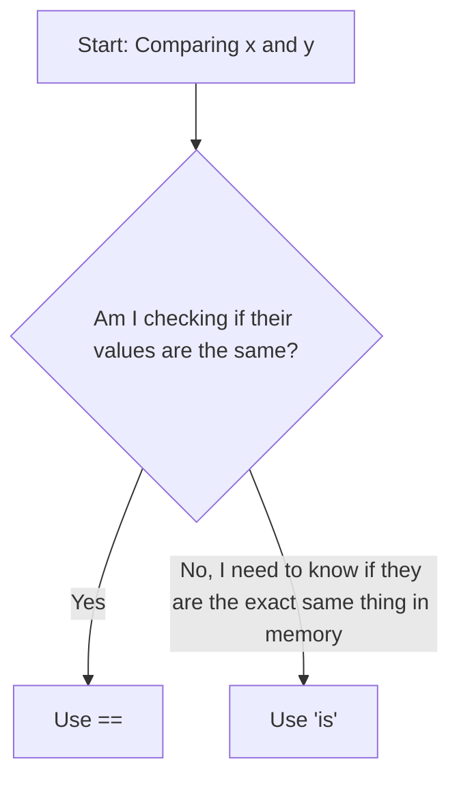

**Date:** [04-07-2025] 

---

### **Part 1: Review & Key Takeaways from Previous Class**

Today's class started with a review. The main points were:

*   **Identifiers:** The rules for naming variables (start with letter or `_`, case-sensitive, etc.).
*   **Data Types:** The basic types like `int`, `float`, `str`, and `bool`.

Sir emphasized the importance of using **meaningful variable names**. This makes the code easier to read and understand later. It's not just for the computer, it's for humans too.

**My Personal Rule:** Avoid single-letter names unless it's a simple counter (like `i` in a loop later).

| Good Names (Clear) | Bad Names (Confusing) |
| :----------------- | :-------------------- |
| `student_name`     | `s` or `s_name`       |
| `age`              | `a`                   |
| `salary_in_usd`    | `sal`                 |
| `first_name`       | `fname`               |

---

### **Part 2: Getting Input from the User (Dynamic Values)**

This was the first new topic. So far, I've only used **static values**, which means I hard-coded the value directly into the program.

```python
# Static value
name = "riyan"
```

The new method is using **dynamic values**, where the program asks the user for the value when it runs. This is done with the `input()` function.

```python
# Dynamic value from user
name = input("Enter your name: ")
print("Hello,", name)
```

#### **The Most Important Rule for `input()`**

The `input()` function **ALWAYS returns a string!** Even if the user types a number, Python sees it as text.

This means I can't do math with it directly. I have to convert it first. This is called **Type Casting**.

| Function | What it Does                 | My Example Code                            |
| :------- | :--------------------------- | :----------------------------------------- |
| `int()`  | Converts a string to an integer | `age = int(input("Enter your age: "))`     |
| `float()`| Converts a string to a float    | `salary = float(input("Enter salary: "))` |

**My successful code from the exercise:**

This code asks for the employee's details and correctly converts the `emp_ID` to an integer and `salary` to a float. The `role` can stay as a string.

```python
# My code for getting employee details
emp_ID = int(input("Enter your Employee ID: "))
role = input("Enter your role: ")
salary = float(input("Enter your salary"))

print("Hello", name, "Your employee ID is", emp_ID, "and your role", role, "with the salary", salary)
print(type(emp_ID))   # Correctly shows <class 'int'>
print(type(role))     # Correctly shows <class 'str'>
print(type(salary))   # Correctly shows <class 'float'>
```

---

### **Part 3: Python Operators**

The next major topic was operators. These are the symbols we use to do things with our variables.

#### **1. Arithmetic Operators**

These are for basic math.

| Operator | Name             | My Example         | Result  |
| :------- | :--------------- | :----------------- | :------ |
| `+`      | Addition         | `70 + 80`          | `150`   |
| `-`      | Subtraction      | `70 - 80`          | `-10`   |
| `*`      | Multiplication   | `'riyan ' * 10`    | repeats the string 10 times |
| `/`      | Division         | `70 / 80`          | `0.875` (always a float) |
| `//`     | Floor Division   | `70 // 80`         | `0` (cuts off the decimal part) |
| `%`      | Modulus          | `70 % 80`          | `70` (the remainder) |
| `**`     | Exponent         | `2 ** 3`           | `8` |

#### **2. Assignment Operators**

These are shortcuts for updating a variable's value.

```python
# The long way
a = 10
a = a + 10  # a is now 20

# The shortcut using an assignment operator
a = 10
a += 10     # This does the exact same thing
print("after:", a) # prints 20
```

#### **3. Comparison Operators**

Used to compare two things. They always give back `True` or `False`.

| Operator | Name                      | My Example | Result |
| :------- | :------------------------ | :--------- | :----- |
| `==`     | Is equal to?              | `a == 10`  | `True` |
| `!=`     | Is not equal to?          | `a != 20`  | `True` |
| `>`      | Is greater than?          | `a > 5`    | `True` |
| `<`      | Is less than?             | `a < 20`   | `True` |
| `>=`     | Is greater than or equal? | `a >= 10`  | `True` |
| `<=`     | Is less than or equal?    | `a <= 10`  | `True` |

#### **4. Logical Operators**

Used to combine multiple comparisons.

*   **`and`**: BOTH sides must be `True` for the whole thing to be `True`.
*   **`or`**: ONLY ONE side needs to be `True` for the whole thing to be `True`.
*   **`not`**: Flips the result (`not True` becomes `False`).

**Truth Table (a good way to memorize this):**

| A | B | A and B | A or B |
|:---:|:---:|:---:|:---:|
| True | True | True | True |
| True | False | False | True |
| False | True | False | True |
| False | False | False | False |
#### **5. Membership & Identity Operators**

*   **Membership (`in`, `not in`):** Checks if something is inside a sequence (like a string).
    ```python
    # My code from the exercise:
    'a' in 'riyan' # This returns True
    'z' in 'riyan' # This returns False
    ```
*   **Identity (`is`, `is not`):** Checks if two variables are the *exact same object in memory*. This is stricter than `==`.

**How to think about `is` vs `==`:**



---

### **End of Week 1 Summary & My To-Do List**

This week was all about the fundamentals.

**What I learned:**
*   How to properly name variables.
*   The basic data types.
*   How to get information from a user with `input()` and why I **must** use `int()` or `float()` to convert numbers.
*   All the different operators for math, comparing things, and logic.

**My Practice Plan:**
1.  Redo all the coding exercises from the notebooks without looking at the answers.
2.  Write a new program from scratch:
3.  Experiment with the operators. See what happens with weird combinations.