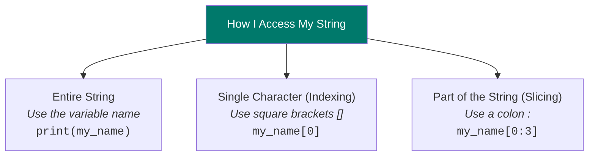

# 📚 My Notes: Week 2, Day 5 - Python Strings

**📅 Date:** July 7th, 2025
**🎯 Today's Goal:** Revise operators and get hands-on with Python strings.

---

## Part 1: Today's Revision

Today's session started with a quick recap of what we've learned so far.

### ► My Workflow

Sir reviewed the standard workflow for the course. We have two main environments:

*   **Local:** Using Anaconda and Jupyter Notebook on my own machine.
*   **Cloud:** Using Google Colab for when I'm not on my main laptop.

Inside Jupyter, the process is to use **Markdown cells** (like this one) for my notes and **Code cells** for my Python scripts.

### ► Core Concepts Recap

I need to remember these basics:
*   **Variable:** A name I give to a value (e.g., `my_name`).
*   **Value:** The data itself (e.g., `"Riyan"`).
*   **Type Casting:** This was a key point. Sir reminded us that `input()` **always gives a string**. I have to use `int()` or `float()` to convert it to a number if I want to do math.

```python
# A quick test to remind myself
age_as_string = input("Enter your age: ")
print(f"The data type is initially: {type(age_as_string)}")

age_as_number = int(age_as_string)
print(f"After using int(), the data type is: {type(age_as_number)}")
```

---

## Part 2: My Warm-up Practice

After the revision, we jumped into some practice problems to get our brains working.

### 1. Division Calculator
**Task:** Get two numbers from the user and show the result of their division.

```python
# My code for the division problem
num1 = float(input("Enter the 1st number: "))
num2 = float(input("Enter the 2nd number: "))

division_result = num1 / num2

print(f"The division of these two numbers is: {division_result}")
```

### 2. Celsius to Fahrenheit Converter
**Task:** Get the day and a temperature in Celsius, then convert it to Fahrenheit.

```python
# My code for the temperature converter
day = input("Enter today's day: ")
temp_celsius = float(input("Enter the temperature in Celsius: "))

# The formula is F = (C * 9/5) + 32
temp_fahrenheit = (temp_celsius * 9/5) + 32

print(f"\nOn {day}, the temperature {temp_celsius}°C is equal to {temp_fahrenheit}°F.")
```

### 3. SD Hub Email Creator
**Task:** Get my first name and create a custom email address for me.

```python
# My code for the email generator
first_name = input("Enter your first name: ")

# My new email address
email_address = first_name + "@sdhub.in"

print("Your new email address is:", email_address)
```

---

## Part 3: Today's New Topic - Strings!

With the warm-up done, we started on the main topic: **Strings**.

> The official definition says a string is a **sequence of characters**. It's an **immutable** data type, which means I can't change it after I create it.

### ► Creating a String
I learned there are three ways to create strings in Python.

| Method | My Example |
| :--- | :--- |
| **Single Quotes** | `my_name = 'Riyan'` |
| **Double Quotes** | `my_sentence = "My name is 'Riyan'"` |
| **Triple Quotes** | `my_paragraph = '''This is a multi-line<br>string.'''` |

### ► Accessing My String's Content
This was the coolest part. Since a string is a sequence, I can grab any part of it I want.



#### a) Indexing (Getting a single letter)

Every character has an index number. It starts from 0 for the first letter. Negative indexing starts from -1 for the last letter.

**Here's the breakdown for my name, `my_name = "Riyan"`:**

| Character | **R** | **i** | **y** | **a** | **n** |
| :--- | :-: | :-: | :-: | :-: | :-: |
| **Positive Index** | 0 | 1 | 2 | 3 | 4 |
| **Negative Index** | -5 | -4 | -3 | -2 | -1 |

#### b) Slicing (Getting a piece of the string)

The format is `my_name[start:end:step]`. The most important thing to remember is that the `end` index is **not included**.

---

## Part 4: Sir's End-of-Class Challenge

To wrap up the class, Sir gave us a set of challenges to solve using the string manipulation techniques we just learned. This was a test of our understanding.

**The Challenge:** For a given string, perform the following tasks:
- Display the string
- Display the first character
- Display the last character
- Display the 3rd character
- Display the first three characters
- Display the last two characters
- Display characters between the 3rd and 4th position
- Display the reverse of the string
- Display alternate characters
- Display the string by skipping 4 characters

**My Solution:**
```python
# The string I'm using for the challenge
my_string = "Riyan"
print(f"My original string for the challenge is: '{my_string}'")
print("-" * 40)

# Display the entire string
print(f"The full string: '{my_string}'")

# Display the first character
print(f"First character: '{my_string[0]}'")

# Display the last character
print(f"Last character: '{my_string[-1]}'")

# Display the 3rd character (which is at index 2)
print(f"Third character: '{my_string[2]}'")

# Display the first three characters
print(f"First three characters: '{my_string[0:3]}'")

# Display the last two characters
print(f"Last two characters: '{my_string[-3:]}'")

# Display characters between 3rd and 4th (index 2 and 3)
print(f"Chars between 3rd and 4th: '{my_string[2:4]}'")

# Display the reverse of the string
print(f"My name reversed: '{my_string[::-1]}'")

# Display alternate characters (skip 1, step is 2)
print(f"Alternate characters: '{my_string[::2]}'")

# Display the string by skipping 4 characters (step is 5)
print(f"Skipping 4 characters: '{my_string[::5]}'")
```