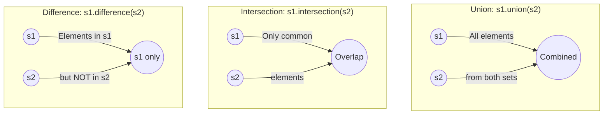
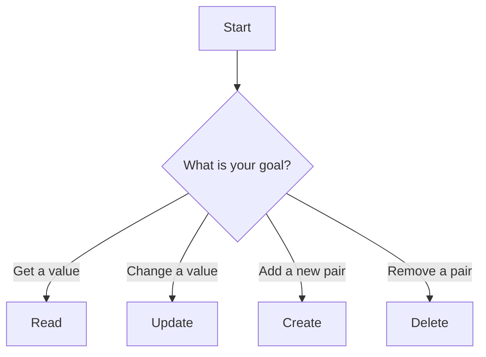

# Python Study Notes: Week 2, Day 7 

Welcome! Today, our goal is to master three of Python's most essential data structures: **Tuples**, **Sets**, and **Dictionaries**. Think of these as different types of containers, each designed for a specific job. Understanding which container to use and why is a key step to becoming a proficient Python programmer.

## A Deeper Look at Tuples: The "Read-Only" Container

We'll start with a review of tuples. The single most important thing to remember about a tuple is that it's **immutable**, which is a fancy word for "unchangeable."

**Analogy:** Imagine you write a list of rules on a stone tablet. Once the rules are carved, you can't erase or change them. That stone tablet is a tuple. A list, on the other hand, is like writing on a whiteboard—you can erase, add, and change things whenever you want.

### Why Would You Ever Want an Unchangeable List?

This is a great question. Immutability is a feature, not a bug! You use tuples when you have data that you want to protect from accidental changes.

*   **Configuration Settings:** Storing settings like a website URL or a database name that shouldn't change while the program runs.
*   **Returning Multiple Values:** A function can neatly return multiple results as a single tuple (e.g., `return (name, age, city)`).
*   **Data Integrity:** When you pass a tuple to another part of your program, you can be 100% sure it won't be modified.

### Working with Tuples

```python
# A tuple is created with parentheses ().
tup1 = (1, 2, 3, 4, 5)

# --- Accessing data works just like with lists ---

# Get the first element (indexing starts at 0)
first_element = tup1[0]
print(f"First element: {first_element}")

# Get the last element using a negative index
last_element = tup1[-1]
print(f"Last element: {last_element}")

# Get a "slice" of the tuple (e.g., the last two elements)
last_two = tup1[-2:]
print(f"Last two elements: {last_two}")

# --- The "Immutability" Rule in Action ---
# If you try to change an element, Python will stop you with an error.
# The following line will cause a TypeError:
# tup1[0] = 99 # ERROR! 'tuple' object does not support item assignment

# So, how do we "add" a name as requested in the notebook?
# We can't change the original. Instead, we create a NEW tuple.
name_to_add = ("Riyan",) # The comma is crucial! Without it, Python thinks it's just a string in parentheses.

# This creates a brand new tuple by combining the two.
# The original tup1 is discarded and the variable now points to this new one.
tup1 = tup1 + name_to_add
print(f"The new tuple is: {tup1}")
```
**Output:**
```
First element: 1
Last element: 5
Last two elements: (4, 5)
The new tuple is: (1, 2, 3, 4, 5, 'Riyan')
```

## Main Topic 1: Sets - The "Unique & Unordered" Container

A Set is a container designed for two primary purposes:
1.  Storing a collection of **unique** items (no duplicates allowed).
2.  Performing high-speed mathematical set operations (like union, intersection, etc.).

**Analogy:** Think of a set as a club roster. A person can't be on the roster twice—they're either in the club or they're not. Also, the roster isn't necessarily sorted by when people joined; it's just a collection of all the members.

### Key Characteristics of Sets

*   **Unordered**: The items in a set do not have a defined order. You can't ask for the "first" or "last" item.
*   **No Indexing**: Because they are unordered, you **cannot** access elements using an index (e.g., `my_set[0]` will cause an error).
*   **Unique Elements**: Duplicates are automatically and instantly removed. This is their most famous feature.
*   **Mutable**: You can add and remove elements from a set.

### Creating and Modifying Sets

```python
# You can create a set with curly braces {}
# Notice how the duplicate '1' and '2' are automatically removed.
s1 = {1, 2, 2, 1, 5, 5, 7}
print(f"The set s1 is: {s1}")

# You can also create a set from a list or range.
# This is a great way to get all the unique items from a list.
s2 = set(range(10, 20))
print(f"The set s2 is: {s2}")

# --- Watch Out! Creating an EMPTY set ---
# To create an empty set, you MUST use the set() function.
empty_set = set()
print(f"The type of empty_set is: {type(empty_set)}")

# If you use empty braces, you get an empty DICTIONARY instead!
empty_dict = {}
print(f"The type of empty_dict is: {type(empty_dict)}")


# --- Adding and Removing Elements ---
# Let's add the number 50 to our set s2
s2.add(50)
print(f"s2 after adding 50: {s2}")

# Now let's remove the number 15
s2.remove(15)
print(f"s2 after removing 15: {s2}")

# Note: .remove() will crash if the item doesn't exist.
# A safer alternative is .discard(), which does nothing if the item isn't found.
s2.discard(999) # This will run without error.
```

### The Power of Set Operations

This is where sets truly shine. They allow for incredibly fast and readable comparisons between collections.



**Let's see this in code:**
```python
set_A = set(range(50, 100))
set_B = set(range(70, 120))

# 1. Union: A new set with all elements from both Set A and Set B.
union_result = set_A.union(set_B)
# print(f"Union Result: {union_result}") # This will print all numbers from 50 to 119

# 2. Intersection: A new set with only the elements that are common to BOTH Set A and Set B.
intersection_result = set_A.intersection(set_B)
print(f"Intersection (numbers in both): {intersection_result}")

# 3. Difference: A new set with elements that are in Set A, but NOT in Set B.
difference_result = set_A.difference(set_B)
print(f"Difference (numbers in A but not B): {difference_result}")
```
**Output:**
```
Intersection (numbers in both): {70, 71, 72, 73, 74, 75, 76, 77, 78, 79, 80, 81, 82, 83, 84, 85, 86, 87, 88, 89, 90, 91, 92, 93, 94, 95, 96, 97, 98, 99}
Difference (numbers in A but not B): {50, 51, 52, 53, 54, 55, 56, 57, 58, 59, 60, 61, 62, 63, 64, 65, 66, 67, 68, 69}
```

## Main Topic 2: Dictionaries - The "Key-Value" Container

A dictionary is the most versatile data structure in Python. It stores data in **key-value pairs**.

**Analogy:** A dictionary is exactly like a real-world dictionary. You don't look for a definition by its page number (an index); you look it up by its **word** (the **key**) to find its **definition** (the **value**). Another great analogy is a contact list: you look up a person's **name** (key) to get their **phone number** (value).

### Anatomy of a Dictionary
A dictionary is made of key-value pairs inside curly braces `{}`.

```
di = {'key1': 'value1', 'key2': 'value2'}
```
*   **Keys**:
    *   They are the identifiers you use to retrieve a value.
    *   They **must be unique**. You can't have two identical keys.
    *   They **must be immutable** (strings, numbers, and tuples make great keys; lists do not).
*   **Values**:
    *   They hold the data associated with a key.
    *   They can be **any data type** (a string, a list, a number, another dictionary, etc.).
    *   They **can be duplicated**.

### Creating and Using Dictionaries

```python
# A simple dictionary
di = {'name': 'Riyan', 'age': 20}

# A more complex dictionary, like the one in the notebook.
# This is a common pattern for storing data that could be in a spreadsheet.
employee_data = {
    'e_id': (101, 102, 103, 104, 105),
    'name': ('riyan', 'sohail', 'faizaan', 'dawood', 'Mujahid'),
    'role': ('engg', 'backend', 'data', 'ai/ml', 'mang'),
    'salary': (10000, 20000, 30000, 40000, 500000)
}
```

### Dictionary Operations: The "CRUD" Model (Create, Read, Update, Delete)

Working with dictionary data follows a very simple and logical pattern.



**Let's see the code for each:**
```python
# Let's use a simpler dictionary for these examples
student = {'name': 'Faizaan', 'major': 'Data Science', 'courses': ['Python', 'SQL']}

# --- 1. READ (Accessing Data) ---
# Use the key in square brackets to get its value.
student_name = student['name']
print(f"Student's name is: {student_name}")

# --- 2. UPDATE (Modifying Data) ---
# Access the key and assign it a new value.
student['major'] = 'AI/ML Engineering'
print(f"Student's new record: {student}")

# --- 3. CREATE (Adding a New Key-Value Pair) ---
# Simply assign a value to a brand new key.
student['grad_year'] = 2026
print(f"Student record after adding year: {student}")

# --- 4. DELETE (Removing a Key-Value Pair) ---
# The .pop() method is the standard way to remove a key-value pair.
student.pop('courses')
print(f"Student record after removing courses: {student}")
```
**Output:**
```
Student's name is: Faizaan
Student's new record: {'name': 'Faizaan', 'major': 'AI/ML Engineering', 'courses': ['Python', 'SQL']}
Student record after adding year: {'name': 'Faizaan', 'major': 'AI/ML Engineering', 'courses': ['Python', 'SQL'], 'grad_year': 2026}
Student record after removing courses: {'name': 'Faizaan', 'major': 'AI/ML Engineering', 'grad_year': 2026}
```
### A Final, Important Lesson: The `TypeError` in the Notebook Explained
In the notebook, you tried to change a name inside the `employee_data` dictionary and got an error. Let's break down exactly why that happened.

**The Code:** `di['name'][-1] = "test"`

1.  **`di['name']`**: This part of the code accessed the dictionary and retrieved the value associated with the key `'name'`. The value it found was the **tuple**: `('riyan', 'sohail', 'faizaan', 'dawood', 'Mujahid')`.
2.  **`(...) [-1] = "test"`**: The code then tried to change the last item *of that tuple*.
3.  **The Error**: Since tuples are **immutable**, Python correctly threw a `TypeError: 'tuple' object does not support item assignment`.

This is a fantastic lesson on how data structures interact. The dictionary itself is mutable (we can add or remove keys), but the properties of its values (like a tuple's immutability) are still respected. If the value had been a `list`, the operation would have worked perfectly