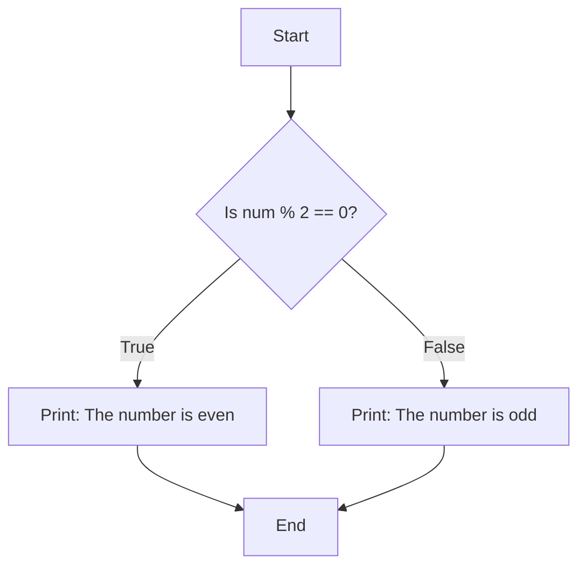
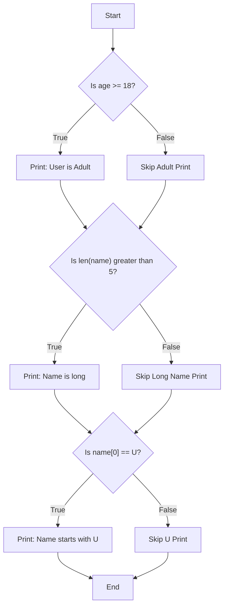
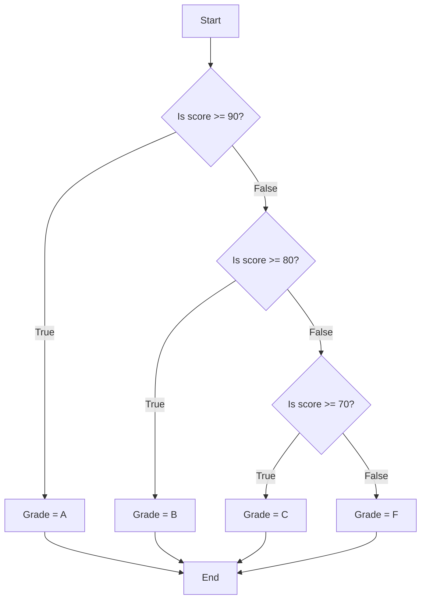

# 📚 Python Study Notes Week 2, Day 8 : Revision & Conditional Programming

**📅 Date:** July 10th, 2025

Welcome! Today we will reinforce our understanding of Python's fundamentals and then take a major step forward into **Conditional Programming**. This is where our programs stop being simple, top-to-bottom scripts and start making intelligent decisions.

## Part 1: Revisiting Python's Foundations

Before we learn to control our program's flow, let's quickly review the building blocks we're working with.

### Variables: The Labeled Boxes of Programming

A variable is a name you give to a memory location to store a piece of data. Think of it as a labeled box where you can put information.

-   **Identifier:** The name of the variable (e.g., `age`).
-   **Assignment Operator:** The equals sign (`=`), which tells Python to "put the value on the right into the variable on the left."
-   **Data/Value:** The information stored in the variable (e.g., `28`).

```python
# identifier   assignment   data/value
name         =            "Uwaish"
age          =            28
```

**Rules for Identifiers (Variable Names):**
*   Must start with a letter (a-z, A-Z) or an underscore (`_`).
*   Cannot start with a number.
*   Can only contain letters, numbers, and underscores.
*   Are case-sensitive (`age` is different from `Age`).

### Operators: The Tools for Doing Work

Operators are special symbols that perform operations on variables and values.

| Category | Operators | What they do |
| :--- | :--- | :--- |
| **Arithmetic** | `+`, `-`, `*`, `/`, `%` | Perform mathematical calculations. The **modulo (`%`)** gives the remainder of a division. |
| **Assignment** | `=` | Assigns a value to a variable. |
| **Comparison** | `==`, `!=`, `>`, `<` | Compares two values and results in `True` or `False`. |
| **Logical** | `and`, `or`, `not` | Combines conditional statements. |

### Data Types: The Different Kinds of Information

Python needs to know what *kind* of data it's working with. Here's a recap:

**1. Basic (Primitive) Types:**
*   **Integer (`int`):** Whole numbers, like `10`, `-50`, `1000`.
*   **Float (`float`):** Numbers with a decimal point, like `22.5`, `3.14`.
*   **String (`str`):** Text, enclosed in single (`'`) or double (`"`) quotes.
*   **Boolean (`bool`):** Represents truth values, can only be `True` or `False`.

**2. Collection Types:** These are containers that hold other data.

### Deep Dive: A Comparison of Collection Types

This table summarizes everything you need to know about Python's four main collection types.

| Feature                | List                 | Tuple                 | Set               | Dictionary                 |
| :--------------------- | :------------------- | :-------------------- | :---------------- | :------------------------- |
| **Syntax (Shape)**     | `[ ]`                | `( )`                 | `{ }` or `set()`  | `{key: value}`             |
| **Is it Ordered?**     | **Yes**              | **Yes**               | **No**            | **Yes** (in Python 3.7+)   |
| **Is it Mutable?**     | **Yes** (changeable) | **No** (unchangeable) | **Yes**           | **Yes**                    |
| **Allows Duplicates?** | **Yes**              | **Yes**               | **No**            | Keys are unique            |
| **Indexed By?**        | Number [0, 1, 2...]  | Number [0, 1, 2...]   | Not indexed       | Key                        |
| **How to Update?**     | `my_list[0] = 'new'` | Cannot be updated     | N/A               | `my_dict['key'] = 'new'`   |
| **How to Add?**        | `my_list.append()`   | Concatenate `+`       | `my_set.add()`    | `my_dict['new_key'] = val` |
| **How to Delete?**     | `my_list.pop()`      | Cannot be deleted     | `my_set.remove()` | `my_dict.pop('key')`       |

## Part 2: Working with Data (A Practical Revision)

The exercises in your notebook are perfect examples of the **CRUD** model: **C**reate, **R**ead, **U**pdate, **D**elete.

### Strings
```python
# 1. CREATE and READ from user
str1 = input("Please enter your string:") # e.g., "My name is Uwaish"

# 2. READ (Accessing)
print(f"The string is: {str1}")
print(f"The last char is: {str1[-1]}") # 'h'
print(f"The reverse is: {str1[::-1]}") # 'hsiawU si eman yM'

# 3. Performing Operations
print(f"The length is: {len(str1)}") # 17
# To count words, we split the string by spaces and count the resulting list items
print(f"Word count is: {len(str1.split(' '))}") # 4
```

### Lists
```python
# 1. CREATE a list of numbers from 1 to 10
li = list(range(1, 11))

# 2. READ
print(f"The list is: {li}")
print(f"The last three elements are: {li[-3:]}")

# 3. UPDATE (Add an element)
li.append(100)
print(f"After adding 100: {li}")

# 4. DELETE (Remove an element)
# .pop(0) removes the element at index 0
li.pop(0)
print(f"After deleting the first element: {li}")
```

## Part 3: Formatting Strings for Clear Output

Putting variables directly into strings is essential for creating readable output. Python gives us two great ways to do this.

### Method 1: The `.format()` Method

This method uses curly braces `{}` as placeholders inside the string. You then call the `.format()` function on the string and pass your variables into it in the correct order.

```python
day = "Thursday"
temp = 22

# The first {} gets replaced by the first variable (day)
# The second {} gets replaced by the second variable (temp)
print("Today is {} and the temperature is {} degree celsius".format(day, temp))
```

### Method 2: The f-string (The Modern Way)

This is the newer, more readable, and generally preferred method. You simply put an `f` before the opening quote of the string. This allows you to place your variables directly inside the curly braces.

```python
day = "Thursday"
temp = 22

# The f tells Python to evaluate the expressions inside the {}
print(f"Today is {day} and the temperature is {temp} degree celsius.")
```

---
## Part 4: Conditional Programming - Making Your Code Smart

So far, our code has been **procedural** or **sequential**: it runs from top to bottom, one line at a time. But what if we want it to make decisions? That's where **conditional programming** comes in. It allows us to control the *flow* of our program.

**The Key Idea: The `if` Statement**
The `if` statement checks if a condition is `True`. If it is, the code inside its block is executed. If not, the code is skipped.

**The Most Important Rule: INDENTATION**
In Python, the spaces at the beginning of a line are not for style; they are **SYNTAX**. Indentation tells Python which lines of code belong to the `if` block, the `else` block, or any other block. A block starts with a colon (`:`) and consists of all subsequent indented lines.

### `if-else`: The Two-Way Street

This is the simplest conditional structure. It asks a single question and has two possible outcomes.

**How it Works:**
1.  Check the `if` condition.
2.  If it's `True`, run the code inside the `if` block and then skip the `else` block completely.
3.  If it's `False`, skip the `if` block and run the code inside the `else` block.



**Code Example: The Odd/Even Checker**
Let's break down how this works:
*   The **modulo operator (`%`)** calculates the remainder of a division.
*   Any even number divided by 2 has a remainder of `0`.
*   Any odd number divided by 2 has a remainder of `1`.

```python
num = int(input("Please enter a number: "))

# The condition: is the remainder when num is divided by 2 equal to 0?
if num % 2 == 0:
    # This block only runs if the condition is True.
    # Notice the indentation!
    print("The number is even")
else:
    # This block only runs if the condition is False.
    print("The number is odd")
```

### `if-if-if`: Multiple Independent Checks

Use this structure when you want to check several different conditions that are **not related** to each other. The program will evaluate every single `if` statement, one after another.



**Code Example: Checking User Details**
```python
name = input("Please enter your name: ")
age = int(input("Please enter your age: "))

# Check #1
if age >= 18:
    print("The user is Adult.")

# Check #2 (This is checked regardless of the first if)
if len(name) > 5:
    print("Name length is greater than 5.")

# Check #3 (This is also checked regardless of the others)
# .upper() makes the check case-insensitive!
if name[0].upper() == 'U':
    print("Name starts with 'U'.")
```

### `if-elif-else`: The Chain of Choices

Use this when you have **multiple related conditions**, but you only want **one** outcome. Python checks the conditions in order and runs the block for the *very first one* that is `True`, then it skips the rest of the chain.

**Use Case:** Assigning a letter grade based on a score. A score can't be an 'A' and a 'B' at the same time.


**Code Example:**
```python
score = int(input("Enter your score: "))

if score >= 90:
    print("Grade is A")
elif score >= 80:
    print("Grade is B")
elif score >= 70:
    print("Grade is C")
else:
    print("Grade is F")
```