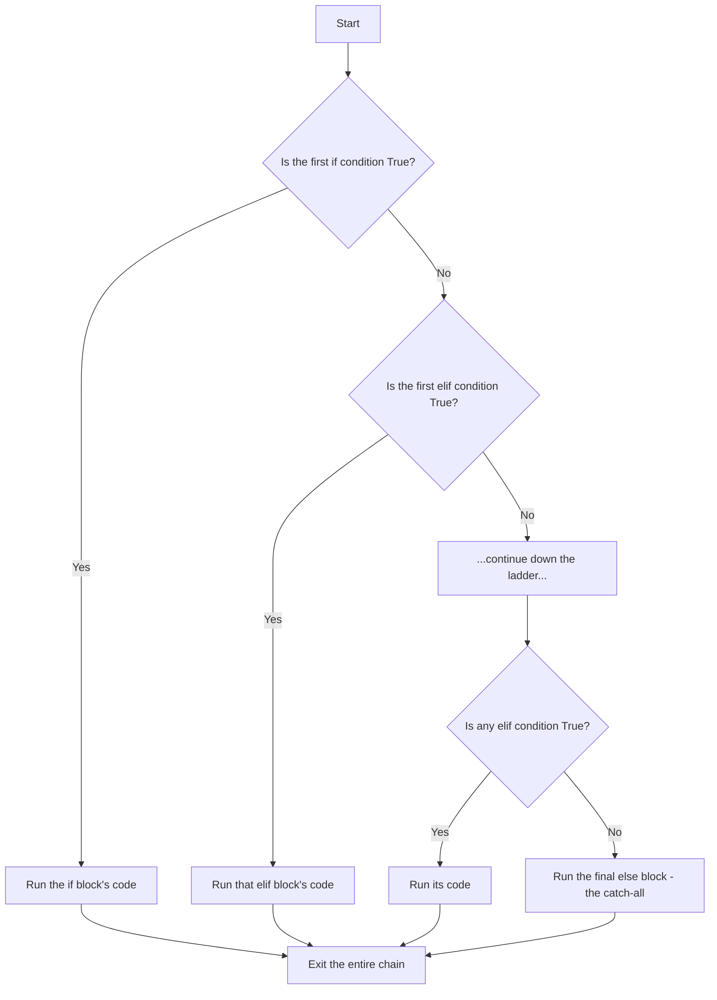
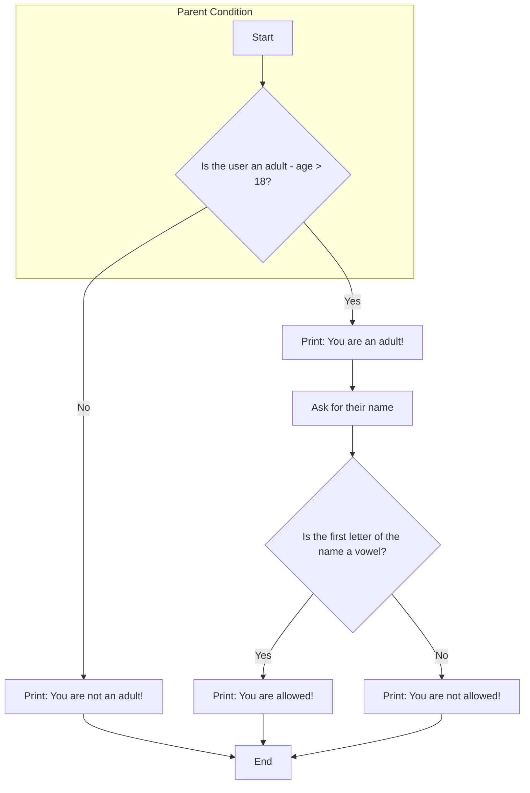
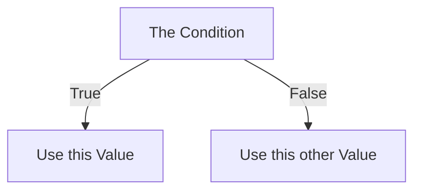

# A Deep Dive into Advanced Conditional Logic

Today, we move beyond simple `if-else` statements and learn how to build programs that can handle complex, multi-layered decisions. We will master three core techniques: chaining conditions with `elif`, nesting conditions within each other, and writing them concisely with the ternary operator.

## 1. Chained Conditions: The `if-elif-else` Ladder

This is the structure you use when you have **multiple related conditions**, but you only want **one single outcome**. Think of it as a series of questions asked in order. The moment one gets a "yes," the questioning stops.

**When to use it:** Grading systems, choosing from a menu of options, or any situation where the conditions are mutually exclusive.

### Visualizing the Flow

The program flows down the ladder, executing the code for the *very first* `True` condition it finds, and then it immediately exits the entire chain.



### In Practice: The Student Grading WAP

Your notebook example of grading a student based on their score is the perfect illustration of this concept.

**The Code from `Conditional Prog.ipynb`:**
```python
# Task: Grade a student based on their score.
score = int(input("Please enter your score:"))

# 1. First Check: Is the score in the top tier?
if score > 60:
    print("Pass with I Division!")

# 2. Second Check: If not, is it in the middle tier?
# This line is only ever reached if the first condition (score > 60) was FALSE.
# This means we don't need to write "and score <= 60". The elif implies it.
elif score > 33:
    print("Pass with II Division!")

# 3. The Catch-All: If none of the above were true...
# This block runs for any score that is not greater than 33.
else:
    print("Fail!")
```
**The "Smallest Detail":** The power of `elif` is that it makes your code cleaner. Because it only runs when the previous `if` or `elif` statements were `False`, you can write `elif score > 33:` instead of the more verbose `elif score > 33 and score <= 60:`.

## 2. Nested Conditions: Decisions Within Decisions

Nesting is placing one `if` statement *inside* another. This creates a parent-child relationship between conditions. The inner "child" condition is only ever checked if the outer "parent" condition is `True`.

**When to use it:** When you need to ask a follow-up question that only makes sense after a certain condition has been met (e.g., asking for a name *after* confirming a user is an adult).

### Visualizing the Flow

Notice how the second decision point is entirely contained within the "Yes" path of the first decision.


### In Practice: The Adult Vowel-Checker WAP

**The Code from `Conditional Prog.ipynb`:**
```python
# Task: Allow adults whose names start with a vowel.
age = int(input("Please enter your age:"))

# --- LEVEL 1: The Parent Condition ---
if age > 18:
    print("You are an adult!")
    
    # This input is only requested if the user is an adult.
    name = input("Please enter your name:")
    
    # --- LEVEL 2: The Nested Child Condition ---
    # It checks if the lowercase first letter of the name is 'in' the string of vowels.
    if name[0].lower() in 'aeiou':
        print("You are allowed!")
    else:
        print("You are not allowed!")
        
else:
    print("You are not an adult!")
```
**The "Smallest Details":**
*   **`name[0]`**: Accesses the very first character of the `name` string.
*   **`.lower()`**: A crucial string method that converts the character to lowercase. This ensures your code works whether the user types "Aisha" or "aisha".
*   **`in`**: The membership operator. `if 'a' in 'aeiou'` checks if the character `'a'` is a member of the vowel string, which is `True`.

## 3. The Ternary Operator: Concise Single-Line Logic

The Ternary Operator (or Conditional Expression) is a clean, one-line way to write a simple `if-else` statement. It's not for complex logic, but it's perfect for assigning one of two possible values to a variable.

**When to use it:** When you need to make a simple choice and assign the result immediately.

### Visualizing the Logic
Think of it as a compact version of a flow chart.



**The Syntax:**
`[value_to_use_if_true] if [the_condition_to_check] else [value_to_use_if_false]`

### In Practice: The Square vs. Cube WAP

This is the ideal scenario for a ternary operator because you are doing one simple thing: assigning a calculated value to a single variable.

**The Code from `07.ipynb`:**
```python
# Task: Calculate the square if a number is even, and the cube if it's odd.
num = int(input("Enter a number: "))

#         [Value if True]  if [The Condition] else [Value if False]
#               |                |                     |
#               V                V                     V
result =      num ** 2     if num % 2 == 0     else   num ** 3

print(f"The result is: {result}")
```
**The "Smallest Detail":** The entire expression `num ** 2 if num % 2 == 0 else num ** 3` is evaluated first. It resolves to a single value (either the square or the cube), and *that final value* is what gets assigned to the `result` variable.

### TODO home work

Of course. Here is the fully solved and explained practice worksheet, formatted in Markdown for clarity.

***

# Python Fundamentals: Practice Worksheet (Solutions)

Here are the detailed answers and explanations for the practice worksheet.

## 1. Identifiers

**Which of the following are valid Python identifiers?**  
a) `my_var`  
b) `123name`  
c) `_temp123`  
d) `class`

***
**Answer:**  
The valid identifiers are **a) `my_var`** and **c) `_temp123`**.

**Explanation:**
*   **a) `my_var`**: Valid because it starts with a letter and contains only letters and underscores.
*   **b) `123name`**: **Invalid** because identifiers cannot start with a number.
*   **c) `_temp123`**: Valid because it starts with an underscore and contains letters and numbers.
*   **d) `class`**: **Invalid** because `class` is a reserved keyword in Python and cannot be used as a variable name.

***

## 2. Operators

**What is the output of the following expression and why?**  
```python
a = 10
b = 5
print(a // b + a % b)
```

***
**Answer:**  
The output is **`2`**.

**Explanation:**
Python evaluates this expression based on operator precedence.
1.  **`a // b` (Floor Division):** `10 // 5` calculates how many times 5 fits completely into 10, which is `2`.
2.  **`a % b` (Modulo):** `10 % 5` calculates the remainder of the division, which is `0` (since 10 divides evenly by 5).
3.  **`+` (Addition):** The results are then added: `2 + 0`, which equals `2`.

***

## 3. Datatypes

**What will be the datatype of the following?**
```python
x = 3.14
y = "123"
z = True
print(type(x), type(y), type(z))
```

***
**Answer:**  
The output will be: `<class 'float'> <class 'str'> <class 'bool'>`

**Explanation:**
*   `x = 3.14` is a number with a decimal point, so its type is **float**.
*   `y = "123"` is enclosed in quotes, making it a **string**, not a number.
*   `z = True` is one of Python's two special boolean values, so its type is **bool**.

***

## 4. Strings

**Write a Python program to:**  
- Take a user input string  
- Convert it to uppercase  
- Print the reverse of the string

***
**Answer:**  
```python
# 1. Take a user input string
user_string = input("Please enter a sentence: ")

# 2. Convert it to uppercase using the .upper() method
uppercase_string = user_string.upper()
print(f"In uppercase: {uppercase_string}")

# 3. Print the reverse of the string using slicing
# The [::-1] slice means start from the end, go to the beginning, with a step of -1.
reversed_string = uppercase_string[::-1]
print(f"The reverse is: {reversed_string}")
```
***

## 5. List

**Given the list:**  
`fruits = ["apple", "banana", "cherry"]`  
**Write code to:**  
- Add "orange" to the list  
- Remove "banana"  
- Print the second item

***
**Answer:**  
```python
fruits = ["apple", "banana", "cherry"]
print(f"Original list: {fruits}")

# Add "orange" to the list using the .append() method
fruits.append("orange")
print(f"After adding orange: {fruits}")

# Remove "banana" from the list using the .remove() method
fruits.remove("banana")
print(f"After removing banana: {fruits}")

# Print the second item (at index 1)
# The list is now ["apple", "cherry", "orange"]
second_item = fruits[1]
print(f"The second item is now: {second_item}")
```
***

## 6. List (Indexing & Slicing)

**What will be the output of:**
```python
my_list = [10, 20, 30, 40, 50]
print(my_list[1:4])
print(my_list[-2])
```
***
**Answer:**  
The output is:
```
[20, 30, 40]
40
```
**Explanation:**
*   `my_list[1:4]`: This is a slice that starts at index 1 and goes up to (but does not include) index 4.
*   `my_list[-2]`: This uses negative indexing. `-1` is the last item, so `-2` is the second-to-last item, which is `40`.

***

## 7. Tuple

**Write a Python program that creates a tuple with 4 elements. Try changing one element — what happens and why?**

***
**Answer:**  
```python
# Create a tuple with 4 different data types
my_tuple = ("apple", 25, 3.14, True)
print(f"Original tuple: {my_tuple}")

# Try to change the second element (at index 1)
# The following line is commented out because it will crash the program.
# my_tuple[1] = 30 
```
**What happens and why?**
Running the line `my_tuple[1] = 30` will raise a **`TypeError`** with a message like: `'tuple' object does not support item assignment`.

This happens because tuples are **immutable**. Immutability is a core feature of tuples, meaning that once a tuple is created, its elements cannot be changed, added, or removed. This makes them useful for storing data that should not be accidentally modified.

***

## 8. Set

**Given two sets:**  
`set1 = {1, 2, 3}`  
`set2 = {3, 4, 5}`  
**Write Python code to:**  
- Find union  
- Find intersection  
- Add an element `6` to `set1`

***
**Answer:**  
```python
set1 = {1, 2, 3}
set2 = {3, 4, 5}

# Find the union: all unique elements from both sets
union_result = set1.union(set2)
print(f"Union: {union_result}") # Output: {1, 2, 3, 4, 5}

# Find the intersection: only elements that are in BOTH sets
intersection_result = set1.intersection(set2)
print(f"Intersection: {intersection_result}") # Output: {3}

# Add an element 6 to set1
set1.add(6)
print(f"Set1 after adding 6: {set1}") # Output: {1, 2, 3, 6}
```

***

## 9. Dictionary (Basic)

**Create a dictionary with keys: `name`, `age`, `city`. Print the value of each key. Then update the city to a new value.**

***
**Answer:**  
```python
# Create the dictionary
person = {
    "name": "Alex",
    "age": 28,
    "city": "London"
}

# Print the value of each key
print(f"Name: {person['name']}")
print(f"Age: {person['age']}")
print(f"City: {person['city']}")

# Update the city to a new value
person['city'] = "Manchester"
print(f"Updated city: {person['city']}")
print(f"The final dictionary: {person}")
```***

## 10. Dictionary (Looping)

**Given a dictionary:**  
`scores = {"Alice": 90, "Bob": 85, "Charlie": 78}`  
**Write a program to print each student’s name and score using a loop.**

***
**Answer:**  
```python
scores = {"Alice": 90, "Bob": 85, "Charlie": 78}

# The .items() method returns key-value pairs, which we can unpack into two loop variables.
print("Student Scores:")
for name, score in scores.items():
    print(f"- {name}: {score}")
```
***

## 11. Conditional Programming (if)

**Write a Python program that takes a number as input and prints whether it is positive, negative, or zero.**

***
**Answer:**  
```python
# Get input from the user and convert it to an integer
num = int(input("Enter a number: "))

if num > 0:
    print("The number is positive.")
elif num < 0:
    print("The number is negative.")
else:
    print("The number is zero.")
```
***

## 12. Conditional (if-elif-else)

**Write a program to check if a user’s age qualifies for:**  
- Minor (<18)  
- Adult (18–60)  
- Senior (>60)

***
**Answer:**  
```python
age = int(input("Please enter your age: "))

if age < 18:
    print("Category: Minor")
elif age <= 60: # This only runs if age is NOT < 18, so we know age is >= 18.
    print("Category: Adult")
else: # This only runs if age is NOT <= 60.
    print("Category: Senior")
```
***

## 13. Conditional (Nested)

**Write a program that takes two numbers and prints:**  
- "A is greater" if A > B  
- "B is greater" if B > A  
- "Equal" if both are same  
**Also print whether the greater number is even or odd.**

***
**Answer:**  
```python
a = int(input("Enter the first number (A): "))
b = int(input("Enter the second number (B): "))

if a > b:
    print("A is greater.")
    # This is a nested conditional, checked only if a > b
    if a % 2 == 0:
        print("It is an even number.")
    else:
        print("It is an odd number.")
elif b > a:
    print("B is greater.")
    # This is also a nested conditional
    if b % 2 == 0:
        print("It is an even number.")
    else:
        print("It is an odd number.")
else:
    print("The numbers are equal.")
```
***

## 14. Mixing Datatypes and Collections

**What will be the output of:**
```python
data = {"fruits": ["apple", "banana"], "count": 2}
print(data["fruits"][0])
```
***
**Answer:**  
The output is **`apple`**.

**Explanation:**
1.  `data["fruits"]` accesses the dictionary `data` and retrieves the value associated with the key `"fruits"`. This value is the list `["apple", "banana"]`.
2.  `[0]` is then applied to that list, which retrieves the element at index 0, which is the string `"apple"`.

***

## 15. Applied Problem (Mini-Project Style)

**Create a program that:**  
- Takes a list of 5 names from the user  
- Stores them in a list  
- Converts the list to a tuple  
- Checks if a given name (input) is in the tuple or not  
- If found, print position

***
**Answer:**  
```python
# 1. Take a list of 5 names from the user
print("Please enter 5 names.")
names_list = []
for i in range(5):
    name = input(f"Enter name {i+1}: ")
    names_list.append(name)

print(f"\nYour list is: {names_list}")

# 2. Convert the list to a tuple
names_tuple = tuple(names_list)
print(f"Converted to a tuple: {names_tuple}")

# 3. Check if a given name is in the tuple
name_to_check = input("\nEnter a name to search for: ")

if name_to_check in names_tuple:
    # 4. If found, print position using the .index() method
    position = names_tuple.index(name_to_check)
    print(f"Success! '{name_to_check}' was found at position {position}.")
else:
    print(f"Sorry, '{name_to_check}' was not found in the tuple.")
```
***

# Additional Problems (Solutions)

**1. Positive, Negative or Zero**
```python
num = int(input("Enter a number: "))

if num > 0:
    print("The number is positive.")
elif num < 0:
    print("The number is negative.")
else:
    print("The number is zero.")
```
---

**2. Age Category Checker**

```python
age = int(input("Please enter the person's age: "))

if age < 13:
    print("Category: Child")
elif age <= 19: # 13-19
    print("Category: Teen")
elif age <= 59: # 20-59
    print("Category: Adult")
else: # 60 and above
    print("Category: Senior")
```
---
**3. Largest of Three Numbers**
```python
num1 = int(input("Enter the first number: "))
num2 = int(input("Enter the second number: "))
num3 = int(input("Enter the third number: "))

if num1 >= num2 and num1 >= num3:
    largest = num1
elif num2 >= num1 and num2 >= num3:
    largest = num2
else:
    largest = num3

print(f"The largest number is {largest}.")
```
---
**4. Grading System**
```python
score = int(input("Enter the score (0-100): "))

if score >= 90:
    grade = "A"
elif score >= 80:
    grade = "B"
elif score >= 70:
    grade = "C"
elif score >= 60:
    grade = "D"
else:
    grade = "F"

print(f"The grade is: {grade}")
```