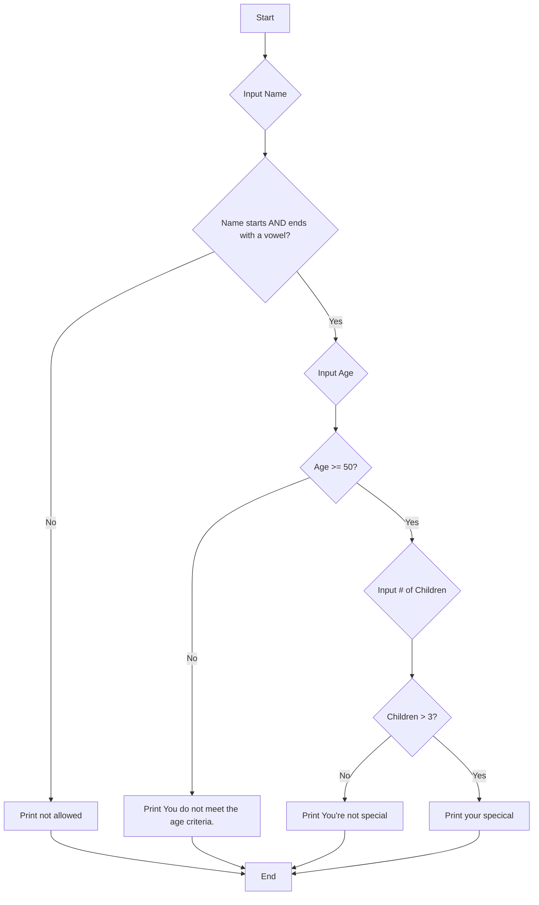

#  📚 **Week 3, Day 10: Mastering Control Flow with `while` Loops**

**📅 Date:** July 14th, 2025

Today's session focused on moving beyond simple sequential programming into the dynamic world of control flow. You learned how to make your programs react to different conditions and how to repeat actions efficiently using loops.

## 1. Conditional Logic Warm-up

started with a complex problem that combines multiple `if-else` statements. This is a great example of **nested conditional programming**.

### The Challenge

Write a program that grants "special status" based on a user's name, age, and number of children. The rules are:
1.  The name must start **and** end with a vowel.
2.  If the name is valid, the user's age must be 50 or over.
3.  If the age is valid, the user must have more than 2 children.

### The Code

```python
name = input("Enter your Name: ")

# A string containing all vowels for easy checking
vowel = 'aeiou'

# Check if the first and last letters of the name are vowels
# .lower() makes the check case-insensitive
if name[0].lower() in vowel and name[-1].lower() in vowel:
    print("Your name is valid. Proceeding to the next step.")

    age = int(input("Enter your age: "))

    # Check if the user is 50 or older
    if age >= 50:
        # Note: The prompt asked for "more then 2", while the code checks for "kids > 3".
        # We'll stick to the code's logic here.
        kids = int(input("Enter your number of children: "))
        if kids > 3:
            print("Congratulations! You have been granted special status.")
        else:
            print("You do not meet the criteria for special status (number of children).")
    else:
        print("You do not meet the age criteria.")
else:
    print("Your name is not valid. Access denied.")
```

### Logic Flowchart

Here’s a visual representation of how the program makes its decisions:



---

## 2. Introduction to Control Flow and Loops

You then explored why loops are essential for efficient programming.

| Programming Type | Description |
| :--- | :--- |
| **Procedural** | Statements are executed sequentially, one after the other. |
| **Conditional** | `if-else` statements are used to execute code only if a certain condition is true. |
| **Control Flow (Loops)** | Used to fix redundancy by repeating a block of code as long as a condition is met. |

Without loops, printing numbers from 1 to 10 is repetitive and inefficient:
```python
# Manual (and redundant) method
print(1)
print(2)
print(3)
# ...and so on...
print(10)
```
Loops solve this problem elegantly.

---

## 3. The `while` Loop

The `while` loop is designed to repeat a set of instructions as long as a specified condition remains `True`.

### The 3-Step Process of a `while` Loop

A `while` loop has a clear and reliable structure.

| Step | Purpose | Example (`num = 1; while num <= 10: ...`) |
| :--- | :--- | :--- |
| **1. Initialization** | Create a variable and set its starting value before the loop begins. | `num = 1` |
| **2. Condition** | The logical test that is checked *before* each loop iteration. The loop runs only if this is `True`. | `while num <= 10:` |
| **3. Operation/Update** | A statement inside the loop that changes the loop variable, working towards making the condition `False`. Without this, you get an infinite loop! | `num += 1` |

### Core Examples

#### a. Display numbers from 1 to 10
```python
# display 1 to 10
num = 1          # 1. Initialization
while num <= 10: # 2. Condition
    print(num)
    num += 1     # 3. Operation
```

#### b. Display numbers from 10 to 1
```python
# display 10 to 1
num = 10         # 1. Initialization
while num >= 1:  # 2. Condition
    print(num)
    num -= 1     # 3. Operation
```

#### c. Display even numbers between 10 and 30 (Corrected)
The notebook had a logical error where the condition was `num >= 30`. This would never run because `num` starts at 10. Here is the corrected and fully working code.

```python
# display even numbers between 10 to 30
num = 10              # 1. Initialization
while num <= 30:      # 2. Condition (Corrected to '<=')
    if num % 2 == 0:  # Check if the number is even
        print(num)
    num += 1          # 3. Operation
```

---

## 4. `while` Loops with User Input

You can make your loops more interactive by using `input()` to define the loop's range.

### Challenge: Display numbers in a user-defined range

```python
start = int(input("Enter Start: "))
end = int(input("Enter End: "))

# The 'start' variable is used for initialization and is also updated.
while start <= end:
    print(start)
    start += 1
```

---

## 5. Creative Application: Star Patterns

Loops aren't just for numbers; they're excellent for creating patterns. The expression `"*"` `* num` creates a string with a number of stars equal to `num`.

#### a. Increasing triangle of stars
```python
# display star pattern (increasing)
num = 1
while num <= 10:
    print("*" * num)
    num += 1    
```

**Output:**
```
*
**
***
****
*****
******
*******
********
*********
**********
```

#### b. Decreasing triangle of stars
```python
# display star pattern (decreasing)
num = 10
while num >= 1:
    print('*' * num)
    num -= 1
```
**Output:**
```
**********
*********
********
*******
******
*****
****
***
**
*
```

---
## 6. Combining `while` Loops with Conditional Logic

The final exercise combined everything you learned: a `while` loop to iterate through a range and an `if-else` statement to perform a check in each iteration.

### Challenge: Label numbers as "odd" or "even" in a given range

```python
start = int(input("enter start number: "))
end = int(input("enter end number: "))

# Loop from the start to the end number
while start <= end:
    # Inside the loop, check the current number
    if start % 2 == 0:
        print(start, 'even')
    else:
        print(start, "odd")
    
    # Don't forget to update the loop variable!
    start += 1
```

This program perfectly demonstrates how loops handle the repetition (going from `start` to `end`) while conditionals handle the logic for each individual number (`if it's even or odd`).