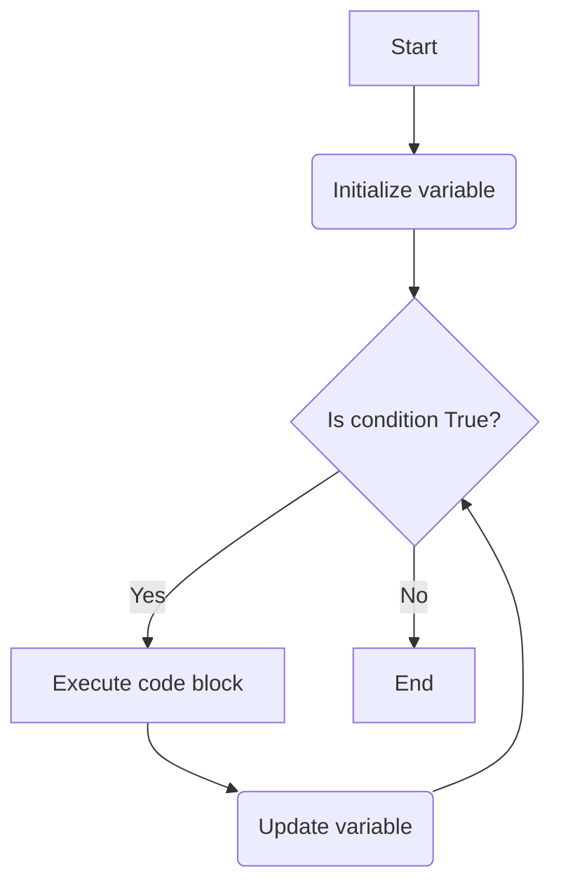
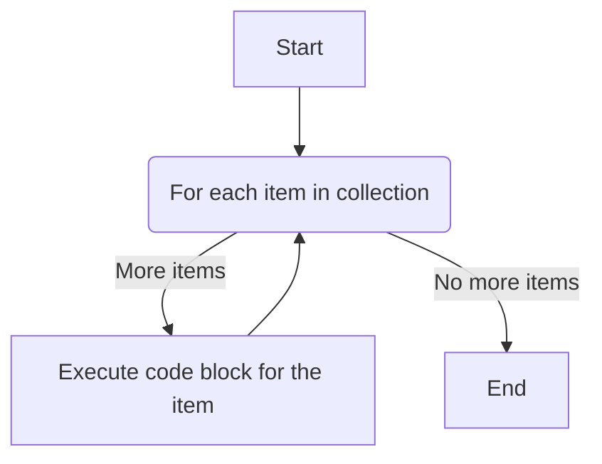
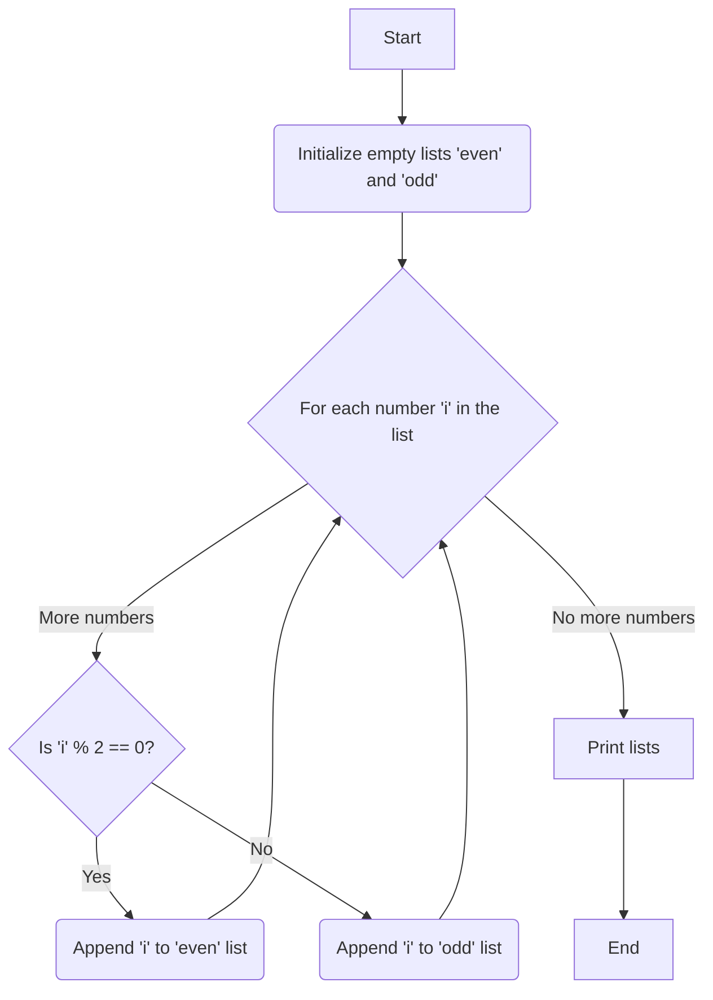

#  📚 **Week 3, Day 11: Notes on Python Loops: `while` and `for`

**📅 Date:** July 15th, 2025

## 1. The `while` Loop

A `while` loop repeatedly executes a block of code as long as a given condition remains `True`. It's ideal for situations where you don't know in advance how many times the loop needs to run.

The structure involves three key steps:
1.  **Initialization:** A variable is initialized before the loop starts.
2.  **Condition:** The `while` loop checks this condition before each iteration.
3.  **Operation/Update:** The code inside the loop that performs a task and typically updates the initialization variable to eventually make the condition `False`.

### Flowchart of a `while` Loop



### Loop Control Keywords

These keywords alter the standard flow of a loop.

#### a. `break`
The `break` keyword immediately **stops** the loop's execution, even if the main condition is still `True`.

**Example Code:**
The loop is supposed to run as long as `num` is less than or equal to 10. However, the `break` statement is triggered when `num` equals 5, causing the loop to terminate prematurely.

```python
num = 1
while num <= 10:
    print(num)
    if num == 5:
        break  # Exit the loop
    num += 1
```

**Output:**
```
1
2
3
4
5
```

**Flowchart with `break`:**
```mermaid
graph TD
    A[Start] --> B(num = 1);
    B --> C{num <= 10?};
    C -- Yes --> D[print(num)];
    D --> E{is num == 5?};
    E -- Yes --> F(break);
    E -- No --> G(num += 1);
    G --> C;
    F --> H[End];
    C -- No --> H;
```

#### b. `continue`
The `continue` keyword **skips** the rest of the current iteration and moves to the next one.

**Example Code:**
In this loop, when `num` becomes 5, the `continue` statement is executed. This skips the `print(num)` command for that specific iteration, and the loop continues with the next value, 6.

```python
num = 0
while num <= 10:
    num += 1
    if num == 5:
        continue  # Skip this iteration
    print(num)
```

**Output:** (Notice that 5 is missing)
```
1
2
3
4
6
7
8
9
10
11
```
> **Important Note:** Be careful where you place the `continue` keyword. If the variable update (`num += 1`) were placed *after* the `continue`, the loop would get stuck in an infinite loop at `num = 5` because it would never reach the update statement.

#### c. `pass`
The `pass` keyword is a null operator. It does nothing and acts as a placeholder where code is syntactically required but you have nothing to write yet.

**Example Code:**
When `num` is 5, the `pass` statement does nothing, and the program proceeds to print the number. The output is therefore unaffected.

```python
num = 0
while num <= 10:
    num += 1
    if num == 5:
        pass  # Do nothing and continue
    print(num)
```

**Output:**
```
1
2
3
4
5
6
7
8
9
10
11
```

### Practical `while` Loop Examples

#### Password Application
This program simulates a simple login system. It gives the user a limited number of attempts to enter the correct password.

**Code Explained:**
1.  **`pasw = input(...)`**: The program first asks the user to create a password.
2.  **`attempt = 0`**: A counter for login attempts is initialized.
3.  **`while True:`**: This creates an infinite loop that will only terminate with a `break` statement.
4.  **`if pasw == login:`**: If the entered password matches the stored one, it prints a success message and uses `break` to exit the loop.
5.  **`elif attempt == 3:`**: If the user has already made 3 wrong attempts, it prints a "try again later" message and uses `break` to exit.
6.  **`else:`**: If the password is wrong and attempts are not maxed out, it increments the `attempt` counter and asks the user to try again.

```mermaid
graph TD
    A[Start] --> B(Create Password);
    B --> C(Initialize attempts = 0);
    C --> D{Loop starts};
    D --> E(Ask for login password);
    E --> F{Is login == password?};
    F -- Yes --> G[Print "Logged in"] --> H(break);
    F -- No --> I{Is attempts == 3?};
    I -- Yes --> J[Print "Try again later"] --> H(break);
    I -- No --> K(Increment attempts);
    K --> L[Print "Try again"];
    L --> D;
    H --> M[End];
```

#### Multiplication Table Generator
This program takes a number from the user and generates its multiplication table up to 10.

**Code Explained:**
1.  **`num = 1`**: A counter is initialized to 1.
2.  **`table = int(input(...))`**: The user is prompted to enter a number, which is converted to an integer.
3.  **`while num < 11:`**: The loop continues as long as the counter is less than 11 (i.e., from 1 to 10).
4.  **`print(...)`**: Inside the loop, the formatted multiplication string is printed.
5.  **`num += 1`**: The counter is incremented to move to the next multiplication factor.

---

## 2. The `for` Loop

A `for` loop is used for **iterating over a sequence** (like a list, tuple, dictionary, set, or string). It's best used when you know how many times you need to loop—once for each item in the collection.

**Syntax:**
```python
# for variable in collection:
#     (code to execute)
```

### Flowchart of a `for` Loop



### `for` Loop Examples

#### a. Iterating Through a String
A string is a collection of characters. A `for` loop can process one character at a time.

```python
name = "Riyan"
for var in name:
    print(var)
```

**Output:**
```
R
i
y
a
n
```

#### b. Separating Odd and Even Numbers
This program iterates through a list of numbers and categorizes each as either "Even" or "Odd" by using two empty lists.

**Code Explained:**
1.  **`even = []`, `odd = []`**: Two empty lists are created to store the results.
2.  **`for i in li:`**: The loop iterates through each number `i` in the list `li`.
3.  **`if i % 2 == 0:`**: The modulo operator (`%`) gives the remainder of a division. If a number divided by 2 has a remainder of 0, it's even.
4.  **`even.append(i)`**: The number `i` is added to the `even` list.
5.  **`else:`**: If the number is not even, it must be odd.
6.  **`odd.append(i)`**: The number `i` is added to the `odd` list.

**Flowchart for Sorting Odd/Even Numbers:**


#### c. Separating Pass and Fail Scores
This is another example of categorization, similar to the odd/even sorter. Here, scores are sorted into "pass" and "fail" lists based on a passing threshold of 33.

**Code Explained:**
The logic is identical to the previous example, but the condition checks if a score `i` is greater than or equal to 33.

```python
li = [23, 34, 54, 65, 12]
pas = []
fai = []

for i in li:
    if i >= 33:
        pas.append(i)
    else:
        fai.append(i)

print('The student is Passed!', pas)
print('The student is failed!', fai)
```

**Output:**
```
The student is Passed! [34, 54, 65]
The student is failed! [23, 12]
```

## Summary: `while` vs. `for`

| Feature | `while` Loop | `for` Loop |
| :--- | :--- | :--- |
| **Primary Use** | When the number of iterations is unknown. | When iterating over a known sequence. |
| **Control** | Based on a condition being `True` or `False`. | Iterates once for each item in a collection. |
| **Setup** | Requires manual initialization and update of a counter/variable. | Manages the iteration variable automatically. |
| **Common Scenario** | Reading a file until the end, user input validation, game loops. | Processing lists, strings, or dictionary entries. |