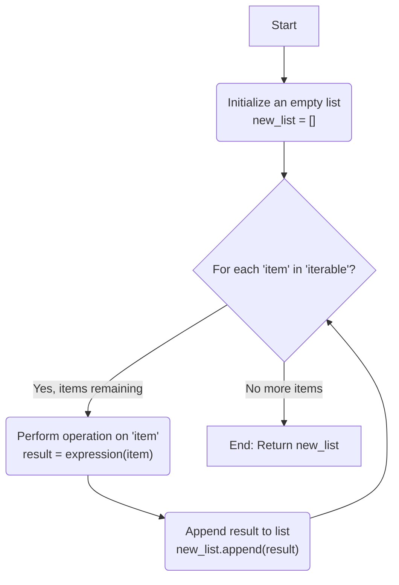
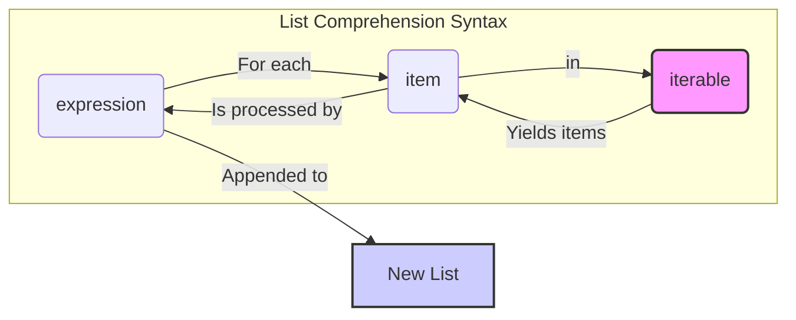
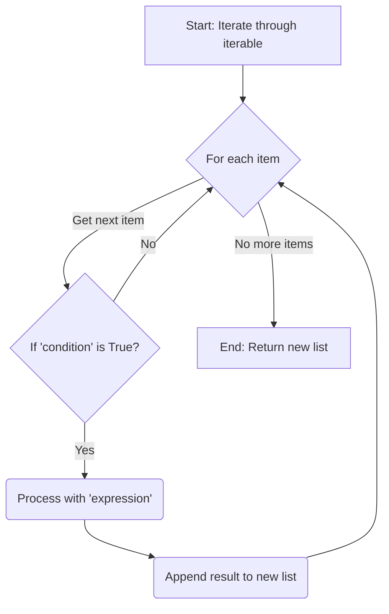
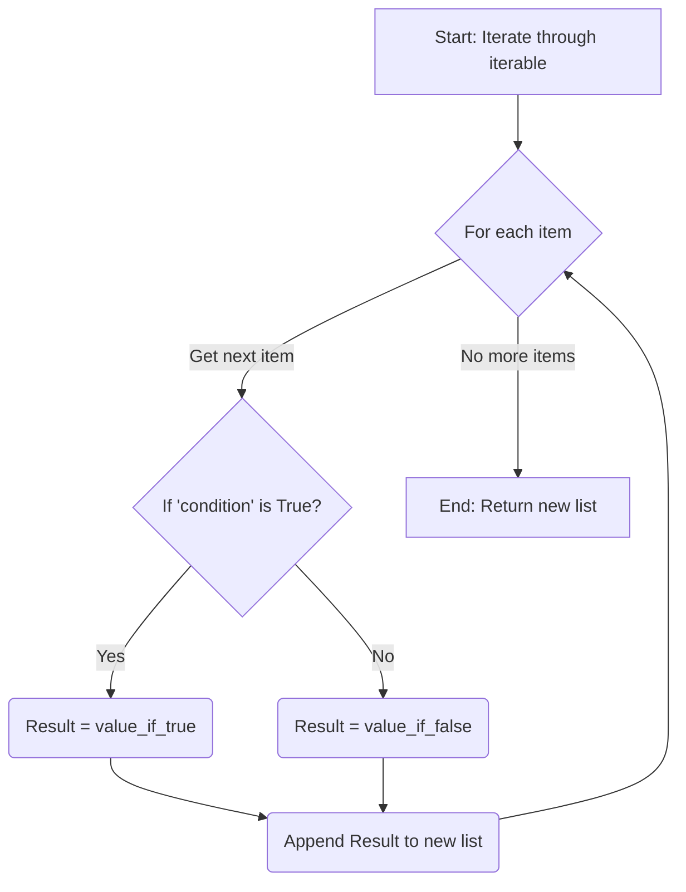
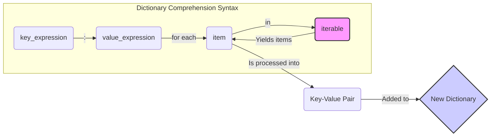

#  📚 **Week 3, Day 12: Mastering Python Loops and Comprehensions: The Complete Guide**

**📅 Date:** July 16th, 2025

This note provides a detailed breakdown of loops and comprehensions in Python. It starts with the fundamentals of `for` loops and builds up to the elegant and efficient syntax of list and dictionary comprehensions
### **1. The Foundation: The Traditional `for` Loop**

Before we can appreciate comprehensions, we must understand what they improve upon: the standard `for` loop. A `for` loop is essential for iterating over a sequence (like a list or string) to perform an action on each item. A common task is to create a new, modified list from an existing one.

This process typically involves three steps:
1.  **Initialize:** Create an empty list.
2.  **Iterate:** Loop through each item in the source iterable.
3.  **Append:** Add a new, transformed item to the list inside the loop.

**The Flowchart View:**

This is what the logic looks like visually.



**Code Example:**
```python
name = 'riyan'
li = [] # 1. Initialize

for i in name: # 2. Iterate
    li.append(i) # 3. Append

print(li)
# Output: ['r', 'i', 'y', 'a', 'n']
```

This is clear and functional, but Python provides a more concise way to do this.

---
## **2. The "Pythonic" Way: An Introduction to Comprehensions**

Comprehensions are a hallmark of idiomatic Python code. They allow you to create lists, dictionaries, and other sequences in a single, readable line, combining the loop and append steps into one elegant expression.

---
## **3. A Deep Dive into List Comprehensions**

We can master list comprehensions by understanding three primary patterns.

### **Case 1: Basic Comprehension (Direct Mapping)**
This is the simplest form, used when you want to apply the same operation to every item in an iterable.

**Syntax & Diagram**

It directly maps the `expression` to each `item` from the `iterable`.



**Example: Calculate the square of each number.**
```python
li = [1,2,3,4,5]

# The list comprehension way
sq = [i**2 for i in li]
print(sq)
# Output: [1, 4, 9, 16, 25]
```

---
### **Case 2: Comprehension with a Filter (`if`)**
This pattern is used to **selectively include** items in your new list. An `if` condition acts as a gatekeeper, and only items that pass the check are included.

**Syntax & Flowchart**

The `if condition` is placed at the end and determines whether an item makes it into the final list.



**Example: Select only the names that start with a vowel.**
```python
li = ['Uwaish','pro','khan', 'aie', 'amaan']
vowels = 'aeiouAEIOU'

# The list comprehension way
vowel_names = [name for name in li if name[0] in vowels]
print(vowel_names)
# Output: ['Uwaish', 'aie', 'amaan']
```

---
### **Case 3: Comprehension with Conditional Output (`if/else`)**
This powerful pattern is used when you need to **transform every item differently based on a condition**. Every item from the source iterable produces a value in the new list.

**Syntax & Flowchart**

The `if/else` logic is placed *before* the `for` loop, defining which output to produce for each item.



**Example: Label numbers as 'even' or 'odd'.**
```python
li = [1,2,3,4,5]

# The list comprehension way
even_odd = ['even' if i % 2 == 0 else 'odd' for i in li]
print(even_odd)
# Output: ['odd', 'even', 'odd', 'even', 'odd']
```

---
## **4. Beyond Lists: Dictionary Comprehensions**

The same elegant syntax can be used to build dictionaries. The key difference is the use of curly braces `{}` and the definition of a `key:value` pair.

**Syntax & Diagram**



**Example: Create a dictionary mapping each name to its length.**
```python
li = ['zxcvbnm','asdfghjkl','qwertyuiop']

# Key: i (the name itself)
# Value: len(i) (the length of the name)
res = {i: len(i) for i in li}
print(res)
# Output: {'zxcvbnm': 7, 'asdfghjkl': 9, 'qwertyuiop': 10}
```

---
## **Summary & Key Takeaways**

By mastering these patterns, you can write more efficient and readable Python code.

| Use Case | Syntax | Analogy |
| :--- | :--- | :--- |
| **Simple Mapping** | `[expression for i in list]` | An assembly line applying the same tool to every item. |
| **Filtering Items** | `[expression for i in list if condition]` | A quality control checkpoint that discards faulty items. |
| **Conditional Output**| `[out_if_true if cond else out_if_false for i in list]`| A sorting machine that puts every item into one of two bins. |
