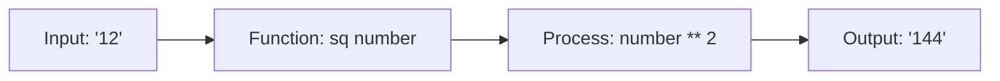
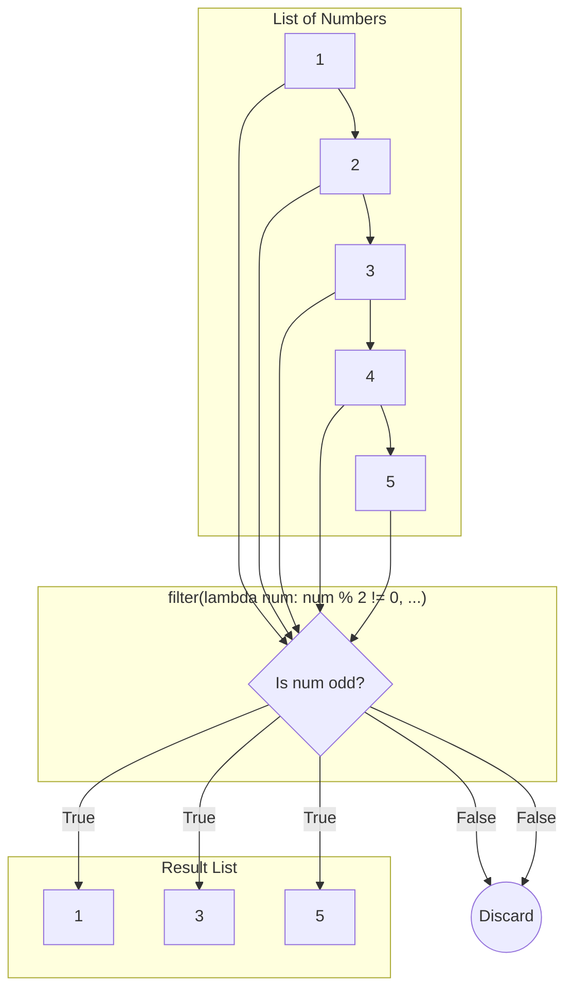
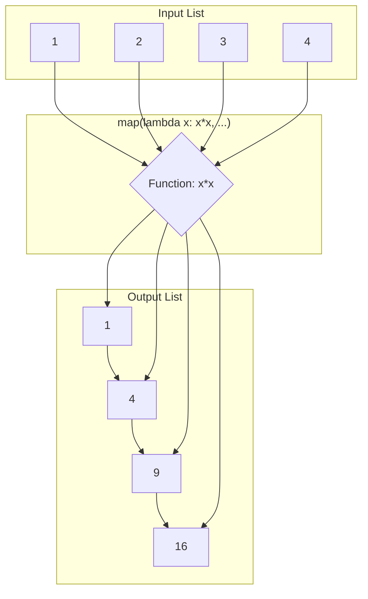
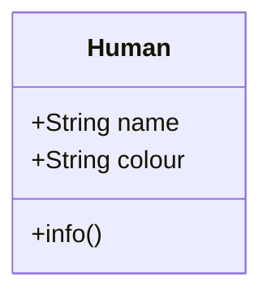
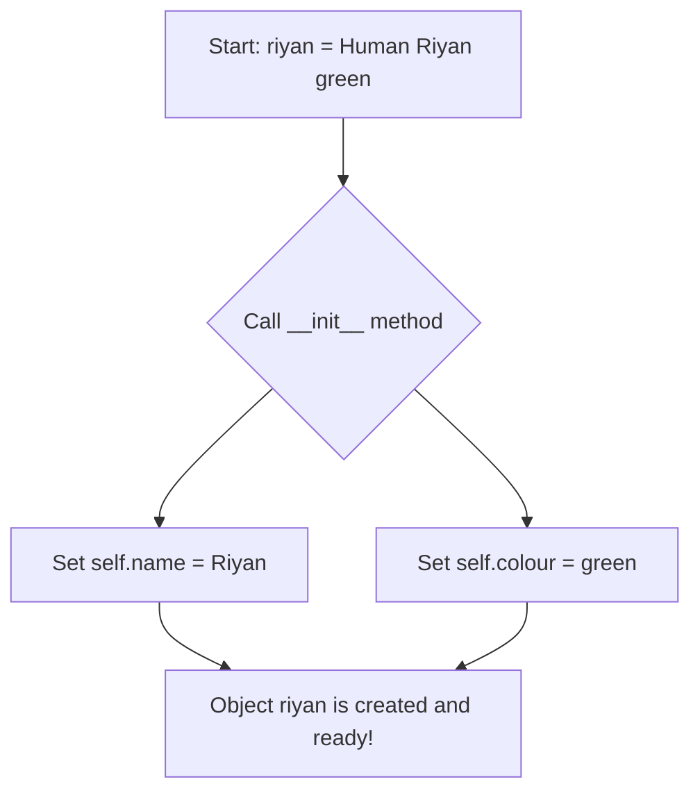

# Data Science Notes: Python Fundamentals
**Date: 22 - 7 - 2025, Tuesday**
**Course: Week 4, Day 15**

---

## 📌 1. User-Defined Functions (UDFs)

A function is a reusable block of code that performs a single, specific task. Think of it as a mini-machine built to do one job perfectly.

**Analogy: The Magic Box 📦**
You provide an input, the function processes it according to its rules, and it gives back an output.

### Function Flow Diagram

### Summary of UDF Examples

| Goal | Function Definition | Example Usage & Output |
| :--- | :--- | :--- |
| **Square a Number** | `def sq(num): return num ** 2` | `sq(12)` → `144` |
| **Greet a User** | `def greet(name): return f"Hello, {name}!"` | `greet("Riyan")` → `"Hello, Riyan!"` |
| **Filter Even Numbers**| `def evens(nums): return [n for n in nums if n%2==0]` | `evens([1,2,3,4])` → `[2, 4]` |

---

## 📌 2. Lambda Functions: The "Quick" Functions

A `lambda` function is a small, one-line, anonymous function. It's perfect for simple, throwaway tasks where defining a full `def` function is overkill.

**Analogy: The Sticky Note 📝**
A `def` function is a formal recipe in a cookbook. A `lambda` is a quick instruction you jot down on a sticky note for immediate use.

### `def` vs. `lambda`

| Feature | `def` Function | `lambda` Function |
| :--- | :--- | :--- |
| **Syntax** | `def my_func(args): ...` | `lambda args: expression` |
| **Name** | Always has a name | Anonymous (no name) |
| **Complexity** | Can contain multiple lines, loops, etc. | Single expression only |
| **Use Case** | Complex, reusable logic | Simple, one-time operations |

### Lambda Function Flow

This diagram shows how a `lambda` is used inside a `filter` function. The lambda's job is simple: check if a number is odd (`True` or `False`).

---

## 📌 3. The `map()` Function: The Transformation Machine

The `map()` function applies a given function to **every single item** in an iterable (like a list). It's an efficient way to transform a whole collection of data.

**Analogy: The Assembly Line 🏭**
An assembly line (`map`) takes raw items (your list) and sends each one through a machine (your function) to be processed.

### `map()` Function Diagram

This shows `map()` applying a `lambda x: x*x` function to each number in a list.

---
## 📌 4. Classes: The Blueprint for Objects

A `class` is a **blueprint** for creating objects. An `object` is a working instance of a class, with its own unique data but sharing the same structure and behaviors.

### Terminology Table

| Term | Analogy (Car Blueprint) | In Code (`Human` Class) |
|:---|:---|:---|
| **Class** | The design plan for a "Car" | `class Human:` |
| **Object**| A specific car built from the plan | `riyan = Human("Riyan", "green")`|
| **Attribute** | A property, like `color` or `model` | `self.name`, `self.colour` |
| **Method** | An action, like `drive()` or `honk()` | `def info(self): ...` |

### Class Structure Diagram (`Human` Class)

This Mermaid diagram shows the "blueprint" for our `Human` class. It has two attributes (data) and one method (function).

### Object Creation Flow (`__init__`)

When you create an object like `riyan = Human(...)`, the `__init__` method runs automatically to set up the object's initial state.

