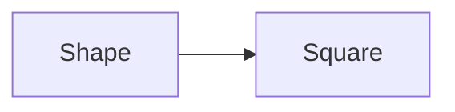
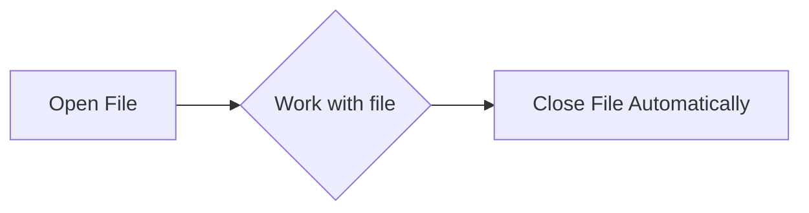

# Week 4, Day 18: Object-Oriented Programming & File Handling

**Date: 24-7-2025 Thursday**
## Introduction to Object-Oriented Programming (OOP)

Object-Oriented Programming is a programming paradigm based on the concept of "objects", which can contain data in the form of fields (often known as attributes or properties) and code in the form of procedures (often known as methods).

### Core Concepts of OOP

| Concept | Description |
| :--- | :--- |
| **Class** | A blueprint for creating objects. |
| **Object** | An instance of a class. |
| **Attribute** | A property or data associated with an object. |
| **Method** | A function associated with an object. |

### The Four Pillars of OOP

The four pillars of object-oriented programming are:

1.  **Encapsulation**: The bundling of data (attributes) and the methods that operate on that data into a single unit, a class. It restricts direct access to some of an object's components, which is a key principle of data hiding.
2.  **Inheritance**: Allows a new class (child/subclass) to inherit attributes and methods from an existing class (parent/superclass). This promotes code reusability.
3.  **Polymorphism**: Allows objects of different classes to be treated as objects of a common superclass. The same method name can behave differently for different classes.
4.  **Abstraction**: Hides the complex implementation details and shows only the essential features of the object.

### 1. Encapsulation

In Python, we use access modifiers to control the visibility of attributes and methods. These are denoted by naming conventions:

| Modifier | Prefix | Description |
| :--- | :--- | :--- |
| `Public` | `name` | Accessible from anywhere. |
| `Protected` | `_name` | Should only be accessed within the class and its subclasses. |
| `Private` | `__name` | Should only be accessed within the class. Python enforces this through a process called name mangling. |

#### Example

```python
class Student:
    def __init__(self, name, age, student_id):
        self.name = name        # Public attribute
        self._age = age         # Protected attribute
        self.__student_id = student_id  # Private attribute

    def display_info(self):
        print(f"Name: {self.name}")
        print(f"Age: {self._age}")
        print(f"Student ID: {self.__student_id}")

# Creating an object
riyan = Student("Riyan", 20, "DS12345")

# Accessing public attribute (Allowed)
print(f"Public Name: {riyan.name}")

# Accessing protected attribute (Allowed, but not recommended)
print(f"Protected Age: {riyan._age}")

# Accessing private attribute (Will raise an AttributeError)
try:
    print(f"Private Student ID: {riyan.__student_id}")
except AttributeError as e:
    print(f"Error: {e}")

# Accessing private attribute via name mangling (not recommended)
print(f"Student ID (via name mangling): {riyan._Student__student_id}")
```

### 2. Inheritance

Inheritance allows a new class to inherit attributes and methods from an existing class.


#### Example

```python
# Parent Class
class Person:
    def __init__(self, name):
        self.name = name

    def introduce(self):
        print(f"Hello, my name is {self.name}.")

# Child Class inheriting from Person
class Student(Person):
    def study(self):
        print(f"{self.name} is studying Data Science.")

riyan = Student("Riyan")
riyan.introduce()  # Method inherited from Person class
riyan.study()   # Method from the Student class
```

### 3. Polymorphism

Polymorphism allows objects of different classes to be treated as objects of a common superclass.

#### Example

```python
class Teacher:
    def role(self):
        print("The teacher educates.")

class Student:
    def role(self):
        print("The student learns.")

class Staff:
    def role(self):
        print("The staff supports.")

# Polymorphism in action
teacher = Teacher()
student = Student()
staff = Staff()

for person in [teacher, student, staff]:
    person.role()
```

### 4. Abstraction

Abstraction hides the complex implementation details and shows only the essential features of the object. In Python, we can achieve abstraction using abstract classes and methods from the `abc` module.



#### Example

```python
from abc import ABC, abstractmethod

# Abstract Base Class
class Vehicle(ABC):
    @abstractmethod
    def start_engine(self):
        pass

    @abstractmethod
    def stop_engine(self):
        pass

class Car(Vehicle):
    def __init__(self, make, model):
        self.make = make
        self.model = model

    def start_engine(self):
        return f"The {self.make} {self.model}'s engine is running."

    def stop_engine(self):
        return f"The {self.make} {self.model}'s engine has stopped."

# You cannot create an object of an abstract class
try:
    v = Vehicle()
except TypeError as e:
    print(f"Error: {e}")

# You must implement all abstract methods in the subclass
my_car = Car("Toyota", "Camry")
print(my_car.start_engine())
print(my_car.stop_engine())
```

## File Handling

File handling is used to store data permanently in a file.

### File Modes

| Mode  | Description                                                                                                                                   |
| :---- | :-------------------------------------------------------------------------------------------------------------------------------------------- |
| `'r'` | **Read**: Default mode. Opens a file for reading. Raises an error if the file does not exist.                                                 |
| `'w'` | **Write**: Opens a file for writing. **Creates a new file if it does not exist, or completely overwrites the file if it exists.**             |
| `'a'` | **Append**: Opens a file for appending. **Creates a new file if it does not exist, or adds new content to the end of the file if it exists.** |
| `'x'` | **Create**: Creates a new file. Raises an error if the file already exists.                                                                   |
| `'+'` | Can be added to a mode to allow for both reading and writing (e.g., `'r+'`, `'w+'`).                                                          |

### The `with` Statement (Best Practice)

The `with` statement automatically handles closing the file, even if errors occur.



### Writing to a File

```python
# 1. Using 'w' to write and overwrite
with open('my_notes.txt', 'w') as f:
    f.write("Today I learned about OOP.\n")

with open('my_notes.txt', 'w') as f:
    f.write("I am Riyan and I'm learning file handling.\n") # This overwrites the previous content

print("--- Content after 'w' ---")
with open('my_notes.txt', 'r') as f:
    print(f.read())

# 2. Using 'a' to append
with open('my_notes.txt', 'a') as f:
    f.write("Appending this new line to my notes!\n") # This adds to the end of the file

print("--- Content after 'a' ---")
with open('my_notes.txt', 'r') as f:
    print(f.read())
```

### Reading From a File

| Method             | Description                             |
| :----------------- | :-------------------------------------- |
| `file.read()`      | Reads the entire content of the file.   |
| `file.readline()`  | Reads a single line from the file.      |
| `file.readlines()` | Reads all lines into a list of strings. |

### Exercise

**Create a `txt` file with the following content in the same format:**

```
Python is a programming language and has the following features:

1. Open Source
2. Platform Independent
3. Supports all Paradigm
4. Vast Collection of Libraries
5. User Friendly
```

#### Solution

```python
content_to_write = """Python is a programming language and has the following features:

1. Open Source
2. Platform Independent
3. Supports all Paradigm
4. Vast Collection of Libraries
5. User Friendly
"""

with open('python_features.txt', 'w') as file:
    file.write(content_to_write)

# Let's read the file back to verify
print("--- Content of python_features.txt ---")
with open('python_features.txt', 'r') as file:
    print(file.read())
```